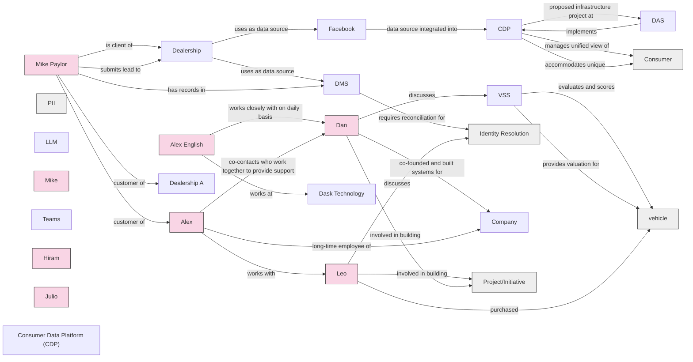

# Analysis of Conflict AI Kickoff - Phase 0-20260527_130151-Meeting Recording

## Summary

# Meeting Summary

This transcript captures introductions from two teams meeting to collaborate on a Customer Data Platform (CDP) project. The Dask Technology team includes Daniel Aston (SVP of Engineering), Alex English (SVP of Product), and technology consultant Mike Paylor, who bring 13-15 years of experience in automotive SaaS solutions and product development. The Conflict team, led by Leo, consists of approximately eight engineers and technical specialists with diverse expertise ranging from 1.5 to 30 years of experience in software development, distributed systems, data engineering, and DevOps.

The meeting establishes a collaborative partnership between the two companies, with Leo serving as the central coordinator for the Conflict team. Team members highlight their relevant experience in areas critical to the project, including infrastructure, cloud solutions, full-stack engineering, and data management. Craig Irwin from Conflict's commercial team also joins to handle business-related aspects of the engagement.

The introductions reveal strong complementary expertise between the teams, with Dask bringing product and business perspective while Conflict contributes deep technical engineering capabilities. The tone is professional yet casual, emphasizing excitement about launching the CDP initiative that has been discussed for some time. The meeting concludes with Leo preparing to move into discussing the project's purpose and objectives.

## Key Points

- **Dask Technology operates in the automotive SaaS space with multiple solutions**
  Daniel Aston (SVP Engineering, 6 years) and Alex English (SVP Product, 14 years) lead the Dask team which provides various SaaS solutions for automotive industry

- **Daniel Aston is SVP of Engineering at Dask**
  Daniel Aston has been with Dask for over 6 years and has 13-15 years of engineering experience, transitioning from coding to management

- **Alex English has strong operational and product background**
  Previously led account management, support, onboarding, and deactivations teams before moving to product leadership 4 years ago

- **Mike Paylor is a long-term technology and product consultant**
  Working with Dask for 3 years, known them for 13 years; has VP Engineering and CTO experience at PayPal, Upwork, and startups; focused on infrastructure, DevOps, and cost savings

- **Conflict team consists of experienced engineers and data specialists**
  Luis Hernandez (30 years experience, distributed systems), Alicia (20+ years data engineering), Oscar (13+ years software development), Byron (8 years engineering), Hiram (full stack, e-commerce/cybersecurity background), Julio (8 years, full stack, DevOps to UI)

- **Leo is the project coordinator and leader**
  20+ years in tech across ops, data, coding, AI, infrastructure; serving as central coordinator for the engagement

- **CDP (Customer Data Platform) implementation is the main initiative**
  Long-discussed project between Dask and Conflict teams; importance will become apparent through product breadth discussion

- **Meeting agenda focuses on purpose, objectives, and duration**
  50 minutes available; Leo has hard stop for another meeting; includes overview, discussion, guiding questions, data sharing and access basics

- **Dask has developed data silos across multiple applications**
  Broad portfolio spanning media/advertisement services, lead response, and reputation management for car dealerships; need to consolidate sources of record beyond existing data lake and reporting engine

- **Scope alignment and goal definition needed**
  Need to hear from Dask on goals, what they're building, and requirements for success; common language and understanding essential for all participants

## Knowledge Graph

