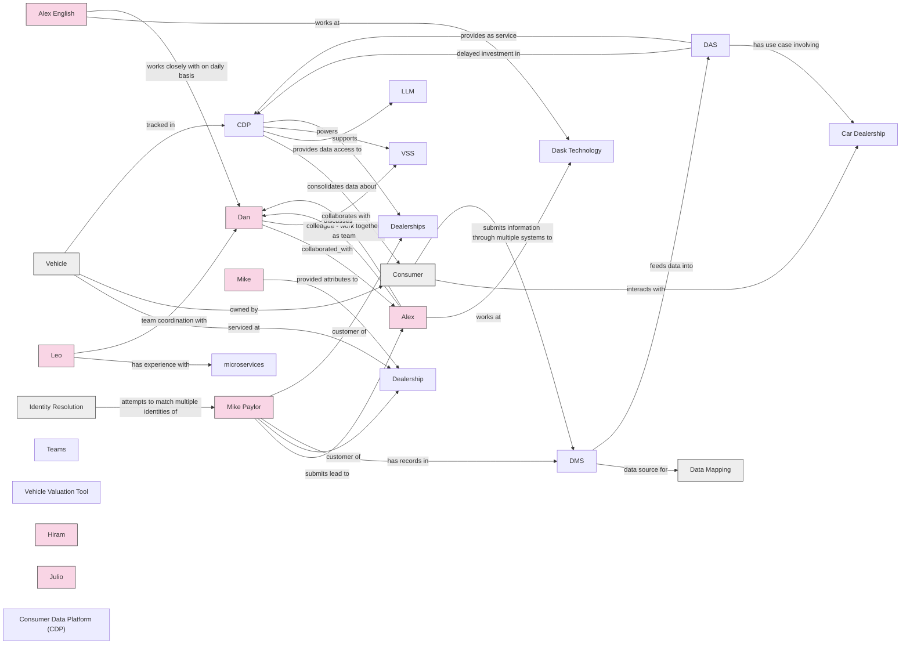

# Analysis of Conflict AI Kickoff - Phase 0-20260527_130151-Meeting Recording

## Summary

# Meeting Summary

This transcript captures introductions from two teams meeting to discuss a Customer Data Platform (CDP) project. The Dask Technology side includes Daniel Aston (SVP Engineering, 6+ years), Alex English (SVP Product, 14+ years), and Mike Paylor (technology and product consultant, 13+ years working relationship). The Conflict team, led by Leo, includes multiple engineers and specialists: Luis Hernandez (30 years experience, distributed systems), Alicia (20+ years data engineering), Oscar (13+ years software development, 1.5 years at Conflict), Byron (8 years total, 3+ years with Leo), Hiram (full stack engineer since 2023), Julio (8 years experience, 4 years at Conflict), and Craig Irwin (commercial lead).

The meeting establishes a collaborative partnership between the two organizations to build a CDP solution. The Dask team brings deep automotive SaaS expertise and product knowledge, while the Conflict team contributes extensive engineering talent across distributed systems, data engineering, and full-stack development. Leo serves as the central coordinator for the Conflict team and indicates the meeting will move toward aligning on project purpose and objectives.

## Key Points

- **Dask Technology operates in the automotive SaaS space**
  Dask Technology provides multiple SaaS solutions for the automotive industry, including media/advertisement services for car dealerships, lead response services, and reputation management

- **Daniel Aston is SVP of Engineering at Dask**
  Daniel Aston has been with Dask for over 6 years and has 13-15 years of engineering experience, transitioning from coding to management

- **Alex English is SVP of Product at Dask**
  Alex English has been with Dask for 14 years with operational background in account management, support, onboarding, and deactivations; has led product team for 4 years

- **Mike Paylor is a technology and product consultant**
  Mike Paylor has worked with Dask for 3 years and known them for 13 years; has VP of Engineering and CTO experience at PayPal, Upwork, and startups; focusing on infrastructure, DevOps, and cost savings

- **Leo is the project leader and coordinator**
  Leo has 20+ years in tech with experience in ops, data, coding, AI, and cloud infrastructure; serving as central coordinator for the project

- **Conflict team includes multiple engineers with diverse experience**
  Team includes Luis Hernandez (30 years distributed systems), Alicia (20+ years data engineering), Oscar (13+ years software development), Byron (8 years experience), Hiram (full stack engineer), Julio (8 years full stack), and Craig Irwin (commercial lead)

- **Project goal is to build a CDP (Customer Data Platform)**
  Dask Technology is planning to implement a Customer Data Platform to consolidate data silos across their various automotive SaaS applications

- **Dask has developed data silos across multiple applications**
  Throughout 15 years of operation, Dask has created separate sources of record across different applications, despite having a data lake and reporting engine

- **Meeting agenda focuses on scope alignment and discovery**
  Discussion will cover purpose, objectives, duration, data sharing, access requirements, and guiding questions; Leo has a hard stop after 50 minutes

- **Initial discovery phase to understand goals and requirements**
  Team will discuss what they're building, why, and what success looks like before diving into technical details and data sharing requirements

## Knowledge Graph

