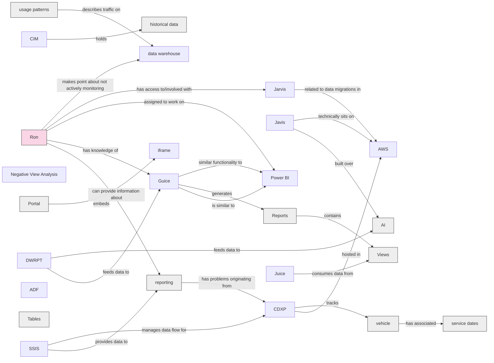

# Conflict AI - Review of Reporting (Juice) 2026-06-08

## Summary

# Summary

This transcript documents a meeting at the start of summer where a team discusses their data reporting infrastructure and tools. The core group includes regular attendees, though some members may join intermittently based on availability. The team acknowledges that their data comes from multiple sources of varying quality, including outdated SSIS jobs that require careful handling to avoid consuming manipulated data.

The discussion centers on **Guice**, a reporting engine similar to Power BI that enables product team members (primarily Jacob) to build client-facing reports through a drag-and-drop interface without engineering involvement. However, Guice has significant limitations—most notably, it cannot perform database joins, requiring the team to consolidate multi-source data in their data warehouse reporting database (DWRPT) at the SQL level before presenting it to Guice.

The team is not committed to Guice long-term and is already exploring alternatives. While Guice itself won't be accessible to new team members, access to the underlying data warehouse reporting database—which contains all tables and views powering the analytics—can be provided. The speaker demonstrates a sample Guice report from their 3Birds/Dash CDXP site, showing how users can filter data by various parameters like campaign methods and communication channels.

## Key Points

- **Core team established for the project**
  A core group of team members identified, with some flexibility for others to join based on availability

- **Data quality issues from multiple sources**
  Reporting data comes from multiple sources with varying quality; some SSIS jobs are outdated and not ideal for CDP consumption

- **Raw data preferred over manipulated data**
  Preference to consume raw data from SSIS processes rather than end results to allow selective use of data pieces

- **Guice is a reporting engine, not a long-term priority**
  Guice functions like Power BI for drag-and-drop report building; not critical for long-term roadmap and alternatives are being explored

- **Guice has technical limitations with joins**
  Guice cannot perform joins across multiple data sources; data must be joined at SQL level in DWRPT before presenting to Guice

- **Data quality improvements implemented**
  Common Client ID implemented to improve table joins; discovered data cleanliness issues

- **Guice reports are client-facing**
  Reports generated in Guice are used for client-facing purposes; built by internal product team (primarily Jacob), non-technical users

- **Data warehouse contains multiple schemas**
  Data organized by application schemas (e.g., SL for Social Logic, ML for MediaLogic) to prevent data conflation

- **Guice embedded via iframe with security controls**
  Guice reports embedded in company portal using iframe with login requirements and specific security rules

- **Power BI available but resource constraints**
  Power BI available but lack of internal Power BI developers; offshore team utilized to avoid taking engineering resources

## Knowledge Graph

