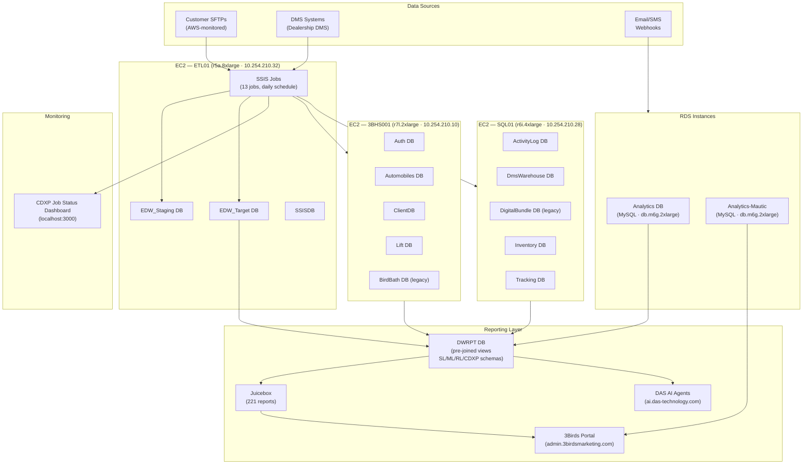
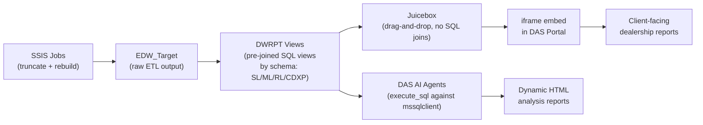

# Session Synthesis — 2026-06-08

Two sessions analyzed: SSIS infrastructure review (morning) and Juicebox/reporting review (afternoon).

---

## Session 1: SSIS Review

**Time:** 2026-06-08 16:01 UTC  
**Attendees:** Rick Sorich (Eng Manager, DAS), Leo Mata, Luis Hernandez, Alicia Salazar, Hiram Gonzalez, Julio Rojas  
**Organized by:** Daniel Aston

### What Was Shown

#### 1. CDXP Job Status Dashboard (`localhost:3000/cdxp-job-status`)

A new monitoring dashboard (built ~1 week ago) tracking all 13 SSIS jobs in a 30-day window.

**Dashboard header KPIs (as of 2026-06-08 ~9am MST):**
- Currently Running: 1 (ThreeBirds.Analytics.CRM)
- Failed (last 24h): 1
- 7-day Success Rate: 93% — Healthy
- Persistent Failures: 2 jobs critical

**All 13 Jobs:**

| Job | Package | Last Run | Status | 30-day Runs | Success % | Avg Duration |
|-----|---------|----------|--------|-------------|-----------|--------------|
| Mileone_reward_member | ThreeBirds.Analytics.Mileone.reward | May 28, 11pm | **FAILED** | 20 | **0%** | 4s |
| ThreeBirds.Analytics.BlueSky | ThreeBirds.Analytics.BlueSky | Jun 7, 6:30pm | **FAILED** | 30 | 93% | 2h 37m |
| JuiceReporting_CDXPCustomers | JuiceReporting_CDXPCustomers | Jun 7, 9pm | Succeeded | 7 | 71% | 7m 7s |
| ThreeBirds.Analytics.CRM | ThreeBirds.Analytics.CRM | Jun 8, 8:01am | **Running** | 30 | 93% | 3h 20m |
| appointment-process | ThreeBirds.Analytics.Appointment | Jun 8, 5:30am | Succeeded | 31 | 97% | 2h 53m |
| Conquest_Mailing | ThreeBirds.Analytics.Conquest | Jun 7, 12pm | Succeeded | 30 | 100% | 57s |
| MileOne Weekly Unsubscribe | MileOne Weekly Unsubscribe | Jun 8, 6am | Succeeded | 60 | 100% | 2m 54s |
| ThreeBirds.Analytics.CustomerValue | ThreeBirds.Analytics.CustomerValue | Jun 7, 11:30pm | Succeeded | 30 | 100% | 8m 41s |
| ThreeBirds.Analytics.CVH | ThreeBirds.Analytics.CVH | Jun 7, 4pm | Succeeded | 30 | 100% | 2h 4m |
| ThreeBirds.Analytics.DDE | ThreeBirds.Analytics.DDE | Jun 8, 3am | Succeeded | 31 | 97% | 1h 54m |
| ThreeBirds.Analytics.Email | ThreeBirds.Analytics.Email | Jun 7, 12:30pm | Succeeded | 30 | — | 4h 25m |
| ThreeBirds.Analytics.LeadSource_LeadPerformance | ThreeBirds.Analytics.LeadSource_LeadPerformance | Jun 7, 11pm | Succeeded | — | — | 1h 28m |
| ThreeBirds.Analytics.SmartSuppression | ThreeBirds.Analytics.SmartSuppression | — | — | — | — | — |

**Critical failure — BlueSky last error:**
```
sp_juice_data_sync_bluesky_ssis: Error: Executing the query "EXEC
sp_juice_data_sync_bluesky_ssis" failed with the following error:
"There is already an object named 'JuiceReporting_CDXPCustomers'
in the database."
```
Root cause: job drops/rebuilds table but the table already exists from a prior partial run. A known SSIS truncate-rebuild failure mode.

**Daily Timeline view:** Gantt-style chart showing job schedule slots across a 24h day. Jobs run in waves from ~midnight through morning (~3am–9am window). CRM is the longest-running job (~3h avg), appointment-process is the most reliable long-runner.

#### 2. AWS Infrastructure (from Lucidchart at lucid.app)

Three EC2 instances + two RDS instances:

```
┌─────────────────────────────────────────────────────────────────────┐
│ 3BHS001 (r7l.2xlarge) — 10.254.210.10                              │
│  EC2 + SQL Server databases:                                        │
│  Auth | Automobiles | BirdBath | ClientDB | Lift                    │
└─────────────────────────────────────────────────────────────────────┘
┌─────────────────────────────────────────────────────────────────────┐
│ SQL01 (r6i.4xlarge) — 10.254.210.28                                │
│  EC2 + SQL Server databases:                                        │
│  ActivityLog | DmsWarehouse | DigitalBundle | Inventory | Tracking  │
└─────────────────────────────────────────────────────────────────────┘
┌─────────────────────────────────────────────────────────────────────┐
│ ETL01 (r5a.8xlarge) — 10.254.210.32                                │
│  EC2 + SQL Server databases:                                        │
│  EDW_Staging | EDW_Target | SSISDB                                  │
└─────────────────────────────────────────────────────────────────────┘
┌──────────────────────────────────────┐
│ db.m6g.2xlarge (RDS)                │
│  MySQL: Analytics                   │
└──────────────────────────────────────┘
┌──────────────────────────────────────┐
│ db.m6g.2xlarge (RDS)                │
│  MySQL: Analytics-Mautic            │
└──────────────────────────────────────┘
```

**Key observations from diagram:**
- ETL01 is the SSIS execution server (hosts SSISDB, EDW_Staging, EDW_Target)
- 3BHS001 holds application-facing DBs including BirdBath and Lift (legacy; modified cautiously, dependencies not fully mapped)
- SQL01 holds DmsWarehouse (DMS data ingestion target)
- Mautic (open-source email/segmentation) runs on its own RDS — decoupled from main SSIS
- No arrows/connections shown in the diagram — relationships exist only in SSIS job logic, not documented

### Key Insights

1. **Mileone_reward_member has never succeeded** — 0% over 20 runs, last run was May 28. Its continued role in the pipeline is unclear and worth reviewing.

2. **BlueSky failure is a structural defect** — the job tries to recreate `JuiceReporting_CDXPCustomers` which already exists. This is the exact drop-and-rebuild pattern Rick described. Fix requires either `DROP IF EXISTS` + recreate, or incremental upsert logic.

3. **3–4 offshore data engineers** manually monitor and remediate daily failures, with limited documentation — the new monitoring dashboard is the pipeline's first centralized visibility layer.

4. **12-year-old codebase, multiple ownership changes** — BirdBath, DigitalBundle, and other DBs appear unused but are retained because their downstream dependencies (blast radius) aren't yet mapped.

5. **AWS Glue was considered but rejected** — moving to Glue would relocate the workload without addressing the underlying architecture (truncate-rebuild, undocumented dependencies).

6. **SFTP ingestion is dual-sided** — sometimes DAS hosts the SFTP (customer pushes to DAS), sometimes the customer hosts it (DAS pulls). AWS monitors SFTP and triggers SSIS on new file arrival.

### Action Items

| Priority | Action | Owner |
|----------|--------|-------|
| HIGH | Investigate why Mileone_reward_member has 0% success rate and never runs | Rick / Eng team |
| HIGH | Fix BlueSky "already an object" failure — add DROP IF EXISTS or switch to upsert | Eng team |
| HIGH | Implement alerting for SSIS failures — engineers fixing silently with no notification | Rick / Leo's team |
| MEDIUM | Get accurate job descriptions from engineers for all 13 SSIS jobs | Rick |
| MEDIUM | Formal evaluation: AWS Glue vs. Airflow for ETL modernization | Eng team |
| LOW | Audit unused databases (BirdBath, DigitalBundle, etc.) — dependency-map before deleting | Eng team |

---

## Session 2: Review of Reporting (Juice)

**Time:** 2026-06-08 21:33 UTC  
**Attendees:** Daniel Aston, Ron Mulder, Leo Mata, Luis Hernandez, Hiram Gonzalez, Alicia Salazar  
**Organized by:** Daniel Aston

### What Was Shown

#### 1. Juicebox Reporting Platform (`das-technology.myjuicebox.io`)

Juicebox (referred to as "Juice") is the primary client-facing reporting tool — drag-and-drop, no-code, similar to Power BI. Built within the product team using its no-code interface, without engineering involvement.

**Report library stats:**
- Total reports: 221
- Sign-in required: 111
- Public link: 119
- Custom label groups: CDXP-Live (14), CDXP-Old (17), CDXP-Working (4), DDE (32), Non-CDXP-Live (2), Non-CDXP-Old (2), Non-CDXP-Working (5)

**Key reports visible:**
- GST DDE - Sample Dashboard (has public link)
- Hyundai DDE - Sample Dashboard
- DDE Roll-up Report v4 (DB)
- Reputation Management Reporting
- Dealership Data Dashboard
- Service Performance v2
- Lead Response (working)
- CDXP Customers
- Website Vendor Performance
- INFINITI DDE Individual Dealer
- Nissan DDE Individual Dealer
- CDXP Enterprise Summary

**Reputation Management Reporting (1,728 clients):**
- All-Time Reviews: 13,246,317 total, 4.34 avg rating
- All-Time Legacy Surveys: 69,563,400 sent, 6,521,406 responses (9.37%), 4.64 avg
- All-Time Review Surge X: 362,371 sent, 39,734 responses (10.97%)

Juicebox embeds reports in the DAS portal via iframe with auth/security rules.

**Critical limitation:** Juicebox cannot perform SQL JOINs. All multi-source data must be pre-joined in SQL within the DWRPT database before being exposed as a view for Juicebox consumption.

#### 2. DWRPT Database Views (SQL Server Management Studio)

Ron showed the DWRPT (Data Warehouse Reporting) database views in SSMS — this is the SQL layer that pre-joins data before Juicebox picks it up.

**View schema prefixes observed:**

| Prefix | Schema | Purpose |
|--------|--------|---------|
| `AL` | Application Layer | Primary reporting views |
| `ALGVACampaign*` | GVA campaigns | Campaign data by VIN |
| `ALJuiceReporting_*` | Juice reporting | BSR equity views |
| `ALMAIA*` | MAIA campaigns | Campaign data |
| `ALML*` | MediaLogic | Campaign level performance, vehicle performance daily, VDP data (Google, Google2) |
| `ALTikTok*` | TikTok | Campaign data |
| `ALv_CDXP_*` | CDXP | BlueSky (overview, recommendations, service perf), CDXPCustomers, CDXPTransactionsOverview, DataMiningTool, HiddenTable_MarketingSummary, LeadPerformance, LeadPerformance_LeadSourceIndex, Marketing_Summary, Marketing_Summary_Contact_eng, MarketingPerformance, MatchBacks, mv_contact_stats, NEW_RECIPIENTS, RecipientLoss, TRANSACTION_SUMMARY, ZipCode_Geo |
| `ALv_ML_*` | MediaLogic | CampaignLevelPerformance, VehiclePerformanceDaily |
| `ALv_RL_*` | ReviewLogic | Leads, Leads_Reactivations, Smart_Follow |
| `ALv_SL_*` | Social Logic | Accounts, MRSReviewRequest, Reviews, SurveyResponseGen2, Surveys |
| `ALv_SurveySendSummary` | Core | Survey send tracking |
| `ALVDPData_ML_*` | VDP data | Google, Google2 |
| `core_v_*` | Core | AllTimePerformance, MRSReviewRequest, Reviews, SocialAdsCampaign, SurveyResponseGen2, Surveys, SurveySendSummary |
| `dbo.` | Default | RL_Leads, RL_Leads_dev |
| `zuora.` | Zuora billing | AccountStage |

**Application schemas observed:** SL (Social Logic), ML (MediaLogic), RL (ReviewLogic/RepLogic), CDXP — organized to prevent cross-app data conflation.

#### 3. 3Birds Portal (`admin.3birdsmarketing.com`)

CDXP Summary report for 195 clients — shows how CDXP is impacting dealerships by connecting campaign engagement to DMS sales/service results. This is Juicebox embedded inside the 3Birds portal via iframe.

Navigation includes: Reports, Admin Tools, Evaluations, Vendor Dashboard, Reputation Management, CDXP (Summary, Enterprise), Dealership Insights, Applications (Digital 360 Dashboard, Builder, Clients, Library, Reports, List Management, Social Media, 3 Birds Academy, Calendar, Assess).

#### 4. DAS AI Agent Interface (`ai.das-technology.com`)

Live AI agent system shown in action — Microsoft Copilot-style interface with multiple specialized agents:

**Agents visible:**
- DAS AI - Lead Response Client Results Analysis
- QuickChart Analytics
- [DRAFT] DAS AI - CDXP Performance Dashboard
- [DRAFT] DAS AI - CDXP & RL Lead Nurture
- Dan Test Agent
- DAS AI - Client Review Sentiment Analysis
- Bug Report Data

**Demo 1 — Toyota Walnut Creek Client Review Sentiment Analysis:**
- 1,679 Total Reviews (12-month window, June 2025 – June 2026)
- 4.77★ Average Rating
- 4.7% Negative Reviews (79 at 1–2 stars)
- 94.7% Positive Reviews (1,590 at 4–5 stars)
- Agent queried: structure check → available views → dealership data → review data — 4 tool calls, all `execute_sql` against `mssqlclient`

**Demo 2 — Bob Poynter GM Lead Response Analysis (July–September 2025):**
- 2,007 total leads, 88.3% quote sent rate (1,773 quotes)
- Strong used vehicle performance at 94.6% quote rate
- Monthly Performance Trending:
  | Month | Leads | Quotes Sent | Quotes Opened | Reactivations | SmartFollow | Payment Drivers |
  |-------|-------|-------------|---------------|---------------|-------------|-----------------|
  | July | 802 | 714 (89.0%) | 319 (44.7%) | 96 | 0 | 66 |
  | August | 644 | 575 (89.3%) | 238 (41.4%) | 59 | 15,792 | 44 |
  | September | 561 | 484 (86.3%) | 203 (41.9%) | 45 | 11,504 | 38 |
- Reactivation Rate: 11.3% | Payment Driver Engagement Rate: 19.5%

### Key Insights

1. **Juicebox is a reporting endpoint, not a build foundation** — team explicitly said it's not on the long-term roadmap. The 221 reports in Juicebox represent institutional knowledge that needs to be migrated to whatever replaces it. The CDP build should NOT add more Juicebox dependencies.

2. **DWRPT is the real data layer** — the database is well-structured with schema-prefixed views (SL, ML, RL, CDXP, core). This is the integration point. For CDP, access to DWRPT is more valuable than access to Juicebox.

3. **Common Client ID was implemented** — this is the cross-source join key. It's recent and not fully validated yet (data cleanliness issues discovered). Critical to understand before building CDP identity resolution.

4. **DAS AI agent is already in production** — the `ai.das-technology.com` interface is live, running SQL queries against mssqlclient, building reports dynamically. Several agents in DRAFT state. This is parallel to CDP work, not a replacement for it.

5. **Power BI is available but staffing-constrained** — they have access but no internal Power BI developers. Offshore team is being utilized. This is a real option for replacing Juicebox if CDP reporting needs scale.

6. **Raw SSIS data preferred for CDP** — explicitly stated: don't consume Juicebox output or post-processed SSIS results. Pull raw data from SSIS source tables to preserve flexibility for CDP-specific transformations.

### Action Items

| Priority | Action | Owner |
|----------|--------|-------|
| HIGH | Get DWRPT database access for Conflict team | Ron |
| HIGH | Evaluate Juicebox replacement (Power BI, Metabase, custom) for CDP reporting layer | Team |
| HIGH | Audit Common Client ID implementation — understand join quality before CDP identity resolution | Ron |
| MEDIUM | Determine which SSIS jobs produce raw vs. manipulated data for CDP sourcing strategy | Team |

---

## Cross-Session Synthesis

### Architecture as Understood



### Reporting Data Flow (Juicebox-specific)



### What CDP Needs from These Sessions

1. **Direct DWRPT access** — this is the cleanest, most join-ready data layer. Request read access for CDP development.
2. **SSIS raw source tables, not ETL outputs** — consume from EDW_Staging or source DBs, not the DWRPT views which may include manipulated/summarized data.
3. **Job dependency map** — before modernizing ETL, need to understand which SSIS jobs feed which downstream tables. The monitoring dashboard shows job health but not DAG relationships.
4. **Common Client ID schema** — this is the identity key across sources. Need to understand its structure before CDP identity resolution design.
5. **Juicebox migration inventory** — the 221 reports (especially the 14 CDXP-Live ones) represent client commitments that CDP reporting must eventually cover.
6. **DAS AI agent architecture** — the agents at `ai.das-technology.com` are already querying the same DWRPT views. CDP AI features should reuse this infrastructure, not build parallel.
