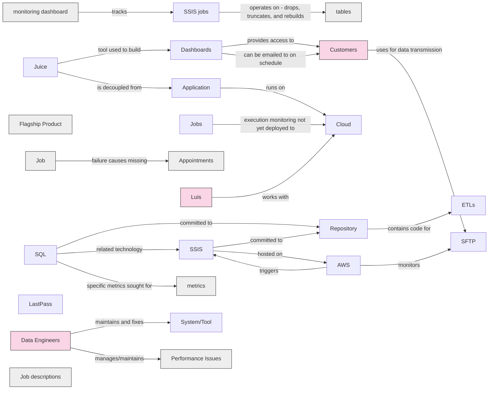

# ConflictAI - SSIS Review 2026-06-08

## Summary

# Summary

A team at DAS presented their current data infrastructure, which relies heavily on SSIS (SQL Server Integration Services) jobs to manage data pipelines. The system consists of tightly coupled jobs that run on predetermined schedules, with dependencies between them, and they frequently fail due to fragility in their design.

The main issues plaguing the system include: jobs that truncate and rebuild tables from scratch, making the system vulnerable to data loss if anything crashes; frequent failures that require constant manual intervention from three to four data engineers to keep running; and poor visibility and documentation about what each job actually does. One monitoring dashboard was recently built to track job status and success rates, revealing that some jobs have never run successfully.

The infrastructure spans multiple databases (some on EC2 instances and some on RDS), with data ingestion from various sources including customer SFTP servers and AWS file monitoring. SQL code is version-controlled in a repository, but the overall system lacks modern data pipeline practices and requires constant "tape and glue" fixes from engineers rather than sustainable solutions.

The team acknowledged that SSIS is outdated for their needs and that better alternatives exist for managing these data workflows in modern times.

## Key Points

- **Team introductions and roles**
  Rick (Engineering Manager at DAS), Leo (Manager), Alicia (Data), Luis (Computer Engineer), Hiram (Software Engineer), Julio (Software Engineer)

- **SSIS jobs are tightly coupled and fragile**
  Jobs drop and truncate tables then rebuild from scratch. If anything crashes, entire tables go missing. Jobs run on predetermined intervals with dependencies on previous jobs

- **Jobs frequently fail and require constant manual fixes**
  3-4 data engineers in India constantly fix failures. One job has never run successfully. Failures happen randomly and are fixed without documentation or notification

- **Monitoring dashboard was recently built**
  Created a week ago to track job status, failure rates, and success rates. Shows current running jobs and upcoming jobs

- **Job descriptions are unclear and poorly documented**
  Some job purposes unknown. AI was used to determine descriptions because getting information from engineers is difficult

- **SQL code is in repository with some AWS integration**
  SQL committed to repo. AWS monitors SFTP for new files, pulls them, and triggers SSIS jobs to process records into database

- **Multiple data sources including customer SFTPs**
  SFTP sometimes on company end, sometimes on customer dealership end. AWS and SSIS handle file processing and database loading

- **Multiple databases across EC2 and RDS instances**
  Main SSIS jobs run on EC2. Two RDS instances handle webhook data from emails/SMS. Mautic (open source) runs on RDS for segmentation and emailing

- **System is brittle with unclear failure points**
  When jobs break, it's unclear where the failure occurred. Requires 3 engineers to keep running daily. Very expensive to maintain

- **AWS Glue considered but not a real solution**
  Considered moving to serverless AWS Glue to downsize databases, but this just moves the problem to cloud without addressing underlying architectural issues

- **12-year-old legacy system with accumulated technical debt**
  Application changed hands multiple times. No cleanup of old artifacts. Unused databases like BirdBath and Digital Bundle still exist but not deleted due to fear of breaking something

- **ETL jobs previously took over 24 hours**
  Optimizations and indexing have been applied to improve processing time

## Knowledge Graph

