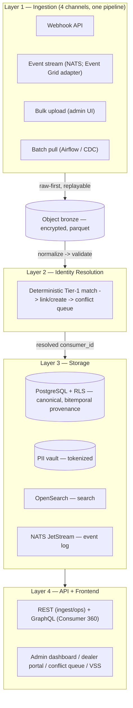

# DAS CDP — Architecture (Canonical)

**Status:** canonical architecture reference. Supersedes `wiki/Architecture.md` and `artifacts/phase-0/deliverables/das-cdp-revised-architecture-plan.md` (both retained for history, headed with a supersede note pointing here).

**Scope:** what the CDP is and how it is built: layers, data flow, services, deployment, observability, and the locked design decisions. Sizing and cost are not duplicated here. Infrastructure sizing/placement lives in [`docs/cdp-reference-topology.md`](cdp-reference-topology.md); the AWS-vs-Azure cost comparison lives in [`docs/cloud-aws-vs-azure-bakeoff.md`](cloud-aws-vs-azure-bakeoff.md). Stack detail: [`wiki/Tech-Stack.md`](../wiki/Tech-Stack.md). Decision log: `memory/decisions.md#d-093`.

**Cloud substrate:** a portable OSS core (Postgres, NATS, Temporal, OpenSearch, Airflow, Auth0, OTel) that runs unchanged on either cloud. Azure-primary is preferred (Dan Aston, 2026-06-17) to consolidate on DAS's org cloud; AWS is the alternative (data gravity: source DBs on EC2/RDS). The bake-off settles the substrate; the core and the bus-agnostic intake are identical either way, with no vendor lock-in in app code. Service names below are written Azure-first with the AWS equivalent in parentheses; where one product is named it is illustrative, not a lock.

## System overview

Four functional layers. Each layer's responsibility is fixed; the technology that runs it is portable.

## Sources (what the CDP ingests from)

Discovered in Phase 0 (SSIS review with Rick Sorich, 2026-06-08). The CDP ingests from **original sources**, becomes the system of record, and retires the legacy ETL once reliable.

- **Source DBs:** SQL Server on EC2: `ETL01` (EDW_Staging/Target, SSISDB), `3BHS001` (Auth, Automobiles, ClientDB, Lift; legacy, dependencies not fully mapped, modified cautiously), `SQL01` (ActivityLog, DmsWarehouse, Inventory, Tracking); RDS MySQL (Analytics, Analytics-Mautic). Data gravity is on AWS.
- **Legacy ETL:** SSIS, 13 truncate-and-rebuild jobs, daily, on ETL01; fragile and near capacity. DAS confirmed the jobs will be dropped. The CDP reimplements the logic against originals (Airflow DAGs + Python), not a 1:1 port; DAG count is set by source decomposition, not the legacy 13.
- **DWRPT:** pre-joined reporting views (`ALv_CDXP_*`, `ALv_ML_*`, `ALv_RL_*`, `ALv_SL_*`, `core_v_*`) powering Juicebox (221 reports, not long-term). Reporting-parity reference only, not an ingestion source (may contain manipulated/summarized data).
- **DAS AI layer:** live production at `ai.das-technology.com`, agents executing SQL over DWRPT views (lead response, review sentiment, CDXP dashboards). CDP AI features reuse this infrastructure.
- **Event publishers:** DAS apps publish to Azure Event Grid (Acceptor leads, plus Inventory, Comms, Survey, Reputation) as CloudEvents 1.0; the CDP subscribes via a config-only adapter.

## Layer 1 — Ingestion

Four channels feed one universal pipeline: **land raw -> normalize -> validate -> resolve identity -> store -> return `consumer_id`**. New sources plug in as adapters without touching the resolution engine.

- **Webhook API:** real-time event push (Django REST); returns `consumer_id` for fast-path subsequent events.
- **Event stream:** async intake on the internal **NATS JetStream** backbone; external buses (DAS's Azure Event Grid first) bridge in via a config-only adapter. Bus-agnostic, at-least-once with retry. DAS publishes CloudEvents 1.0, so a direct-publish path is a config swap, not a rewrite.
- **Bulk upload:** CSV/JSON via admin UI, background processing with progress.
- **Batch pull:** scheduled extraction from source DBs, SFTP, vendor APIs via **Airflow**; source capture via **Debezium** CDC (or cloud-native DMS).

Raw-first capture preserves untrusted source data at the point of consumption (DAS's explicit requirement) and makes the whole pipeline replayable from bronze. Ingest is from original sources, not EDW/DWRPT: the DWRPT pre-joined views contain manipulated/summarized data and are a reporting-parity reference only. Airflow owns all ingest; Temporal owns the app/admin layer, with no overlap.

## Layer 2 — Identity Resolution

**Deterministic Tier-1 + conflict queue first; ML earned in Phase 2+ against real data.** Normalize identifiers (email, phone, VIN, dealer customer ID) -> exact match against the identity graph -> link to an existing consumer or create new -> human conflict queue for ambiguous matches. Field-level provenance records which source fed each value; survivorship rules (source-trust ranking, DMS as ground truth) select the golden value; household/family resolution is a first-class hard case.

The relational `identity` / `identity_link` tables **are** the graph: single source of truth in Postgres, no separate graph store (Apache AGE is the in-engine option if traversal need is proven). The resolver runs in a privileged role above tenant RLS (cross-dealer linkage); all serving stays tenant-scoped. The 4 AI/ML tables deploy empty-but-complete in Stage 1, so ML is a config/model addition with zero schema migration. Matching model, survivorship, household, and consent locked 2026-06-18 (Alicia + Luis); identity strategy Option A locked 2026-06-17.

## Layer 3 — Storage

- **PostgreSQL (≥ 15.4) + Row-Level Security:** canonical and serving store, managed (Azure Database for PostgreSQL / RDS) + pooling + read replicas. Multi-tenant isolation at the database level, so a dealer's data is invisible to others even if app-layer auth is bypassed.
- **Object-store raw landing** (Azure Blob / S3, bronze, parquet, encrypted): raw ingestion lands here; analytical processing runs over it; replayable.
- **Bitemporal, append-only provenance:** valid-time (`valid_from`/`valid_to`) + system-time (`recorded_at`/`superseded_at`) as `tstzrange` with a GiST exclusion constraint. The "as-of" time-travel query **is** the golden-record evolution view (Mike's #1 requested artifact).
- **OpenSearch:** fuzzy person search + query log. **NATS JetStream:** internal event log/backbone.
- **Erasure orchestration:** durable Temporal workflow saga (delete tokenized PII-vault row + tombstone -> confirm tokens dereference across stores -> audit). The append-only history survives; only the PII the token points to is gone. Per-consumer crypto-shred evaluated and rejected (superseded 2026-06-21).
- **Consent ledger:** portable app-built SHA-256 hash chain, no KMS/Key Vault coupling (locked 2026-06-18).
- **Data lifecycle:** observation tables range-partitioned by time; old partitions rotate to cold object storage and re-hydrate on demand (`active -> dehydrated -> archival -> erasure`).
- **Table set:** 15 tables locked 2026-06-18 (11 core + 4 AI/ML stubs, structurally complete from day 1; zero migrations for Phase 2 ML). Schema DDL is the remaining build artifact (Alicia + Luis). See [`Data-Model`](../wiki/Data-Model.md).

## Layer 4 — API + Frontend

**Dual surface: REST + GraphQL.** REST for ingestion endpoints and operational integrations (webhooks, event push, file upload); GraphQL (Strawberry) for the Consumer 360 profile, so downstream apps query exactly the fields they need in one round trip. Both share one backend, auth, and tenant context. Frontend (Next.js): DAS admin dashboard, dealer portal, identity conflict-review queue. VSS is the first downstream consumer. Backend is Python-primary (Django REST + Strawberry GraphQL, Airflow/Temporal workers, resolver/transform); Go reserved for measured hot paths; TypeScript on the frontend.

## Services topology

| Service | Responsibility | Tech |
|---|---|---|
| Ingestion | Batch DAGs, source CDC, webhook + bulk endpoints, raw landing | Airflow (managed or self-hosted), Debezium / cloud-native CDC, Django REST |
| Event intake | Bus-agnostic capture; Event Grid adapter (Option A) | NATS JetStream + adapter |
| Identity resolution | Normalize -> deterministic match -> link/create -> conflict queue | Python service; Temporal for merge/unmerge sagas + human-in-loop |
| Profile API | Consumer 360 reads; operational/ingestion writes | Strawberry GraphQL + Django REST |
| Admin / ops | Dealer portal, conflict-review UI, source-onboarding console | Next.js + Django |
| Workflow / workers | Queue workers, admin-utility orchestration, erasure saga | Temporal |
| Analytics / search | Reporting; fuzzy person search | Postgres-native analytics (portable) or managed warehouse; OpenSearch |
| Reporting | ~1,700 dealer tenants + internal authoring | Apache Superset (self-hosted, headless/embedded, BI-as-code) |

## Deployment architecture

Cloud-neutral; Azure-primary product named first, AWS equivalent in parentheses. Sizing/placement: [`docs/cdp-reference-topology.md`](cdp-reference-topology.md). Cost: [`docs/cloud-aws-vs-azure-bakeoff.md`](cloud-aws-vs-azure-bakeoff.md).

- **Compute:** Kubernetes (AKS; EKS) self-hosts NATS JetStream, Temporal, Django, Next.js, OpenSearch, workers. Airflow for ingest DAGs (self-hosted on k8s; MWAA exists on AWS, Azure self-hosts).
- **Data stores:** object storage (Blob; S3) bronze, encrypted · PostgreSQL (Azure DB for PostgreSQL; RDS) + pooling + read replicas · Postgres-native analytics (portable) or managed warehouse · OpenSearch.
- **Ingress & auth:** cloud L7 LB (Application Gateway; ALB) + NLBs for non-HTTP; Auth0 (EntraID federation, 4-role group-based); API-key/HMAC for machine ingestion. Kong addable behind the LB if a multi-consumer external API surface materializes.
- **CDC:** Debezium (preferred, portable) or cloud-native DMS into raw landing.
- **Cross-cutting:** secrets + keys (Key Vault; Secrets Manager + KMS) for at-rest encryption; erasure via tokenized PII-vault delete. Managed backup/PITR + object-store raw replay + cross-region pilot-light standby (DR).
- **IaC:** Terraform via `boilerworks-opscode`; app on `boilerworks-django-nextjs`.
- **Networking:** private VNet/subnets for the data tier; public ingress via the cloud LB; CDC connectivity to source SQL Server; inbound Event Grid subscription delivery to the CDP webhook.

**Operational invariants (productionized V1):** idempotent ingest (dedup keys on event + webhook); Django expand/contract zero-downtime migrations; auth first-line on every endpoint; group-based permissions; soft deletes only; UUID PKs in APIs; real Postgres in tests.

## Observability

OTel instrumentation is portable across both clouds and feeds three signals:

- **Metrics:** OTel -> Prometheus -> Grafana (self-hosted on the node group by default; managed AMP / Azure Monitor is the opt-in alternative; see bake-off for the cost swing).
- **Logs:** OTel -> OpenSearch (Elastic Common Schema / SS4O), reusing the search-tier OpenSearch.
- **Traces (distributed tracing):** OTel -> **Jaeger**, self-hosted and OpenSearch-backed so traces share the existing OpenSearch tier and stay cloud-portable. On AWS, run hosted/managed Jaeger where possible (Jaeger backed by Amazon OpenSearch Service); AWS X-Ray is the managed alternative but is proprietary and breaks portability, so Jaeger is preferred. On Azure, the same self-hosted Jaeger applies (Application Insights is the proprietary alternative, not preferred).

This keeps the avoid-SaaS direction intact: metrics, logs, and traces all run on OSS the team operates, identical on either cloud, with managed backends as opt-in levers rather than defaults.

## Cloud footprint alignment

| | Detail |
|---|---|
| Reused | Auth0 (DAS-approved SaaS, federates EntraID); DAS's existing cloud presence and source DBs |
| Net-new | Kubernetes (AKS; EKS), NATS, Temporal, PostgreSQL, OpenSearch, Airflow, Superset, Jaeger |
| Event source | DAS app events originate in Azure Event Grid; the CDP subscribes via a config-only subscription to the CDP webhook (Option A). Azure-primary co-locates with this event layer; AWS makes it a cross-cloud subscription (still bus-agnostic). |
| Portability | The OSS core runs on either cloud; proprietary swap-points (managed Airflow, warehouse, CDC, backup, secrets/KMS, object storage, LB) each have an Azure and AWS equivalent. No vendor lock-in in app code. |

**Honest constraints:** legacy 3BHS001 is modified cautiously (extract via read replica / low-impact windows); dev baseline now, production rightsized on observed load (2026-06-16, see topology); Event Grid delivery details (catalog, subscription ownership, auth) are Phase-1 build-time and the architecture stands regardless.

## Locked decisions (summary)

| Decision | Status |
|---|---|
| Four-layer architecture, PostgreSQL + RLS, multi-tenant model | Locked |
| Four ingestion channels, bus-agnostic NATS intake, raw-first | Locked |
| REST + GraphQL dual surface; Python-primary backend; Django; Next.js | Locked |
| Identity strategy Option A | Locked 2026-06-17 |
| Matching / survivorship / household / consent model | Locked 2026-06-18 (Alicia + Luis) |
| Bitemporal append-only provenance; 15-table set (11 core + 4 AI/ML stubs) | Locked 2026-06-18 |
| Tokenized PII-vault erasure (crypto-shred rejected) | Locked; vault delete 2026-06-21 |
| Consent ledger (SHA-256 hash chain, portable) | Locked 2026-06-18 |
| Reporting on Apache Superset (two-layer, $0 baseline) | Locked |
| Portable OSS core, Azure-primary preferred (AWS alternative) | Direction set 2026-06-17; bake-off finalizes substrate |
| Cloud cost comparison | Research complete (bake-off); **no cloud decision recorded** |

Remaining build-time artifacts (not design decisions): the schema DDL itself, and residual design detail (consent policy values, household lifecycle) — owned by the Identity Resolution Strategy + CDP Scoping deliverables.

## References

- Sizing / placement: [`docs/cdp-reference-topology.md`](cdp-reference-topology.md)
- Cloud cost comparison: [`docs/cloud-aws-vs-azure-bakeoff.md`](cloud-aws-vs-azure-bakeoff.md)
- Identity: [`deliverables/identity-resolution-strategy.md`](deliverables/identity-resolution-strategy.md) · Privacy: [`deliverables/privacy-by-design-framework.md`](deliverables/privacy-by-design-framework.md)
- Reporting (target state): [`deliverables/reporting-data-flow.md`](deliverables/reporting-data-flow.md) · Scoping: [`deliverables/cdp-scoping-document.md`](deliverables/cdp-scoping-document.md)
- Stack detail: [`wiki/Tech-Stack.md`](../wiki/Tech-Stack.md) · Data model: [`wiki/Data-Model.md`](../wiki/Data-Model.md)
- Decision log: `memory/decisions.md`
- Build plan: `specs/03-phase-1-build/`
