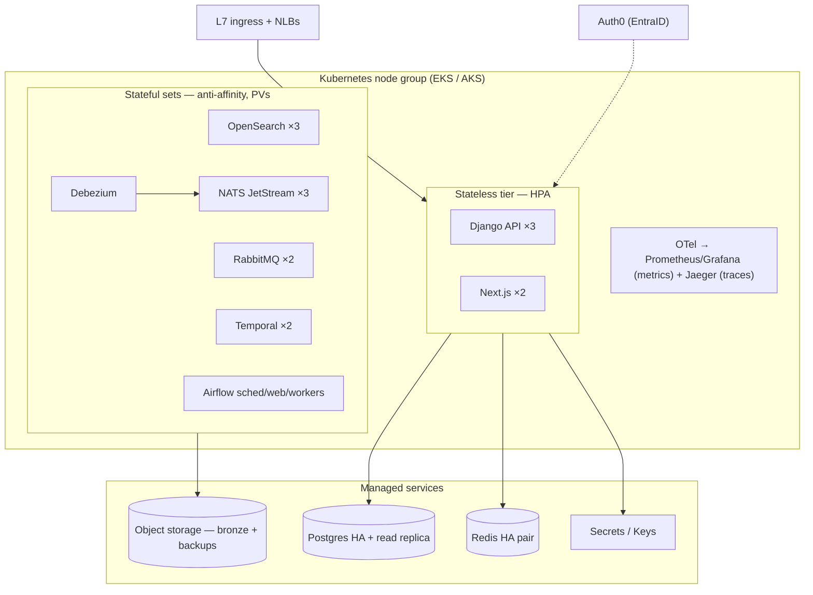
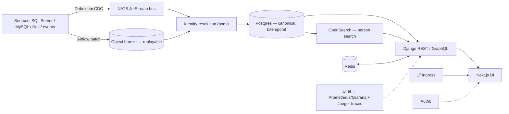

# DAS CDP — Reference Topology (Dev + Prod Sizing)

**Cloud-neutral.** The CDP runs an identical open-source core on Kubernetes (EKS or AKS); the substrate is interchangeable (see `docs/cloud-aws-vs-azure-bakeoff.md` for the per-cloud cost comparison). This doc fixes the **infrastructure sizing and workload placement** for two environments — a dev baseline and a production steady-state — at the reference scale of ~10M consumers / ~1,700 dealer tenants.

**Posture: dev baseline first, production rightsized on observed load** (2026-06-16 infra-sizing decision). The stack is elastic — every line below scales as a config change, not a redesign. Sizes here are starting points; the system surfaces its own profile in flight and prod is tuned against real load.

**Costing nature:** node counts, storage, and replica counts are engineering estimates, not measured load. Per-unit costs and bottom-line totals live in the bake-off doc; this doc is the topology those costs are built on.

## Architecture in one line

Sources → ingestion (Debezium CDC + Airflow batch) → event bus (NATS JetStream) + object bronze → identity resolution → canonical Postgres → serving (GraphQL/REST + OpenSearch) → Next.js UI behind the L7 ingress. Everything except the managed data services runs as pods on the node group.

## Deployment topology

## What is self-hosted vs managed

| Layer | Self-hosted on the node group (we run it) | Managed service (cloud-provided) |
|---|---|---|
| App | Django REST + Strawberry GraphQL, Next.js | — |
| Eventing / workflow | NATS JetStream, RabbitMQ, Temporal | — |
| Orchestration | Airflow (scheduler, webserver, workers) | — |
| Search | OpenSearch (data nodes) | — |
| CDC | Debezium | — |
| Observability | OTel collector, Prometheus, Grafana, Jaeger — traces, OpenSearch-backed (self-host default) | — |
| Data of record | — | Postgres (RDS / Azure DB for PostgreSQL Flexible Server) |
| Cache | — | Redis (ElastiCache / Azure Cache for Redis) |
| Object storage (bronze + backups) | — | S3 / Azure Blob |
| Ingress | — | L7 LB (ALB / Application Gateway v2) + NLBs for non-HTTP |
| Secrets / keys | — | Secrets Manager + KMS / Key Vault |
| Warehouse | Postgres-native default (optional self-host ClickHouse/DuckDB) | optional: Redshift / Fabric / Synapse |
| Auth | — | Auth0 (federates EntraID) |

Self-hosting the OSS core is the avoid-proprietary-SaaS direction: the stack is identical on either cloud, with no managed-service premium and full portability, at the cost of operating the software ourselves.

## Node group — workload placement and sizing

Per-workload resource **requests** (steady-state; limits set higher for burst). Replica counts differ dev vs prod.

| Workload | Per-pod request | Dev replicas | Prod replicas | Prod vCPU / GB |
|---|---|--:|--:|--:|
| Django API (REST + GraphQL) | 1 vCPU / 2 GB | 1 | 3 | 3 / 6 |
| Next.js frontend | 0.5 vCPU / 1 GB | 1 | 2 | 1 / 2 |
| NATS JetStream | 0.5 vCPU / 1 GB | 1 | 3 | 1.5 / 3 |
| RabbitMQ | 0.5 vCPU / 1 GB | 1 | 2 | 1 / 2 |
| Temporal | 0.5 vCPU / 1 GB | 1 | 2 | 1 / 2 |
| Airflow (scheduler + web + workers) | mixed | 3 pods | 4 pods | 3.5 / 7 |
| OpenSearch data nodes | 2 vCPU / 8 GB | 1 | 3 | 6 / 24 |
| OTel collector | 0.5 vCPU / 1 GB | 1 | 2 | 1 / 2 |
| Debezium (Kafka Connect) | 1 vCPU / 2 GB | 1 | 1 | 1 / 2 |
| Prometheus + Grafana + Jaeger (self-host; Jaeger uses OpenSearch as its store) | 1 vCPU / 2 GB | 1 | 2 | 2 / 4 |
| **Sum of requests (prod)** | | | | **~21 / ~54** |

Adding ~30% headroom (rolling deploys, burst, node-failure tolerance) plus kube-system overhead puts prod at **~28–30 schedulable vCPU**, which is why the prod node group is sized above that with one node of slack for an AZ/node failure.

| Node group | Dev | Prod |
|---|---|---|
| Nodes × size | 3 × 4 vCPU / 16 GB | 6 × 8 vCPU / 32 GB |
| Total | 12 vCPU / 48 GB | 48 vCPU / 192 GB |
| Spread | single node pool | spread across 3 AZs/zones (2 nodes each) |
| Headroom | tight (dev-only) | ~1 node of slack for failover |

**Placement notes:** OpenSearch and the messaging/workflow stateful sets (NATS, RabbitMQ, Temporal) get anti-affinity so replicas land on different nodes/zones. Airflow workers are the elastic tier — scale out under batch load. App pods (Django/Next.js) are stateless and HPA-driven. Debezium is a singleton connector against the source CDC streams.

## Persistent volumes (block storage)

Stateful sets need PVs (EBS gp3 / Azure Premium SSD). Dominant consumer is OpenSearch.

| PV | Dev | Prod |
|---|--:|--:|
| OpenSearch data | 100 GB | 750 GB |
| NATS JetStream (stream retention/replay) | 100 GB | 400 GB |
| RabbitMQ + Temporal + Airflow (logs/dags) | 100 GB | 350 GB |
| **Total block** | **300 GB** | **1.5 TB** |

## Managed data tier

| Service | Dev | Prod |
|---|---|---|
| Postgres (canonical) | 4 vCPU, **single-AZ**, 100 GB, built-in pooler | 4 vCPU, **HA (zone-redundant / multi-AZ)** + **1 read replica** (×3 compute), 100 GB → grows on ingestion |
| Redis cache | 1 small node | HA pair (primary + replica) |
| Object storage (bronze + backups) | 200 GB | 3 TB |
| L7 ingress | 1 L7 LB, minimal capacity | L7 LB + capacity units + NLBs for NATS/non-HTTP |
| Secrets / keys | managed (few keys/secrets) | managed (full set) |
| Warehouse | Postgres-native ($0) | Postgres-native default; managed (Redshift / Fabric / Synapse) opt-in |
| Backups / DR | daily backup, no cross-region | PITR + snapshots, **cross-region pilot-light PG standby + object geo-replication** |

**Postgres is the anchor.** Start at 100 GB and grow as sources feed in — storage scales online, compute scales up as a config change, read replicas absorb serving/analytics read load before any managed warehouse is needed.

## Per-cloud SKU mapping

Sizes are held constant; only the SKU label changes.

| Component | AWS SKU | Azure SKU |
|---|---|---|
| Dev node (4 vCPU) | m6i.xlarge | D4ds_v5 |
| Prod node (8 vCPU) | m6i.2xlarge | D8ds_v5 |
| Postgres (4 vCPU) | RDS db.r6g.xlarge | PG Flexible Server GP 4-vCore |
| PG pooler | RDS Proxy | built-in PgBouncer |
| Redis | ElastiCache cache.r6g.large | Azure Cache Standard C3 |
| Object storage | S3 | Azure Blob (Hot) |
| Block / PV | EBS gp3 | Premium SSD v2 |
| L7 ingress | ALB | Application Gateway v2 |
| Secrets / keys | Secrets Manager + KMS | Key Vault |
| Managed warehouse (opt-in) | Redshift Serverless | Fabric / Synapse Serverless |

## Scaling levers (dev baseline → production)

1. **App tier** — HPA on Django/Next.js by CPU/RPS; node autoscaler adds nodes under pressure.
2. **Postgres** — vertical scale-up (vCPU/RAM) online; add read replicas for serving/analytics fan-out; storage autogrows.
3. **OpenSearch** — add data nodes + shards as the person-search index grows.
4. **Airflow** — scale the worker pool for batch/backfill windows; scale back after.
5. **Redis** — tier up node size / add shards for cache pressure.
6. **Warehouse** — stay Postgres-native until heavy BI/reporting scan load justifies a managed warehouse (then opt into Redshift / Fabric / Synapse — see bake-off).
7. **DR** — promote the cross-region pilot-light standby; object storage is already geo-replicated.

## Data flow (infrastructure view)

1. **Ingest** — Debezium streams source CDC; Airflow runs batch/file feeds. Raw lands in object **bronze** (replayable) and on the **NATS** bus.
2. **Resolve** — the identity-resolution engine (pods) consumes events, writes canonical entities to **Postgres** (bitemporal, provenance-bearing).
3. **Index** — canonical changes sync to **OpenSearch** for fuzzy person search.
4. **Serve** — Django GraphQL/REST reads Postgres (RLS, tenant-scoped) and OpenSearch; **Redis** caches hot reads.
5. **Present** — Next.js UI calls the API behind the **L7 ingress**; Auth0 handles auth.
6. **Observe** — OTel collector → Prometheus → Grafana across all pods and the managed tier.

## References

- Costs and per-cloud pricing: `docs/cloud-aws-vs-azure-bakeoff.md`
- Infra-sizing posture: `memory/decisions.md` (2026-06-16 dev-baseline-first)
- Foundation build stories: `specs/03-phase-1-build/01-foundation/`
