# Data Flow — DAS Estate

How data originates from external sources and flows through each database layer to power the CDP, analytics, and AI products.

---

## Overview diagram

```mermaid
flowchart TD

  %% ── External sources ─────────────────────────────────────
  subgraph SRC["External Sources"]
    CRM["CRM Systems\nVinSolutions · eLeads\nTekion · DealerSocket\nReynolds & Reynolds"]
    DMS["DMS Systems\nCDK · Authenticom\nDealerTrack · R&R"]
    LEADS["Lead Providers\nTrueCar · Cars.com\nAutoTrader · CarGurus\nCapital One · RouteOne"]
    REVIEW["Review Platforms\nGoogle My Business\nDealerRater · Yelp\nCars.com · CarGurus"]
    ADS["Advertising APIs\nMeta / Facebook\nGoogle GA4 + PMax\nTikTok · Instagram"]
    EMAIL_SMS["Email & SMS\nMailGun webhooks\nTwilio SMS\nRocketChat/ETS"]
    INVENTORY["Inventory Systems\nHomeNet API\nLotVantage\nDealer crawler"]
    BILLING["Billing\nZuora subscriptions\nSalesforce/Dynamics365"]
    VINDATA["VIN Reference\nDataOne (blocked)\nBlackBook · KBB"]
  end

  %% ── RL Production — lead response platform ───────────────
  subgraph RL["RL Production  ·  20.65.216.199:49577"]
    OLTP["oltp\n240 tables · 1.13B rows · 196 GB\nfranchise_consumer 51M\nfranchise_consumer_alias 34M\nlead 11M"]
    OLTP_ARCH["oltp_Archive\n9 tables · 1.9B rows · 225 GB\nlead_history 1.03B\nfranchise_consumer_txn 422M"]
    DATAONE["DataOne\nblocked — likely VIN ref"]
  end

  %% ── DAS primary SQL Server ────────────────────────────────
  subgraph DAS["DAS Primary  ·  20.51.108.231:1433"]
    MEG["Megatron\n852 tables · 438 GB\nAccount 2.08M\nListing 7.43M\nLeadQueue 207K"]
    MEG_REPO["MegatronRepository\nread-only archive mirror\nListingRepository 73.79M"]
    PRIME["Prime\n141 tables · 67 GB\nVDPSERPPerformance 19.79M\nPlatformAuto_Campaigns 552K"]
    TRAX["Trax\n36 tables · 11 GB\nAdCapture_MonthlyTotal 108M\nDealerCapture 893K"]
    WEB["WEB\n657 tables · 76 GB\nFEEDADS 8M\nFeedDealers ~22K"]
    OBF["OutboundFeeds\nobf_Destination_Budgets 15.5M\nAccountDestinations 85.6K"]
    PF["petfinder\nPetFinderPets 15.7K\nZipCode 42.9K"]
    EC["endeavorcentral\nActive_Campaigns 22K\nAll_Flights 49K"]
    RD["RedDawn\nCrawler_Unique_AdNum 41.8M\nCrawler_Results 1.36M"]
  end

  %% ── DWRPT server ─────────────────────────────────────────
  subgraph DWRPT["DWRPT Server  ·  40.83.161.93"]
    DS["DataStaging\n13 schemas · 100 tables · 335 GB\nCDXP / BlueSky / MediaLogix\nRadar / RL / Dynamics / GMB"]
    DWRPT_AI["DWRPT_AI\n13 schemas · 108 tables · 335 GB\n42 AI-schema views\nJuiceReporting_BlueSkyOverview 13.3M"]
    FH["Feedhub / CIM\nFeedAds 8M\nFeedDealers 22.8K\nblocked — schema via ETL copy"]
    ZU["Zuora\nAccountStage 11.6K\nbilling mirror\nblocked — schema via ETL copy"]
  end

  %% ── Outputs ──────────────────────────────────────────────
  AI_TOOL["ai.das-technology.com\nDAS AI assistant\n(42 AI views in DWRPT_AI)"]
  CDP["CDP / Golden Record\nidentity-resolved\ncustomer profile"]
  PORTAL["DAS Portal\n(planned)"]
  REPORTS["JuiceReporting\nanalytics / BI"]

  %% ── Data flows: sources → RL ─────────────────────────────
  CRM -- "ADF/XML email or API\nlead response triggers" --> OLTP
  LEADS -- "ADF/XML → email → RL\nlead_provider_name" --> OLTP
  DMS -- "DMS data feeds" --> OLTP
  VINDATA -. "VIN reference lookup\n(DataOne — blocked)" .-> OLTP

  %% ── RL internal archival ─────────────────────────────────
  OLTP -- "periodic bulk archive\n(threshold-based job)" --> OLTP_ARCH

  %% ── Sources → DAS primary ────────────────────────────────
  CRM -- "CSV email →\nFTP → SSIS ingestion" --> MEG
  DMS -- "CDK 3PA → FTP\n(48-72 hr lag)" --> MEG
  LEADS -- "ADF/XML → SSIS\nLeadQueue" --> MEG
  ADS -- "Meta / Google APIs\ncampaign perf" --> PRIME
  ADS -- "Google GVA / PMax\nMediaLogix" --> PRIME
  EMAIL_SMS -- "MailGun webhooks\n→ PostgreSQL events" --> DS
  REVIEW -- "GMB / DealerRater\nReviewRocket API" --> DS
  INVENTORY -- "HomeNet / LotVantage\nnightly feed" --> WEB
  INVENTORY -- "dealer crawler\nVIN scrape" --> RD
  BILLING -- "Zuora → staging" --> ZU
  INVENTORY -- "FeedAds ETL\nnightly" --> FH

  %% ── DAS primary internal flows ───────────────────────────
  MEG -- "archive mirror\n(read-only snapshot)" --> MEG_REPO
  WEB -- "FEEDADS/FEEDDEALERS\nnightly ETL copy" --> DS
  FH -- "FeedAds ETL copy\nMLdata schema" --> DS
  OBF -- "feed routing data" --> WEB

  %% ── RL → DWRPT ───────────────────────────────────────────
  OLTP -- "SSIS ETL\nresponse logix schema" --> DS

  %% ── DAS primary → DWRPT ─────────────────────────────────
  MEG -- "CDXP/BlueSky ETL\nvia SSIS (CRM/CVH/DMS jobs)" --> DS
  PRIME -- "MediaLogix ETL\nMLdata schema" --> DS
  RD -- "crawler results" --> DS

  %% ── DWRPT internal ───────────────────────────────────────
  DS -- "reporting replica\n(same ETL pipelines)" --> DWRPT_AI
  ZU -- "Zuora staging ETL" --> DS

  %% ── Outputs ──────────────────────────────────────────────
  DWRPT_AI -- "42 AI views\nSQL queries" --> AI_TOOL
  DWRPT_AI -- "JuiceReporting\nidentity seed" --> REPORTS
  DS -- "identity resolution\nCandidate joins" --> CDP
  OLTP -- "franchise_consumer_alias\nemail/phone graph" --> CDP
  MEG -- "Account + Listing\nCommonClientID" --> CDP
  PRIME -- "VDP performance\ncampaign attribution" --> CDP
  CDP --> PORTAL

  %% ── Styling ──────────────────────────────────────────────
  classDef external fill:#e8f4f8,stroke:#4a90d9,color:#000
  classDef rl fill:#fff3e0,stroke:#e65100,color:#000
  classDef das fill:#f3e5f5,stroke:#7b1fa2,color:#000
  classDef dwrpt fill:#e8f5e9,stroke:#2e7d32,color:#000
  classDef output fill:#fce4ec,stroke:#c62828,color:#000,font-weight:bold

  class CRM,DMS,LEADS,REVIEW,ADS,EMAIL_SMS,INVENTORY,BILLING,VINDATA external
  class OLTP,OLTP_ARCH,DATAONE rl
  class MEG,MEG_REPO,PRIME,TRAX,WEB,OBF,PF,EC,RD das
  class DS,DWRPT_AI,FH,ZU dwrpt
  class AI_TOOL,CDP,PORTAL,REPORTS output
```



---

## Layer-by-layer explanation

### External sources

| Source category | How data enters DAS |
|---|---|
| CRM (VinSolutions, eLeads, Tekion, DealerSocket, R&R) | CSV exported manually → emailed to `Analytics@3birdsmarketing.com` → FTP → SSIS → **Megatron** |
| DMS (CDK, Authenticom, DealerTrack, R&R DMS) | CDK via 3PA number → FTP (48–72 hr lag); Authenticom via FTP/SFTP → SSIS → **Megatron** |
| Lead providers (TrueCar, Cars.com, AutoTrader, CarGurus, etc.) | ADF/XML email format → **RL oltp** (2,500+ parsers); also SSIS → **Megatron** `LeadQueue` |
| Advertising APIs (Meta, Google, TikTok) | Direct API → **Prime** (MediaLogix ad performance); GA4/GCLID events also flow in |
| Review platforms (GMB, DealerRater, Yelp) | ReviewRocket API → **DataStaging** `core` and `radar` schemas |
| Email/SMS (MailGun, Twilio) | MailGun webhook → PostgreSQL events → **DataStaging** BlueSky schema |
| Inventory (HomeNet, LotVantage, crawler) | HomeNet/LotVantage nightly feed → **WEB** `FEEDADS`; crawler → **RedDawn** |
| Billing (Zuora, Salesforce/Dynamics 365) | Zuora staging mirror → **Zuora** DB → **DataStaging** `zuora` schema |

### RL Production (`oltp` / `oltp_Archive`)

Response Logix runs the lead response and CRM automation platform. It owns the richest identity tables in the estate:

- `franchise_consumer` (51M) — consumer identity master per franchise
- `franchise_consumer_alias` (34M) — multi-email / multi-phone alias graph; richest identity expansion table in the estate
- `franchise_consumer_vehicle` (29M) — VIN → consumer linkage
- `lead` (11M) — full lead PII with provider reference IDs

Data writes are **application-layer only** (ADO.NET/JDBC) — no SSIS stored procedures exist in `oltp`. Old records are bulk-moved to `oltp_Archive` via a periodic job (threshold-based, schedule unknown).

RL data reaches **DataStaging** via SSIS ETL into the `responseLx` schema.

**Key linkage uncertainty:** `customer.AccountId` (63% populated) may equal `Megatron.Account.acc_ID`; `customer.NewClientId` (51%) may equal `CommonClientID`. Awaiting Ron Mulder confirmation.

### DAS Primary server (`Megatron` / `Prime` / `Trax` / `WEB` / others)

The DAS SQL Server at `20.51.108.231` holds the main transactional and analytics databases:

- **Megatron** — canonical account/listing/lead database; SSIS processes CRM, DMS, CVH, Email, and BlueSky jobs into it
- **MegatronRepository** — read-only archive mirror of Megatron (safe for CDP snapshots)
- **Prime** — ad performance data (VDP, SERP, PlatformAuto campaigns)
- **Trax** — ad capture event log; `AdCapture_MonthlyTotal` (108M rows) is the monthly aggregate
- **WEB** — feed inventory (`FEEDADS`, `FEEDEXTRAS`, `ExistingListings`); data refreshed in-place nightly
- **OutboundFeeds** — routes inventory listings to 69 destination partners; tracks per-account budgets
- **RedDawn** — crawler pipeline for competitor and market inventory data
- **petfinder** — integration with PetFinder shelter/pet listing API (separate vertical)
- **endeavorcentral** — sales/billing campaign tracking; cross-references Megatron `acc_ID`

### DWRPT server (`DataStaging` / `DWRPT_AI` / `Feedhub` / `Zuora`)

The analytics and reporting server at `40.83.161.93` consolidates data from all upstream systems via SSIS ETL (43 SQL Agent jobs):

- **DataStaging** (335 GB) — primary analytics staging layer; 13 schemas covering BlueSky CXP, MediaLogix, ReviewRocket/Radar, Response Logix, Dynamics 365, Zuora, Google My Business, and LotVantage
- **DWRPT_AI** (~335 GB) — reporting replica fed by the same ETL; 42 `AI`-schema views power `ai.das-technology.com`; `JuiceReporting_BlueSkyOverview` (13.3M rows) is the richest identity seed in the estate
- **Feedhub / CIM** — automotive inventory CIM; `FeedAds` (8M rows) feeds into `DataStaging.MLdata` nightly; ConflictAI login blocked
- **Zuora** — billing staging mirror; ConflictAI login blocked; schema recovered from `DataStaging.zuora` staging tables

### Outputs

| Output | Primary data source | Status |
|---|---|---|
| `ai.das-technology.com` AI assistant | 42 `AI`-schema views in `DWRPT_AI` | Live |
| JuiceReporting / BI analytics | `DWRPT_AI.JuiceReporting_*` | Live |
| CDP / Golden Record | `DataStaging` + `oltp` + `Megatron` + `Prime` | Planned — Phase 0 |
| DAS Portal (identity view) | CDP output | Planned — Phase 1 |

---

## Key identity join paths

These are the cross-system joins that matter most for CDP identity resolution:

```
Megatron.Account.acc_ID
  ↔ (candidate) oltp.customer.AccountId       — needs Ron Mulder confirmation
  ↔ CommonClientID                             — via CommonClientIdMapping or CCID column

oltp.franchise_consumer_alias.email / phone
  ↔ DataStaging.CDXP.JuiceReporting_BlueSkyOverview.email / phone
  ↔ Megatron.LeadQueue.ldq_Email / ldq_Phone

franchise_consumer.franchise_consumer_id (UUID)
  ↔ franchise_consumer_alias.franchise_consumer_id  — alias expansion graph

DataStaging.clientdb.ClientConsolidated.CommonClientId (INT)
  ↔ DataStaging.MLdata.ML_Account_Info.CommonClientID  — requires CAST (stored as VARCHAR)
  ↔ DataStaging.radar.clientConfigurations.CommonClientID — requires CAST (stored as TEXT)
  ↔ DataStaging.zuora.AccountStage.ClientID — requires CAST (stored as VARCHAR)
```

---

## Open data flow questions

- What is the ETL refresh cadence per DWRPT schema? (Ron Mulder)
- Which SSIS jobs write into DataStaging vs. DWRPT_AI specifically?
- Does `oltp` → DataStaging ETL capture `franchise_consumer_alias` (the email/phone graph) or only `lead`?
- What triggers archival from `oltp` to `oltp_Archive`? Is there a lag before CDP can see a lead?
- Can the CDP subscribe to the DAS Event Bus (Azure Event Grid) for real-time lead ingestion, bypassing the 48–72 hr SSIS lag?
