# DataStaging

Central SQL Server staging and analytics database that consolidates inbound data from all major DAS product lines — Juice/BlueSky CXP, MediaLogix inventory advertising, ReviewRocket/Radar reputation, Response Logix lead management, Dynamics 365 CRM, Zuora billing, Google My Business, and LotVantage YouTube — into a single queryable surface serving the DAS CDP platform and the AI assistant at ai.das-technology.com.

> **ERD:** `docs/databases/erd/datastaging.svg`
> **DDL dump:** `docs/databases/dumps/datastaging.sql`

---

## Overview

| Property | Value |
|---|---|
| Server | DWRPT (40.83.161.93) |
| Schemas | 13 |
| Tables | 100 |
| Views | 58 (42 in AI schema) |
| Total data | ~335 GB |
| Largest table | CDXP.JuiceReporting_HiddenTable_MarketingSummary (~48 GB, 118M rows) |
| Universal identity key | `CommonClientID` (INT) — present in 10 of 13 schemas |
| PII present | Yes — CDXP schema (email, phone, address, name, VIN, equity), RLData (email, phone, name), RPData (email, phone) |
| GLBA-adjacent data | Yes — equity/trade-in valuations in CDXP.JuiceReporting_BSR_equity |
| Backup cadence | Daily full + frequent log shipping to Azure Blob; 3,843 records in last 30 days |

DataStaging is the **primary read-heavy analytics and staging layer** for the DAS CDP platform. It is not a transactional OLTP store. Data flows in from source systems (Prime, Megatron, RedDawn, Dynamics, Zuora, MediaLogix, Google) via ETL pipelines; the AI assistant (ai.das-technology.com) queries the 42 AI-schema views layered on top of this data. Row-level writes happen in source databases; this database is the consolidated downstream store.

The database sits on the same DWRPT server as DWRPT_AI. Its schema structure mirrors DWRPT_AI very closely — many table names are identical. Key differences: DataStaging contains `RLData.smart_quote` (8.5M rows), the larger `core.Stage_SurveyHistory` (83M rows), and `MLdata.grail_srpactions_daily` (99M rows) that do not appear in the DWRPT_AI estate at the same scale. The CDXP `mv_contact_stats` table (15.4M rows, 15 GB) is the most attribution-rich table in the estate.

Backups are stored to Azure Blob Storage at `medialogixprodsqlstorage.blob.core.windows.net/cimsqlbackupcontainer/`. The last full backup was 343 GB (2026-06-14).

---

## Schemas

### clientdb — Master Client Registry (1 table, 93K rows, 23 MB)

Single table: `ClientConsolidated`. This is the **authoritative cross-system client master** and the root of all `CommonClientID` FK chains.

#### clientdb.ClientConsolidated (93,007 rows, 23 MB)
> Authoritative dealer/client registry — every other schema's `CommonClientID` resolves here.

| Column | Type | Nullable | Key | Notes |
|---|---|---|---|---|
| CommonClientId | int | NOT NULL | PK | Universal tenant identifier |
| DynamicsAccountId | varchar(36) | NULL | | Dynamics 365 account GUID |
| ClientName | nvarchar(254) | NOT NULL | | Dealer group / client name |
| Street | nvarchar(200) | NULL | | Physical address |
| City | nvarchar(128) | NULL | | |
| Province | nvarchar(128) | NULL | | State/province |
| PostalCode | nvarchar(64) | NULL | | |
| CountryName | nvarchar(200) | NULL | | |
| SiteUrl | nvarchar(1000) | NULL | | Dealer website URL |

**CDP note:** Every cross-system join routes through `CommonClientId`. This is the tenant scoping key. Start here when building the tenant resolution layer.

---

### CDXP — Juice/BlueSky CXP Reporting (23 tables, 327M rows, 131 GB)

The richest PII and attribution source in the estate. Contains customer contacts with cross-system identity keys, campaign engagement, revenue attribution, and vehicle equity data. All 23 tables carry `CommonClientID` (INT FK).

#### CDXP.JuiceReporting_BlueSkyOverview (13.3M rows, 13.9 GB)
> Master contact table — four identity keys + full PII + LTV, vehicle lifecycle, and equity data on a single row.

| Column | Type | Nullable | Notes |
|---|---|---|---|
| ContactID | (inferred int) | | Contact identity key |
| ClientID | (inferred int) | | Juice client ID |
| EDW_DMS_Customer_ID | varchar | | DMS customer ID |
| RecipientID | varchar | | Email platform recipient ID |
| CRMID | varchar | | CRM identity key |
| EmailAddress | varchar | | **PII** |
| FirstName / LastName | varchar | | **PII** |
| Address / City / State / ZipCode | varchar | | **PII** |
| PhoneNumber | varchar | | **PII** |
| LTVSegment | varchar | | Lifetime value segment |
| LTVScore / Sale30Score / Sale180Score / Service30Score / Service180Score | decimal | | Predictive scores |
| LeadSourceType / LeadStatusType | varchar | | Lead funnel state |
| SaleDate / LeaseEndDate / LastServiceDate | datetime | | Transaction dates |
| DealType / SaleType | varchar | | |
| VehicleMake / VehicleModel / VehicleYear | varchar | | Owned vehicle |
| VIN | varchar | | **PII-adjacent** |
| EquityValueRough / EquityValueClean / EquityValueAverage | decimal | | **GLBA-adjacent** |
| MonthlyPayments / Trade_in_Average | decimal | | **GLBA-adjacent** |
| CommonClientID | int | | FK → clientdb.ClientConsolidated |

**CDP note:** Primary identity resolution seed — four identity keys (`ContactID`, `EDW_DMS_Customer_ID`, `RecipientID`, `CRMID`) + full PII on one row. Ingest with encryption at rest; tag `pii:high`. This is the best single-table golden record source in the estate.

#### CDXP.JuiceReporting_HiddenTable_MarketingSummary (118M rows, 48 GB)
> Granular email engagement table — every send, open, click, unsubscribe event per recipient per campaign.

Key columns: `ClientID`, `CampaignID`, `CampaignName`, `EmailID`, `SendType`, `SentDate`, `RecipientID`, `FirstName`, `LastName`, `EmailAddress`, `Address1`, `City`, `State`, `ZipCode`, `HomePhone`, `CellPhone`, `WorkPhone`, `IsOpener`, `IsClicker`, `IsBounce`, `IsDelivered`, `IsUnsubscriber`, `IsNonOpener`, `OpenDate`, `ClickDate`, `UnsubscribeDate`, `TransactionDate`, `CommonClientID`.

#### CDXP.mv_contact_stats (15.4M rows, 15.5 GB)
> Most attribution-complete table in the estate — per-contact, per-campaign engagement + service + sales attribution flags with 82 columns.

Key columns: `clientid`, `campaign_id`, `contact_id`, `contact_email`, `contact_phonenumber`, `contact_vin`, `contact_make/model/year`, `send_type`, `engagement_opened`, `engagement_clicked`, `attribution_service`, `attribution_service_count`, `attribution_sales`, `attribution_sales_count`, `attribution_sales_revenue`, `attribution_days_to_first_sale`, `attribution_pageview`, `CommonClientID`.

#### CDXP.JuiceReporting_Marketing_Summary (49M rows, 12 GB)
> Campaign-level send and engagement summary per recipient.

Key columns: `ClientID`, `CampaignName`, `CampaignId`, `SentDateTime`, `RecipientID`, `IsDelivered`, `IsOpener`, `IsClicker`, `IsUnsubscriber`, `OpenDate`, `ClickDate`, `TransactionID`, `TransactionType`, `TransactionDate`, `CommonClientID`.

#### CDXP.JuiceReporting_LeadPerformance_LeadSourceIndex (25.4M rows, 13.8 GB)
> Lead source attribution index with geographic enrichment from Juice_ZipCode_Geo.

Key columns: `ClientID`, `LeadSourceProvider`, `LeadIdentifier`, `ContactID`, `RecipientID`, `EmailAddress`, `FirstName`, `LastName`, `CRMID`, `LeadCreateDate`, `SaleDate`, `IsConvertedLead`, `CommonClientID`, `city`, `state_name`, `latitude`, `Longitude`.

#### CDXP.JuiceReporting_CDXPTransactionsOverview (15.6M rows, 5.5 GB)
> Per-contact, per-campaign transaction attribution — sales and service revenue by send.

Key columns: `ClientID`, `CampaignID`, `CampaignName`, `SentDateTime`, `TransactionType`, `attribution_service`, `attribution_sales`, `attribution_sales_revenue`, `Contact_ID`, `FirstName`, `LastName`, `EmailAddress`, `TransactionDate`, `SalesRevenue`, `ServiceRevenue`, `VehicleVIN`, `CommonClientID`.

#### CDXP.JuiceReporting_BlueSkyServicePerformance (8.1M rows, 4.8 GB)
> Service transaction records with customer, vehicle, and RO financials.

Key columns: `EDW_DMS_Customer_ID`, `ContactType`, `ClientID`, `RO Closed date`, `EDW_DMS_Transaction_ID`, `EDW_DMS_Vehicle_ID`, `RONumber`, `ROAmount`, `CPROTotal`, `WPROTotal`, `HasDeclinedService`, `Make/Model/Year`, `Mileage`, `CommonClientID`.

#### CDXP.JuiceReporting_RecipientLoss (8.7M rows)
> Unsubscribe and hard-bounce events with full PII — `EmailAddress`, `FirstName`, `LastName`, `WhenEastern`, `Action`, `CommonClientID`.

#### CDXP.JuiceReporting_CDXPCustomers (9.7M rows, 4.5 GB)
> Active customer profiles with vehicle lifecycle, equity, and campaign engagement state.

#### CDXP.JuiceReporting_BSR_equity (6.1M rows, 1.8 GB)
> Vehicle equity estimates per contact — `ClientID`, `FirstName`, `LastName`, `EmailAddress`, `PhoneNumber`, `VIN`, `EstimatedMiles`, `EquityValueRough`, `EquityValueClean`, `EquityValueAverage`, `Payment`, `Rate_APR`, `Term`. **GLBA-adjacent; treat as sensitive.**

#### CDXP.JuiceReporting_BlueSkyRecommendations (6.7M rows, 2.9 GB)
> Next-best-action recommendations — contact PII + vehicle + declined service + equity trigger flags.

#### CDXP.JuiceReporting_DataMiningTool (4.7M rows, 1.6 GB)
> Scoring and segmentation view — `LTVScore`, `Sale30/180Score`, `Service30/180Score`, `LastVehicleMake/Model/Year`, `EstimatedVehicleMileage`, `CommonClientID`.

#### CDXP.JuiceReporting_LeadPerformance (13.2M rows, 3.6 GB)
> Lead funnel tracking — `LeadSourceProvider`, `ContactID`, `CRMID`, `LeadCreateDate`, `SaleDate`, `IsConvertedLead`, `LeadStatusType`, `CommonClientID`.

#### CDXP.JuiceReporting_BlueSky_ServicePerf_V2 (13.3M rows, 1.6 GB)
> Service performance v2 with DMS customer and vehicle IDs: `EDW_DMS_Customer_ID`, `EDW_DMS_Vehicle_ID`, `crmid`, `CommonClientID`.

#### CDXP.JuiceReporting_BlueSkyOverview_v2 (10.8M rows)
> Transaction-level view of BlueSkyOverview: `EDW_DMS_Transaction_ID`, `EDW_DMS_Customer_ID`, `EDW_DMS_Vehicle_ID`, `TransactionTypeID`, `TransactionDate`, `ROAmount`, `CommonClientID`.

#### CDXP.JuiceReporting_TRANSACTION_SUMMARY (7.8M rows)
> Aggregated transaction totals by client and date: `ClientID`, `TransactionDate`, `Total_transactions`, `TransactionType`, `gross`, `CommonClientID`.

#### CDXP.JuiceReporting_MatchBacks (241K rows)
> Campaign-to-transaction matchbacks with revenue: `CampaignID`, `RecipientID`, `EDW_DMS_Customer_ID`, `TransactionType`, `SalesRevenue`, `ServiceRevenue`, `DaysToClose`, `VehicleVIN`, `CommonClientID`.

#### CDXP.JuiceReportingBlueSkyCurrentLeads (358K rows)
> Active leads with full contact + vehicle interest + lifecycle state: `ContactID`, `CRMID`, `EmailAddress`, `PhoneNumber`, `DesiredVehicle*`, `OwnedVehicle*`, `ContractEndDate`, `CommonClientAPIId`.

#### CDXP.JuiceReporting_MarketingPerformance (6.9K rows)
> Campaign-event-level aggregate KPIs: `Deliveries`, `UniqueOpens`, `UniqueClicks`, `Unsubscribes`, `SalesMatchbacks`, `ServiceMatchbacks`, `CommonClientAPIId`.

#### CDXP.JuiceReporting_NEW_RECIPIENTS (9.6K rows)
> Campaign send summary with financial attribution totals: `SalesInfluences`, `FrontGrossSum`, `ServiceInfluences`, `Service_RO_Sum`, `CommonClientID`.

#### CDXP.JuiceReporting_Marketing_Summary_Contact_eng (1.1M rows)
> Contact engagement events at link level: `CampaignID`, `RecipientID`, `ClientLinkID`, `LinkText`, `LinkURL`, `LinkCategory`, `IsHandraiser`, `CommonClientAPIId`.

#### CDXP.ClientDetails (32.5K rows)
> Dealer client details including address, hours, Facebook integration, and CIM feed config: `ClientID`, `StreetAddress1`, `City`, `State`, `PostalCode`, `PhoneNumber`, `FullSiteURL`, `Latitude`, `Longitude`, `IsFacebookPublished`, `CIMFeedId`, `CommonClientAPIId`.

#### CDXP.Juice_ZipCode_Geo (33K rows)
> ZIP code to lat/long geocoding reference table — no `CommonClientID`.

---

### core — Stage / ReviewRocket / Surveys (22 tables, 244M rows, 62 GB)

Staging layer for Radar reputation, review ingestion, NPS surveys, transaction records, and ReviewRocket workflow data.

#### core.Stage_Accounts (165K rows)
> Account registry — the Radar/ReviewRocket identity anchor; maps `Token` (GUID) to `CommonClientId`.

| Column | Type | Nullable | Notes |
|---|---|---|---|
| Id | int | NOT NULL | |
| Token | uniqueidentifier | NOT NULL | Radar/ReviewRocket identity key |
| Name | varchar(255) | NULL | Account name |
| CommonClientId | int | NULL | FK → clientdb.ClientConsolidated |
| Deleted | bit | NOT NULL | Soft delete flag |
| RLCustomerId | int | NULL | Response Logix customer ID |
| DynId | uniqueidentifier | NULL | Dynamics 365 account ID |
| SocialActive / ReputationActive / RSActive / MCActive | bit | | Feature flags |
| Brands / OEMPrograms | varchar | NULL | OEM associations |
| Latitude / Longitude | varchar(100) | NULL | Dealer coordinates |
| TekionId | varchar(255) | NULL | Tekion DMS ID |

#### core.Stage_Review (14.6M rows, 36 GB)
> Primary review ingestion table — all incoming reviews by source, site, and score.

| Column | Type | Nullable | Notes |
|---|---|---|---|
| Id | int | NOT NULL | |
| ReviewGuid | uniqueidentifier | NOT NULL | |
| AccountGuid | uniqueidentifier | NOT NULL | FK → Stage_Accounts.Token |
| ReviewSourceId | int | NOT NULL | |
| ReviewSiteId | int | NOT NULL | |
| ReviewScore | decimal | NULL | |
| ReviewerName | nvarchar(400) | NULL | PII-adjacent |
| ReviewComment / ReviewTitle | nvarchar(max) | NULL | |
| ReviewDate / Created / Modified | datetime | NULL | |
| SoftDeleteDateUTC | datetime | NULL | Soft delete |
| IsClosedLoop | bit | NOT NULL | |

#### core.Stage_Review2024 / core.Stage_Review4M
> Partitioned overflow tables for 2024 reviews (424K rows) and a 4M-row extract (182K rows). Same schema as Stage_Review.

#### core.Stage_ReviewCategory (3.7M rows)
> Category tags per review: `ReviewId` FK, category label.

#### core.Stage_ReviewSentiment / core.Stage_ReviewSentimentDetail (5 / 10 rows)
> AI-generated sentiment classifications per review — sparse, likely recently provisioned.

#### core.Stage_Surveys (78.6M rows, 19 GB)
> Survey sends — one row per survey dispatched. Key fields: `Id`, `OldSurveyId` (GUID), `AccountToken` (GUID), `SentDate`, `Type` (Sales/Service), `Email`, `Vin`, `TxnNumber`, `CustomerFirstName/LastName`, `Make/Year/Model`, `SentViaEmail`, `SentViaSms`.

#### core.Stage_SurveyHistory (82.8M rows, 2.9 GB)
> Event log for survey lifecycle: `SurveyId`, `ActionId`, `ActionTime`, `SiteId`, `Count`.

#### core.Stage_SurveyResponse (7.4M rows, 2.2 GB)
> Survey responses: `SurveyId`, `ResponseDate`, `NPSScore`, `Rating`, `Comments`, `Feedback`, `PublicationDate`, `Make/Year/Model`.

#### core.Stage_Txns (55.2M rows, 2.3 GB)
> Transaction records ingested from DMS feeds: `TxnId`, `TxnDate`, `TxnTypeId`, `Token` (account GUID), `AccountToken`, `CustomerId`, `HasCustomerEmail`.

#### core.t_Reviews (204K rows)
> Denormalized review view: `AccountName`, `CommonClientId`, `ReviewSite`, `ReviewScore`, `ReviewDate`, `ReviewComment`. Primary query surface for review-level analytics. Indexed on `CommonClientId`, `AccountGuid`, `ReviewSite`, `PublicationDate`.

#### core.t_Surveys (0 rows — empty staging target)
> Denormalized survey view with same structure as t_Reviews but for surveys: `CommonClientId`, `AccountId`, `Type`, `NPSScore`, `Rating`, `Email`, `Make/Year/Model`.

#### core.ReviewRocketSurvey (389K rows) / core.ReviewRocketSurveyResponse (57.8K rows)
> ReviewRocket survey workflow tables — sent surveys and responses.

#### core.ReviewRocketConfiguration (497 rows)
> Per-client ReviewRocket configuration: branding, email templates, redirect flags.

#### core.ReviewRocketDealerSite / ReviewRocketQuestion / ReviewRocketQuestionOption / ReviewRocketClickSite
> Reference and configuration tables for the ReviewRocket review request workflow.

#### core.Stage_MRSReviewRequest (128K rows) / core.Stage_MRSReviewRequestNotification (124K rows)
> Manual review request workflow tracking.

#### core.Stage_SocialAdsCampaign (22.9K rows)
> Social advertising campaign windows per account GUID.

#### core.Stage_AccountHierarchy (3.3K rows)
> Parent-child account relationships: `ChildAccountId`, `ParentAccountId`.

#### core.Stage_Addresses (164K rows)
> Account address records linked by `AccountId`.

---

### MLdata — MediaLogix Inventory & Advertising (23 tables, 209M rows, 93 GB)

Paid advertising performance data for the MediaLogix platform — inventory feeds, VDP/SRP actions, display, Google Vehicle Ads, PlatformAuto.

#### MLdata.grail_srpactions_daily (98.9M rows, 15.9 GB)
> High-volume SRP action event log — one row per listing per action per day. Key fields: `event_date`, `acc_id`, `subscription_id`, `lst_id`, `app_action`, `is_bot`, `action_count`. Indexed heavily on `lst_id` + `event_date`.

#### MLdata.FEEDADS (8M rows, 34 GB)
> Live inventory feed ads — one row per VIN per dealer. Key fields: `faUID`, `faVIN`, `faMAKE/MODEL/YEAR`, `faPRICE`, `faACTIVE`, `faLASTUPLOAD`, `fdUID` (dealer FK), `faSCLID` (sales channel). **No `CommonClientID` — join via `fdUID` → FEEDDEALERS → ML_Account_Info.**

#### MLdata.Listing (7.4M rows, 24.4 GB)
> Listing registry — canonical listing record per dealer ad. Key fields: `lst_ID`, `acc_ID`, `lst_Type`, `lst_Price`, `lss_ID` (subscription), `lst_Created`, `lst_Modified`, `lst_LastUpload`.

#### MLdata.ListingVehicle (7.8M rows, 3.6 GB)
> Vehicle attributes per listing: `lst_id`, `veh_vin`, `veh_year/make/model/trim`, `veh_mileage`, `veh_condition`, `veh_status`, `veh_Options`.

#### MLdata.VehiclePerformanceDaily (12.5M rows, 4.4 GB)
> VIN-level Meta + Google performance by day: `common_client_id` (INT), `campaign_date`, `vehicle_vin`, `vehicle_year/make/model`, `meta_impressions`, `gpm_impressions`, `meta_vdp_clicks`, `gpm_vdp_clicks`, `delisted`.

#### MLdata.VehiclePerformanceDailyV2 (12.6M rows, 2.1 GB)
> Same structure as VehiclePerformanceDaily — V2 variant.

#### MLdata.GVAVDPDatav2 (15.9M rows, 3.3 GB)
> Google Vehicle Ads VDP performance: `gva_date`, `client_id`, `campaign_id`, `campaign_name`, `impressions`, `clicks`, `veh_vin`, `lst_id`.

#### MLdata.PlatformAuto_Stats (31.8M rows, 4.1 GB)
> PlatformAuto SRP/VDP impression data: `pls_date`, `veh_vin`, `pla_dlr_id`, `acc_id`, `srp_impressions`, `vdp_impressions`, `lst_id`.

#### MLdata.PlatformAuto_Campaigns (1.1M rows)
> PlatformAuto campaign-level stats: `acc_id`, `cmp_id`, `plc_date`, `local_views`, `srp_visits`, `vdp_views`, `plc_cost`.

#### MLdata.Display (3.9M rows)
> Display ad metrics: `dis_Date`, `iml_ID`, `rcd_Master_ID`, `dis_Clicks`, `dis_Impressions`, `dis_CPC`, `dis_Cost`.

#### MLdata.GVACampaignDataset (144K rows) / MLdata.GVAVDPData (6M rows)
> Older GVA data variants.

#### MLdata.VDPPerformance (1.1M rows)
> VDP impressions and clicks by account and date: `acc_id`, `vdp_date`, `impressions`, `clicks`, `vdp_views`, `cost`, `type`.

#### MLdata.ML_Account_Info (6.2K rows)
> Master ML → CommonClientID mapping: `acc_id`, `core_client_id`, `common_client_id` (**VARCHAR(50) — type mismatch**), `acc_company`, `sfdc_account_id`.

#### MLdata.MLCommonClientIdMapping (6.2K rows)
> `acc_id` → `sales_channel_id` + `ref_id` cross-walk.

#### MLdata.FEEDDEALERS (22.8K rows)
> Dealer registry for feed ads: `fdUID`, `fdPUBID`, publisher details.

#### MLdata.Account (2.1M rows)
> ML platform account records: `acc_ID`, `acc_GUID`, `acc_Company`, `acc_Email_String`, `acc_Login`. Historical — may overlap with ML_Account_Info.

#### MLdata.LeadQueue (204K rows)
> Inbound listing leads: `lst_ID`, `ldq_FromFirstName/LastName`, `ldq_FromZipCode`, `ldq_FromPhone`, `ldq_FromMail`, `ldq_Message`.

#### MLdata.grail_srpactions_daily / MLdata.srpactions_daily (0 rows)
> `srpactions_daily` is empty — appears to be a legacy or pre-migration staging target.

#### MLdata.__AllAdEzCampaigns (17.8K rows) / MLdata._AllFlights (49K rows)
> AdEz campaign and flight pricing reference tables.

#### MLdata.ImportLog (10.6K rows)
> ETL import audit log for the MLdata pipeline.

---

### RLData — Response Logix Lead Management (10 tables, 82M rows, 39 GB)

Lead response management system — inbound lead tracking, lifecycle history, CRM integration, and smart quote/reactivation workflows.

#### RLData.lead (3.7M rows, 5.4 GB)
> Master lead record — 102 columns. Key PII fields: `lead_id` (GUID), `first/last`, `email`, `home_phone/mobile_phone`, `address_1`, `city`, `state`, `zip`. Lead vehicle: `lp_make/model/year/trim/vin`. Status: `status`, `lead_closed`. **No `CommonClientID` — join via `customer_id` → customer → Stage_Accounts.**

#### RLData.lead_history (67M rows, 26 GB)
> Event log per lead GUID — `history_date`, `type`, `description_1/2/3/4`. The largest table in RLData at 67M events.

#### RLData.smart_quote (8.5M rows, 7.8 GB)
> Smart quote workflow records — email templates, quoted vehicles, billing flags. Links to `lead_id`. Key fields: `smart_quote_id`, `lead_id`, `email`, `make/year/model/trim/vin`, `is_billable`, `smart_quote_date`.

#### RLData.reactivation (1.4M rows)
> Reactivation campaign events per lead: `reactivation_id`, `smart_follow_txn_id`, `email`, `vin`, `make/year/model`, `is_billable`, `satisfaction_level`.

#### RLData.customer (6K rows)
> RL customer (dealer) registry: `customer_id`, `name`, `status`, `AccountId` (FK → core.Stage_Accounts.Id), `NewClientId`.

#### RLData.franchise (9.9K rows)
> Franchise (dealer franchise) to customer mapping: `franchise_id`, `customer_id`, `make_id`, `status`, `franchise_guid`, `core_account_guid` (links to Radar/Stage_Accounts). 46 columns.

#### RLData.smart_facts_report_data (499K rows)
> Reporting snapshot per lead: `lead_id`, `customer_id`, `franchise_id`, `email`, `home_phone`, `type`, `status`, `lp_make/model/year`.

#### RLData.smart_follow_performance_report (880K rows)
> Performance aggregates per franchise/customer/date: clustered unique on `(report_date, type, franchise_id, customer_id)`.

#### RLData.ChatStatistics (27K rows)
> Per-lead chat timing stats: `lead_number`, `customer_id`, `processingTime`, `reviewingTime`, `status`.

#### RLData.make (76 rows)
> Vehicle make reference: `make_id`, `name`, `plural`, `make`, `code`.

---

### Google — Google My Business (2 tables, 22.3M rows, 7 GB)

#### Google.DealershipDataFile (1M rows)
> GMB weekly dealer-level performance: `DealershipName`, `PlaceID`, `GoogleVDPImpressions`, `DealerVDPClicks`, `Calls`, `ZipCode`, `DASID`, `DateWeek`. **No `CommonClientID` — join via `DASID`; mapping not in this database.**

#### Google.VehicleDataFile (21.2M rows, 6.6 GB)
> GMB vehicle-level VDP data: `DealershipName`, `PlaceID`, `VIN`, `Vehicle`, `DealerVDPClicks`, `Calls`, `DASID`. Large at 21M rows.

---

### AI — LLM Query Log + Analytics Views (2 tables + 42 views, 159 rows, 2 MB)

The AI schema hosts the live query interface for ai.das-technology.com. The 2 tables are tiny (134 + 25 rows); the 42 views are the query surface exposed to the AI assistant — they wrap tables from CDXP, core, MLdata, RLData, and dynamics.

#### AI.Log_Questions (134 rows)
> Logs every query to the AI assistant: `Question` (NL), `Query` (generated SQL), `NaturalResponse`, `RAGContext`, `ChartType`, `ViewName`, `DatasetJson`, `AppInterface`, token accounting (`TotalInputTokensQuery/Response/Analytics`, `TotalOutputTokensQuery/Response/Analytics`), `QuestionDate`, `Status`.

#### AI.Log_Questions_insights (25 rows)
> User-annotated insights on query results: `IdInsights`, `Id` (FK → Log_Questions), `Title`, `DatasetJson`, `View`.

**AI schema views (42 total):**

| View | Wraps |
|---|---|
| v_CDXP_BlueSkyOverview | CDXP.JuiceReporting_BlueSkyOverview |
| v_CDXP_Marketing_Summary | CDXP.JuiceReporting_Marketing_Summary |
| v_CDXP_HiddenTable_MarketingSummary | CDXP.JuiceReporting_HiddenTable_MarketingSummary |
| v_CDXP_LeadPerformance | CDXP.JuiceReporting_LeadPerformance |
| v_CDXP_mv_contact_stats | CDXP.mv_contact_stats |
| v_CDXP_CDXPTransactionsOverview | CDXP.JuiceReporting_CDXPTransactionsOverview |
| v_CDXP_CDXPCustomers | CDXP.JuiceReporting_CDXPCustomers |
| v_CDXP_BSR_equity (AI.JuiceReporting_BSR_equity) | CDXP.JuiceReporting_BSR_equity |
| v_CDXP_MatchBacks | CDXP.JuiceReporting_MatchBacks |
| v_CDXP_TRANSACTION_SUMMARY | CDXP.JuiceReporting_TRANSACTION_SUMMARY |
| v_CDXP_RecipientLoss | CDXP.JuiceReporting_RecipientLoss |
| v_CDXP_BlueSkyCurrentLeads | CDXP.JuiceReportingBlueSkyCurrentLeads |
| v_CDXP_MarketingPerformance | CDXP.JuiceReporting_MarketingPerformance |
| v_CDXP_Marketing_Summary_Contact_eng | CDXP.JuiceReporting_Marketing_Summary_Contact_eng |
| v_CDXP_DataMiningTool | CDXP.JuiceReporting_DataMiningTool |
| v_CDXP_BlueSkyRecommendations | CDXP.JuiceReporting_BlueSkyRecommendations |
| v_CDXP_BlueSkyServicePerformance | CDXP.JuiceReporting_BlueSkyServicePerformance |
| v_CDXP_BlueSky_ServicePerf_V2 | CDXP.JuiceReporting_BlueSky_ServicePerf_V2 |
| v_CDXP_LeadPerformance_LeadSourceIndex | CDXP.JuiceReporting_LeadPerformance_LeadSourceIndex |
| v_CDXP_NEW_RECIPIENTS | CDXP.JuiceReporting_NEW_RECIPIENTS |
| v_CDXP_BlueSkyOverview_v2 | CDXP.JuiceReporting_BlueSkyOverview_v2 |
| v_CDXP_ZipCode_Geo | CDXP.Juice_ZipCode_Geo |
| v_ML_VehiclePerformanceDaily | MLdata.VehiclePerformanceDaily |
| v_ML_CampaignLevelPerformance | MLdata.* |
| MLCampaign_VDP_Performance | MLdata.* |
| GVACampaignData / GVACampaignDataByVINv3 / GVACampaignDataByVINDelistedv3 | MLdata.GVA* |
| VDPData_ML_Google / VDPData_ML_Google2 | MLdata.* + Google.* |
| MAIACampaignData / TikTokCampaignData | MLdata.* |
| MLData_VIN_Meta_Google_VDP_12month | MLdata.* + Google.* |
| v_RL_Leads / v_RL_Leads_Reactivations / v_RL_Smart_Follow | RLData.* |
| v_SL_Accounts / v_SL_Reviews / v_SL_Surveys | core.Stage_Accounts, core.Stage_Review, core.Stage_Surveys |
| v_SL_MRSReviewRequest / v_SL_SurveyResponseGen2 / v_SurveySendSummary | core.* |

**CDP note:** The 42 AI views are the production query interface for the AI assistant. These views pre-filter and shape data for NL→SQL generation. Any CDP ingestion pipeline should align with the same view semantics to maintain consistency.

---

### dynamics — Dynamics 365 CRM (4 tables, 225K rows, 68 MB)

#### dynamics.Account (43.5K rows)
> Dynamics 365 account records: `accountid` (GUID PK), `name`, `das_3birdsid`, `das_oemcode`, `address1_*`, `parentaccountid`, `netwoven_clientid` (GUID). **No `CommonClientID` column — join via dynamics.Account_Lookup.**

#### dynamics.Account_Lookup (43.5K rows)
> CCI mapping for Dynamics accounts: `accountid` (GUID, clustered unique), `oems`, `ownername`, `CommonClientId` (INT).

#### dynamics.OptionSet (60 rows)
> CRM option set reference values: `objecttypecode`, `attributename`, `attributevalue`, `value`.

#### dynamics.SalesOrderDetail (138K rows)
> Subscription orders: `salesorderdetailid`, `netwoven_account` (GUID → dynamics.Account), `productid`, `productname`, `das_productcategorygrouping`, `das_productfamily`, `netwoven_startdate`, `netwoven_status`, `netwoven_cancellationdate`.

---

### LVData — LotVantage YouTube (5 tables, 4.6M rows, 2 GB)

Vehicle-level YouTube video performance data from the LotVantage platform.

#### LVData.youtube_videos (3M rows)
> Video records per vehicle: `vehicle_id`, `dealership_id` (FK — no CCI mapping), `url`, `external_id` (YouTube ID), `status`, `deleted_at` (soft delete).

#### LVData.youtube_video_stats (616K rows)
> Snapshot stats per video: `youtube_video_id`, `view_count`, `like_count`, `comment_count`, `favorite_count`, `created_at`.

#### LVData.youtube_settings (6.1K rows)
> Per-dealer YouTube channel config: `dealership_id`, `channel`, `refresh_token`, `channel_id`, `maximum_live_videos`.

#### LVData.youtube_voice_recordings (960K rows)
> AI voice recording status per vehicle: `vehicle_id`, `external_id`, `status`, `voice`, `url`, `text` (nvarchar max — the script text), `deleted_at`.

#### LVData.youtube_video_daily_stats (3 rows)
> Nearly empty — likely a recently provisioned or deprecated rollup.

---

### radar — Reputation Management (2 tables, 134K rows, 152 MB)

#### radar.clientConfigurations (5.7K rows)
> Client reputation configuration from MongoDB (flattened): 47 columns all typed `text` (flat JSON export). `commonClientID` is `text` — **type mismatch, cast required**. Contains `aiprompts`, `sentiments`, `signatures`, `reviewsites_*`.

#### radar.Reviews (128K rows)
> Review records with response text: `ClientName`, `DateReviewIngested`, `StarRating`, `ReviewSite`, `ReviewText`, `ResponseText`, `StatusOfReview`. **No `CommonClientID`; join via `ClientName`.**

---

### RPData — RocketChat / LiveJoin Chat (3 tables, 537K rows, 117 MB)

#### RPData.Company (0 rows — empty)
> Chat company registry: `Id`, `Title`, `Type`, `Status`, `clientId` (maps to DAS client), `Tier`, `BrandUrl`.

#### RPData.Leads (537K rows)
> Inbound chat leads: `CompanyId`, `ClientPhone`, `ClientEmail`, `FirstName`, `LastName`, `Status`, `CreatedAt`, `Source`, `Type`. **PII present.**

#### RPData.Messages (0 rows — empty)
> Full chat conversation log: `ConversationId`, `CompanyId`, `Type`, `Text`, `CreatedAt`, `ChannelType`. Currently empty.

---

### juice — Consolidated Reviews (1 table, 175K rows, 162 MB)

#### juice.Review (175K rows)
> Cross-source review consolidation: `CommonClientId` (INT FK), `ReviewSourceName`, `AccountName`, `ReviewSiteId`, `ReviewScore`, `ReviewerName`, `ReviewDate`, `ReviewComment`. Cleanest review surface — note it has duplicate date columns (`Created` and `Created1`, etc.) suggesting a merge artifact.

---

### zuora — Billing (2 tables, 11.6K rows, 19 MB)

#### zuora.AccountStage (11.6K rows)
> Zuora billing accounts: `AccountNumber`, `Name`, `Status`, `Balance`, `CrmId` (→ dynamics.Account.accountid), `ClientID` (**VARCHAR(50) — maps to CommonClientId, type mismatch**), `Currency`, `AutoPay`, `PaymentTerm`.

#### zuora.AccountingPeriodStage (0 rows — empty)
> Fiscal period reference: `FiscalYear`, `FiscalQuarter`, `StartDate`, `EndDate`, `Status`.

---

## Stored Procedures (0 total)

No stored procedures were found. ETL patterns are inferred from schema structure and index patterns. All data movement likely occurs via SSIS packages or external ETL tools writing directly to tables.

---

## Views (58 total)

Views are concentrated in 4 schemas:

**AI schema (42 views)** — documented in the AI schema section above. These are the query surface for ai.das-technology.com.

**core schema (7 views):**

| View | Purpose |
|---|---|
| core.v_Reviews | Denormalized review query surface |
| core.v_Surveys | Denormalized survey query surface |
| core.v_SurveyResponseGen2 | Survey response with gen-2 NPS scoring |
| core.v_SurveySendSummary | Survey send volume summary |
| core.v_MRSReviewRequest | MRS review request tracking |
| core.v_SocialAdsCampaign | Social ad campaign summary |
| core.v_AllTimePerformance | All-time reputation performance |

**dbo schema (5 views):**

| View | Purpose |
|---|---|
| dbo.v_RL_Leads | RLData lead view (production) |
| dbo.v_RL_Leads_dev | Development variant |
| dbo.v_RL_Leads_Reactivations | Reactivation events |
| dbo.v_RL_OptOuts | Lead opt-out records |
| dbo.v_RL_Smart_Follow | Smart follow performance |

**dynamics schema (2 views):**

| View | Purpose |
|---|---|
| dynamics.v_AccountProducts | Active product subscriptions per account |
| dynamics.v_AccountProductsV2 | V2 variant with additional fields |

**MLdata schema (2 views):**

| View | Purpose |
|---|---|
| MLdata.v_ML_CampaignPerformanceDaily | Campaign-level daily performance |
| MLdata.v_ML_VehiclePerformanceDaily | VIN-level daily Meta + GVA performance |

---

## Indexes

| Schema | Table | Index | Columns | Type | Unique |
|---|---|---|---|---|---|
| AI | Log_Questions | PK_Log_Questions | Id | CLUSTERED | Yes |
| AI | Log_Questions_insights | PK_Log_Questions_insights | IdInsights | CLUSTERED | Yes |
| core | ReviewRocketSurvey | CIX_ReviewRocketSurvey_SentDate | SentDate | CLUSTERED | No |
| core | ReviewRocketSurveyResponse | CIX_ReviewRocketSurveyResponse_ResponseDate | ResponseDate | CLUSTERED | No |
| core | Stage_AccountHierarchy | CIX_Stage_AccountHierarchy_ChildAccountId | ChildAccountId, ParentAccountId | CLUSTERED | No |
| core | Stage_AccountHierarchy | IX_Stage_AccountHierarchy_ParentAccountId_INCL | ParentAccountId | NONCLUSTERED | No |
| core | Stage_Accounts | CIX_Stage_Accounts_Id | Id | CLUSTERED | No |
| core | Stage_Accounts | IX_Stage_Accounts_Id_Deleted_INCL_Name_Brands | Id, Deleted | NONCLUSTERED | No |
| core | Stage_Accounts | IX_Stage_Accounts_Token_Deleted_V3_Optimized | Token, Deleted | NONCLUSTERED | No |
| core | Stage_Addresses | CIX_Stage_Addresses_AccountId | AccountId | CLUSTERED | No |
| core | Stage_Category | CIX_Stage_Category_Id | Id | CLUSTERED | No |
| core | Stage_MRSReviewRequestNotification | IDX_RSReviewRequestNotification_SentDate | SentDate | NONCLUSTERED | No |
| core | Stage_Review | IDX_Stage_Stage_Review_Created | Created | CLUSTERED | No |
| core | Stage_Review | IX_Stage_Review_AccountGuid_Created_INCL_Columns | AccountGuid, Created | NONCLUSTERED | No |
| core | Stage_Review | IX_Stage_Review_AccountGuid_INCL_ReviewScore | AccountGuid | NONCLUSTERED | No |
| core | Stage_Review | IX_Stage_Review_Created_Covering_Full | Created, AccountGuid | NONCLUSTERED | No |
| core | Stage_Review2024 | IDX_Stage_Review2024_AccountGuid_ReviewSourceId_ReviewSiteId | AccountGuid, ReviewSourceId, ReviewSiteId | NONCLUSTERED | No |
| core | Stage_Review2024 | IDX_Stage_Review2024_Created | Created | CLUSTERED | No |
| core | Stage_ReviewCategory | IX_Stage_ReviewCategory_ReviewId | ReviewId | NONCLUSTERED | No |
| core | Stage_ReviewSentiment | IX_RevSent_ReviewId | ReviewId | NONCLUSTERED | No |
| core | Stage_ReviewSentiment | PK__Stage_Re__E7C24091 | SentimentId | CLUSTERED | Yes |
| core | Stage_ReviewSentimentDetail | IX_RevSentDet_SentimentId | SentimentId | NONCLUSTERED | No |
| core | Stage_ReviewSentimentDetail | IX_RevSentDet_Type_Text | detail_type, detail_text | NONCLUSTERED | No |
| core | Stage_ReviewSentimentDetail | PK__Stage_Re__135C316D | DetailId | CLUSTERED | Yes |
| core | Stage_ReviewSite | IDX_Stage_ReviewSite_id | Id | CLUSTERED | No |
| core | Stage_SurveyHistory | IDX_Stage_SurveyHistory_ActionTime | ActionTime | CLUSTERED | No |
| core | Stage_SurveyResponse | CIX_Stage_SurveyResponse_SurveyId | SurveyId | CLUSTERED | No |
| core | Stage_SurveyResponse | IDX_Stage_SurveyResponse_ResponseDate_NC | ResponseDate | NONCLUSTERED | No |
| core | Stage_Surveys | IDX_Stage_Surveys_SentDate | SentDate | CLUSTERED | No |
| core | Stage_Surveys | IX_Stage_Surveys_Id_SentDate_Optimized | Id, SentDate | NONCLUSTERED | No |
| core | Stage_Txns | CIX_Stage_Txns_TxnDate | TxnDate | CLUSTERED | No |
| core | Stage_TxnTypes | CIX_Stage_TxnTypes_TxnTypeId | TxnTypeId | CLUSTERED | Yes |
| core | t_Reviews | IX_t_Reviews_AccountGuid | AccountGuid | NONCLUSTERED | No |
| core | t_Reviews | IX_t_Reviews_AccountName | AccountName | NONCLUSTERED | No |
| core | t_Reviews | IX_t_Reviews_CommonClientId | CommonClientId | NONCLUSTERED | No |
| core | t_Reviews | IX_t_Reviews_PublicationDate | PublicationDate | NONCLUSTERED | No |
| core | t_Reviews | IX_t_Reviews_ReviewSite | ReviewSite | NONCLUSTERED | No |
| core | t_Reviews | IX_t_Reviews_State | State | NONCLUSTERED | No |
| core | t_Surveys | IX_t_Reviews_State | State | NONCLUSTERED | No |
| core | t_Surveys | IX_t_Surveys_AccountId | AccountId | NONCLUSTERED | No |
| core | t_Surveys | IX_t_Surveys_AccountName | AccountName | NONCLUSTERED | No |
| core | t_Surveys | IX_t_Surveys_CommonClientId | CommonClientId | NONCLUSTERED | No |
| core | t_Surveys | IX_t_Surveys_PublicationDate | PublicationDate | NONCLUSTERED | No |
| core | t_Surveys | IX_t_Surveys_SentDate | SentDate | NONCLUSTERED | No |
| core | t_Surveys | IX_t_Surveys_Type | Type | NONCLUSTERED | No |
| dynamics | Account | IX_Account_accountype_accountid | netwoven_accountype, accountid | NONCLUSTERED | No |
| dynamics | Account | IX_Account_parentaccountid | parentaccountid | NONCLUSTERED | No |
| dynamics | Account_Lookup | IX_Account_Lookup_accountid | accountid | CLUSTERED | Yes |
| dynamics | Account_Lookup | IX_Account_Lookup_netwoven_clientid | netwoven_clientid | NONCLUSTERED | No |
| juice | Review | IDX_Juice_Review_ID | Id | CLUSTERED | No |
| LVData | youtube_video_stats | IX_id | id | NONCLUSTERED | No |
| MLdata | __AllAdEzCampaigns | IX_AllAdEzCampaigns_ratchet_id | ratchet_id | NONCLUSTERED | No |
| MLdata | __AllAdEzCampaigns | IX_AllAdEzCampaigns_subscription_id | subscription_id | NONCLUSTERED | No |
| MLdata | _AllFlights | IX_AllFlights_subscription_id | subscription_id | NONCLUSTERED | No |
| MLdata | Display | IX_Display_dis_Date_Filter | dis_Date | NONCLUSTERED | No |
| MLdata | Display | IX_Display_rcd_Master_ID | rcd_Master_ID | NONCLUSTERED | No |
| MLdata | FEEDADS | IX_FEEDADS_faVIN | faVIN | NONCLUSTERED | No |
| MLdata | grail_srpactions_daily | IX_grail_eventdate_appaction_isbot_lstid | event_date, app_action, is_bot, lst_id | NONCLUSTERED | No |
| MLdata | grail_srpactions_daily | IX_grail_filtered_vdp_20_22 | event_date, lst_id | NONCLUSTERED | No |
| MLdata | grail_srpactions_daily | IX_grail_lstid_date_filtered | lst_id, event_date | NONCLUSTERED | No |
| MLdata | grail_srpactions_daily | IX_grail_srpactions_LstId_Date | lst_id, event_date | NONCLUSTERED | No |
| MLdata | GVAVDPDatav2 | IX_GVAVDPDatav2_Date_LstId_Vin | gva_date, lst_id, veh_vin | NONCLUSTERED | No |
| MLdata | GVAVDPDatav2 | IX_GVAVDPDatav2_lstID | lst_id | NONCLUSTERED | No |
| MLdata | LeadQueue | IX_LeadQueue_lstID | lst_ID | NONCLUSTERED | No |
| MLdata | Listing | IX_Listing_lastupload | lst_LastUpload | NONCLUSTERED | No |
| MLdata | Listing | IX_Listing_lssID | lss_ID | NONCLUSTERED | No |
| MLdata | Listing | IX_Listing_LstID_AccID | lst_ID | NONCLUSTERED | No |
| MLdata | Listing | IX_Listing_lstID_accID_lastupload | lst_ID, acc_ID, lst_LastUpload | NONCLUSTERED | No |
| MLdata | Listing | IX_Listing_Price_Modified | lst_ID, lst_Price | NONCLUSTERED | No |
| MLdata | ListingVehicle | IX_ListingVehicle_lstID | lst_id | NONCLUSTERED | No |
| MLdata | ListingVehicle | IX_ListingVehicle_LstId_IncludeVehicle | lst_id | NONCLUSTERED | No |
| MLdata | ListingVehicle | IX_ListingVehicle_lstId_vin | lst_id, veh_vin | NONCLUSTERED | No |
| MLdata | ML_Account_Info | IX_ML_Account_Info_acc_id | acc_id | NONCLUSTERED | No |
| MLdata | PlatformAuto_Stats | IX_PlatformAutoStats_lstID | lst_id | NONCLUSTERED | No |
| MLdata | srpactions_daily | IX_srpactions_daily_lstID_app_action_is_bot | lst_id, app_action, is_bot | NONCLUSTERED | No |
| MLdata | VDPPerformance | IX_VDPPerformance_accID | acc_id | NONCLUSTERED | No |
| MLdata | VehiclePerformanceDaily | IX_VPDM_campaign_date | campaign_date | NONCLUSTERED | No |
| MLdata | VehiclePerformanceDaily | IX_VPDM_customer_date | customer_name, campaign_date | NONCLUSTERED | No |
| MLdata | VehiclePerformanceDaily | IX_VPDM_customer_name | customer_name | NONCLUSTERED | No |
| MLdata | VehiclePerformanceDaily | IX_VPDM_delisted | delisted | NONCLUSTERED | No |
| MLdata | VehiclePerformanceDaily | IX_VPDM_metrics_only | campaign_date | NONCLUSTERED | No |
| RLData | customer | IX_customer_performance | customer_id | NONCLUSTERED | No |
| RLData | lead | IX_lead_date_status_covering | lead_date, status | NONCLUSTERED | No |
| RLData | lead | IX_lead_dateonly_covering | lead_date, lead_id | NONCLUSTERED | No |
| RLData | lead | IX_lead_make_model_date_type | lp_make, lp_model, lead_date, type | NONCLUSTERED | No |
| RLData | lead_history | IX_lead_history_date_type | history_date, type | NONCLUSTERED | No |
| RLData | lead_history | IX_lead_history_leadid_type | lead_id, type | NONCLUSTERED | No |
| RLData | reactivation | IX_reactivation_smart_follow_txn_id | smart_follow_txn_id | NONCLUSTERED | No |
| RLData | smart_follow_performance_report | ak_smart_follow_performance_report_date_type_franchise_id_customer_id | report_date, type, franchise_id, customer_id | CLUSTERED | Yes |
| RLData | smart_quote | IX_smart_quote_created_billable | is_billable, created_date, lead_id | NONCLUSTERED | No |

---

## ETL & SQL Agent Jobs

No SQL Agent jobs were accessible (`msdb.sysjobs` returned 0 records — likely a permissions restriction on the discovery account). Backup history (3,843 records over 30 days) confirms active daily full backups plus frequent log backups, indicating a healthy ETL-driven pipeline.

**Inferred ETL patterns from schema and index evidence:**

- `core.Stage_Accounts`, `core.Stage_Review`, `core.Stage_Surveys`, `core.Stage_Txns` all have date-clustered indexes (on `Created`, `SentDate`, `TxnDate`) — consistent with append-only ETL loads sorted by date.
- `MLdata.grail_srpactions_daily` (99M rows) has 4 indexes optimized for `lst_id + event_date` range scans — classic time-series fact table loaded by daily ETL.
- `MLdata.FEEDADS.IX_FEEDADS_faVIN` suggests VIN-based upsert pattern for inventory feed refreshes.
- `CDXP.mv_contact_stats` (15 GB) has no indexes — likely a complete-refresh truncate+insert table rebuilt on each ETL cycle.
- `AI.Log_Questions` has only a PK — written by the AI assistant application, not an ETL process.

---

## Data Analysis

### Row Count Summary

| Schema | Table | Approx Rows | Size (MB) |
|---|---|---|---|
| AI | Log_Questions | 134 | — |
| AI | Log_Questions_insights | 25 | — |
| CDXP | ClientDetails | 32,538 | — |
| CDXP | Juice_ZipCode_Geo | 33,113 | — |
| CDXP | JuiceReporting_BlueSky_ServicePerf_V2 | 13,262,840 | 1,614 |
| CDXP | JuiceReporting_BlueSkyOverview | 13,262,840 | 13,945 |
| CDXP | JuiceReporting_BlueSkyOverview_v2 | 10,779,160 | — |
| CDXP | JuiceReporting_BlueSkyRecommendations | 6,666,942 | 2,882 |
| CDXP | JuiceReporting_BlueSkyServicePerformance | 8,095,604 | 4,779 |
| CDXP | JuiceReporting_BSR_equity | 6,063,697 | 1,817 |
| CDXP | JuiceReporting_CDXPCustomers | 9,720,022 | 4,538 |
| CDXP | JuiceReporting_CDXPTransactionsOverview | 15,635,367 | 5,549 |
| CDXP | JuiceReporting_DataMiningTool | 4,706,750 | 1,617 |
| CDXP | JuiceReporting_HiddenTable_MarketingSummary | 118,073,500 | 48,477 |
| CDXP | JuiceReporting_LeadPerformance | 13,225,622 | 3,563 |
| CDXP | JuiceReporting_LeadPerformance_LeadSourceIndex | 25,446,714 | 13,754 |
| CDXP | JuiceReporting_Marketing_Summary | 49,152,011 | 11,973 |
| CDXP | JuiceReporting_Marketing_Summary_Contact_eng | 1,131,789 | — |
| CDXP | JuiceReporting_MarketingPerformance | 6,919 | — |
| CDXP | JuiceReporting_MatchBacks | 241,220 | — |
| CDXP | JuiceReporting_NEW_RECIPIENTS | 9,593 | — |
| CDXP | JuiceReporting_RecipientLoss | 8,661,265 | — |
| CDXP | JuiceReporting_TRANSACTION_SUMMARY | 7,790,566 | — |
| CDXP | JuiceReportingBlueSkyCurrentLeads | 358,318 | — |
| CDXP | mv_contact_stats | 15,394,147 | 15,501 |
| clientdb | ClientConsolidated | 93,007 | 23 |
| core | ReviewRocketClickSite | 103 | — |
| core | ReviewRocketConfiguration | 497 | — |
| core | ReviewRocketDealerSite | 730 | — |
| core | ReviewRocketQuestion | 5,426 | — |
| core | ReviewRocketQuestionOption | 2,522 | — |
| core | ReviewRocketSurvey | 389,522 | — |
| core | ReviewRocketSurveyResponse | 57,824 | — |
| core | Stage_AccountHierarchy | 3,322 | — |
| core | Stage_Accounts | 165,485 | — |
| core | Stage_Addresses | 164,722 | — |
| core | Stage_Category | 2 | — |
| core | Stage_MRSReviewRequest | 128,453 | — |
| core | Stage_MRSReviewRequestNotification | 124,791 | — |
| core | Stage_ProductInventoryInternalFeedNodes | 5,714 | — |
| core | Stage_Review | 14,628,458 | 35,998 |
| core | Stage_Review2024 | 424,534 | — |
| core | Stage_Review4M | 182,119 | — |
| core | Stage_ReviewCategory | 3,744,698 | — |
| core | Stage_ReviewSentiment | 5 | — |
| core | Stage_ReviewSentimentDetail | 10 | — |
| core | Stage_ReviewSite | 30 | — |
| core | Stage_ReviewSource | 11 | — |
| core | Stage_SocialAdsCampaign | 22,857 | — |
| core | Stage_SurveyHistory | 82,826,920 | 2,854 |
| core | Stage_SurveyResponse | 7,357,723 | 2,184 |
| core | Stage_Surveys | 78,577,255 | 19,232 |
| core | Stage_Txns | 55,184,247 | 2,331 |
| core | Stage_TxnTypes | 2 | — |
| core | t_Reviews | 204,624 | — |
| core | t_Surveys | 0 | — |
| dynamics | Account | 43,518 | — |
| dynamics | Account_Lookup | 43,518 | — |
| dynamics | OptionSet | 60 | — |
| dynamics | SalesOrderDetail | 138,278 | — |
| Google | DealershipDataFile | 1,046,409 | — |
| Google | VehicleDataFile | 21,202,024 | 6,643 |
| juice | Review | 175,437 | 162 |
| LVData | youtube_settings | 6,098 | — |
| LVData | youtube_video_daily_stats | 3 | — |
| LVData | youtube_video_stats | 616,372 | — |
| LVData | youtube_videos | 2,981,115 | — |
| LVData | youtube_voice_recordings | 960,173 | — |
| MLdata | __AllAdEzCampaigns | 17,794 | — |
| MLdata | _AllFlights | 48,978 | — |
| MLdata | Account | 2,082,770 | — |
| MLdata | Display | 3,917,269 | — |
| MLdata | FEEDADS | 8,030,440 | 34,406 |
| MLdata | FEEDDEALERS | 22,800 | — |
| MLdata | grail_srpactions_daily | 98,852,570 | 15,890 |
| MLdata | GVACampaignDataset | 144,247 | — |
| MLdata | GVAVDPData | 5,994,636 | — |
| MLdata | GVAVDPDatav2 | 15,860,196 | 3,267 |
| MLdata | ImportLog | 10,634 | — |
| MLdata | LeadQueue | 204,612 | — |
| MLdata | Listing | 7,428,822 | 24,389 |
| MLdata | ListingVehicle | 7,815,616 | 3,551 |
| MLdata | ML_Account_Info | 6,159 | — |
| MLdata | MLCommonClientIdMapping | 6,163 | — |
| MLdata | PlatformAuto_Campaigns | 1,104,704 | — |
| MLdata | PlatformAuto_Stats | 31,776,870 | 4,130 |
| MLdata | srpactions_daily | 0 | — |
| MLdata | VDPPerformance | 1,060,205 | — |
| MLdata | VDPVINPerformance | 0 | — |
| MLdata | VehiclePerformanceDaily | 12,500,142 | 4,353 |
| MLdata | VehiclePerformanceDailyV2 | 12,607,521 | 2,066 |
| radar | clientConfigurations | 5,696 | — |
| radar | Reviews | 128,353 | — |
| RLData | ChatStatistics | 27,489 | — |
| RLData | customer | 6,024 | — |
| RLData | franchise | 9,920 | — |
| RLData | lead | 3,719,180 | 5,413 |
| RLData | lead_history | 66,995,841 | 26,160 |
| RLData | make | 76 | — |
| RLData | reactivation | 1,420,146 | — |
| RLData | smart_facts_report_data | 499,872 | — |
| RLData | smart_follow_performance_report | 880,439 | — |
| RLData | smart_quote | 8,475,447 | 7,761 |
| RPData | Company | 0 | — |
| RPData | Leads | 536,986 | — |
| RPData | Messages | 0 | — |
| zuora | AccountStage | 11,632 | — |
| zuora | AccountingPeriodStage | 0 | — |

### Data Patterns & Observations

- **CDXP JuiceReporting_BlueSkyOverview** (sample data): `ContactID="1281506"`, `ClientID="183520"`, `EDW_DMS_Customer_ID="31871796"`, `EmailAddress=""` (blank in sample — email may be null/redacted for opted-out contacts), `RecipientID=null`, `CRMID=null`. Not all four identity keys are populated per row — blank/null identity keys are common.
- **CDXP mv_contact_stats** (sample data): `clientid="216441"`, `campaign_id="1524904"`, `contact_source_id="12568686"` — shows large integer IDs for contact source suggesting high-volume event capture.
- **AI.Log_Questions** (sample data): Question `"show me surveys insights for 2025"` → generated SQL references `core.v_Surveys_01_overview`. The AI assistant queries the AI-schema views, not base tables directly.
- **CDXP.JuiceReporting_RecipientLoss** (sample): `"REBECCAROHDE@HOTMAIL.COM"` stored as uppercase — email normalization needed on CDP ingest.
- **zuora.AccountStage**: All columns are varchar — no typed numerics. `Balance`, `BillCycleDay`, `CreditBalance`, `TotalInvoiceBalance` are all `varchar(18)`, not decimal. Type coercions required.
- **radar.clientConfigurations**: All 47 columns are `text(16)` — this is a MongoDB-to-SQL flat dump. Querying JSON arrays within text fields requires application-level parsing.
- **juice.Review**: Has duplicate column pairs (`Created` + `Created1`, `Modified` + `Modified1`, etc.) — artifact of a table merge or schema evolution. One set of date columns is likely stale.
- **RPData.Company / RPData.Messages**: Both tables are empty (0 rows) despite schema existing. LiveJoin/RocketChat integration may not yet be active or data is loaded on demand.

### Inferred Data Flow

```
Source Systems                     DataStaging
─────────────────                  ──────────────────────────────────────
Juice/BlueSky CXP     ──ETL──>    CDXP.* (23 tables)
ReviewRocket/Radar    ──ETL──>    core.Stage_* + core.t_*
DMS (CDK/Reynolds)    ──ETL──>    core.Stage_Txns, Stage_Surveys
Response Logix        ──ETL──>    RLData.* (10 tables)
MediaLogix            ──ETL──>    MLdata.* (23 tables)
Dynamics 365          ──ETL──>    dynamics.* (4 tables)
Zuora                 ──ETL──>    zuora.* (2 tables)
Google My Business    ──ETL──>    Google.* (2 tables)
LotVantage            ──ETL──>    LVData.* (5 tables)

DataStaging
──────────────────────────────────────────────────────
AI schema (42 views)  ──queries──>  ai.das-technology.com AI assistant
core.v_* / dbo.v_*    ──queries──>  Internal BI / reporting tools
```

### Data Quality Notes

- `RLData.lead.email` is `varchar(100) NOT NULL` with a `NOT NULL` constraint but the column evidently accepts empty strings — the sample shows `email=""` patterns. Email validation logic is application-side, not database-enforced.
- `radar.clientConfigurations.commonClientID` is typed `text` (all 47 columns are `text`) — consequence of a MongoDB flat dump. Cannot join natively to INT `CommonClientId` without CAST.
- `MLdata.ML_Account_Info.common_client_id` is `varchar(50)` — type mismatch with all other schemas' INT `CommonClientID`.
- `zuora.AccountStage.ClientID` is `varchar(50)` — maps to CommonClientId semantically but requires type cast.
- `juice.Review` has duplicate date columns (`Created`/`Created1`, etc.) — one pair is likely from a legacy schema merge and may have nulls.
- `core.t_Surveys` has 0 rows despite having 6 covering indexes — either the table is rebuilt on demand or the ETL job feeding it is not running.
- `Google.DealershipDataFile.GoogleVDPImpressions` is typed `varchar(255)` — numeric value stored as string, requires cast on ingest.

---

## Entity-Relationship Diagram

```mermaid
erDiagram
    clientdb_ClientConsolidated {
        int CommonClientId PK
        varchar DynamicsAccountId
        nvarchar ClientName
    }

    core_Stage_Accounts {
        int Id
        uniqueidentifier Token
        int CommonClientId FK
        int RLCustomerId
        uniqueidentifier DynId
        bit Deleted
    }

    core_Stage_Review {
        int Id
        uniqueidentifier ReviewGuid
        uniqueidentifier AccountGuid FK
        int ReviewSiteId
        decimal ReviewScore
        datetime Created
    }

    core_Stage_Surveys {
        int Id
        uniqueidentifier AccountToken FK
        datetime SentDate
        varchar Type
        varchar Email
        varchar Vin
    }

    core_t_Reviews {
        int Id
        int CommonClientId FK
        uniqueidentifier AccountGuid
        nvarchar ReviewSite
        decimal ReviewScore
    }

    CDXP_BlueSkyOverview {
        int ContactID
        int ClientID
        varchar EDW_DMS_Customer_ID
        varchar RecipientID
        varchar CRMID
        varchar EmailAddress
        int CommonClientID FK
    }

    CDXP_mv_contact_stats {
        int clientid FK
        int campaign_id
        int contact_id
        varchar contact_email
        varchar contact_vin
        int CommonClientID FK
    }

    CDXP_Marketing_Summary {
        int ClientID FK
        int CampaignId
        varchar RecipientID
        bit IsOpener
        bit IsClicker
        int CommonClientID FK
    }

    CDXP_HiddenTable_MarketingSummary {
        int ClientID FK
        int CampaignID
        varchar RecipientID
        varchar EmailAddress
        int CommonClientID FK
    }

    MLdata_ML_Account_Info {
        int acc_id
        varchar common_client_id
        varchar sfdc_account_id
    }

    MLdata_Listing {
        int lst_ID PK
        int acc_ID FK
        money lst_Price
        datetime lst_LastUpload
    }

    MLdata_ListingVehicle {
        int lst_id FK
        varchar veh_vin
        varchar veh_make
        varchar veh_model
    }

    MLdata_FEEDADS {
        int faUID PK
        varchar faVIN
        int fdUID FK
        bit faACTIVE
    }

    MLdata_grail_srpactions_daily {
        date event_date
        int lst_id FK
        int acc_id
        bigint action_count
    }

    MLdata_VehiclePerformanceDaily {
        int common_client_id FK
        date campaign_date
        varchar vehicle_vin
        bigint meta_impressions
    }

    RLData_customer {
        int customer_id PK
        int AccountId FK
        varchar status
    }

    RLData_lead {
        int lead_number PK
        uniqueidentifier lead_id
        int customer_id FK
        varchar email
        varchar status
    }

    RLData_lead_history {
        int id PK
        uniqueidentifier lead_id FK
        datetime history_date
        varchar type
    }

    RLData_smart_quote {
        uniqueidentifier smart_quote_id PK
        uniqueidentifier lead_id FK
        varchar vin
        bit is_billable
    }

    dynamics_Account {
        uniqueidentifier accountid PK
        nvarchar name
        uniqueidentifier netwoven_clientid
    }

    dynamics_Account_Lookup {
        uniqueidentifier accountid PK
        int CommonClientId FK
    }

    dynamics_SalesOrderDetail {
        uniqueidentifier salesorderdetailid PK
        uniqueidentifier netwoven_account FK
        nvarchar productname
    }

    Google_VehicleDataFile {
        varchar DASID
        varchar VIN
        varchar PlaceID
        int DealerVDPClicks
    }

    zuora_AccountStage {
        varchar Id PK
        varchar CrmId
        varchar ClientID
        varchar Status
    }

    juice_Review {
        int Id PK
        int CommonClientId FK
        nvarchar ReviewSourceName
        decimal ReviewScore
    }

    AI_Log_Questions {
        int Id PK
        varchar Question
        varchar ViewName
        datetime QuestionDate
    }

    AI_Log_Questions_insights {
        int IdInsights PK
        int Id FK
        varchar Title
    }

    clientdb_ClientConsolidated ||--o{ core_Stage_Accounts : "CommonClientId"
    clientdb_ClientConsolidated ||--o{ core_t_Reviews : "CommonClientId"
    clientdb_ClientConsolidated ||--o{ CDXP_BlueSkyOverview : "CommonClientID"
    clientdb_ClientConsolidated ||--o{ CDXP_mv_contact_stats : "CommonClientID"
    clientdb_ClientConsolidated ||--o{ CDXP_Marketing_Summary : "CommonClientID"
    clientdb_ClientConsolidated ||--o{ CDXP_HiddenTable_MarketingSummary : "CommonClientID"
    clientdb_ClientConsolidated ||--o{ dynamics_Account_Lookup : "CommonClientId"
    clientdb_ClientConsolidated ||--o{ juice_Review : "CommonClientId"
    clientdb_ClientConsolidated ||--o{ MLdata_VehiclePerformanceDaily : "common_client_id"
    core_Stage_Accounts ||--o{ core_Stage_Review : "AccountGuid=Token"
    core_Stage_Accounts ||--o{ core_Stage_Surveys : "AccountToken=Token"
    core_Stage_Accounts ||--o{ RLData_customer : "Id=AccountId"
    dynamics_Account ||--|| dynamics_Account_Lookup : "accountid"
    dynamics_Account ||--o{ dynamics_SalesOrderDetail : "netwoven_account"
    MLdata_Listing ||--o{ MLdata_ListingVehicle : "lst_id"
    MLdata_Listing ||--o{ MLdata_grail_srpactions_daily : "lst_id"
    RLData_customer ||--o{ RLData_lead : "customer_id"
    RLData_lead ||--o{ RLData_lead_history : "lead_id"
    RLData_lead ||--o{ RLData_smart_quote : "lead_id"
    AI_Log_Questions ||--o{ AI_Log_Questions_insights : "Id"
```



---

## CommonClientID Cross-System Map

| Schema | Column | Type | Notes |
|---|---|---|---|
| clientdb.ClientConsolidated | CommonClientId | INT | **Primary key — authoritative** |
| CDXP (all 23 tables) | CommonClientID | INT | FK, present on all tables |
| core.Stage_Accounts | CommonClientId | INT | FK |
| core.t_Reviews | CommonClientId | INT | Denormalized |
| core.t_Surveys | CommonClientId | INT | Denormalized |
| dynamics.Account_Lookup | CommonClientId | INT | FK |
| juice.Review | CommonClientId | INT | FK |
| MLdata.VehiclePerformanceDaily/V2 | common_client_id | INT | FK |
| MLdata.ML_Account_Info | common_client_id | VARCHAR(50) | **Type mismatch — CAST required** |
| radar.clientConfigurations | commonClientID | TEXT | **Type mismatch — CAST required** |
| zuora.AccountStage | ClientID | VARCHAR(50) | Maps to CommonClientId — **type mismatch** |
| RLData.* | — | — | No CCI; join path: lead → customer → AccountId → Stage_Accounts → CommonClientId |
| RPData.* | — | — | No CCI; join via Company.clientId (mapping unconfirmed) |
| Google.* | — | — | No CCI; join via DASID (mapping not in this DB) |
| LVData.* | — | — | No CCI; join via dealership_id (mapping not in this DB) |

---

## CDP Relevance

**Identity resolution:**
- `CDXP.JuiceReporting_BlueSkyOverview` is the **primary seed table** — `ContactID + EDW_DMS_Customer_ID + RecipientID + CRMID + email + phone` on one row, 13.3M contacts. Best single-table golden record source in the estate.
- `CDXP.mv_contact_stats` adds `contact_vin`, `contact_make/model/year`, and full attribution flags for 15.4M contact-campaign pairs — best attribution enrichment table.
- `RLData.lead` provides a third identity path via `lead_id` (GUID) + `email` + `home/mobile_phone` for 3.7M auto-intender leads. No `CommonClientID` — requires join hop through `customer`.

**Multi-tenant safety:** `CommonClientID` is the tenant scoping key. Every CDP query must include `WHERE CommonClientID = ?` (or equivalent join). The four schemas without CCI (RLData, RPData, Google, LVData) require the extra join hop through `clientdb` — unscoped queries on these are bugs.

**PII and compliance:**
- CDXP tables: full name, email, phone, address, VIN, equity/financing data. Tag `pii:high`. Encrypt at rest. Coordinate with Privacy-by-Design stakeholder before ingest.
- RLData.lead: email, phone, name, address. Tag `pii:medium`.
- RPData.Leads: email, phone. Tag `pii:medium`.
- CDXP.JuiceReporting_BSR_equity: `EquityValueRough/Clean`, `Payment`, `Rate_APR`, `Term`. Tag `pii:high` + `glba:sensitive`.

**Type coercions required on ingest:**
- `radar.clientConfigurations.commonClientID` TEXT → INT
- `MLdata.ML_Account_Info.common_client_id` VARCHAR(50) → INT
- `zuora.AccountStage.ClientID` VARCHAR(50) → INT
- `zuora.AccountStage.Balance/CreditBalance/TotalInvoiceBalance` VARCHAR(18) → DECIMAL
- `Google.DealershipDataFile.GoogleVDPImpressions` VARCHAR(255) → INT

**Unmapped joins to resolve:**
- `Google.*.DASID` → `CommonClientId` mapping not found in this database
- `LVData.*.dealership_id` → `CommonClientId` mapping not found
- `RPData.Company.clientId` format unconfirmed (may be INT-as-string or GUID)

---

## Open Questions

1. **ETL ownership and refresh cadence:** Who owns the ETL pipelines feeding each schema? Ron Mulder for MLdata — but who owns CDXP, RLData, core, and Zuora refreshes? What is the lag between source systems and DataStaging for each schema?

2. **DASID mapping:** Where does `Google.*.DASID` → `CommonClientId` resolve? Is there a lookup table on another database on this server, or in an external system?

3. **DataStaging vs. DWRPT_AI:** Both databases appear to have nearly identical schema structure and many of the same table names. What is the authoritative distinction between them? Is one a replica of the other, or do they serve different consumers? Are CDXP row counts in DataStaging (13.3M BlueSkyOverview) authoritative, or does DWRPT_AI have a newer snapshot?

4. **RPData empty tables:** `RPData.Company` and `RPData.Messages` are both 0 rows. Is the LiveJoin/RocketChat integration active? If not, should these tables be treated as deprecated or expected to be populated in a future sprint?

5. **core.t_Surveys empty:** This table has 0 rows and 6 covering indexes, suggesting it should be populated by an ETL job. Is the job disabled, or is the table intentionally empty pending a migration? Investigate before including t_Surveys in any CDP pipeline.
