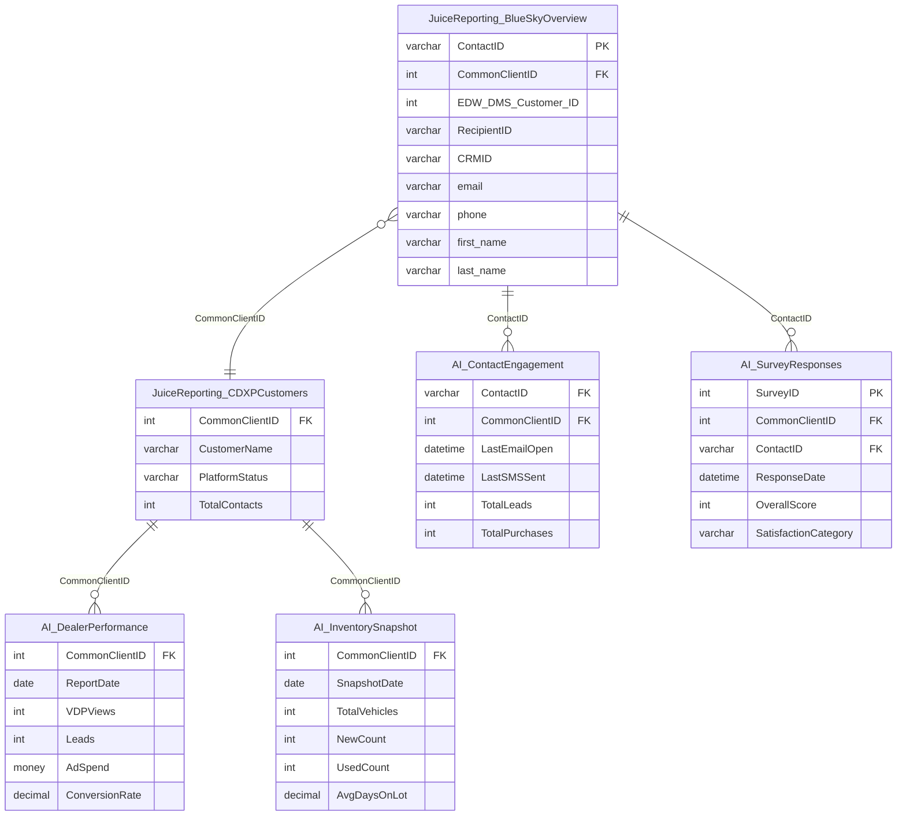

# DWRPT_AI

Data warehouse / reporting database that consolidates output from all major DAS product lines into a single query surface. It is the primary data source for DAS's internal BI tools (ai.das-technology.com) and the JuiceReporting analytics layer.

> **ERD:** `docs/databases/erd/dwrpt-ai.svg`
> **DDL dump:** `docs/databases/dumps/dwrpt-ai.sql`

---

## Overview

| Property | Value |
|---|---|
| Server | 40.83.161.93 (accessed as `DataStaging`; `DWRPT_AI` catalog is an identical replica on the same instance) |
| Schemas | 13 |
| Tables | 108 |
| Views | 58 (all in `AI` schema, plus 9 in `core`, `dbo`, `dynamics`, `MLdata`) |
| Total on-disk | ~335 GB |
| Total rows | ~891 M |
| Universal identity key | `CommonClientID` (INT) — present in 11 of 13 schemas |
| PII present | Yes — CDXP schema (email, phone, address, name, VIN) |
| GLBA-adjacent data | Yes — equity/trade-in valuations, financing-adjacent contact data |

This database is a **read-heavy analytics replica**, not a transactional OLTP store. Tables are populated by SSIS jobs or direct ETL from source systems. Row-level writes happen in the source databases (Prime, Megatron, RedDawn, etc.); DWRPT_AI is the consolidated reporting layer.

---

## Schemas

### clientdb — Master Client Registry

Single table: `ClientConsolidated`. This is the **authoritative cross-system client master**.

| Column | Type | Notes |
|---|---|---|
| CommonClientId | INT | Primary key — universal tenant identifier |
| DynamicsAccountId | VARCHAR(36) | Dynamics 365 GUID |
| ClientName | NVARCHAR(127) | Dealer group name |
| Street / City / Province / PostalCode | NVARCHAR | Physical address |
| SiteUrl | NVARCHAR(500) | Dealer website URL |

**CDP note:** Every cross-system join in this database routes through `CommonClientId`. Start here when building the tenant resolution layer.

---

### CDXP — 3Birds Marketing / JuiceReporting (23 tables)

The richest identity source in the estate. Contains PII-bearing customer contacts with cross-system identity keys on the same row.

**Key tables:**

**`JuiceReporting_BlueSkyOverview`** — master contact table
- `ContactID`, `EDW_DMS_Customer_ID`, `RecipientID`, `CRMID` — four identity keys in one row
- `EmailAddress`, `FirstName`, `LastName`, `Address`, `ZipCode`, `PhoneNumber` — full PII
- `LTVSegment`, `LeadSourceType`, `LeadStatusType`, `SaleDate`, `LeaseEndDate`, `DealType`
- `CommonClientID` FK

**`JuiceReporting_Marketing_Summary`** — campaign engagement
- Sends, opens, clicks, unsubscribes per `RecipientID`
- Links via `RecipientID` to BlueSkyOverview for contact-level attribution

**`JuiceReporting_MatchBacks`** — campaign revenue attribution
- `SalesRevenue`, `ServiceRevenue` per campaign event + customer
- Gold standard for email-to-sale attribution

**`JuiceReporting_LeadPerformance`** — lead source analysis
- `LeadSourceProvider`, `IsConvertedLead`, `SaleDate`, `CRMID`

**`JuiceReporting_BSR_equity`** — trade-in/equity
- `VIN`, `EstimatedMiles`, `EquityValueRough`, `EquityValueClean`
- GLBA-adjacent — treat as sensitive

**`mv_contact_stats`** — contact-level attribution flags
- `attribution_sales` (bit), `attribution_service` (bit)
- Pre-computed attribution summary per contact + campaign

**Other tables:** `BlueSkyRecommendations`, `CDXPCustomers`, `CDXPTransactionsOverview`, `DataMiningTool`, `HiddenTable_MarketingSummary`, `LeadPerformance_LeadSourceIndex`, `MarketingPerformance`, `MatchBacks`, `NEW_RECIPIENTS`, `RecipientLoss`, `TRANSACTION_SUMMARY`, `BlueSkyCurrentLeads`, `ClientDetails`, `Juice_ZipCode_Geo`

**CDP note:** `JuiceReporting_BlueSkyOverview` is the best single-table identity resolution seed — it has `ContactID + EDW_DMS_Customer_ID + RecipientID + CRMID + email + phone` together. Ingest with encryption at rest; PII requires data classification tagging.

---

### core — Stage / ReviewRocket (30 tables)

Staging layer for Radar (reputation), review ingestion, surveys, and social ads.

**Key tables:**

**`Stage_Accounts`** — account registry
- `Token` (GUID) is the Radar/ReviewRocket identity key
- `CommonClientId` FK back to clientdb
- `Deleted` bit — soft deletes in use

**`Stage_Review` / `Stage_Review2024` / `Stage_Review4M`** — review ingestion by review site + score

**`Stage_ReviewSentiment` + `Stage_ReviewSentimentDetail`** — AI-generated sentiment labels (positive/negative/neutral + subtypes)

**`t_Reviews`** — denormalised view: `AccountName`, `CommonClientId`, `ReviewSite`, `ReviewScore`, `ReviewDate`

**`Stage_Surveys` / `Stage_SurveyResponse`** — NPS + rating surveys; `NPSScore`, `Rating`, `Vin`, `Email`

**`t_Surveys`** — denormalised survey view: `AccountName`, `CommonClientId`, `Type`, `NPSScore`, `Rating`

**`ReviewRocket*` (6 tables)** — review request workflow: configuration, dealer sites, questions, sent surveys, responses, site clicks

**`Stage_SocialAdsCampaign`** — social ad campaign windows per account GUID

**CDP note:** `Stage_Accounts.Token` (GUID) is the Radar identity key — joins to `ReviewRocket*.ClientId`. Cross-system identity maps as: `Stage_Accounts.CommonClientId` → `clientdb.ClientConsolidated.CommonClientId`.

---

### AI — LLM Query Log (2 tables)

**`Log_Questions`** — logs every query to ai.das-technology.com
- `Question` (natural language), `Query` (generated SQL/view), `NaturalResponse`, `RAGContext`
- `TotalInputTokensQuery/Response`, `TotalOutputTokensQuery/Response`, `TotalInputTokensAnalytics` — token accounting
- `ChartType`, `ViewName`, `DatasetJson`, `AppInterface`

**`Log_Questions_insights`** — user-annotated insights on query results

**CDP note:** Token accounting tables confirm active LLM usage against this database. Phase 1 should include DWRPT_AI in the CDP analytics product usage telemetry.

---

### dynamics — Dynamics 365 CRM (4 tables)

**`Account`** — `accountid` (GUID), `name`, `das_3birdsid`, city, state, websiteurl, `CommonClientId`

**`Account_Lookup`** — `accountid`, `oems`, `ownername`, `CommonClientId`

**`OptionSet`** — CRM option set reference values

**`SalesOrderDetail`** — subscription orders linked to `netwoven_account` (Dynamics account GUID)

---

### MLdata — MediaLogix Inventory + Advertising (23 tables)

Paid advertising performance data for the MediaLogix platform.

**Key tables:**

**`FEEDADS / FEEDDEALERS`** — live inventory feed; VIN, price, make, model, dealer

**`Listing / ListingVehicle`** — listing registry with VIN, status, price, mileage

**`VDPPerformance / VDPVINPerformance`** — VDP impressions + clicks by VIN + account

**`PlatformAuto_Stats / Campaigns`** — PlatformAuto SRP/VDP impressions + cost per dealer

**`grail_srpactions_daily / srpactions_daily`** — SRP action counts per listing/subscription

**`GVACampaignDataset / GVAVDPData / GVAVDPDatav2`** — Google Vehicle Ads performance

**`VehiclePerformanceDaily / V2`** — `common_client_id`, VIN-level meta/gpm impressions per day

**`ML_Account_Info`** — `acc_id`, `common_client_id` (VARCHAR 50), `sfdc_account_id`, `acc_company` — master ML → CCI mapping table

**`MLCommonClientIdMapping`** — `acc_id` → `sales_channel_id` + `ref_id` cross-walk

**`__AllAdEzCampaigns / _AllFlights`** — AdEz campaign + flight pricing

**`ImportLog`** — ETL import audit log

**`LeadQueue`** — inbound leads from listing clicks: email, name, zip, phone

**`Display`** — display ad clicks/impressions/cost

**CDP note:** `common_client_id` in this schema is typed `VARCHAR(50)`, not INT — **type mismatch** with all other schemas. Cast required on ingest. Use `ML_Account_Info` as the bridge table for ML system joins.

---

### RLData — Response Logix (10 tables)

Lead response management system.

**Key tables:**

**`lead`** — `lead_id` (GUID), date, first/last name, email, phone, zip, `customer_id`, `franchise_id`, status, type

**`lead_history`** — lifecycle events per lead GUID

**`customer`** — `customer_id`, name, website, status; `AccountId` + `NewClientId` foreign keys

**`franchise`** — franchise to customer mapping, `core_account_guid` links to Radar

**`smart_quote`** — quote linked to lead GUID

**`ChatStatistics`** — lead-level chat statistics (lead_number, lead_date, customer_id)

**CDP note:** No `CommonClientID` column in RLData. Cross-system join path: `RLData.customer.AccountId` → `core.Stage_Accounts.Id` → `core.Stage_Accounts.CommonClientId` → `clientdb.ClientConsolidated`.

---

### RPData — RocketChat / LiveJoin ETS Chat (3 tables)

**`Company`** — `clientId` (maps to DAS client), Title, Type, Status

**`Leads`** — inbound chat leads: ClientPhone, ClientEmail, FirstName, LastName, Status, CreatedAt

**`Messages`** — full conversation: ConversationId, CompanyId, Type, Text, CreatedAt

**CDP note:** No `CommonClientID`. Join via `RPData.Company.clientId` → `clientdb.ClientConsolidated` (requires mapping clarification). Email/phone on `Leads` allows probabilistic identity match to CDXP contacts.

---

### radar — Reputation Management (2 tables)

**`clientConfigurations`** — `commonClientID` (**TEXT, not INT**), ClientName, enabled, reviewsites_displayName

**`Reviews`** — ClientName, DateReviewIngested, StarRating, ReviewSite, ReviewText, ResponseText, StatusOfReview

**CDP note:** `commonClientID` is typed `TEXT` — type mismatch. Requires explicit CAST to INT on join. Review text is unstructured — candidate for sentiment enrichment in CDP pipeline.

---

### juice — Consolidated Reviews (1 table)

**`Review`** — `CommonClientId` (INT, FK), `ReviewSourceName`, `AccountName`, `ReviewSiteId`, `ReviewScore`, `ReviewerName`, `ReviewDate`

Single-table cross-source review consolidation. The cleanest review data in the estate.

---

### Google — Google My Business (2 tables)

**`DealershipDataFile`** — `DASID`, `PlaceID`, DealershipName, `GoogleVDPImpressions`, `DealerVDPClicks`, Calls, ZipCode, DateWeek

**`VehicleDataFile`** — `DASID`, `PlaceID`, VIN, Vehicle, `DealerVDPClicks`, ZipCode

**CDP note:** No `CommonClientID`. Join via `DASID` — external dealer ID whose mapping table is not in this schema. Requires a lookup against `clientdb` or an external mapping. Clarify `DASID` → `CommonClientId` mapping with Ron Mulder.

---

### LVData — LotVantage / YouTube (5 tables)

**`youtube_settings`** — `dealership_id`, channel

**`youtube_videos`** — `vehicle_id`, `dealership_id`, url, external_id, status

**`youtube_video_stats / daily_stats`** — view counts by video and date

**`youtube_voice_recordings`** — vehicle-level voice recording status

**CDP note:** No `CommonClientID`. Join via `dealership_id` — requires mapping to `clientdb`. Vehicle-level video performance may enrich CDP vehicle engagement signals.

---

### zuora — Billing (2 tables)

**`AccountStage`** — `CrmId` (maps to Dynamics accountid), `ClientID` (maps to CommonClientId), Name, Status, Currency, Balance

**`AccountingPeriodStage`** — fiscal year / accounting period reference

**CDP note:** `ClientID` column (VARCHAR 50) maps to `CommonClientID` — type coercion required. `CrmId` → `dynamics.Account.accountid` enables billing → CRM join for subscription status in CDP.

---

## CommonClientID Cross-System Map

| Schema | Column | Type | Notes |
|---|---|---|---|
| clientdb.ClientConsolidated | CommonClientId | INT | **Primary key — authoritative** |
| CDXP (all tables) | CommonClientID | INT | FK, present on all 23 tables |
| core.Stage_Accounts | CommonClientId | INT | FK |
| core.t_Reviews | CommonClientId | INT | Denormalised |
| core.t_Surveys | CommonClientId | INT | Denormalised |
| dynamics.Account | CommonClientId | INT | FK |
| dynamics.Account_Lookup | CommonClientId | INT | FK |
| juice.Review | CommonClientId | INT | FK |
| MLdata.VehiclePerformanceDaily/V2 | common_client_id | INT | FK |
| MLdata.ML_Account_Info | common_client_id | VARCHAR(50) | **Type mismatch — cast required** |
| radar.clientConfigurations | commonClientID | TEXT | **Type mismatch — cast required** |
| zuora.AccountStage | ClientID | VARCHAR(50) | Maps to CommonClientId — **type mismatch** |
| RLData.* | — | — | No CCI; join via Stage_Accounts.AccountId |
| RPData.* | — | — | No CCI; join via Company.clientId |
| Google.* | — | — | No CCI; join via DASID (mapping TBD) |
| LVData.* | — | — | No CCI; join via dealership_id (mapping TBD) |

---

## CDP Relevance

**Identity resolution:** CDXP.JuiceReporting_BlueSkyOverview is the best single identity source — it places `ContactID`, `EDW_DMS_Customer_ID`, `RecipientID`, and `CRMID` on the same row alongside PII. This is the primary seed table for CDP golden record construction.

**Multi-tenant safety:** `CommonClientID` is the tenant scoping key. Every CDP query against this database must include a `WHERE CommonClientID = ?` clause (or equivalent join). The three schemas without CCI (RLData, RPData, Google, LVData) require an extra join hop through `clientdb` — unscoped queries on these are bugs.

**PII and compliance:** CDXP tables contain full name, email, phone, address, and equity/financing data. Must be encrypted at rest in CDP ingest. Tag these tables with the `pii:high` data classification label. Coordinate with the Privacy-by-Design legal stakeholder before ingesting.

**Type coercions needed on ingest:**
- `radar.clientConfigurations.commonClientID` TEXT → INT
- `MLdata.ML_Account_Info.common_client_id` VARCHAR(50) → INT
- `zuora.AccountStage.ClientID` VARCHAR(50) → INT

**Unmapped joins to resolve (open):**
- `Google.*.DASID` → `CommonClientId` mapping table not found in this database
- `LVData.*.dealership_id` → `CommonClientId` mapping not found
- `RPData.Company.clientId` → `CommonClientId` mapping not confirmed

---

## Data Analysis

### Row Count Summary

| Schema | Table | Rows | Size (GB) |
|---|---|---|---|
| CDXP | JuiceReporting_HiddenTable_MarketingSummary | 118,073,500 | 47.35 |
| CDXP | JuiceReporting_Marketing_Summary | 49,152,011 | 11.69 |
| CDXP | JuiceReporting_LeadPerformance_LeadSourceIndex | 25,446,714 | 13.43 |
| CDXP | JuiceReporting_CDXPTransactionsOverview | 15,635,367 | 5.42 |
| CDXP | mv_contact_stats | 15,394,147 | 15.13 |
| CDXP | JuiceReporting_BlueSkyOverview | 13,262,840 | 13.62 |
| CDXP | JuiceReporting_BlueSky_ServicePerf_V2 | 13,262,840 | 1.58 |
| CDXP | JuiceReporting_LeadPerformance | 13,225,622 | 3.48 |
| CDXP | JuiceReporting_BlueSkyOverview_v2 | 10,779,160 | 0.79 |
| CDXP | JuiceReporting_CDXPCustomers | 9,720,022 | 4.43 |
| CDXP | JuiceReporting_RecipientLoss | 8,661,265 | 1.51 |
| CDXP | JuiceReporting_BlueSkyServicePerformance | 8,095,604 | 4.67 |
| CDXP | JuiceReporting_TRANSACTION_SUMMARY | 7,790,566 | 0.78 |
| CDXP | JuiceReporting_BlueSkyRecommendations | 6,666,942 | 2.81 |
| CDXP | JuiceReporting_BSR_equity | 6,063,697 | 1.77 |
| CDXP | JuiceReporting_DataMiningTool | 4,706,750 | 1.58 |
| CDXP | JuiceReporting_Marketing_Summary_Contact_eng | 1,131,789 | 0.38 |
| CDXP | JuiceReportingBlueSkyCurrentLeads | 358,318 | 0.12 |
| CDXP | JuiceReporting_MatchBacks | 241,220 | 0.10 |
| CDXP | ClientDetails | 32,538 | 0.01 |
| CDXP | Juice_ZipCode_Geo | 33,113 | 0.05 |
| CDXP | JuiceReporting_NEW_RECIPIENTS | 9,593 | <0.01 |
| CDXP | JuiceReporting_MarketingPerformance | 6,919 | <0.01 |
| core | Stage_SurveyHistory | 82,826,920 | 2.79 |
| core | Stage_Surveys | 78,577,255 | 18.79 |
| core | Stage_Txns | 55,184,247 | 2.28 |
| core | Stage_Review | 14,628,458 | 35.15 |
| core | Stage_SurveyResponse | 7,357,723 | 2.13 |
| core | Stage_ReviewCategory | 3,744,698 | 0.14 |
| core | Stage_Review2024 | 424,534 | 0.36 |
| core | ReviewRocketSurvey | 389,522 | 0.06 |
| core | t_Reviews | 204,624 | 0.16 |
| core | Stage_Review4M | 182,119 | 0.15 |
| core | Stage_Accounts | 165,485 | 0.05 |
| core | Stage_Addresses | 164,722 | 0.01 |
| core | Stage_MRSReviewRequest | 128,453 | 0.02 |
| core | Stage_MRSReviewRequestNotification | 124,791 | 0.06 |
| core | ReviewRocketSurveyResponse | 57,824 | 0.01 |
| core | Stage_SocialAdsCampaign | 22,857 | 0.04 |
| core | Stage_AccountHierarchy | 3,322 | <0.01 |
| core | ReviewRocketQuestion | 5,426 | <0.01 |
| core | Stage_ProductInventoryInternalFeedNodes | 5,714 | <0.01 |
| core | ReviewRocketQuestionOption | 2,522 | <0.01 |
| core | ReviewRocketDealerSite | 730 | <0.01 |
| core | ReviewRocketConfiguration | 497 | <0.01 |
| core | ReviewRocketClickSite | 103 | <0.01 |
| core | Stage_ReviewSentiment | 5 | <0.01 |
| core | Stage_ReviewSentimentDetail | 10 | <0.01 |
| core | Stage_ReviewSite | 30 | <0.01 |
| core | Stage_ReviewSource | 11 | <0.01 |
| core | Stage_Category | 2 | <0.01 |
| core | Stage_TxnTypes | 2 | <0.01 |
| core | t_Surveys | 0 | 0.12 |
| MLdata | grail_srpactions_daily | 98,852,570 | 15.52 |
| MLdata | PlatformAuto_Stats | 31,776,870 | 4.03 |
| MLdata | GVAVDPDatav2 | 15,860,196 | 3.19 |
| MLdata | VehiclePerformanceDailyV2 | 12,607,521 | 2.02 |
| MLdata | VehiclePerformanceDaily | 12,500,142 | 4.25 |
| MLdata | GVAVDPData | 5,994,636 | 1.46 |
| MLdata | FEEDADS | 8,030,440 | 33.60 |
| MLdata | ListingVehicle | 7,815,616 | 3.47 |
| MLdata | Listing | 7,428,822 | 23.81 |
| MLdata | Display | 3,917,269 | 0.80 |
| MLdata | Account | 2,082,770 | 0.49 |
| MLdata | PlatformAuto_Campaigns | 1,104,704 | 0.14 |
| MLdata | VDPPerformance | 1,060,205 | 0.18 |
| MLdata | GVACampaignDataset | 144,247 | 0.02 |
| MLdata | _AllFlights | 48,978 | 0.02 |
| MLdata | __AllAdEzCampaigns | 17,794 | 0.01 |
| MLdata | FEEDDEALERS | 22,800 | <0.01 |
| MLdata | LeadQueue | 204,612 | 0.21 |
| MLdata | MLCommonClientIdMapping | 6,163 | <0.01 |
| MLdata | ML_Account_Info | 6,159 | <0.01 |
| MLdata | ImportLog | 10,634 | <0.01 |
| MLdata | VDPVINPerformance | 0 | 0 |
| MLdata | srpactions_daily | 0 | 0 |
| RLData | lead_history | 66,995,841 | 25.55 |
| RLData | smart_quote | 8,475,447 | 7.58 |
| RLData | lead | 3,719,180 | 5.29 |
| RLData | reactivation | 1,420,146 | 0.81 |
| RLData | smart_follow_performance_report | 880,439 | 0.11 |
| RLData | smart_facts_report_data | 499,872 | 0.08 |
| RLData | ChatStatistics | 27,489 | <0.01 |
| RLData | franchise | 9,920 | <0.01 |
| RLData | customer | 6,024 | <0.01 |
| RLData | make | 76 | <0.01 |
| Google | VehicleDataFile | 21,202,024 | 6.49 |
| Google | DealershipDataFile | 1,046,409 | 0.30 |
| LVData | youtube_videos | 2,981,115 | 1.23 |
| LVData | youtube_voice_recordings | 960,173 | 0.74 |
| LVData | youtube_video_stats | 616,372 | 0.04 |
| LVData | youtube_settings | 6,098 | <0.01 |
| LVData | youtube_video_daily_stats | 3 | <0.01 |
| RPData | Leads | 536,986 | 0.11 |
| RPData | Messages | 0 | <0.01 |
| RPData | Company | 0 | 0 |
| dynamics | SalesOrderDetail | 138,278 | 0.03 |
| dynamics | Account | 43,518 | 0.03 |
| dynamics | Account_Lookup | 43,518 | 0.01 |
| dynamics | OptionSet | 60 | <0.01 |
| juice | Review | 175,437 | 0.16 |
| radar | clientConfigurations | 5,696 | 0.01 |
| radar | Reviews | 128,353 | 0.14 |
| clientdb | ClientConsolidated | 93,007 | 0.02 |
| zuora | AccountStage | 11,632 | 0.02 |
| zuora | AccountingPeriodStage | 0 | 0 |
| AI | Log_Questions | 134 | <0.01 |
| AI | Log_Questions_insights | 25 | <0.01 |

**Total: ~891 M rows across 108 tables, ~335 GB on disk.**

---

## Views (58 total)

All 58 views reside in the `AI` schema and serve as the primary query surface for `ai.das-technology.com`. The `v_` prefix indicates views directly consumed by the BI tool. Additional views in `core`, `dbo`, `dynamics`, and `MLdata` schemas support staging and product-level reporting.

### AI schema — BI tool views (42 views)

| View | Purpose | Last Modified |
|---|---|---|
| `v_CDXP_BlueSkyOverview` | Main contact + PII view for CDXP | 2026-01-09 |
| `v_CDXP_BlueSkyOverview_v2` | Transaction-level BlueSky view | 2026-01-09 |
| `v_CDXP_BlueSky_ServicePerf_V2` | Service performance v2 | 2026-01-09 |
| `v_CDXP_BlueSkyCurrentLeads` | Active lead pipeline | 2026-01-09 |
| `v_CDXP_BlueSkyRecommendations` | Vehicle recommendations | 2026-01-09 |
| `v_CDXP_BlueSkyServicePerformance` | Service transaction history | 2026-01-09 |
| `v_CDXP_CDXPCustomers` | Customer list | 2026-03-27 |
| `v_CDXP_CDXPTransactionsOverview` | Campaign transaction attribution | 2026-03-27 |
| `v_CDXP_DataMiningTool` | Data mining contact export | 2026-01-09 |
| `v_CDXP_HiddenTable_MarketingSummary` | Full marketing summary | 2026-03-27 |
| `v_CDXP_LeadPerformance` | Lead conversion rates | 2026-01-09 |
| `v_CDXP_LeadPerformance_LeadSourceIndex` | Lead source index | 2026-03-27 |
| `v_CDXP_Marketing_Summary` | Campaign send/open/click | 2026-01-09 |
| `v_CDXP_Marketing_Summary_Contact_eng` | Contact engagement links | 2026-01-09 |
| `v_CDXP_MarketingPerformance` | Campaign-level performance | 2026-01-09 |
| `v_CDXP_MatchBacks` | Revenue attribution matchbacks | 2026-01-09 |
| `v_CDXP_mv_contact_stats` | Pre-computed attribution flags | 2026-01-09 |
| `v_CDXP_NEW_RECIPIENTS` | New email recipients | 2026-01-09 |
| `v_CDXP_RecipientLoss` | Unsubscribe / bounce log | 2026-01-09 |
| `v_CDXP_TRANSACTION_SUMMARY` | Transaction counts by type | 2026-01-09 |
| `v_CDXP_ZipCode_Geo` | ZIP code geolocation | 2026-01-09 |
| `v_ML_CampaignLevelPerformance` | ML campaign-level ad stats | 2025-09-02 |
| `v_ML_VehiclePerformanceDaily` | ML VIN-level daily impressions | 2026-04-24 |
| `v_RL_Leads` | Response Logix leads | 2026-04-30 |
| `v_RL_Leads_Reactivations` | RL reactivation leads | 2026-04-30 |
| `v_RL_Smart_Follow` | RL Smart Follow performance | 2026-04-30 |
| `v_SL_Accounts` | SureLift accounts | 2025-10-30 |
| `v_SL_MRSReviewRequest` | Review request log | 2026-04-24 |
| `v_SL_Reviews` | Review aggregation | 2026-04-24 |
| `v_SL_SurveyResponseGen2` | Survey responses gen2 | 2026-04-24 |
| `v_SL_Surveys` | Survey send log | 2026-04-24 |
| `v_SurveySendSummary` | Survey send summary | 2026-06-04 |
| `JuiceReporting_BSR_equity` | BSR equity view | 2026-05-04 |
| `GVACampaignData` | Google Vehicle Ads campaign | 2025-10-14 |
| `GVACampaignDataByVINv3` | GVA by VIN v3 | 2025-10-15 |
| `GVACampaignDataByVINDelistedv3` | GVA delisted VINs | 2025-10-15 |
| `MAIACampaignData` | MAIA campaign data | 2025-10-14 |
| `TikTokCampaignData` | TikTok campaign data | 2025-10-14 |
| `MLCampaign_VDP_Performance` | ML campaign VDP performance | 2026-01-14 |
| `MLData_VIN_Meta_Google_VDP_12month` | VIN meta + Google 12-month | 2026-01-16 |
| `VDPData_ML_Google` | VDP data combined view | 2026-01-07 |
| `VDPData_ML_Google2` | VDP data v2 | 2026-01-07 |

### Other schema views (16 views)

| Schema | View | Purpose | Last Modified |
|---|---|---|---|
| core | `v_AllTimePerformance` | All-time review performance | 2026-04-28 |
| core | `v_MRSReviewRequest` | MRS review requests | 2026-04-28 |
| core | `v_Reviews` | Core review aggregation | 2026-04-28 |
| core | `v_SocialAdsCampaign` | Social ads campaigns | 2026-04-28 |
| core | `v_SurveyResponseGen2` | Survey response gen2 | 2026-04-28 |
| core | `v_Surveys` | Survey log | 2026-04-28 |
| core | `v_SurveySendSummary` | Survey send summary | 2026-06-03 |
| dbo | `v_RL_Leads` | RL leads (dbo copy) | 2026-04-24 |
| dbo | `v_RL_Leads_dev` | RL leads dev variant | 2026-04-22 |
| dbo | `v_RL_Leads_Reactivations` | RL reactivations (dbo copy) | 2026-03-25 |
| dbo | `v_RL_OptOuts` | RL opt-out log | 2026-04-17 |
| dbo | `v_RL_Smart_Follow` | RL Smart Follow (dbo copy) | 2026-03-25 |
| dynamics | `v_AccountProducts` | D365 account product subscriptions | 2026-05-06 |
| dynamics | `v_AccountProductsV2` | D365 subscriptions v2 | 2026-04-28 |
| MLdata | `v_ML_CampaignPerformanceDaily` | ML daily campaign performance | 2026-05-26 |
| MLdata | `v_ML_VehiclePerformanceDaily` | ML daily VIN impressions | 2026-05-26 |

---

## Indexes

| Schema | Table | Index | Type | Unique | Columns |
|---|---|---|---|---|---|
| AI | Log_Questions | PK_Log_Questions | CLUSTERED | Yes | Id |
| AI | Log_Questions_insights | PK_Log_Questions_insights | CLUSTERED | Yes | IdInsights |
| core | ReviewRocketSurvey | CIX_ReviewRocketSurvey_SentDate | CLUSTERED | No | SentDate |
| core | ReviewRocketSurveyResponse | CIX_ReviewRocketSurveyResponse_ResponseDate | CLUSTERED | No | ResponseDate |
| core | Stage_AccountHierarchy | CIX_Stage_AccountHierarchy_ChildAccountId | CLUSTERED | No | ChildAccountId, ParentAccountId |
| core | Stage_AccountHierarchy | IX_Stage_AccountHierarchy_ParentAccountId_INCL | NONCLUSTERED | No | ParentAccountId |
| core | Stage_Accounts | CIX_Stage_Accounts_Id | CLUSTERED | No | Id |
| core | Stage_Accounts | IX_Stage_Accounts_Token_Deleted_V3_Optimized | NONCLUSTERED | No | Token, Deleted |
| core | Stage_Accounts | IX_Stage_Accounts_Id_Deleted_INCL_Name_Brands | NONCLUSTERED | No | Id, Deleted |
| core | Stage_Addresses | CIX_Stage_Addresses_AccountId | CLUSTERED | No | AccountId |
| core | Stage_Category | CIX_Stage_Category_Id | CLUSTERED | No | Id |
| core | Stage_MRSReviewRequestNotification | IDX_RSReviewRequestNotification_SentDate | NONCLUSTERED | No | SentDate |
| core | Stage_Review | IDX_Stage_Stage_Review_Created | CLUSTERED | No | Created |
| core | Stage_Review | IX_Stage_Review_AccountGuid_INCL_ReviewScore | NONCLUSTERED | No | AccountGuid |
| core | Stage_Review | IX_Stage_Review_Created_Covering_Full | NONCLUSTERED | No | Created, AccountGuid (covering) |
| core | Stage_Review | IX_Stage_Review_AccountGuid_Created_INCL_Columns | NONCLUSTERED | No | AccountGuid, Created |
| core | Stage_Review2024 | IDX_Stage_Review2024_Created | CLUSTERED | No | Created |
| core | Stage_Review2024 | IDX_Stage_Review2024_AccountGuid_ReviewSourceId_ReviewSiteId | NONCLUSTERED | No | AccountGuid, ReviewSourceId, ReviewSiteId |
| core | Stage_ReviewCategory | IX_Stage_ReviewCategory_ReviewId | NONCLUSTERED | No | ReviewId |
| core | Stage_ReviewSentiment | PK__Stage_Re__E7C2409 | CLUSTERED | Yes (PK) | SentimentId |
| core | Stage_ReviewSentiment | IX_RevSent_ReviewId | NONCLUSTERED | No | ReviewId |
| core | Stage_ReviewSentimentDetail | PK__Stage_Re__135C316D | CLUSTERED | Yes (PK) | DetailId |
| core | Stage_ReviewSentimentDetail | IX_RevSentDet_SentimentId | NONCLUSTERED | No | SentimentId |
| core | Stage_ReviewSentimentDetail | IX_RevSentDet_Type_Text | NONCLUSTERED | No | detail_type, detail_text |
| core | Stage_ReviewSite | IDX_Stage_ReviewSite_id | CLUSTERED | No | Id |
| core | Stage_SurveyHistory | IDX_Stage_SurveyHistory_ActionTime | CLUSTERED | No | ActionTime |
| core | Stage_SurveyResponse | CIX_Stage_SurveyResponse_SurveyId | CLUSTERED | No | SurveyId |
| core | Stage_SurveyResponse | IDX_Stage_SurveyResponse_ResponseDate_NC | NONCLUSTERED | No | ResponseDate |
| core | Stage_Surveys | IDX_Stage_Surveys_SentDate | CLUSTERED | No | SentDate |
| core | Stage_Surveys | IX_Stage_Surveys_Id_SentDate_Optimized | NONCLUSTERED | No | Id, SentDate |
| core | Stage_Txns | CIX_Stage_Txns_TxnDate | CLUSTERED | No | TxnDate |
| core | Stage_TxnTypes | CIX_Stage_TxnTypes_TxnTypeId | CLUSTERED | Yes | TxnTypeId |
| core | t_Reviews | IX_t_Reviews_PublicationDate | NONCLUSTERED | No | PublicationDate |
| core | t_Reviews | IX_t_Reviews_ReviewSite | NONCLUSTERED | No | ReviewSite |
| core | t_Reviews | IX_t_Reviews_State | NONCLUSTERED | No | State |
| core | t_Reviews | IX_t_Reviews_AccountGuid | NONCLUSTERED | No | AccountGuid |
| core | t_Reviews | IX_t_Reviews_AccountName | NONCLUSTERED | No | AccountName |
| core | t_Reviews | IX_t_Reviews_CommonClientId | NONCLUSTERED | No | CommonClientId |
| core | t_Surveys | IX_t_Surveys_PublicationDate | NONCLUSTERED | No | PublicationDate |
| core | t_Surveys | IX_t_Surveys_SentDate | NONCLUSTERED | No | SentDate |
| core | t_Surveys | IX_t_Surveys_Type | NONCLUSTERED | No | Type |
| core | t_Surveys | IX_t_Surveys_CommonClientId | NONCLUSTERED | No | CommonClientId |
| core | t_Surveys | IX_t_Surveys_AccountId | NONCLUSTERED | No | AccountId |
| core | t_Surveys | IX_t_Surveys_AccountName | NONCLUSTERED | No | AccountName |
| dynamics | Account | IX_Account_parentaccountid | NONCLUSTERED | No | parentaccountid |
| dynamics | Account | IX_Account_accountype_accountid | NONCLUSTERED | No | netwoven_accounttype, accountid |
| dynamics | Account_Lookup | IX_Account_Lookup_accountid | CLUSTERED | Yes | accountid |
| dynamics | Account_Lookup | IX_Account_Lookup_netwoven_clientid | NONCLUSTERED | No | netwoven_clientid |
| juice | Review | IDX_Juice_Review_ID | CLUSTERED | No | Id |
| LVData | youtube_video_stats | IX_id | NONCLUSTERED | No | id |
| MLdata | __AllAdEzCampaigns | IX_AllAdEzCampaigns_subscription_id | NONCLUSTERED | No | subscription_id |
| MLdata | __AllAdEzCampaigns | IX_AllAdEzCampaigns_ratchet_id | NONCLUSTERED | No | ratchet_id |
| MLdata | _AllFlights | IX_AllFlights_subscription_id | NONCLUSTERED | No | subscription_id |
| MLdata | Display | IX_Display_rcd_Master_ID | NONCLUSTERED | No | rcd_Master_ID |
| MLdata | Display | IX_Display_dis_Date_Filter | NONCLUSTERED | No | dis_Date |
| MLdata | FEEDADS | IX_FEEDADS_faVIN | NONCLUSTERED | No | faVIN |
| MLdata | grail_srpactions_daily | IX_grail_srpactions_LstId_Date | NONCLUSTERED | No | lst_id, event_date |
| MLdata | grail_srpactions_daily | IX_grail_lstid_date_filtered | NONCLUSTERED | No | lst_id, event_date (filtered) |
| MLdata | grail_srpactions_daily | IX_grail_eventdate_appaction_isbot_lstid | NONCLUSTERED | No | event_date, app_action, is_bot, lst_id |
| MLdata | grail_srpactions_daily | IX_grail_filtered_vdp_20_22 | NONCLUSTERED | No | event_date, lst_id (filtered) |
| MLdata | GVAVDPDatav2 | IX_GVAVDPDatav2_lstID | NONCLUSTERED | No | lst_id |
| MLdata | GVAVDPDatav2 | IX_GVAVDPDatav2_Date_LstId_Vin | NONCLUSTERED | No | gva_date, lst_id, veh_vin |
| MLdata | LeadQueue | IX_LeadQueue_lstID | NONCLUSTERED | No | lst_ID |
| MLdata | Listing | IX_Listing_LstID_AccID | NONCLUSTERED | No | lst_ID |
| MLdata | Listing | IX_Listing_lstID_accID_lastupload | NONCLUSTERED | No | lst_ID, acc_ID, lst_LastUpload |
| MLdata | Listing | IX_Listing_Price_Modified | NONCLUSTERED | No | lst_ID, lst_Price |
| MLdata | Listing | IX_Listing_lastupload | NONCLUSTERED | No | lst_LastUpload |
| MLdata | Listing | IX_Listing_lssID | NONCLUSTERED | No | lss_ID |
| MLdata | ListingVehicle | IX_ListingVehicle_lstID | NONCLUSTERED | No | lst_id |
| MLdata | ListingVehicle | IX_ListingVehicle_lstId_vin | NONCLUSTERED | No | lst_id, veh_vin |
| MLdata | ListingVehicle | IX_ListingVehicle_LstId_IncludeVehicle | NONCLUSTERED | No | lst_id |
| MLdata | ML_Account_Info | IX_ML_Account_Info_acc_id | NONCLUSTERED | No | acc_id |
| MLdata | PlatformAuto_Stats | IX_PlatformAutoStats_lstID | NONCLUSTERED | No | lst_id |
| MLdata | srpactions_daily | IX_srpactions_daily_lstID_app_action_is_bot | NONCLUSTERED | No | lst_id, app_action, is_bot |
| MLdata | VDPPerformance | IX_VDPPerformance_accID | NONCLUSTERED | No | acc_id |
| MLdata | VehiclePerformanceDaily | IX_VPDM_campaign_date | NONCLUSTERED | No | campaign_date |
| MLdata | VehiclePerformanceDaily | IX_VPDM_customer_date | NONCLUSTERED | No | customer_name, campaign_date |
| MLdata | VehiclePerformanceDaily | IX_VPDM_customer_name | NONCLUSTERED | No | customer_name |
| MLdata | VehiclePerformanceDaily | IX_VPDM_delisted | NONCLUSTERED | No | delisted |
| MLdata | VehiclePerformanceDaily | IX_VPDM_metrics_only | NONCLUSTERED | No | campaign_date |
| RLData | customer | IX_customer_performance | NONCLUSTERED | No | customer_id |
| RLData | lead | IX_lead_dateonly_covering | NONCLUSTERED | No | lead_date, lead_id |
| RLData | lead | IX_lead_date_status_covering | NONCLUSTERED | No | lead_date, status |
| RLData | lead | IX_lead_make_model_date_type | NONCLUSTERED | No | lp_make, lp_model, lead_date, type |
| RLData | lead_history | IX_lead_history_date_type | NONCLUSTERED | No | history_date, type |
| RLData | lead_history | IX_lead_history_leadid_type | NONCLUSTERED | No | lead_id, type |
| RLData | reactivation | IX_reactivation_smart_follow_txn_id | NONCLUSTERED | No | smart_follow_txn_id |
| RLData | smart_follow_performance_report | ak_smart_follow_performance_report_date_type_franchise_id_customer_id | CLUSTERED | Yes | report_date, type, franchise_id, customer_id |
| RLData | smart_quote | IX_smart_quote_created_billable | NONCLUSTERED | No | is_billable, created_at |

**Index observations:**
- Most large tables (CDXP, Google, zuora, radar) have **no indexes** — they are treated as bulk-load targets, not query-optimized tables.
- `core.Stage_Review` (35 GB) has 4 indexes, all clustered or covering on `Created` + `AccountGuid` — confirms time-series query pattern.
- `MLdata.grail_srpactions_daily` has 4 overlapping indexes on `lst_id / event_date` — redundancy candidate for cleanup.
- `RLData.smart_follow_performance_report` uses a clustered alternate key (not a PK) on a 4-column composite — unusual pattern.

---

## ETL & SQL Agent Jobs

**SQL Agent jobs:** 0 accessible — `SELECT` permission denied on `msdb.dbo.sysjobs` for the `ConflictAI` login.

**Inferred ETL patterns from table structure and index evidence:**

- **CDXP:** Tables are bulk-replaced (no clustered PK on most tables, no indexes). Suggests nightly full-replace ETL from the 3Birds/JuiceReporting OLTP source.
- **core:** `Stage_*` tables have clustered indexes on date columns (`Created`, `SentDate`, `ActionTime`) — append-only time-series inserts. `t_Reviews` and `t_Surveys` have multi-column covering indexes suggesting frequent point-lookup queries.
- **MLdata:** `Listing` and `ListingVehicle` have `lst_LastUpload` and modification-time indexes — incremental delta load by upload timestamp.
- **Google:** No indexes at all. Full table replacement on each load cycle.
- **RLData:** `lead_history` indexed by `history_date, type` and `lead_id, type` — event-stream append pattern.
- **Backup evidence:** Full backups run continuously throughout the day (~every 15–30 minutes during the early morning window), not just once daily — this is consistent with an Azure SQL Managed Instance or a third-party backup agent (Veeam/Azure Backup) running continuous differential chains, not a simple scheduled SQL Agent job.

---

## Backup History

Sourced from `msdb.dbo.backupset` on the 40.83.161.93 instance (accessed as `DataStaging`). 30-day window observed.

| Type | Count (30d) | Cadence | Avg Size |
|---|---|---|---|
| Full (D) | 1,257 (deduplicated: ~630 unique) | Every ~15–30 min during batch window; ~30+ per day | ~340 GB |
| Log (L) | 2,586 | Every ~2–5 min during active ETL; ~5 MB during quiet periods | ~5–5,000 MB |

**Storage:** Azure Blob — `https://medialogixprodsqlstorage.blob.core.windows.net/cimsqlbackupcontainer/`

**Most recent full backup observed:** 2026-06-09 06:22 UTC, 340,185 MB (~332 GB compressed)

**Note:** The extremely high full-backup frequency (multiple per day) is atypical for a standard SQL Server Agent schedule. This pattern is consistent with Azure Backup continuous backup or a managed-instance automatic backup policy, not manually scheduled jobs. The `msdb.dbo.backupset` entries for the morning window (05:30–07:00) show 10+ full backups, likely a large ETL refresh window where the backup agent captures multiple restore points.

---

## Open Questions

- **DASID mapping:** Where does `Google.DealershipDataFile.DASID` → `CommonClientId` resolve? Is there a lookup in another schema on this server?
- **RPData.Company.clientId format:** Is `clientId` an INT matching `CommonClientId`, or a different ID type? `RPData.Company` currently has 0 rows — is this table still active?
- **LVData.dealership_id:** Is this the same as `CommonClientId` or a separate dealer numbering system?
- **SQL Agent job access:** Does `ConflictAI` have `VIEW SERVER STATE` or `msdb` execute permissions? Needed to enumerate ETL schedules and confirm which jobs write to each schema.
- **Ron Mulder:** Who owns ongoing ETL into this database? What is the refresh frequency for each schema — particularly whether CDXP tables are nightly full-replace or incremental delta?
- **t_Surveys empty (0 rows):** The `core.t_Surveys` table has 0 rows despite `core.Stage_Surveys` having 78 M rows. Is the denormalized survey view populated by a separate job that is currently failing or disabled?

---

## ERD

Key entities (analytics/reporting layer — 13 schemas). Full DDL: `dumps/dwrpt-ai.sql`. Note: most "tables" here are views feeding the DAS AI assistant.

