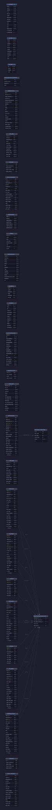
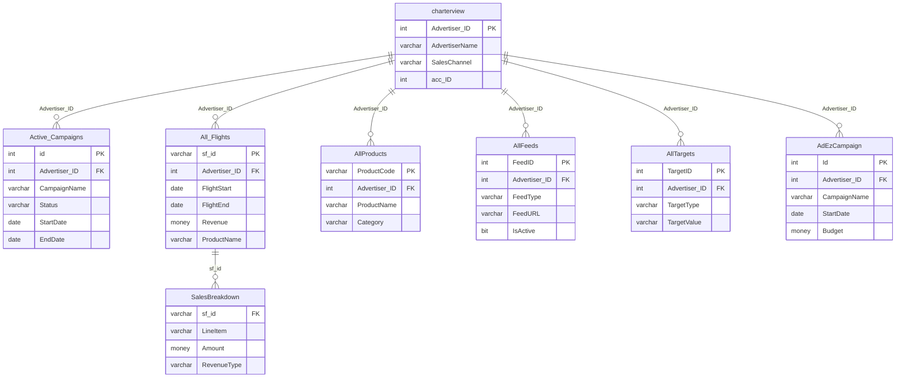

# EndeavorCentral — Schema Documentation

> _Status: complete — schema documented 2026-06-21._ Describe only what the schema dump shows; flag inference; cite real object names. See [quality standards](../discovery-guide.md#quality-standards--references).

## Overview

Sales, billing, and campaign performance reporting database. Tracks advertising subscriptions, flight periods, revenue, and product assignments per advertiser. Used for financial reporting and sales channel analysis.

## Access

- **Owner:** Ron Mulder · **Researcher:** Alicia · **Status:** granted · **Reach:** `20.51.108.231:1433` / SQL Server auth / SSMS or pyodbc
- Cross-ref: [System Access Tracker](/analysis/artifacts/access-tracker/index.html)

## Schema dump

Authoritative DDL: `dumps/endeavorcentral.sql` — schema-only, no data. Extracted 2026-06-11 via `INFORMATION_SCHEMA` query (SQL Server endeavorcentral). Re-extract from source to refresh.

## Tables

_16 tables total · **0.04 GB total / 0.04 GB used** (full DDL in `dumps/endeavorcentral.sql`; ERD shows subset). Row counts from `sys.partitions` 2026-06-14._

| Table | ~Rows | Purpose | PK | CDP-relevant |
|---|---|---|---|---|
| `_Active_Campaigns` | 7,664 | Snapshot of currently active ad campaigns with budget, targeting, and status fields per subscription and provider. | `id` | ✓ |
| `_AllTargets` | 17,033 | Stores impression, click, profile-view, and action targets per campaign ID. | — | — |
| `_AllProducts` | 17,791 | Flattened view of all products/subscriptions per campaign, including pricing, product type, provider, and advertiser identity. | — | — |
| `_All_Flights` | 48,978 | Granular flight-level billing records with dates, budget, impressions, clicks, price, and sales-channel attribution per subscription. | `sf_id` | — |
| `_RAN_XML` | 3,162 | Stores RAN (Recruiter Ad Network, inferred) XML payloads with campaign metadata for feed submission. | — | — |
| `__AllFeeds` | 8,725 | Cross-reference of advertiser subscriptions to feed names, statuses, and date ranges (inferred aggregator feed registry). | — | ✓ |
| `Subscription_Flight_Date` | 2,466 | Audit log of subscription flight date changes, capturing start/end dates and the action taken (e.g., activate, cancel). | — | — |
| `charterview` | 279 | Advertiser-level summary showing which product types (leads, display, smartads, etc.) each advertiser has subscribed to and their date ranges. | `Advertiser_ID` | — |
| `_Advertiser_Alt_ID` | 488 | Maps advertiser account IDs to alternate external IDs per sales channel. | — | — |
| `AdvertiserSalesChannel_Log` | 307 | Audit log recording changes to an advertiser's sales channel and customer ID assignments. | — | — |
| `CommercialCustomer` | 0 | Commercial customer master with contact info, billing email, sales totals, and active date range across publications (inferred staging/reporting table). | `CUSID` | — |
| `FactualInfo` | 0 | Advertiser profile data including contact, URL, and social-media handles (Twitter, Facebook, FourSquare) for directory/factual enrichment. | — | — |
| `SalesMedia` | 0 | Monthly sales revenue per customer and media type across publications (inferred pivot feed for reporting). | — | — |
| `SalesBreakdown` | 0 | Pivoted monthly revenue by customer, rep, category, and media type spanning 2014–2019; appears to be a historical sales reporting table. | — | — |
| `DBINFO` | 44 | SQL Server database file metadata (name, type, physical path, size, growth) captured from `sys.database_files`. | `file_id` | — |
| `BKUPSettings` | 1 | Configuration for the database backup job: target database, retention count, local path, and FTP credentials. | `dbID` | — |
| `Active_Campaigns` | 22,099 | Live copy (or view-backed table) of active campaigns — same shape as `_Active_Campaigns`; likely the non-prefixed production version. | `id` | ✓ |
| `AllTargets` | 17,033 | Production counterpart of `_AllTargets`; stores campaign impression/click/action targets. | — | — |
| `AllProducts` | 17,791 | Production counterpart of `_AllProducts`; full product-subscription roster per advertiser. | — | — |
| `AllFeeds` | 8,725 | Production counterpart of `__AllFeeds`; feed registry linking advertisers to subscription feeds. | — | ✓ |
| `All_Flights` | 48,978 | Production counterpart of `_All_Flights`; complete flight billing ledger. | `sf_id` | — |
| `RAN_XML` | 3,162 | Production counterpart of `_RAN_XML`; stores RAN XML payloads per campaign. | — | — |
| `ADEZRanCompare` | 0 | Comparison table for AdEz vs RAN data (inferred reconciliation/QA table; no DDL in dump). | — | — |
| `AdEzCampaign` | 0 | AdEz campaign records (inferred third-party campaign integration; no DDL in dump). | `Id` | ✓ |
| `AdEzAdvertiser` | 0 | AdEz advertiser records (inferred third-party advertiser integration; no DDL in dump). | `Id` | — |
| `_PerformanceProContactEmail` | 0 | Contact email records for PerformancePro (inferred; no DDL in dump). | `id` | ✓ |

## Indexes

**No data returned** by `scripts/index-definitions.sql` — EndeavorCentral either has no user tables with indexes or encountered a silent access error (CATCH block swallowed it). Re-run the script with a targeted `USE EndeavorCentral;` block to confirm.

## Views

No `CREATE VIEW` statements present in `dumps/endeavorcentral.sql`. The following views are known to exist on the server but their definitions were not captured in the schema-only dump:

| View | Purpose | Underlying tables | Notes |
|---|---|---|---|
| `vw_VInfo` | Unknown — definition not in dump. | — | Re-extract with `sp_helptext` or `sys.sql_modules`. |
| `vw_TInfo` | Unknown — definition not in dump. | — | Re-extract with `sp_helptext` or `sys.sql_modules`. |
| `vw_TRInfo` | Unknown — definition not in dump. | — | Re-extract with `sp_helptext` or `sys.sql_modules`. |

## ERD

## CDP relevance

- **`_AllProducts` / `AllProducts`**: Product/SKU per campaign with advertiser ID, sales channel, provider, pricing, and UTM code — key for matching advertisers to purchased products.
- **`_All_Flights` / `All_Flights`**: Flight-level billing records with `adv_id`, `adv_name`, `Phone`, `sales_channel`, date range, and revenue — useful for advertiser spend history.
- **`__AllFeeds` / `AllFeeds`**: Links `adv_id` to subscription and feed metadata — connects advertiser to active data feeds.
- **`_Active_Campaigns` / `Active_Campaigns`**: Current campaign state with `ratchet_id` and `Subscription_Id` — bridges to Megatron/Ratchet identifiers.
- **`charterview`**: Per-advertiser product-type flags and date ranges — compact advertiser profile signal.
- **`FactualInfo`**: Contains `cusphone`, `cusemail`, `cusurl`, Twitter, Facebook, FourSquare — social/contact enrichment for advertiser profiles.
- **`_AllProducts`.`utm_code`**, **`.isFacebook`**, **`.isRetargeting`**: Digital marketing attribution flags directly usable in CDP segmentation.

## Open questions

- Row counts for tables with 0 rows (`CommercialCustomer`, `SalesMedia`, `SalesBreakdown`, etc.) — confirm whether empty or deprecated.
- `ADEZRanCompare`, `AdEzCampaign`, `AdEzAdvertiser`, `_PerformanceProContactEmail` have no DDL in the dump — re-extract or confirm if views/synonyms.
- View definitions for `vw_VInfo`, `vw_TInfo`, `vw_TRInfo` not captured — run `SELECT definition FROM sys.sql_modules WHERE object_id = OBJECT_ID('vw_VInfo')`.
- Relationship between underscore-prefixed tables (e.g., `_AllProducts`) and non-prefixed counterparts (`AllProducts`) — confirm if one is a staging copy or historical snapshot.
