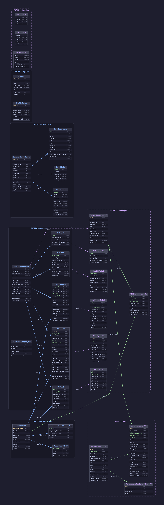

# ER Diagram — EndeavorCentral

**Database:** `EndeavorCentral`
**Server:** `20.51.108.231`
**Date:** 2026-06-11

---

## Diagram



---

## Legend

| Color / Style | Meaning |
|---|---|
| Solid blue border | Relationship between tables (implied FK) |
| Dashed purple border | View derived from base table |
| Solid green border | Relationship between AdEz views |
| Yellow `PK` label | Primary key |
| Green `FK` label | Foreign key (inferred) |
| Name with `[V]` | View (not a physical table) |

---

## Entities

### Tables (16)

#### Group: Campaigns
| Table | Description |
|---|---|
| `_Active_Campaigns` | Active campaigns with budgets and targets |
| `_AllTargets` | Impression, click and action goals per campaign |
| `_AllProducts` | Products/subscriptions per campaign and advertiser |
| `_All_Flights` | Flight periods with metrics and billing data |
| `_RAN_XML` | XML data for RAN campaigns |
| `__AllFeeds` | Subscription feeds per advertiser |
| `Subscription_Flight_Date` | Flight dates per subscription |

#### Group: Advertisers
| Table | Description |
|---|---|
| `charterview` | Main advertiser hub with sales channels |
| `_Advertiser_Alt_ID` | Alternative IDs per advertiser |
| `AdvertiserSalesChannel_Log` | Log of sales channel changes per advertiser |

#### Group: Commercial Customers
| Table | Description |
|---|---|
| `CommercialCustomer` | Commercial customers with aggregated sales |
| `FactualInfo` | Contact info and social media per customer |
| `SalesMedia` | Sales by customer, media type and month |
| `SalesBreakdown` | Monthly sales breakdown 2014–2019 per customer |

#### Group: System
| Table | Description |
|---|---|
| `DBINFO` | Database file information |
| `BKUPSettings` | Backup configuration per database |

---

### Views (13)

#### Mirror views of base tables
| View | Base Table |
|---|---|
| `Active_Campaigns` | `_Active_Campaigns` |
| `AllTargets` | `_AllTargets` |
| `AllProducts` | `_AllProducts` |
| `All_Flights` | `_All_Flights` |
| `AllFeeds` | `__AllFeeds` |
| `RAN_XML` | `_RAN_XML` |

#### AdEz Views
| View | Description |
|---|---|
| `ADEZRanCompare` | Campaign comparison between AdEz and RAN |
| `AdEzCampaign` | Full AdEz campaign detail including ad configuration |
| `AdEzAdvertiser` | Advertisers registered in AdEz |
| `_PerformanceProContactEmail` | Contact emails for Performance Pro |

#### Metadata Views
| View | Description |
|---|---|
| `vw_VInfo` | Metadata for database views |
| `vw_TInfo` | Metadata for tables |
| `vw_TRInfo` | Table metadata including replication info |

---

## Key Relationships

```
_Active_Campaigns  ──►  _AllTargets          (id)
_Active_Campaigns  ──►  _AllProducts         (cmp_id)
_Active_Campaigns  ──►  _All_Flights         (cmp_id)
_Active_Campaigns  ──►  _RAN_XML             (cmp_id)
_Active_Campaigns  ──►  __AllFeeds           (cmp_id)

charterview        ──►  _AllProducts         (adv_id)
charterview        ──►  _All_Flights         (adv_id)
charterview        ──►  __AllFeeds           (adv_id)
charterview        ──►  _Advertiser_Alt_ID   (acc_id)
charterview        ──►  AdvertiserSalesChannel_Log (advertiser_id)

CommercialCustomer ──►  FactualInfo          (cusid)
CommercialCustomer ──►  SalesMedia           (cusID)
CommercialCustomer ──►  SalesBreakdown       (CusID)

Active_Campaigns   ──►  AdEzCampaign         (Subscription_Id)
AdEzAdvertiser     ──►  AdEzCampaign         (Account_Id)
AdEzAdvertiser     ──►  _PerformanceProContactEmail (Business_Id)
```

> **Note:** No explicit `FOREIGN KEY` constraints were found in the schema. All relationships are inferred from shared column names.
