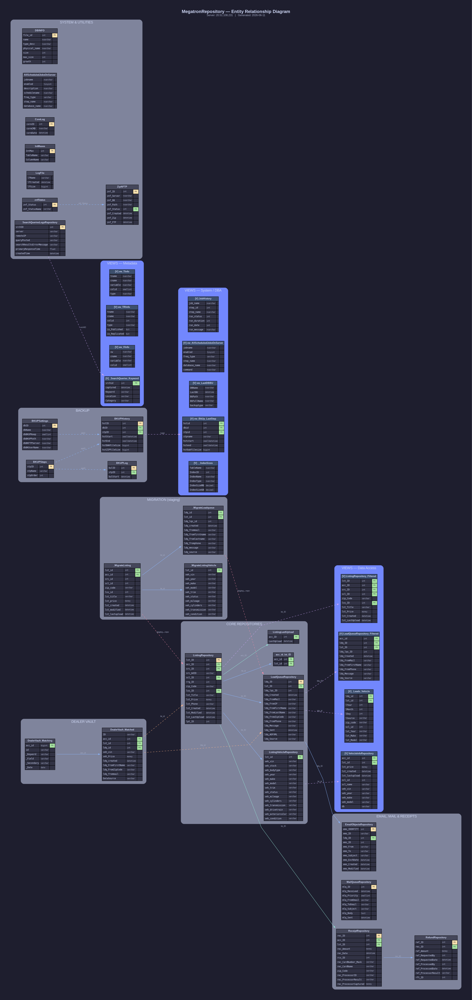

# ER Diagram — MegatronRepository

**Database:** `MegatronRepository`
**Server:** `20.51.108.231`
**Date:** 2026-06-11

---

## Diagram



---

## Legend

| Color / Style | Meaning |
|---|---|
| Solid blue line | Relationship within the same group |
| Teal bold line | Cross-group relationship (Listing → Lead, etc.) |
| Orange dashed line | Migration staging → repository flow |
| Dashed purple line | View → table relationship |
| Yellow `PK` label | Primary key |
| Green `FK` label | Foreign key (inferred from column naming conventions) |

> **Note:** No explicit `FOREIGN KEY` constraints were found in the schema. All relationships are inferred from shared column names and naming conventions (e.g., `acc_ID`, `lst_ID`, `ldq_ID`, etc.).

---

## Entity Groups

### Core Repositories (5 tables)

| Table | Rows | Size | Description |
|---|---|---|---|
| `ListingRepository` | 73.8 M | 53 GB | Historical archive of all vehicle listings replicated from Megatron |
| `ListingVehicleRepository` | 69.4 M | 18.9 GB | Vehicle detail records (make, model, VIN, etc.) linked to ListingRepository |
| `LeadQueueRepository` | 7.9 M | 14.6 GB | Historical archive of all inbound leads replicated from Megatron |
| `acc_id_lst_ID` | 12.5 M | 225 MB | Account-to-listing index/mapping table for fast cross-reference lookups |
| `ListingLastUpload` | — | — | Tracks the last upload timestamp per account |

---

### Email, Mail & Receipts (4 tables)

| Table | Description |
|---|---|
| `EmailObjectsRepository` | Email messages sent in response to leads (linked to LeadQueueRepository) |
| `MailQueueRepository` | Outbound mail queue with priority, subject, and body |
| `ReceiptRepository` | Payment receipt records with amount, card info, and processor result |
| `RefundRepository` | Refund records linked to receipts |

---

### Backup (4 tables)

| Table | Description |
|---|---|
| `BKUPSettings` | Per-database backup configuration (path, FTP server, retention) |
| `BKUPSteps` | Ordered backup step definitions (e.g., compress, upload, verify) |
| `BKUPHistory` | Execution history per step per database with file sizes and timing |
| `BKUPLog` | Log of backup step executions with start timestamps |

---

### Migration — Staging (3 tables)

| Table | Rows | Description |
|---|---|---|
| `_MigrateListing` | 13,941 | Staging table for listings being migrated into ListingRepository |
| `_MigrateListingVehicle` | 13,941 | Staging table for vehicle details during listing migration |
| `_MigrateLeadqueue` | 17 | Staging table for leads during migration |

> These tables serve as transit/staging buffers. Records are loaded here first, then promoted into the corresponding `*Repository` tables.

---

### Dealer Vault (2 tables)

| Table | Description |
|---|---|
| `DealerVault_Matching` | Keyword/field matching rules per dealer account for lead matching |
| `DealerVault_Matched` | Matched lead results — links accounts, listings, leads, and VINs |

---

### System & Utilities (7 tables)

| Table | Description |
|---|---|
| `DBINFO` | Database file metadata (physical files, sizes, growth settings) |
| `AllScheduledJobsOnServer` | SQL Agent scheduled jobs with frequency, database, and status |
| `CoreLog` | Core command execution log with timestamps |
| `IntMaxes` | Tracks current maximum int values per table/column (overflow monitoring) |
| `ZipNFTP` | Zip + FTP job queue with server, path, and status |
| `znfStatus` | Status lookup for ZipNFTP jobs |
| `SearchQueriesLogsRepository` | Archive of search query logs with response times |

---

## Key Relationships

```
ListingRepository       ──► ListingVehicleRepository    (lst_ID)
ListingRepository       ──► LeadQueueRepository         (lst_ID)
ListingRepository       ──► acc_id_lst_ID               (lst_id)
ListingRepository       ──► ListingLastUpload            (acc_ID)
ListingRepository       ──► ReceiptRepository           (lst_ID)

LeadQueueRepository     ──► EmailObjectsRepository      (ldq_ID)
ReceiptRepository       ──► RefundRepository            (rec_ID)

BKUPSettings            ──► BKUPHistory                 (dbID)
BKUPSteps               ──► BKUPHistory                 (stpID)
BKUPSteps               ──► BKUPLog                     (stpID)

_MigrateListing         ──► _MigrateListingVehicle      (lst_id)
_MigrateListing         ──► _MigrateLeadqueue           (lst_id)
_MigrateListing         ──► ListingRepository           [staging → repo]
_MigrateLeadqueue       ──► LeadQueueRepository         [staging → repo]

DealerVault_Matching    ──► DealerVault_Matched         (acc_id)
DealerVault_Matched     ──► ListingRepository           (lst_id)
DealerVault_Matched     ──► LeadQueueRepository         (ldq_id)

znfStatus               ──► ZipNFTP                     (znf_Status)
```

---

## Views (20 views — grouped by function)

### Views — Data Access (4 views)

| View | Base Table(s) | Description |
|---|---|---|
| `LeadQueueRepository_Filtered` | `LeadQueueRepository` | Filtered subset of leads — excludes test or invalid entries |
| `ListingRepository_Filtered` | `ListingRepository` | Filtered subset of listings — active/valid only |
| `VehicleInfoRepository` | `ListingRepository`, `ListingVehicleRepository` | Joined vehicle + listing data with classification info |
| `_Leads_Vehicle` | `LeadQueueRepository`, `ListingVehicleRepository` | Lead records enriched with vehicle (make/model/year) data |

---

### Views — System / DBA (8 views)

| View | Base | Description |
|---|---|---|
| `JobHistory` | `msdb..sysjobhistory` | SQL Agent job execution history with run status and duration |
| `vw_AllScheduledJobsOnServer` | `msdb` system tables | All scheduled SQL Agent jobs with schedule and step details |
| `vw_LastDBBU` | `msdb..backupset` | Most recent backup per database with file path and type |
| `vw_BkUp_LastStep` | `BKUPHistory`, `BKUPSteps` | Latest completed step per backup history record |
| `__IndexSizes` | `sys.dm_db_index_physical_stats` | Index size and fragmentation stats for all tables |
| `__IndexesNotUsed` | `sys.dm_db_index_usage_stats` | Indexes with zero seeks/scans (candidates for removal) |
| `__CurrentPermissions` | `sys.database_permissions` | Current database user permissions |
| `_IDX_Primary_Fix` | `sys.indexes` | Tables missing or with misnamed primary key indexes |

---

### Views — Metadata (8 views)

| View | Description |
|---|---|
| `vw_TInfo` | Table metadata: row counts, reserved/data/index/unused space |
| `vw_TRInfo` | Table row counts with last update statistics |
| `vw_VInfo` | View definitions and object metadata |
| `vw_FInfo` | Function definitions and metadata |
| `vw_SInfo` | Stored procedure definitions and metadata |
| `vw_IDXInfo` | Index definitions, columns, and types |
| `vw_IDXInfo_v2` | Extended index info with fill factor and statistics |
| `_SearchQueries_Keyword` | Keyword search queries from `SearchQueriesLogsRepository` |

---

> **Architecture note:** MegatronRepository is a historical/archive database. The three primary tables (`ListingRepository`, `ListingVehicleRepository`, `LeadQueueRepository`) together hold ~151M rows and ~87GB of data. They mirror the corresponding live tables in Megatron and are used for long-term reporting, analytics, and data recovery scenarios.
