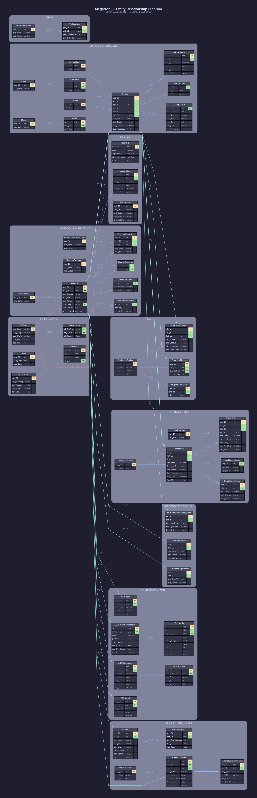

# ER Diagram — Megatron

**Database:** `Megatron`
**Server:** `20.51.108.231`
**Date:** 2026-06-11

---

## Diagram



---

## Legend

| Color / Style | Meaning |
|---|---|
| Solid blue line | Relationship within the same group |
| Teal bold line | Cross-group relationship (Account → Listing → Leads, etc.) |
| Red dashed line | Geography reference (ZipCode) |
| Dashed line | Lookup / reference table relationship |
| Yellow `PK` label | Primary key |
| Green `FK` label | Foreign key (inferred from column naming conventions) |

> **Note:** No explicit `FOREIGN KEY` constraints were found in the schema. All relationships are inferred from shared column names and naming conventions (e.g., `acc_ID`, `lst_ID`, `ldq_ID`, etc.).

---

## Entity Groups

### Accounts & Security (9 tables)

| Table | Description |
|---|---|
| `Account` | Core account/advertiser record — central hub of the database |
| `AccountRole` | Role types (e.g., admin, advertiser, reseller) |
| `AccountExtras` | Additional attributes per account |
| `AccountSecurity` | Login credentials and security level per account |
| `AccountSecurityOptions` | Security option definitions (levels/types) |
| `AccountPreference` | Key-value preferences per account |
| `ResellerCompany` | Reseller company records |
| `ResellerAccounts` | Accounts linked to reseller companies |
| `ActivityLog` | Audit trail of account actions |

---

### Listings & Vehicles (10 tables)

| Table | Description |
|---|---|
| `Listing` | Core vehicle listing — links account, classification, status, and location |
| `ListingVehicle` | Vehicle-specific details (make, model, year, VIN, mileage) |
| `ListingExtras` | Flexible key-value extras per listing |
| `ListingHistory` | Change log for listing field updates |
| `ListingStatus` | Status lookup (e.g., active, sold, expired) |
| `Class` | Top-level vehicle category (e.g., Cars, Trucks) |
| `SubClass` | Subcategory within a Class |
| `Source` | Origin/channel of the listing (e.g., dealer, private) |
| `Make` | Vehicle manufacturer lookup |
| `Model` | Vehicle model lookup linked to Make |

---

### Leads & Email (6 tables)

| Table | Description |
|---|---|
| `LeadQueue` | Inbound lead records linked to a listing |
| `LeadQueueStatus` | Status lookup for leads (e.g., new, contacted, closed) |
| `LeadQueueExtras` | Additional key-value data per lead |
| `EmailObjects` | Email messages sent in response to leads |
| `EmailSources` | Email source/template types |
| `EmailScrubFinals` | Results of email scrubbing/validation |

---

### Campaigns & ADP (6 tables)

| Table | Description |
|---|---|
| `__AllAdEzCampaigns` | All AdEz advertising campaigns per account |
| `_AllFlights` | Flight periods (billing intervals) per campaign |
| `ADPCampaigns` | ADP campaign definitions per account |
| `ADPCreatives` | Creative assets linked to ADP campaigns |
| `ADPLocal` | Local ADP configuration per account |
| `ADPFeeds` | ADP feed URLs per account |

---

### Display & Banners (5 tables)

| Table | Description |
|---|---|
| `Banner` | Display banner definitions per account |
| `BannerLogTotal` | Impressions and clicks totals per banner per day |
| `RatchetDisplay` | Display campaign (Ratchet platform) per account |
| `RatchetDisplayCreative` | Creative assets for Ratchet display campaigns |
| `RatchetClient` | Ratchet client/partner reference |

---

### Craigslist (4 tables)

| Table | Description |
|---|---|
| `CraigslistBucket` | Posting regions/buckets for Craigslist |
| `CraigslistSubBucket` | Sub-regions within a bucket |
| `CraigslistPosting` | Individual Craigslist postings (linked to listing) |
| `CraigslistListing` | Active listings assigned to a Craigslist bucket |

---

### Facebook & Social (3 tables)

| Table | Description |
|---|---|
| `FbPageAccess` | Facebook page tokens per account |
| `CurrentFBPageAccess` | Currently active Facebook page tokens |
| `fbAutomotiveCatalog_data` | Listings synced to Facebook Automotive Catalog |

---

### Geography (5 tables)

| Table | Description |
|---|---|
| `ZipCode` | Zip code lookup with city, state, lat/lon |
| `State` | US state lookup |
| `GeoDistance` | Pre-computed distances between zip codes |
| `IPLocation` | Geographic region per IP block |
| `IPBlocks` | IP address ranges linked to geographic locations |

---

### Print (2 tables)

| Table | Description |
|---|---|
| `PrintPublications` | Print publication catalog |
| `PrintEditions` | Editions/issues per publication with dates |

---

### System (3 tables)

| Table | Description |
|---|---|
| `DBINFO` | Database file metadata |
| `BackupLog` | Backup execution history |
| `ActivityLog` | Account activity audit log |

---

## Key Relationships

```
Account         ──► Listing                    (acc_ID)
Account         ──► __AllAdEzCampaigns         (acc_ID / adv_acc_id)
Account         ──► ADPCampaigns               (acc_ID)
Account         ──► RatchetDisplay             (acc_ID)
Account         ──► Banner                     (acc_ID)
Account         ──► FbPageAccess               (acc_ID)

Listing         ──► LeadQueue                  (lst_ID)
Listing         ──► ListingVehicle             (lst_ID)
Listing         ──► CraigslistPosting          (lst_id)
Listing         ──► fbAutomotiveCatalog_data   (lst_ID)

LeadQueue       ──► EmailObjects               (ldq_ID)
LeadQueue       ──► EmailScrubFinals           (ldq_ID)

__AllAdEzCampaigns ──► _AllFlights             (id / cmp_id)
ADPCampaigns    ──► ADPCreatives               (id / adp_campaign_id)

RatchetDisplay  ──► RatchetDisplayCreative     (rds_ID)
Banner          ──► BannerLogTotal             (ban_ID)

CraigslistBucket ──► CraigslistPosting        (clb_id)
CraigslistBucket ──► CraigslistSubBucket      (clb_id)

ZipCode         ──► Account                    (zip_Code)
ZipCode         ──► Listing                    (zip_Code)
```

---

> **Scope note — Tables:** This diagram covers the 43 core business tables. The Megatron database also contains
> `zzz_*` archive/backup tables (~150+) and `obr_*` reporting tables (~30+) which are excluded here
> to maintain readability. The `obr_*` tables aggregate data from the core tables above for reporting purposes.

---

## Views (25 representative — grouped by function)

The Megatron database contains **200+ views**. The diagram shows the 25 most important operational views, grouped below. Archive views (`zzz_*`, `zzz__*`, `zzz___*`) and diagnostic/utility views are omitted from the diagram but listed in the full view count.

### Views — Accounts & Listings

| View | Base / Description |
|---|---|
| `_AllListings` | Unified listing feed from all source databases |
| `LiveListing` | Active listings only (live inventory) |
| `LiveAccount` | Active dealer/advertiser accounts |
| `_LeadQueueDetails` | Full lead detail including listing, account, and vehicle info |
| `_AllLeadQueue` | All leads across source databases |
| `accountrole_security` | Account with role, admin, exec, and hidden flags |
| `_SecurityCheck` | Security permissions per account (role + security options) |

---

### Views — Campaigns & AdEz

| View | Base / Description |
|---|---|
| `adez_campaigns` | Full AdEz campaign detail with products, channels, and targets |
| `adez_flights` | AdEz flight records with hashed keys for change detection |
| `_AllFlights_Merged` | Combined flight data from all providers with billing and performance |
| `_adp_Campaigns_Mapped` | Ratchet/ADP display campaigns with status and dates |
| `_adp_Clients_Mapped` | ADP clients with reseller, channel, and contact info |
| `_adp_Creatives_Mapped` | ADP creative assets linked to campaigns and banners |
| `AdPlatform_LiveCampaigns` | Currently live ADP campaigns by channel |
| `AdPlatform_PendingCampaigns` | Pending/upcoming ADP campaigns |

---

### Views — Outbound Feeds

| View | Base / Description |
|---|---|
| `adez_master_account` | Normalized account data for outbound feed delivery |
| `adez_master_listing` | Normalized listing data with hash keys for change detection |
| `__SmartVDPListings_v4` | Current VDP (Vehicle Detail Page) listing data per campaign |
| `_OutboundMasterAutos_Data` | Full automotive listing data for outbound distribution |
| `_HiLo_Vehicle_Source` | Live listings for Hi-Lo pricing comparison |

---

### Views — Facebook & Social

| View | Base / Description |
|---|---|
| `fbAutomotiveCatalog_raw_v4` | Facebook Automotive Catalog feed (current version) |
| `fbAutomotiveCatalog_raw_v5` | Facebook Automotive Catalog feed (latest version) |
| `FacebookCampaignSetup` | Facebook campaign setup data per advertiser and subscription |

---

### Views — Craigslist

| View | Base / Description |
|---|---|
| `cl_Mapped_Available` | Listings available for Craigslist posting with attribute hashes |
| `cl_Mapped_Source` | Source data for Craigslist listing mapping |
| `cl_Advertisers_Code` | Advertiser accounts with Craigslist bucket assignments |

---

### Views — Portal / Search

| View | Base / Description |
|---|---|
| `vw_ShortSolarView_Cars_v10` | Current Solr/search index view for vehicle listings |
| `vw_ShortSolarView_Cars_v11` | Latest search index view with additional fields |
| `vw_PortalView` | Lightweight listing view for portal rendering |
| `vw_VehicleData` | Full vehicle data with scoring and image download status |
| `BingCatalog` | Bing vehicle catalog feed (free listings) |
| `BingCatalogPaid` | Bing vehicle catalog feed (paid/targeted campaigns) |
| `GoogleVehicleCatalog` | Google vehicle catalog feed |

---

### Views — System & Diagnostics

| View | Base / Description |
|---|---|
| `OpenSessions` | Currently open SQL Server sessions |
| `vw_RecentActivity` | Recent database activity log with query preview |
| `vw_RecentBackups` | Recent database backup history |
| `vw_AllScheduledJobsOnServer` | All SQL Agent scheduled jobs with status |
| `JobHistory` | SQL Agent job execution history |
| `CeriseFirstPrioriy` | Monitoring view for critical job failures |

---

### Views — Mismatch / Alerting

| View | Description |
|---|---|
| `AdEzRANMismatch` | Campaigns active in AdEz but missing from RAN feed |
| `AdEzDisplayMismatch` | Display campaigns with status differences between systems |
| `AdEzLocalMismatch` | Local campaigns with cost or status discrepancies |
| `ActiveFlightMismatch` | Flights active in one system but not the other |
| `Alert_DisplayActiveNoPerformance_Source` | Display campaigns with no performance data |
| `Alert_LocalActiveNoPerformance_Source` | Local campaigns with no performance data |

---

> **Note on zzz_ views (~120 views):** These are historical snapshots, archived exports, and legacy reporting views. They are preserved for reference but not part of active data operations.
