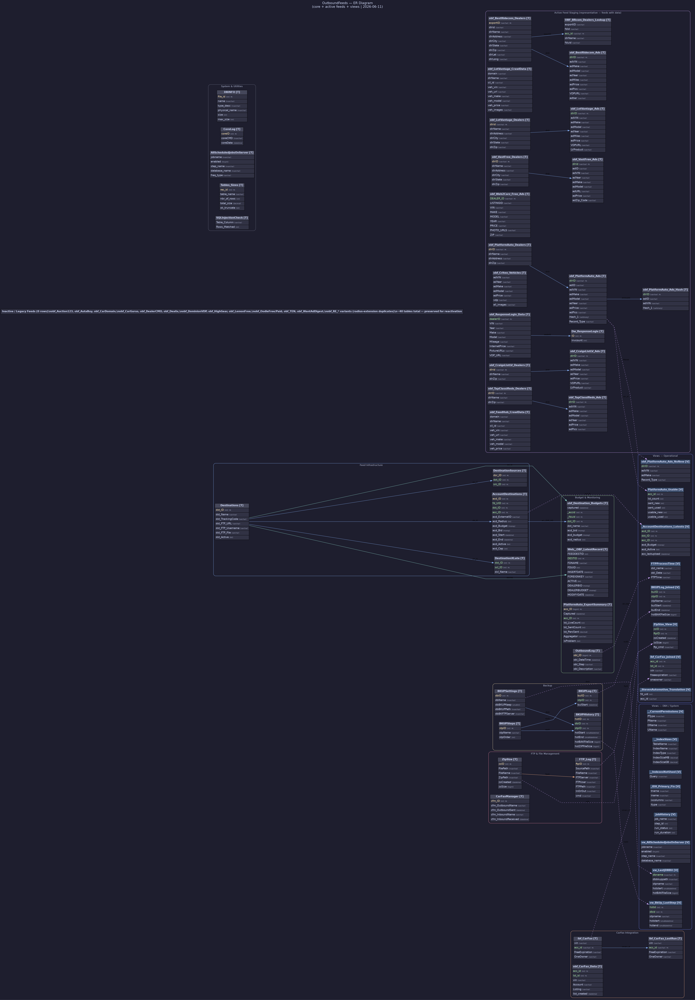

# ER Diagram — OutboundFeeds

**Database:** `OutboundFeeds`
**Server:** `20.51.108.231`
**Date:** 2026-06-11

---

## Diagram



---

## Purpose & Architecture

OutboundFeeds is a **feed distribution hub**. Its job is to take live vehicle listing data from Megatron and publish it to 30+ third-party automotive portals and classified networks. Each destination portal has its own pair of staging tables (`obf_<Portal>_Ads` / `obf_<Portal>_Dealers`) holding pre-formatted data ready for FTP delivery.

The flow is:
```
Megatron (live listings)
    → AccountDestinations (which portals each dealer subscribes to)
    → obf_<Portal>_Ads / _Dealers (staging per portal, formatted per spec)
    → FTP_Log / ZipSize (delivery tracking)
    → Web__OBF_LatestRecord (last-sent audit)
```

---

## Legend

| Color / Style | Meaning |
|---|---|
| Solid blue line | Relationship within the same group |
| Teal bold line | Cross-group relationship |
| Dashed purple line | View → table |
| Orange line | FTP/file management flow |
| Note box | Legacy or inactive table group |
| Yellow `PK` label | Primary key |
| Green `FK` label | Foreign key (inferred from naming conventions) |

> **Note:** No explicit `FOREIGN KEY` constraints exist in the schema. All relationships are inferred from shared column names.

---

## Entity Groups

### Feed Infrastructure (4 tables)

| Table | Rows | Description |
|---|---|---|
| `Destinations` | 69 | Master list of all delivery destinations (portals, FTP endpoints, tracking codes) |
| `DestinationSources` | 0 | Maps a destination to allowed source channels |
| `DestinationXLate` | 976 | Translates classification IDs (scl_ID) into destination-specific category names |
| `AccountDestinations` | 85,583 | Dealer-to-destination subscriptions: which portals each account is active on, with bid, budget, radius, and cap |

---

### Budget & Monitoring (4 tables)

| Table | Rows | Size | Description |
|---|---|---|---|
| `obf_Destination_Budgets` | 15.5 M | 1.5 GB | Captured snapshots of account bid/budget/radius per destination — historical audit trail |
| `Web__OBF_LatestRecord` | 1,559 | 0.3 MB | Latest feed record sent per destination (last-sent marker) |
| `PlatformAuto_ExportSummary` | 4,542 | 0.7 MB | Per-account export summary: live count vs sent count, % coverage, problem flag |
| `OutboundLog` | 45,859 | 5 MB | Step-by-step execution log for outbound processes |

---

### FTP & File Management (3 tables)

| Table | Rows | Size | Description |
|---|---|---|---|
| `FTP_Log` | 166,746 | 119 MB | Full log of every FTP operation (inbound and outbound) with server, path, and command |
| `ZipSize` | 62,718 | 21 MB | Zip file records with paths and sizes; links to FTP_Log for delivery tracking |
| `CarFaxManager` | 1,765 | 0.3 MB | Tracks CarFax inbound/outbound file transfers by name and timestamp |

---

### CarFax Integration (3 tables)

| Table | Description |
|---|---|
| `ibf_CarFax` | Inbound CarFax data: VIN-level free history and one-owner flags |
| `ibf_CarFax_LastRun` | Snapshot of CarFax data from the most recent run |
| `ibf_CarFax_Temp` | Temporary staging for CarFax inbound processing |
| `obf_CarFax_Data` | Outbound CarFax export: full account + listing XML blobs keyed by acc_id/lst_id/VIN (464K rows, 81 MB) |

---

### Active Feed Staging (tables with data)

These staging tables hold currently active vehicle inventory formatted for each portal's specific feed specification.

| Feed | Ads Table | Rows | Size | Dealers Table | Notes |
|---|---|---|---|---|---|
| **BestRide.com** | `obf_BestRidecom_Ads` | 316,740 | 1 GB | `obf_BestRidecom_Dealers` | Largest active feed; has lookup table `OBF_BRcom_Dealers_Lookup` |
| **BestRide Free** | `obf_BRcomFree_ads` | 1,541 | 7 MB | `obf_BRcomFree_dealers` | Free-tier BestRide variant |
| **LotVantage** | `obf_LotVantage_Ads` | 8,384 | 35 MB | `obf_LotVantage_Dealers` | + `obf_LotVantage_CrawlData` (752K rows, 2.8 GB) |
| **Vast Free** | `obf_VastFree_Ads` | 253,310 | 251 MB | `obf_VastFree_Dealers` | High-volume free classified feed |
| **Web2Carz Free** | `obf_Web2Carz_Free_Ads` | 223,826 | 759 MB | *(none)* | Large free feed with radius/extension |
| **PlatformAuto** | `obf_PlatformAuto_Ads` | 79,953 | 227 MB | `obf_PlatformAuto_Dealers` | Has hash table `obf_PlatformAuto_Ads_Hash` for change detection |
| **Criteo** | `obf_Criteo_Vehicles` | 164,827 | 292 MB | *(none)* | Vehicle catalog feed for Criteo retargeting |
| **ResponseLogix** | `obf_ResponseLogix_Data` | 18,218 | 69 MB | *(lookup: Dw_ResponseLogix)* | Lead aggregator feed |
| **ResponsePath** | `obf_ResponsePath_Data` | 6,232 | 27 MB | *(lookup: Dw_ResponsePath)* | Lead aggregator feed |
| **TapClassifieds** | `obf_TapClassifieds_Ads` | 8,679 | 34 MB | `obf_TapClassifieds_Dealers` | — |
| **EveryAuto** | `obf_EveryAuto_Ads` | 3,096 | 12 MB | `obf_EveryAuto_Dealers` | — |
| **AutosUsados** | `obf_AutosUsados_Ads` | 1 | — | `obf_AutosUsados_Dealers` | Spanish-language classifieds |
| **CraigslistLV** | `obf_CraigsListLV_Ads` | 262 | 4 MB | `obf_CraigsListLV_Dealers` | LotVantage-style Craigslist posting |
| **CraigslistDT** | `obf_CraigsListDT_Ads` | 212 | 1 MB | `obf_CraigsListDT_Dealers` | Detroit-style Craigslist posting |
| **FeedHub CrawlData** | `obf_FeedHub_CrawlData` | 13,596 | 71 MB | *(none)* | Dealer website crawl data |
| **CreditLogix** | `obf_CreditLogix_Data` | 1 | — | *(lookup: OBF_CreditLogix_Dealers_Lookup)* | Credit-focused lead portal |
| **InstaVid360** | `obf_InstaVid360_Ads` | 2,987 | 8 MB | *(none)* | Vehicle video thumbnails feed |
| **ISeeCars** | `obf_ISeeCars_Ads` | 1 | — | *(none)* | — |
| **Vast Paid** | `obf_Vast_Paid_Ads` | 1 | — | `obf_Vast_Paid_Dealers` | Paid Vast classified variant |
| **Web2Carz Paid** | `obf_Web2Carz_Paid_Ads` | 1 | — | *(none)* | Paid Web2Carz variant |

---

### Inactive / Legacy Feed Staging (0 rows — ~40 tables)

These tables exist for portals that are no longer active or have been migrated. They are preserved for reactivation. Each follows the same `obf_<Portal>_Ads` / `obf_<Portal>_Dealers` pattern.

Legacy portals include: Auction123, AutaBuy, AutoByTel, Autolist, AutoMarketDirect, AutomotiveCom, CarDomain, CarGigi, CarGurus, CarsDirect, DealerCMO, Dealix, DealSea, DetroitTrading (+ RE/TEST variants), DominionVDP, GetAuto, Gumiya (J/V), HighGear, LemonFree, LendingTree, MerchantCircle, Oodle (Free/Paid), PennySaver, Rentus, TEN, WantAdDigest.

The `obf_RE_*` series duplicates most active feeds as **radius-extension** variants (same schema, different routing logic).

Other: `obf_TJS_Export` (truck driver job leads), `TMPWorldwideJobs` (job board staging), `obf_GumiyoJ/V` (classified job/vehicle feeds), `obf_Claz_Ads`, `obf_Campusave_Temp`.

---

### Backup (4 tables)

| Table | Description |
|---|---|
| `BKUPSettings` | Per-database backup config (path, FTP server, retention days) |
| `BKUPSteps` | Ordered step definitions for the backup pipeline |
| `BKUPHistory` | Execution history per step per database with BAK and ZIP file sizes |
| `BKUPLog` | Per-step execution start timestamps |

---

### System & Utilities (6 tables)

| Table | Description |
|---|---|
| `DBINFO` | Database physical file metadata |
| `AllScheduledJobsOnServer` | All SQL Agent scheduled jobs with frequency and step details |
| `CoreLog` | Core command execution audit log |
| `IntMaxes` | Current max int values per table/column (overflow monitoring) |
| `Tables_Sizes` | Table size and row count snapshots |
| `SQLInjectionCheck` | Tracks columns where injection patterns were detected |
| `sysdiagrams` | SQL Server diagram storage |
| `ImageProxyAccounts` | Accounts using the image proxy service |
| `ZipNFTP` (via `znfStatus`) | Zip + FTP queue (if present; may be shared with other DBs) |

---

## Key Relationships

```
Destinations         ──► AccountDestinations        (dst_ID)
Destinations         ──► DestinationSources          (dst_ID)
Destinations         ──► DestinationXLate             (dst_ID)
Destinations         ──► obf_Destination_Budgets      (dst_ID)
Destinations         ──► Web__OBF_LatestRecord        (DESTID)

AccountDestinations  ──► obf_Destination_Budgets      (acc_ID)

obf_*_Dealers        ──► obf_*_Ads                   (dlrID)   — for each active portal
obf_BestRidecom_Dealers ──► OBF_BRcom_Dealers_Lookup  (exportID)
obf_PlatformAuto_Ads ──► obf_PlatformAuto_Ads_Hash    (adID)

ZipSize              ──► FTP_Log                       (ftpID)
ibf_CarFax           ──► ibf_CarFax_LastRun             (vin/acc_id)

BKUPSettings         ──► BKUPHistory                   (dbID)
BKUPSteps            ──► BKUPHistory / BKUPLog          (stpID)
```

---

## Views (22 views — grouped by function)

### Views — Operational (8 views)

| View | Base Table(s) | Description |
|---|---|---|
| `_AccountDestinations_Latests` | `AccountDestinations` | Active destination subscriptions enriched with last upload timestamp |
| `BKUPLog_Joined` | `BKUPLog`, `BKUPHistory`, `BKUPSteps` | Full backup step log with start/end times and file sizes |
| `FTPProcessTime` | `OutboundLog` | FTP processing duration per destination per day |
| `ibf_CarFax_Joined` | `ibf_CarFax` | CarFax data joined with acc_id/lst_id integers for querying |
| `obf_PlatformAuto_Ads_NoNew` | `obf_PlatformAuto_Ads` | PlatformAuto ads excluding "new" vehicle record type |
| `PlatformAuto_Usable` | `obf_PlatformAuto_Ads` | Per-account usable inventory counts (new vs. used, live vs. sent) |
| `ZipSize_View` | `ZipSize`, `FTP_Log` | Joined zip + FTP records with ready-to-run shell commands |
| `_StevenAutomotive_Translation` | *(system)* | Maps fd_uid to acc_id for the StevenAutomotive integration |

---

### Views — DBA / System (8 views)

| View | Description |
|---|---|
| `JobHistory` | SQL Agent job execution history with run status and duration |
| `vw_AllScheduledJobsOnServer` | All scheduled SQL Agent jobs with full schedule and step details |
| `vw_BkUp_LastStep` | Latest completed step per backup history record |
| `vw_LastJDBBU` | Most recent backup per database with path and file size |
| `__IndexSizes` | Index size and fragmentation for all tables |
| `__IndexesNotUsed` | Indexes with zero usage (candidates for removal) |
| `__CurrentPermissions` | Current database user/role permissions |
| `_IDX_Primary_Fix` | Tables with missing or misnamed primary key indexes |

---

### Views — Metadata (6 views)

| View | Description |
|---|---|
| `vw_TInfo` | Table column metadata with SELECT/INSERT/UPDATE templates |
| `vw_TRInfo` | Table row info with replication flags |
| `vw_VInfo` | View column metadata |
| `vw_FInfo` | Function definitions and column metadata |
| `vw_SInfo` | Stored procedure definitions |
| `vw_IDXInfo` / `vw_IDXInfo_v2` | Index definitions with fill factor, size, and re-index queries |

---

> **Scale note:** The largest tables by size are `obf_Destination_Budgets` (1.5 GB), `obf_LotVantage_CrawlData` (2.9 GB), `obf_Web2Carz_Free_Ads` (759 MB), `obf_BestRidecom_Ads` (1 GB), and `obf_Criteo_Vehicles` (292 MB). Together with `FTP_Log` (119 MB) and `ZipSize` (21 MB), the database holds detailed delivery history going back several years.
