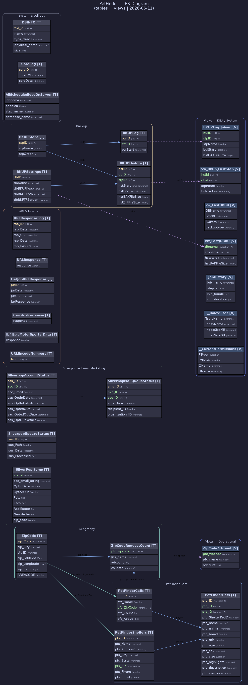

# ER Diagram — PetFinder

**Database:** `PetFinder`
**Server:** `20.51.108.231`
**Date:** 2026-06-11

---

## Diagram



---

## Purpose & Architecture

PetFinder is a **multi-purpose integration database** with two primary domains:

1. **PetFinder feed** — Pulls adoptable pet listings from Petfinder.com by zip code, stores shelter and pet data for display on associated classifieds portals.
2. **Silverpop email marketing** — Tracks email opt-in/opt-out status and mail queue delivery for accounts (linked by `acc_ID` to the Megatron account system).

It also contains generic API response logging tables used by several integrations (Cerritos, EpicMotorSports, job URL lookups).

---

## Legend

| Color / Style | Meaning |
|---|---|
| Solid blue line | Relationship within the same group |
| Teal line | Cross-group relationship |
| Dashed purple line | View → table |
| Yellow `PK` label | Primary key |
| Green `FK` label | Foreign key (inferred from naming conventions) |

> **Note:** No explicit `FOREIGN KEY` constraints exist in the schema. All relationships are inferred from shared column names.

---

## Entity Groups

### PetFinder Core (3 tables)

| Table | Rows | Size | Description |
|---|---|---|---|
| `PetFinderCalls` | 408 | 0.04 MB | Named search configurations — each defines a label and zip code to query from Petfinder.com |
| `PetFinderShelters` | 883 | 0.13 MB | Animal shelters and rescue organizations returned by the API |
| `PetFinderPets` | 15,734 | 18.6 MB | Individual adoptable pet listings with breed, age, sex, size, description, and image URLs |

**Relationships:**
- `PetFinderCalls` → `PetFinderPets` (which call retrieved each pet)
- `PetFinderShelters` → `PetFinderPets` (which shelter owns each pet)
- `ZipCode` → `PetFinderCalls` and `PetFinderShelters` (geographic lookup)

---

### Geography (2 tables)

| Table | Rows | Size | Description |
|---|---|---|---|
| `ZipCode` | 42,890 | 2.7 MB | Full US zip code table with city, state, lat/lon, area code, and radius |
| `ZipCodeRequestCount` | 90,224 | 3.8 MB | Historical log of how many ads/results were returned per zip code per call name per date |

---

### Silverpop — Email Marketing (4 tables)

| Table | Rows | Size | Description |
|---|---|---|---|
| `SilverpopAccountStatus` | 107,872 | 13.5 MB | Opt-in/opt-out status per account email address — the master email subscription list |
| `SilverpopMailQueueStatus` | 6,043 | 0.6 MB | Delivery status for individual emails sent via Silverpop (links to mail queue ID and account) |
| `SilverpopUpdateStatus` | 26 | 0.07 MB | Tracks which Silverpop import/export files have been processed |
| `_SilverPop_temp` | 0 | — | Staging table for building Silverpop import files; includes per-category interest flags (Pets, Cars, RealEstate, etc.) |

> `acc_ID` in the Silverpop tables references `Account.acc_ID` in the **Megatron** database.

---

### API & Integration (6 tables)

| Table | Rows | Description |
|---|---|---|
| `URLResponseLog` | 128 | General-purpose HTTP response log with URL, request data, and full response text |
| `URLResponse` | 0 | Single-row response buffer for API calls |
| `GetJobURLResponse` | 108 | Job URL lookup responses (used for classified job integration) |
| `CerritosResponse` | 1 | Single API response blob for the Cerritos integration |
| `ibf_EpicMotorSports_Data` | 1 | Single response blob for the EpicMotorSports integration |
| `URLEncodeNumbers` | 8,000 | Lookup table of integers 1–8000 used for URL encoding utilities |

---

### Backup (4 tables)

| Table | Description |
|---|---|
| `BKUPSettings` | Per-database backup config (path, FTP server, retention days) |
| `BKUPSteps` | Ordered step definitions for the backup pipeline |
| `BKUPHistory` | Execution history per step per database with BAK and ZIP file sizes |
| `BKUPLog` | Per-step execution start timestamps |

---

### System & Utilities (3 tables)

| Table | Description |
|---|---|
| `DBINFO` | Database physical file metadata |
| `AllScheduledJobsOnServer` | All SQL Agent scheduled jobs with schedule and step details |
| `CoreLog` | Core command execution audit log |

---

## Key Relationships

```
ZipCode           ──► PetFinderCalls            (zip_Code / pfc_ZipCode)
ZipCode           ──► PetFinderShelters          (zip_Code / pfs_Zip)
ZipCode           ──► ZipCodeRequestCount        (zip_Code)

PetFinderCalls    ──► PetFinderPets              (pfc_ID)
PetFinderCalls    ──► ZipCodeRequestCount        (pfc_name)
PetFinderShelters ──► PetFinderPets              (pfs_ID)

SilverpopAccountStatus ──► SilverpopMailQueueStatus  (acc_ID)

BKUPSettings      ──► BKUPHistory                (dbID)
BKUPSteps         ──► BKUPHistory / BKUPLog       (stpID)
```

---

## Views (18 views — grouped by function)

### Views — Operational (1 view)

| View | Base Table | Description |
|---|---|---|
| `ZipCodeAdcount` | `ZipCodeRequestCount` | Aggregated ad count per zip code per call name (latest/summarized) |

---

### Views — DBA / System (7 views)

| View | Description |
|---|---|
| `BKUPLog_Joined` | Full backup step log with start/end times and file sizes |
| `vw_BkUp_LastStep` | Latest completed step per backup history record |
| `vw_LastDBBU` | Most recent backup per database (from msdb backupset) |
| `vw_LastJDBBU` | Most recent backup from the custom backup system |
| `JobHistory` | SQL Agent job execution history |
| `__IndexSizes` | Index size and fragmentation |
| `__CurrentPermissions` | Current database user/role permissions |
| `__IndexesNotUsed` | Indexes with zero usage |
| `_IDX_Primary_Fix` | Tables with missing or misnamed primary key indexes |
| `vw_AllScheduledJobsOnServer` | All scheduled SQL Agent jobs with full schedule details |

---

### Views — Metadata (7 views)

| View | Description |
|---|---|
| `vw_TInfo` | Table column metadata with SELECT/INSERT/UPDATE templates |
| `vw_TRInfo` | Table row info with replication flags |
| `vw_VInfo` | View column metadata |
| `vw_FInfo` | Function definitions |
| `vw_SInfo` | Stored procedure definitions |
| `vw_IDXInfo` | Index definitions with fill factor and re-index queries |
| `vw_IDXInfo_v2` | Extended index info with size metrics |
