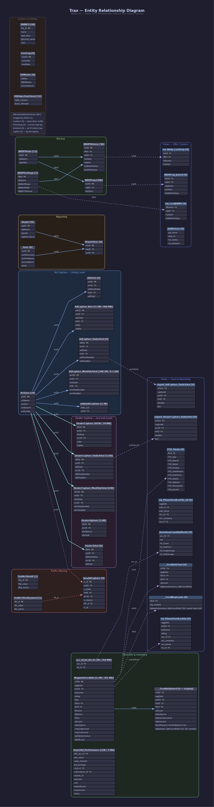

# ER Diagram — Trax

**Database:** `Trax`
**Server:** `20.51.108.231`
**Date:** 2026-06-11

---

## Diagram



---

## Purpose & Architecture

Trax is the **traffic and engagement tracking database**. It records every user interaction with vehicle listings and dealer pages across the Megatron ad network, classifies them by action type, filters bots, and aggregates the results into daily and monthly totals for reporting.

The core flow is:

```
Actions (24 action types: Search, Detail, Printed, ViewPhotos,
         Directions, Dealer, Website, PhoneCalls, Emails…)
    ↓
AdCapture_Bot       — raw listing-level events (17.2M rows)
    → AdCapture_DailyTotal   — daily aggregation by listing/action
    → AdCapture_MonthlyTotal — monthly aggregation (108.5M rows — largest table)

DealerCapture       — raw account-level events (893K rows)
    → DealerCapture_DailyTotal
    → DealerCapture_MonthlyTotal

MagnetoFeedInfo     — per-feed performance snapshot: ad counts + lead
                      quantity (lq*) by portal (50+ portals tracked)
    → __FeedInfoFinal / __FeedNewLeads (views — joined + pivoted)

acc_id_lst_ID       — account-to-listing mapping (35.1M rows)
```

Bot detection is applied at capture time (`isBot` flag on raw tables). `TrafficFilterKeyword` and `TrafficFilterIP` define filter rules; `InvalidCapture` logs events that were rejected.

---

## Legend

| Color / Style | Meaning |
|---|---|
| Solid blue line | Relationship within the same group |
| Teal line | Cross-group relationship (Actions → Dealer cluster) |
| Dashed purple line | View → table |
| Red dashed line | Invalid/error flows |
| Yellow `PK` label | Primary key |
| Green `FK` label | Foreign key (inferred from naming conventions) |

> **Note:** No explicit `FOREIGN KEY` constraints exist in the schema. All relationships are inferred from shared column names.

---

## Entity Groups

### Ad Capture — Listing Level (6 tables)

The primary capture layer, keyed by `lstID` (listing ID from Megatron) and `actID` (action type).

| Table | Rows | Size | Description |
|---|---|---|---|
| `Actions` | 24 | — | Master action type definitions. Each row names a trackable user behavior (Search, Detail view, Printed, ViewPhotos, Directions, Dealer click, Website click, Phone call, Email, etc.) with sort order and section grouping |
| `AdCapture_Bot` | 17.2 M | 968 MB | Raw listing-level engagement events — one row per event with bot flag, date (YYYYMMDD int), listing ID, and log key |
| `AdCapture_DailyTotal` | 0 | — | Pre-aggregated daily totals per listing/action split into bot vs. non-bot (not yet populated) |
| `AdCapture_MonthlyTotal` | **108.5 M** | **4.1 GB** | **Largest table.** Monthly aggregated totals per listing/action — the primary source for listing-level performance reporting |
| `addmulticapture` | 2,209 | 0.3 MB | Batch capture staging — holds a comma-separated list of listing IDs for multi-listing capture events |
| `AdTotal` | 0 | — | Legacy monthly total table (superseded by `AdCapture_MonthlyTotal`, preserved for compatibility) |

---

### Dealer Capture — Account Level (5 tables)

Parallel structure to Ad Capture but keyed by `accID` (dealer account) rather than `lstID`.

| Table | Rows | Size | Description |
|---|---|---|---|
| `DealerCapture` | 893,103 | 24 MB | Raw account-level engagement events with bot flag, date, and log key |
| `DealerCapture_DailyTotal` | 122,281 | 4.7 MB | Daily totals per account/action (bot vs. non-bot) |
| `DealerCapture_MonthlyTotal` | 63,046 | 2.7 MB | Monthly totals per account/action |
| `DealerOptions` | 5,927 | 0.4 MB | Per-dealer configuration options and grab settings |
| `DealerTotal` | 0 | — | Legacy dealer monthly total table (empty) |

---

### Feed Info & Inventory (4 tables)

| Table | Rows | Size | Description |
|---|---|---|---|
| `MagnetoFeedInfo` | 2.2 M | 391 MB | Per-feed performance snapshots keyed by `mfiID`, aggregation date, publisher, and dealer. Includes ad counts, image counts, and lead quantity columns (`lqOldAutomotive`, `lqOldLocal`) per portal |
| `__FeedInfoJoined` | 0 | — | Expanded staging version of MagnetoFeedInfo joining in lead quantities from 50+ portals (lqNewAutomotive, lqNewVast, lqBestRide.com, lqGoogleAds, lqMicrosoftAds, etc.) plus monthly SRP action totals. Currently empty — populated by a stored procedure |
| `acc_id_lst_ID` | 35.1 M | 764 MB | Flat account-to-listing ID mapping table — used for joining Megatron account IDs to listing IDs for reporting queries |
| `SmartAd_Performance` | 22,352 | 5 MB | SmartAd impression and click data by advertiser account, campaign, subscription, and ad unit |

---

### Traffic Filtering (3 tables)

| Table | Rows | Description |
|---|---|---|
| `TrafficFilterIP` | 1 | IP addresses to exclude from capture (bot/scraper IPs) |
| `TrafficFilterKeyword` | 1 | User agent or referrer keyword patterns to filter out |
| `InvalidCapture` | 0 | Log of captures rejected by filter rules — stores the reason, filter keyword ID, and IP |

---

### Reporting (3 tables, all empty)

| Table | Description |
|---|---|
| `Report` | Report definitions with name, URL, and description |
| `ReportUser` | Maps reports to authorized users |
| `User` | Internal user accounts (AD account, name, office ID) |

---

### Backup (4 tables)

| Table | Description |
|---|---|
| `BKUPSettings` | Per-database backup config (path, FTP server, credentials, retention) |
| `BKUPSteps` | Ordered step definitions for the backup pipeline |
| `BKUPHistory` | Execution history per step per database with BAK and ZIP file sizes |
| `BKUPLog` | Per-step execution start timestamps |

---

### System & Utilities

`DBINFO`, `CoreLog`, `IntMaxes`, `SQLInjectionCheck`, `LogFile`, `ProcessLog`, `AllScheduledJobsOnServer`, `imageproxy_blanks`, `myreturn`, `dsrestore`, `sysdiagrams`

---

## Key Relationships

```
Actions              ──► AdCapture_Bot               (actID)
Actions              ──► AdCapture_DailyTotal         (actID)
Actions              ──► AdCapture_MonthlyTotal        (actID)
Actions              ──► addmulticapture              (actID)
Actions              ──► DealerCapture                (actID)
Actions              ──► DealerCapture_DailyTotal      (actID)
Actions              ──► DealerCapture_MonthlyTotal    (actID)
Actions              ──► InvalidCapture               (actID)

TrafficFilterKeyword ──► InvalidCapture               (tfk_id)
MagnetoFeedInfo      ──► __FeedInfoJoined             (mfiID)

Report               ──► ReportUser                   (repID)
User                 ──► ReportUser                   (usrID)

BKUPSettings         ──► BKUPHistory                  (dbID)
BKUPSteps            ──► BKUPHistory / BKUPLog         (stpID)
```

---

## Scale Notes

| Table | Rows | Size | Notes |
|---|---|---|---|
| `AdCapture_MonthlyTotal` | 108.5 M | 4.1 GB | Largest table — monthly listing-level engagement totals |
| `AdCapture_Bot` | 17.2 M | 968 MB | Raw event log with bot flag |
| `acc_id_lst_ID` | 35.1 M | 764 MB | Account-listing mapping |
| `MagnetoFeedInfo` | 2.2 M | 391 MB | Per-feed lead tracking by portal |

---

## Views (25 views — grouped by function)

### Views — Feed & Reporting (8 views)

| View | Base Table(s) | Description |
|---|---|---|
| `__FeedInfoFinal` | `MagnetoFeedInfo` + `__FeedInfoJoined` | Final joined feed info with all portal lead columns and current/prior month SRP action totals |
| `__FeedNewLeads` | `MagnetoFeedInfo` (via Megatron LeadQueue) | New lead counts per dealer per creation date, pivoted by portal (50+ columns) |
| `vw_PhoneUsedLastOn` | `MagnetoFeedInfo` | Most recent date each dealer phone number appeared in a feed, by publisher/edition |
| `vw_PhoneUsedLastOn_all` | `MagnetoFeedInfo` | Same as above but without edition-tag filtering |
| `YTD_Totals` | `AdCapture_MonthlyTotal`, `DealerCapture_MonthlyTotal` | Year-to-date action totals per dealer: Search, Detail, Printed, ViewPhotos, Directions, Dealer, Website, PhoneCalls, Emails |
| `InventoryCountByMonth` | `acc_id_lst_ID` + Megatron | Monthly inventory counts per account: total listings, with price, single image, multi image |
| `export_AdCapture_DailyTotal` | `AdCapture_DailyTotal` | Exported daily ad capture totals in normalized format (bot vs. non-bot per action/account/listing) |
| `export_DealerCapture_DailyTotal` | `DealerCapture_DailyTotal` | Exported daily dealer capture totals in normalized format |

---

### Views — DBA / System (10 views)

| View | Description |
|---|---|
| `BKUPLog_Joined` | Full backup step log with start/end times and file sizes |
| `vw_BkUp_LastStep` | Latest completed step per backup history record |
| `vw_LastDBBU` | Most recent backup per database (from msdb backupset) |
| `vw_LastJDBBU` | Most recent backup from the custom backup system |
| `JobHistory` | SQL Agent job execution history with run status and duration |
| `vw_AllScheduledJobsOnServer` | All scheduled SQL Agent jobs with full schedule and step details |
| `__CurrentPermissions` | Current database user/role permissions |
| `__IndexSizes` | Index size and fragmentation for all tables |
| `__IndexesNotUsed` | Indexes with zero usage (candidates for removal) |
| `_IDX_Primary_Fix` | Tables with missing or misnamed primary key indexes |

---

### Views — Metadata (7 views)

| View | Description |
|---|---|
| `vw_TInfo` | Table column metadata with SELECT/INSERT/UPDATE templates |
| `vw_TRInfo` | Table row info with replication flags |
| `vw_VInfo` | View column metadata |
| `vw_FInfo` | Function definitions |
| `vw_SInfo` | Stored procedure definitions |
| `vw_IDXInfo` / `vw_IDXInfo_v2` | Index definitions with fill factor and size metrics |

---

> **Architecture note:** Trax sits alongside Megatron as a companion analytics database. Megatron owns the master listing and account records; Trax owns the click and engagement event streams. The `acc_id_lst_ID` table (35.1M rows) is the primary join bridge. The `Actions` table with 24 rows is the most referenced table — every single capture record in every capture table has an `actID` foreign key pointing to it.
