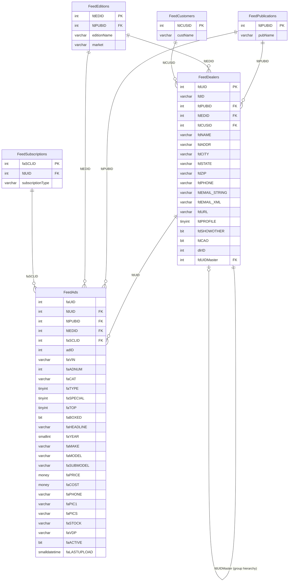

# Feedhub

Automotive Car Inventory Management (CIM) system — ingests vehicle inventory listings from franchise and independent dealers, stores them as syndicated ad records, and distributes them as feed content to publisher editions (print, digital, and platform channels).

> **ERD:** `docs/databases/erd/feedhub.svg`
> **DDL dump:** `docs/databases/dumps/feedhub.sql`

---

## Access Status

**Partial — inference-based.** The `ConflictAI` login has no user mapping inside the Feedhub database (owned by `AzureAdmin`). All seven direct `sys.*` catalog queries were blocked with: `The server principal 'ConflictAI' is not able to access the database 'Feedhub' under the current security context.`

Schema was recovered through two indirect paths:
1. `DataStaging.MLdata.FEEDADS` and `FEEDDEALERS` — confirmed ETL-synced subset copies of the Feedhub source tables (identical `fd`/`fa` column prefix convention, intact `fdUID` PK/FK link)
2. `msdb.dbo.backupset` — backup metadata confirming backup cadence, size, and Azure Blob storage location (`medialogixprodsqlstorage/cimsqlbackupcontainer` — the `cim` prefix confirms Car Inventory Management)

To complete full direct harvest, a DBA must run:
```sql
USE Feedhub;
CREATE USER ConflictAI FOR LOGIN ConflictAI;
EXEC sp_addrolemember 'db_datareader', 'ConflictAI';
```

---

## Overview

| Property | Value |
|---|---|
| Server | DWRPT (40.83.161.93) |
| Owner | AzureAdmin |
| Schemas | dbo (inferred; others unknown) |
| Confirmed tables | 2 (FeedDealers, FeedAds) |
| Inferred additional tables | ~4–6 (lookup/config tables) |
| Total data | ~8.32 MB compressed (weekly full backup size) |
| PII present | Yes — dealer name, address, phone, email; vehicle phone |
| CommonClientID present | No direct column — `fdCUSID` is the customer account key; `fdUID` links to `dlrID` used in `DataStaging.MLdata` |

Feedhub is the operational database for the **CIM (Car Inventory Management)** platform, the automotive inventory feed syndication layer within the MediaLogix product suite. Dealers submit vehicle inventory records (VIN, year, make, model, price, photos, VDP URL, stock number) that are stored as ad records in `FeedAds` and linked to dealer profiles in `FeedDealers`. Each dealer is associated with a publisher (`fdPUBID`) and edition (`fdEDID`), which controls where and how the feed is distributed — across print editions, digital platforms, and third-party syndication channels.

Data flows outward from Feedhub to `DataStaging.MLdata` via a nightly ETL that copies `FeedDealers` → `FEEDDEALERS` and `FeedAds` → `FEEDADS` for ML and performance analytics consumption. The `DataStaging` ETL subset is what powers VDP impression attribution, GVA campaign linking, and vehicle-level performance reporting in `DWRPT_AI.MLdata`. Feedhub itself is an active, continuously-written transactional database with transaction log backups every ~2 hours, confirming live dealer inventory ingest.

---

## Schemas

### dbo — Core Feed Schema

All confirmed tables reside in `dbo`. Based on the Hungarian-notation prefix convention (`fd` = feed dealer, `fa` = feed ad) and FK column names, four to six additional lookup tables are inferred but not yet directly confirmed.

---

#### dbo.FeedDealers (22,800 rows)

> Master registry of automotive dealers enrolled in the CIM feed syndication system, each associated with a publisher edition and customer account.

| Column | Type | Nullable | Key | Notes |
|---|---|---|---|---|
| fdUID | int | NOT NULL | PK | Surrogate dealer key — FK target for FeedAds.fdUID |
| fdID | varchar(20) | NULL | | External dealer code (e.g. "18047", "001123") |
| fdPUBID | int | NOT NULL | | FK → FeedPublications (inferred) — publisher association |
| fdEDID | int | NOT NULL | | FK → FeedEditions (inferred) — edition/market assignment |
| fdCUSID | int | NOT NULL | | FK → FeedCustomers (inferred) — billing customer account |
| fdNAME | varchar(64) | NOT NULL | | Dealer business name — PII-adjacent |
| fdADDR | varchar(128) | NULL | | Street address |
| fdCITY | varchar(64) | NULL | | City |
| fdSTATE | varchar(2) | NOT NULL | | State abbreviation |
| fdZIP | varchar(10) | NOT NULL | | ZIP code |
| fdPHONE | varchar(20) | NULL | | Primary phone — PII |
| fdALTPHONE | varchar(20) | NULL | | Alternate phone — PII |
| fdFAX | varchar(20) | NULL | | Fax number |
| fdEMAIL_STRING | varchar(96) | NULL | | Sales/contact email — PII |
| fdEMAIL_XML | varchar(96) | NULL | | Lead routing email (e.g. motosnap.com domain) — PII |
| fdURL | varchar(128) | NULL | | Dealer website URL |
| fdPROFILE | tinyint | NOT NULL | | Profile display flag (0 = no profile, 1 = profile enabled) |
| fdIMG1 | varchar(128) | NULL | | Dealer logo/image 1 filename |
| fdIMG2 | varchar(128) | NULL | | Dealer logo/image 2 filename |
| fdIMG3 | varchar(128) | NULL | | Dealer logo/image 3 filename |
| fdIMG4 | varchar(128) | NULL | | Dealer logo/image 4 filename |
| fdSHOWOTHER | bit | NOT NULL | | Whether to show competitor listings on the dealer's page |
| fdCAO | bit | NOT NULL | | CAO flag (Call-Around-Only or similar campaign opt-in) |
| dlrID | int | NULL | | Cross-system dealer ID — links to `DataStaging.MLdata` dealer reference |
| fdUIDMaster | int | NULL | | Points to parent/master dealer record for group hierarchies |

---

#### dbo.FeedAds (8,030,440 rows)

> Vehicle inventory listing records — one row per vehicle advertisement per publisher edition, including VIN, vehicle attributes, pricing, photos, and VDP deep link.

| Column | Type | Nullable | Key | Notes |
|---|---|---|---|---|
| faUID | int | NOT NULL | | Surrogate ad key (not confirmed as PK — PK constraint unknown; no direct sys access) |
| fdPUBID | int | NOT NULL | | FK → FeedPublications — publisher this ad runs in |
| fdEDID | int | NOT NULL | | FK → FeedEditions — edition/market for this ad |
| faSCLID | int | NULL | | FK → FeedSubscriptions/Accounts (inferred) — subscription line |
| adID | int | NULL | | Cross-system ad identifier — FK to subscription/AdEz ad record |
| fdUID | int | NULL | FK | FK → FeedDealers.fdUID — owning dealer |
| faVIN | varchar(64) | NOT NULL | | Vehicle Identification Number — primary vehicle identity key |
| faADNUM | int | NOT NULL | | Ad sequence number within the feed |
| faCAT | varchar(20) | NULL | | Vehicle category (SEDAN, OTHER, truck types observed) |
| faTYPE | tinyint | NOT NULL | | Ad type code (0 = standard, 3 = commercial/fleet observed) |
| faSPECIAL | tinyint | NOT NULL | | Special placement flag |
| faTOP | tinyint | NOT NULL | | Top-of-feed priority ranking |
| faBOXED | bit | NOT NULL | | Boxed ad display format flag |
| faHEADLINE | varchar(255) | NULL | | Ad headline — typically "YEAR MAKE MODEL TRIM" |
| faTEXT | varchar(MAX) | NULL | | Full ad body text |
| faHTML | text | NULL | | HTML-rendered ad content (legacy `text` type) |
| faYEAR | smallint | NULL | | Model year |
| faMAKE | varchar(32) | NULL | | Vehicle make (GMC, Ford, Toyota observed) |
| faMODEL | varchar(128) | NULL | | Vehicle model |
| faSUBMODEL | varchar(255) | NULL | | Trim/sub-model description |
| faPRICE | money | NULL | | Listed sale price |
| faCOST | money | NULL | | Dealer cost / invoice price — sensitive |
| faPHONE | varchar(20) | NULL | | Contact phone on ad — PII |
| faPIC1 | varchar(255) | NULL | | Primary photo URL |
| faPIC2 | varchar(255) | NULL | | Secondary photo URL |
| faPIC3 | varchar(255) | NULL | | Tertiary photo URL |
| faPIC4 | varchar(255) | NULL | | Fourth photo URL |
| faPICS | varchar(MAX) | NULL | | Full photo URL list (pipe- or comma-delimited) |
| faSTOCK | varchar(50) | NULL | | Dealer stock number |
| faVDP | varchar(MAX) | NULL | | Vehicle Detail Page (VDP) URL — deep link to listing |
| faRadius | int | NULL | | Geographic radius filter for geo-targeted distribution |
| faCREATED | smalldatetime | NULL | | Record creation timestamp |
| faLASTUPLOAD | smalldatetime | NULL | | Last inventory upload/sync timestamp |
| faACTIVE | bit | NOT NULL | | Active flag — 0 = sold/inactive, 1 = live listing |

---

#### Inferred Tables (not directly confirmed — require direct DB access)

| Inferred Table | Basis | Purpose |
|---|---|---|
| dbo.FeedPublications | `fdPUBID` INT FK on both FeedAds and FeedDealers | Publisher/channel registry (print, digital, platform) |
| dbo.FeedEditions | `fdEDID` INT FK on both tables | Edition/market configuration per publication |
| dbo.FeedCustomers | `fdCUSID` INT FK on FeedDealers | Customer/billing account registry |
| dbo.FeedSubscriptions | `faSCLID` INT FK on FeedAds | Subscription line / contract record |
| dbo.FeedAdCategories | `faCAT` varchar FK pattern | Ad category lookup (SEDAN, OTHER, etc.) |
| dbo.FeedAdTypes | `faTYPE` tinyint | Ad type code lookup |

---

## Stored Procedures

None confirmed — direct database access was blocked. The `procedures` array in the harvest is empty. This section should be completed after the DBA grants `ConflictAI` read access.

---

## Views

### dbo.GVACampaignDataByVINv3 (DataStaging context)

> Joins `DataStaging.MLdata.GVAVDPDatav2` with `DataStaging.MLdata.FEEDADS` on `faUID`/`lst_id` to produce VIN-level Google Vehicle Ads impression and click data enriched with vehicle metadata.

- **Underlying tables:** `MLdata.GVAVDPDatav2`, `MLdata.FEEDADS`
- **Key output columns:** `impressions`, `clicks`, `vin`, `year`, `make`, `model`, `price`, `lastupload`
- **Definition:** `WITH ENCRYPTION` — definition not recoverable without SYSADMIN; column list recovered via `sys.columns`
- **Note:** This view lives in `DataStaging`, not in Feedhub itself. It references the ETL copy of FeedAds, not the Feedhub source table directly.

---

## Indexes

| Table | Index | Columns | Type | Unique | Notes |
|---|---|---|---|---|---|
| MLdata.FEEDADS (DataStaging) | IX_FEEDADS_faVIN | faVIN | NONCLUSTERED | No | On ETL copy in DataStaging — native Feedhub indexes unknown |

Native Feedhub indexes are not recoverable without direct access. Expected indexes based on FK/query patterns:
- Clustered index on `FeedDealers.fdUID` (PK)
- Nonclustered on `FeedAds.fdUID` (FK join)
- Nonclustered on `FeedAds.faVIN` (VIN lookup)
- Nonclustered on `FeedAds.faACTIVE` + `fdEDID` (feed generation filter)

---

## ETL & SQL Agent Jobs

SQL Agent job enumeration was blocked — `ConflictAI` lacks `SQLAgentReaderRole` on `msdb`. No jobs can be listed.

**ETL patterns confirmed from indirect evidence:**

- `DataStaging.MLdata.FEEDADS` (8,030,440 rows) and `FEEDDEALERS` (22,800 rows) are confirmed ETL-synced copies of Feedhub source tables. The sync preserves column names exactly (`fdUID`, `faVIN`, `faPRICE`, etc.), column types, and the FK relationship between the two tables. This is almost certainly an SSIS package or SQL Agent job running on the DWRPT server that reads from Feedhub and writes to DataStaging.
- Transaction log backups every ~2 hours (6 observed on 2026-06-14) confirm Feedhub is an active write-receiving database throughout the day, consistent with real-time or near-real-time inventory upload ingestion from dealer FTP/API feeds.
- The `faLASTUPLOAD` column timestamp in sampled rows (last seen: 2023-12-13) suggests some records are historical/inactive; active listings would have recent `faLASTUPLOAD` values.

---

## Data Analysis

### Row Count Summary

| Schema | Table | Rows | Size KB |
|---|---|---|---|
| dbo | FeedDealers | 22,800 | unknown — requires direct access |
| dbo | FeedAds | 8,030,440 | unknown — requires direct access |
| dbo | FeedPublications (inferred) | unknown | unknown |
| dbo | FeedEditions (inferred) | unknown | unknown |
| dbo | FeedCustomers (inferred) | unknown | unknown |

Total backup compressed size: **8.32 MB** (weekly full). For a database with 8M+ rows in FeedAds, this small backup size indicates either heavy compression, a narrow rowset (many columns NULL for inactive records), or significant reuse of deallocated pages.

### Data Patterns & Observations

- **Active vs inactive ads:** The `faACTIVE` bit flag separates live inventory from historical/sold records. Sampled rows all show `faACTIVE = false` with `faLASTUPLOAD` dates from 2023, confirming the DataStaging ETL copy includes full history including sold/expired listings. The 8M row count represents cumulative history, not current active inventory.
- **faPRICE = 0.0:** All three sampled FeedAds rows show `faPRICE = 0.0`. This may indicate pricing was not populated for older records, or that $0 is a sentinel value for "price on request." Current active listings likely have real prices.
- **faTOP ranking:** Values observed: 3. This is a priority ranking column for feed ordering — higher values presumably sort higher in the output feed.
- **faCOST (dealer cost):** This is a sensitive column — it stores the dealer's actual invoice cost for the vehicle, not the listed sale price. If exposed in CDP analytics, this should be restricted to dealer-facing views only.
- **Photo URL pattern:** `faPIC1`–`faPIC4` are individual slots; `faPICS` is the full collection. The VDP URLs reference third-party dealer sites (thomasmtrs.com observed), confirming this is a syndicated feed pulling from dealer DMS inventory exports.
- **fdUIDMaster:** Nullable INT that points to a parent `fdUID` — this is a dealer group hierarchy column. When non-null, the dealer is a sub-dealer under a group master account.
- **dlrID:** Present on both FeedDealers (as `dlrID`) and FeedAds (as `adID`) — these appear to be cross-system identifiers linking to the legacy MediaLogix dealer/ad registry system.

### Inferred Data Flow

```
Dealer DMS / FTP Upload
        |
        v
[Feedhub] FeedAds + FeedDealers (write path — live transactional)
        |
        |-- Feed generation engine reads FeedAds WHERE faACTIVE=1 AND fdEDID=X
        |       --> distributes to publisher editions (print, digital, platform)
        |
        |-- SSIS / SQL Agent ETL (nightly or near-real-time)
                --> DataStaging.MLdata.FEEDADS (8M rows — full history)
                --> DataStaging.MLdata.FEEDDEALERS (22,800 rows)
                        |
                        v
                [DWRPT_AI.MLdata] — GVA campaign views, VDP performance analytics
```

### Data Quality Notes

- **faCOST nullability:** Cost data is nullable — many records will not have dealer cost populated (dealers don't always expose invoice cost to the feed). Do not assume cost completeness.
- **faHTML `text` type:** The `faHTML` column uses the legacy SQL Server `text` data type (deprecated since SQL Server 2005). If Feedhub is ever migrated, this must be converted to `varchar(MAX)`.
- **faTEXT vs faHTML:** Two overlapping free-text content columns — `faTEXT` (varchar MAX) and `faHTML` (text). Likely one is plain text and one is rendered HTML of the same content. Downstream consumers should prefer `faTEXT`.
- **fdUID nullable on FeedAds:** The FK `fdUID` on FeedAds is nullable — orphaned ad records (ads with no dealer assignment) are possible. CDP ingest should filter or flag rows where `fdUID IS NULL`.
- **fdEMAIL_STRING vs fdEMAIL_XML:** Two email fields per dealer — one for display/string use, one for XML lead routing (motosnap.com domain observed). These may diverge. Identity resolution should prefer `fdEMAIL_STRING` for the public email.

---

## Entity-Relationship Diagram



---

## Backup History

| Backup Type | Start Time | Size MB | Storage Location |
|---|---|---|---|
| Full (D) | 2026-06-11 18:48 | 8.32 | Azure Blob: cimsqlbackupcontainer |
| Full (D) | 2026-06-04 18:45 | 8.32 | Azure Blob: cimsqlbackupcontainer |
| Full (D) | 2026-05-28 18:44 | 8.32 | Azure Blob: cimsqlbackupcontainer |
| Log (L) | 2026-06-14 12:54 | 0.19 | Azure Blob: cimsqlbackupcontainer |
| Log (L) | 2026-06-14 10:50 | 0.19 | Azure Blob: cimsqlbackupcontainer |
| Log (L) | 2026-06-14 08:46 | 0.19 | Azure Blob: cimsqlbackupcontainer |
| Log (L) | 2026-06-14 06:42 | 0.19 | Azure Blob: cimsqlbackupcontainer |
| Log (L) | 2026-06-14 04:38 | 0.19 | Azure Blob: cimsqlbackupcontainer |
| Log (L) | 2026-06-14 02:34 | 0.19 | Azure Blob: cimsqlbackupcontainer |
| Log (L) | 2026-06-14 00:30 | 0.19 | Azure Blob: cimsqlbackupcontainer |
| Log (L) | 2026-06-13 22:26 | 0.19 | Azure Blob: cimsqlbackupcontainer |

**Storage account:** `medialogixprodsqlstorage`
**Container:** `cimsqlbackupcontainer`
**Backup pattern:** Weekly full (Wednesdays ~18:45), transaction log every ~2 hours
**Recovery model:** Full (log backups confirm FULL recovery model)
**Blob naming:** `Feedhub_c841d72d2cfb4b01a0197916fb5d35ad_{timestamp}-07.{bak|log}`

---

## CDP Relevance

**Identity resolution candidates:**

| Table | Column | Type | Notes |
|---|---|---|---|
| FeedDealers | fdUID | INT | Dealer surrogate key — links to `DataStaging.MLdata.FEEDDEALERS.dlrID` |
| FeedDealers | fdCUSID | INT | Customer/billing account — possible link to CRM customer ID |
| FeedDealers | fdEMAIL_STRING | varchar(96) | Dealer contact email — PII; usable for dealer identity matching |
| FeedDealers | fdPHONE | varchar(20) | Dealer phone — PII |
| FeedDealers | dlrID | INT | Cross-system dealer ID — maps to `DataStaging` dealer reference |
| FeedAds | faVIN | varchar(64) | Vehicle VIN — the primary vehicle identity key across all automotive systems |
| FeedAds | faPHONE | varchar(20) | Phone on ad — PII; may differ from dealer phone |

**CommonClientID:** Not present in Feedhub. The closest analog is `fdCUSID` (customer account ID on `FeedDealers`). Whether `fdCUSID` maps to `DWRPT_AI.clientdb.CommonClientId` is unknown — this is a priority open question. The `dlrID` column (present on `FeedDealers`) and `DataStaging.MLdata.ML_Account_Info.acc_id` may provide the bridge.

**PII fields requiring handling:**
- `FeedDealers.fdNAME` — business name (not personal, but identity-adjacent)
- `FeedDealers.fdADDR`, `fdCITY`, `fdSTATE`, `fdZIP` — dealer address
- `FeedDealers.fdPHONE`, `fdALTPHONE`, `fdFAX` — phone numbers
- `FeedDealers.fdEMAIL_STRING`, `fdEMAIL_XML` — email addresses
- `FeedAds.faPHONE` — phone on individual ad records
- `FeedAds.faCOST` — dealer invoice cost (commercially sensitive, not personal PII)

**VIN as cross-system join key:** `FeedAds.faVIN` is the strongest link to other automotive systems. VIN appears in `DWRPT_AI.CDXP.JuiceReporting_BSR_equity` (equity/trade-in), `DWRPT_AI.MLdata.VDPVINPerformance` (impression data), and `DWRPT_AI.core.Stage_SurveyResponse` (survey responses). Feedhub VINs enable vehicle-centric identity graphs across all of these.

**Multi-tenant safety:** Feedhub uses `fdPUBID` + `fdEDID` as the scoping keys for publisher/market isolation, and `fdCUSID` as the customer account scope. If Feedhub data is ingested into CDP, every query must be scoped to `fdCUSID` (or its resolved `CommonClientId` equivalent). The `fdUID` → `fdCUSID` relationship on `FeedDealers` is the tenant boundary.

**Type coercions:** No `CommonClientID` mismatch — the field does not exist in Feedhub. Coercion needed only when joining `fdCUSID` to the `clientdb` schema (if the mapping is confirmed).

---

## Open Questions

1. **fdCUSID → CommonClientId mapping:** Does `FeedDealers.fdCUSID` map directly to `DWRPT_AI.clientdb.ClientConsolidated.CommonClientId`, or is there an intermediate mapping table? This is the critical join for multi-tenant scoping in CDP ingestion.
2. **dlrID cross-system identity:** `FeedDealers.dlrID` appears in `DataStaging.MLdata` — does it map to `ML_Account_Info.acc_id` or to a separate dealer number system? Clarify with the MediaLogix/CIM DBA.
3. **Active inventory count:** Of the 8,030,440 rows in `FeedAds`, how many have `faACTIVE = 1`? The sampled rows are all inactive historical records — the active inventory footprint is unknown, which affects CDP freshness design.
4. **FeedPublications / FeedEditions table structure:** The publisher and edition lookup tables are inferred from FK columns but their full schemas are unknown. What is the publication taxonomy — how many publishers, how many editions, and what media types do they represent?
5. **faCOST data sensitivity policy:** Dealer invoice cost (`faCOST`) is commercially sensitive competitive data. What is the current access control policy? Should it be excluded from CDP ingest entirely, or made available only in restricted dealer-facing views?
