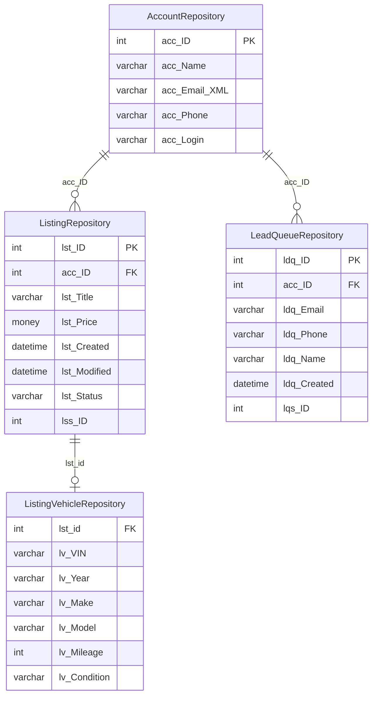

# MegatronRepository — Schema Documentation

> _Status: complete — schema documented 2026-06-21._ Describe only what the schema dump shows; flag inference; cite real object names. See [quality standards](../discovery-guide.md#quality-standards--references).

## Overview

Archive / cold-storage database mirroring key Megatron tables. Stores historical snapshots of leads, listings, listing vehicles, and receipts that have been removed or aged out of the live Megatron database.

## Access

- **Owner:** Ron Mulder · **Researcher:** Alicia · **Status:** granted · **Reach:** `20.51.108.231:1433` / SQL Server auth / SSMS or pyodbc
- Cross-ref: [System Access Tracker](/analysis/artifacts/access-tracker/index.html)

## Schema dump

Authoritative DDL: `dumps/megatron-repository.sql` — schema-only, no data. Extracted 2026-06-11 via `INFORMATION_SCHEMA` query (SQL Server megatron-repository). Re-extract from source to refresh.

## Tables

_26 tables total · **91.25 GB total / 91.22 GB used** (full DDL in `dumps/megatron-repository.sql`; ERD shows subset). Row counts from `sys.partitions` 2026-06-14._

| Table | ~Rows | Purpose | PK | CDP-relevant |
|---|---|---|---|---|
| `ListingRepository` | 73,790,475 | Historical archive of all classified ad listings with account, source, category, pricing, phone, and status — the primary listing cold store. | `lst_ID` | ✓ |
| `ListingVehicleRepository` | 69,370,619 | Vehicle attribute detail (VIN, stock, year, make, model, trim, mileage, condition, colors, etc.) keyed to `lst_id` in `ListingRepository`. | — | ✓ |
| `LeadQueueRepository` | 7,892,374 | Archive of buyer lead submissions including contact details (email, phone, name, zip), message, source, and ADF XML payload per listing. | `ldq_ID` | ✓ |
| `acc_id_lst_ID` | 12,498,629 | Mapping table linking account IDs to listing IDs — bridges seller accounts to their historical listings. | — | — |
| `ListingLastUpload` | 428,399 | Records the most recent inventory upload timestamp per account, used to track feed freshness (inferred). | — | ✓ |
| `EmailObjectsRepository` | 0 | Archive of email message objects (from, to, CC, subject, body, headers) linked to lead queue entries via `ldq_ID`. | `emo_IDENTITY` | — |
| `MailQueueRepository` | 0 | Archive of outbound mail queue entries with sender, recipient, subject, body, headers, and send result/timestamp. | `mlq_ID` | — |
| `ReceiptRepository` | 59,632 | Payment transaction records including amount, date, encrypted card data, and payment processor response per account and listing. | `rec_ID` | — |
| `RefundRepository` | 3,697 | Refund records tied to receipts, including amount, requester, processor result, and refund type, with request and processing timestamps. | `ref_ID` | — |
| `BKUPSettings` | — | Configuration for the database backup job: target database, retention count, local path, and FTP credentials. | `dbID` | — |
| `BKUPSteps` | — | Defines ordered steps in the backup process (step ID, name, and execution order). | `stpID` | — |
| `BKUPHistory` | — | Records backup run history per step, including start/end timestamps and backup/zip file sizes. | `hstID` | — |
| `BKUPLog` | — | Lightweight log of backup job starts, linking to step ID with a timestamp. | `bulID` | — |
| `_MigrateListing` | — | Migration staging copy of listing records, matching the `ListingRepository` schema — used during data migration from live Megatron (inferred). | — | ✓ |
| `_MigrateListingVehicle` | — | Migration staging copy of vehicle attribute records, matching `ListingVehicleRepository` schema. | — | ✓ |
| `_MigrateLeadqueue` | — | Migration staging copy of lead queue records, matching `LeadQueueRepository` schema. | — | ✓ |
| `DealerVault_Matching` | — | Staging table for matching DealerVault inventory records to Megatron accounts and listings by keyword and field, with a match date. | — | ✓ |
| `DealerVault_Matched` | — | Confirmed matches between DealerVault inventory (VIN, stock, price) and lead queue submissions, with full lead contact details and data source tag. | — | ✓ |
| `DBINFO` | — | SQL Server database file metadata (name, type, physical path, size, growth) captured from `sys.database_files`. | `file_id` | — |
| `AllScheduledJobsOnServer` | — | Snapshot of all SQL Server Agent jobs on the server, including schedule, frequency, step commands, and retry settings. | — | — |
| `CoreLog` | — | Operational command log recording executed commands and their timestamps (inferred application-level audit log). | `coreID` | — |
| `IntMaxes` | — | Utility table recording the maximum integer value currently in use per table/column, for ID generation or validation. | — | — |
| `ZipNFTP` | — | Job queue for compressing and FTP-transferring database files, tracking server, path, file, FTP credentials, status, and timestamps. | `znf_ID` | — |
| `znfStatus` | — | Lookup table of status codes and names for the `ZipNFTP` job queue. | `znf_Status` | — |
| `SearchQueriesLogsRepository` | — | Archive of site search queries with server, remote IP, client string, query posted, full URL, response times, and backfill source. | `srchID` | — |
| `LeadQueueRepository_Filtered` | — | No DDL in dump — likely a view or subset table filtering `LeadQueueRepository` to active/non-spam leads (inferred). | — | ✓ |
| `ListingRepository_Filtered` | — | No DDL in dump — likely a view or subset table filtering `ListingRepository` to active/valid listings (inferred). | — | ✓ |
| `VehicleInfoRepository` | — | No DDL in dump — likely a denormalized vehicle detail view combining `ListingRepository` and `ListingVehicleRepository` (inferred). | — | — |
| `_Leads_Vehicle` | — | No DDL in dump — likely a join of lead queue and vehicle listing data for dealer lead analysis (inferred). | — | ✓ |
| `JobHistory` | — | No DDL in dump — likely a view or table capturing SQL Server Agent job run history (inferred). | — | — |

## Indexes

**20 indexes across 13 tables** — 12 clustered, 8 nonclustered, 0 disabled. Mirrors Megatron's key tables (historical archive copies). Full dump: run `scripts/index-definitions.sql`.

| Table | Index | Key Columns | Type | Notes |
|---|---|---|---|---|
| `acc_id_lst_ID` | `PK_acc_id_lst_ID` | `lst_id` | CLUSTERED PK | Account-listing bridge |
| `LeadQueueRepository` | `PK_LeadQueueRepository` | `ldq_ID` | NONCLUSTERED PK | Unusual — no separate clustered index |
| `LeadQueueRepository` | `LeadQueueRepository_IDX_1` | `ldq_Created` → incl. `ldq_lqs_ID, ldq_FromIP` | NONCLUSTERED | Time-ordered lead access |
| `LeadQueueRepository` | `LeadQueueRepository_IDX_2` | `ldq_FromIP, ldq_Created` | NONCLUSTERED | IP+date lookup |

## Growth

Source: `msdb.dbo.backupset` full-backup history (type D), 2026-05-17 to 2026-06-14 (28 days).

| Metric | Value |
|---|---|
| Start size | 91.26 GB (2026-05-17) |
| End size | 91.26 GB (2026-06-14) |
| Net growth | **0.00 GB** |
| Rate | Static — no measurable growth |

MegatronRepository is effectively a read-only archive or slow-changing reference store over this window. Safe to snapshot for CDP without concern about rapid drift.

---

## ERD

Key entities (read-only archive mirror of Megatron live tables). Full DDL: `dumps/megatron-repository.sql`.

## CDP relevance

- **`ListingRepository`** (73.8 M rows): `acc_ID`, `zip_Code`, `lst_Phone`, `lst_Price`, `lst_Type`, `lst_isSale`, `lst_Created/Modified` — historical seller account activity and contact data.
- **`ListingVehicleRepository`** (69.4 M rows): VIN, make, model, year, condition, mileage — vehicle-level detail joinable to listings; enables inventory history per seller account.
- **`LeadQueueRepository`** (7.9 M rows): `ldq_FromMail`, `ldq_FromPhone`, `ldq_FromFirstName`, `ldq_FromLastName`, `ldq_FromZipCode`, `ldq_Source` — buyer contact details and intent signals; high-value CDP input for buyer persona construction.
- **`DealerVault_Matched`**: `acc_id`, `ldq_frommail`, `ldq_fromphone`, `ldq_FromFirstName/LastName`, `ldq_FromZipCode`, `veh_vin`, `veh_Price` — pre-matched dealer lead records with contact and vehicle context.
- **`ListingLastUpload`**: `acc_ID` + last upload timestamp — recency signal for seller account engagement.
- **`_MigrateListing` / `_MigrateLeadqueue` / `_MigrateListingVehicle`**: Migration staging copies — confirm schema parity with repository tables before using as supplementary source.
- **`LeadQueueRepository_Filtered` / `ListingRepository_Filtered` / `_Leads_Vehicle`**: No DDL available — investigate before relying on for CDP; likely views with quality-filtered subsets.

## Open questions

- `LeadQueueRepository_Filtered`, `ListingRepository_Filtered`, `VehicleInfoRepository`, `_Leads_Vehicle`, `JobHistory` have no DDL in dump — confirm with `sp_helptext` or `sys.sql_modules`.
- `acc_id_lst_ID` has no `acc_id` column in its DDL PK but carries `acc_id` as nullable — confirm join behavior with `ListingRepository.acc_ID`.
- `EmailObjectsRepository` and `MailQueueRepository` have 0 rows — confirm deprecated vs. reserved for future use.
- `SearchQueriesLogsRepository.srchID` is listed as PK in doc but not marked NOT NULL PK in dump — verify constraint.
