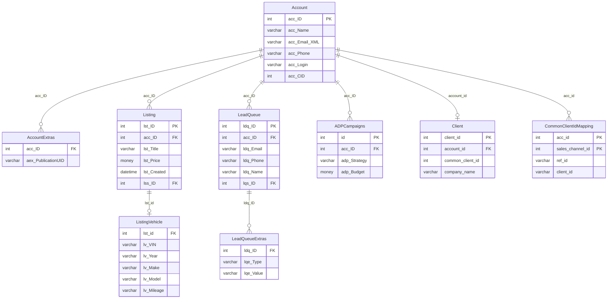

# Megatron — Schema Documentation

> _Status: complete — schema documented 2026-06-21._ Describe only what the schema dump shows; flag inference; cite real object names. See [quality standards](../discovery-guide.md#quality-standards--references).

## Overview

Central advertising and inventory management database. Stores advertiser accounts, vehicle listings, lead queues, campaign data, display banners, outbound feed configurations, and geography lookups. Hub of the DAS platform — most other databases join back to Megatron account or listing IDs.

## Access

- **Owner:** Ron Mulder · **Researcher:** Alicia · **Status:** granted · **Reach:** `20.51.108.231:1433` / SQL Server auth / SSMS or pyodbc
- Cross-ref: [System Access Tracker](/analysis/artifacts/access-tracker/index.html)

## Schema dump

Authoritative DDL: `dumps/megatron.sql` — schema-only, no data. Extracted 2026-06-11 via `INFORMATION_SCHEMA` query (SQL Server megatron). Re-extract from source to refresh.

## Tables

_852 tables total · **438.57 GB total / 417.4 GB used** (full DDL in `dumps/megatron.sql`; ERD shows subset). Row counts from `sys.partitions` 2026-06-14._

| Table | ~Rows | Purpose | PK | CDP-relevant |
|---|---|---|---|---|
| `AccountRole` | 13 | Lookup table of advertiser role types (e.g. individual, business) with active flag and `arl_isBusiness` classification. | `arl_ID` | ✓ |
| `Account` | 2,082,770 | Core advertiser account record: login credentials, contact info (email, phone, address), status, role, source publication, and timestamps. Primary identity anchor for the DAS platform. | `acc_ID` | ✓ |
| `AccountExtras` | 287,363 | Extends `Account` with publication (`pub_ID`), feed edition (`fdUID`, `edID`, `edTag`), and rep assignment (`acc_ID_Rep`) — one row per account-publication combination. | — | ✓ |
| `AccountSecurity` | 23,395 | Maps each account (`acc_ID`) to a security option (`aso_ID`), controlling which features the account can access. | `asc_ID` | ✓ |
| `AccountSecurityOptions` | — | Defines individual security/permission options (`aso_Name`, `aso_Value`) grouped by security group, with sort order and active flag. | `aso_ID` | ✓ |
| `AccountPreference` | 13,829,804 | Stores per-account boolean preference flags keyed by `acc_ID` + `apo_ID`; drives notification and feature opt-in/out behavior. | — | ✓ |
| `ResellerCompany` | 75 | Defines white-label reseller companies with branding, domain, contact info, expiry dates, and active flag. | `rco_ID` | — |
| `ResellerAccounts` | 1,404 | Associates advertiser accounts with reseller companies; tracks admin flag, creator, and active status. | — | ✓ |
| `ActivityLog` | 4,715,732 | SQL Server session-level audit log capturing login, query text, CPU/IO metrics, wait stats, and blocked-session info for DBA monitoring. | `alog_ID` | — |
| `Class` | — | Top-level listing category (e.g. Automotive, Real Estate) with URL slug, display order, feed category name, and homepage-expand flag. | `cls_ID` | — |
| `SubClass` | — | Sub-category under `Class` (e.g. Cars & Trucks under Automotive) with URL-friendly names, ordering, and instant-activation rate region references. | `scl_ID` | — |
| `Source` | — | Publication/site configuration record: site name, URL roots, image paths, email addresses, lead routing settings, and self-serve flag per DAS publication. | `src_ID` | — |
| `ListingStatus` | 28 | Lookup of listing lifecycle states (e.g. active, expired, pending) with active flag and shopping-cart flag. | `lss_ID` | ✓ |
| `Listing` | 7,429,072 | Core listing record: linked to account and publication, holds title, price, description (online + print text), phone, images, status, cost, and timestamps. | `lst_ID` | ✓ |
| `ListingVehicle` | 7,815,857 | Vehicle-specific attributes for a listing: VIN, stock number, year, make, model, trim, mileage, body type, drivetrain, color, fuel, and condition. | — | ✓ |
| `ListingExtras` | 7,405,592 | Links each listing to its feed publication slot (`faUID`, `fdUID`, `faAdnum`, `fdPubID`, `fdEdID`) — the bridge between listings and print/feed editions. | — | ✓ |
| `ListingHistory` | 24,536 | Tracks activation periods for listings: start, end, active flag, and deactivation timestamp — provides listing tenure history. | `lhist_ID` | ✓ |
| `Make` | 498 | Reference table of vehicle makes with associated sub-class ID for category alignment. | `mak_ID` | — |
| `Model` | 3,855 | Reference table of vehicle models linked to make, with associated sub-class ID. | `mod_ID` | — |
| `LeadQueueStatus` | 18 | Lookup of lead lifecycle statuses (e.g. new, sent, rejected) by name. | `lqs_ID` | ✓ |
| `LeadQueue` | 207,367 | Inbound lead records: linked to listing and account, captures submitter name, email, phone, zip, IP, message, ADF-XML payload, and sent timestamp. | `ldq_ID` | ✓ |
| `LeadQueueExtras` | 319,379 | Key-value extension rows for lead queue entries, storing typed extra fields (e.g. VIN, listing URL) via `lqt_ID` + value pairs. | — | ✓ |
| `EmailSources` | — | Defines inbound email lead sources: from-address, subject pattern, lead cost, API key, active flag, and routing/scrub masks. | `ems_ID` | — |
| `EmailObjects` | 976,257 | Raw inbound email objects captured from monitored folders: full from/to/subject/body/header, source classification, and linked lead ID when parsed. | `emo_ID` | — |
| `EmailScrubFinals` | 1,281,030 | Post-scrub lead disposition record: links lead to source, account, listing, reject reasons, lead cost, budget, and running balance by year-month. | `esf_ID` | — |
| `__AllAdEzCampaigns` | — | Denormalized snapshot of all AdEz campaigns with advertiser, sales channel, rep, product type, budget, flight targets, UTM codes, and Facebook/retargeting flags. | `id` | ✓ |
| `_AllFlights` | — | Denormalized flight-level view of all active and historical campaign flights across all platforms: provider, product, advertiser, sales channel, dates, price, impressions, and clicks. | `sf_id` | — |
| `ADPCampaigns` | 12,215 | ADP (Ad Platform) campaign records: linked to Ratchet and subscription IDs, stores provider, budget, bid strategy, ad rotation, geo targets, campaign type, and state. | `id` | ✓ |
| `ADPLocal` | — | ADP local (directory/listing) product record with cost, live status, call tracking, tagline, bullets, social URLs, location details, and Yext flag. | `adl_ID` | — |
| `ADPFeeds` | 9,410 | ADP outbound feed subscription record: linked advertiser/subscription, aggregator, sales channel, pricing, date range, and client/aggregator contact details. | `adf_ID` | ✓ |
| `ADPCreatives` | 40,164 | ADP display creative assets: linked to campaign, stores creative URL, size, landing URL, creative type, template, color, vehicle type, and dynamic ad fields. | `adc_ID` | — |
| `RatchetClient` | — | Ratchet (display ad platform) client record: linked to advertiser account, stores site name, address, email, contact, notes, business type, and geo region. | `rct_ID` | — |
| `RatchetDisplay` | — | Ratchet display campaign record: linked to client, stores campaign name, cost, dates, live status, impression/click targets, bid strategy, and automation flag. | `rds_ID` | — |
| `RatchetDisplayCreative` | — | Ratchet display creative asset: linked to campaign, stores creative URL/banner, display size, start/end dates, landing URL, template, dynamic logo/phone, and algorithm type. | `rdc_ID` | — |
| `Banner` | — | Display banner definition: linked to account and sales rep, stores name, cost, image URL, rollover text, href, schedule dates, hit count, and security option. | `ban_ID` | — |
| `BannerLogTotal` | 429,328 | Daily impression and click totals aggregated per banner (`ban_ID`) and date integer. | `blt_ID` | — |
| `CraigslistBucket` | — | Craigslist regional posting bucket (top-level region): bucket code, name, sub-bucket requirement flag, available slot count, and product ID. | `clb_id` | — |
| `CraigslistSubBucket` | — | Craigslist sub-region bucket linked to a parent bucket: code and description. | `clsb_id` | — |
| `CraigslistPosting` | — | Individual Craigslist posting record: posting ID, creation/expiry dates, manage link, bucket/sub-bucket assignment, and blacklist flag. | `clp_id` | — |
| `CraigslistListing` | — | Maps a Megatron listing to its Craigslist posting ID with posted date, created/last-upload timestamps, and VIN. | `cll_id` | ✓ |
| `FbPageAccess` | — | Records Facebook page access requests per account and product, storing advertiser name, Facebook URL, request date, and access status. | `fpa_ID` | — |
| `CurrentFBPageAccess` | — | Current state of Facebook page access tokens: page ID, name, access token, business manager info, post permission, status, and sync timestamps. | `cfp_ID` | — |
| `fbAutomotiveCatalog_data` | — | Facebook Automotive Catalog feed payload per listing: vehicle ID, VIN, make/model/year, price, images, description, location, availability, dealer info, and VDP URL. | `fac_ID` | — |
| `ZipCode` | 43,198 | ZIP code reference with city, state, lat/lon, default radius, area code, DMA code, Craigslist bucket codes, county name, and time zone. | `zip_Code` | — |
| `State` | — | US state/territory lookup with two-letter ID, name, and `stt_InAmerica` flag. | `sta_ID` | — |
| `GeoDistance` | 219,619 | Named geographic market zones with center lat/lon, radius, type, URL-friendly location slug, and closest ZIP. | — | — |
| `IPLocation` | — | IP geolocation lookup enriched with Megatron GeoDistance data: country, region, city, ZIP, lat/lon, market zone name, and radius. | `ipl_ID` | ✓ |
| `IPBlocks` | 4,826,113 | IP address range-to-location mapping table (start/end IP as integers, `locId` FK to `IPLocation`) used for geo-resolution of visitor IPs. | `ipb_ID` | — |
| `PrintPublications` | — | Print publication configuration: name, pagination paths, notify email recipients (GM/RGM/VP), upload folder/URL, and linked database. | `pub_ID` | — |
| `PrintEditions` | — | Specific print edition within a publication: name, contact info, Endeavor edition ID, and rate region references for instant-activation pricing. | `ped_ID` | — |
| `DBINFO` | — | SQL Server database file metadata snapshot: file ID, name, type, physical path, size, max size, and growth setting. | `file_id` | — |
| `BackupLog` | — | Tracks backup job history: database, backup type (full/diff/log), start/finish times, backup size (compressed and uncompressed), and running status. | `bkl_ID` | — |
| `_AllListings` | — | Denormalized flat listing snapshot used for reporting; not present as `CREATE TABLE` in the schema dump — likely a view or cross-database object (inferred). | — | ✓ |
| `LiveListing` | — | Live/active listing snapshot used by front-end display; not present as `CREATE TABLE` in the schema dump — likely a view or cross-database object (inferred). | `llst_ID` | ✓ |
| `LiveAccount` | — | Live/active account snapshot used by front-end display; not present as `CREATE TABLE` in the schema dump — likely a view or cross-database object (inferred). | `lacc_ID` | ✓ |
| `_LeadQueueDetails` | — | Denormalized lead detail flat table for reporting; not present as `CREATE TABLE` in the schema dump — likely a view or cross-database object (inferred). | — | ✓ |
| `_AllLeadQueue` | — | Denormalized all-leads summary table for reporting; not present as `CREATE TABLE` in the schema dump — likely a view or cross-database object (inferred). | — | ✓ |
| `accountrole_security` | — | Cross-reference of account roles to security options; not present as `CREATE TABLE` in the schema dump — likely a view or cross-database object (inferred). | — | ✓ |
| `_SecurityCheck` | — | Security audit or validation snapshot; not present as `CREATE TABLE` in the schema dump — likely a view or cross-database object (inferred). | — | — |
| `adez_campaigns` | — | AdEz campaign records from the AdEz ad platform; not present as `CREATE TABLE` in the schema dump — likely a view or linked-server object (inferred). | — | ✓ |
| `adez_flights` | — | AdEz flight (delivery period) records; not present as `CREATE TABLE` in the schema dump — likely a view or linked-server object (inferred). | `sf_id` | — |
| `_AllFlights_Merged` | — | Merged flight data across AdEz and ADP sources; not present as `CREATE TABLE` in the schema dump — likely a view or cross-database object (inferred). | `sf_id` | — |
| `_adp_Campaigns_Mapped` | — | ADP campaigns mapped to Megatron accounts for reconciliation; not present as `CREATE TABLE` in the schema dump — likely a view or cross-database object (inferred). | `rcd_ID` | ✓ |
| `_adp_Clients_Mapped` | — | ADP clients mapped to Megatron accounts; not present as `CREATE TABLE` in the schema dump — likely a view or cross-database object (inferred). | `rcc_ID` | — |
| `_adp_Creatives_Mapped` | — | ADP creatives mapped for reconciliation; not present as `CREATE TABLE` in the schema dump — likely a view or cross-database object (inferred). | — | — |
| `AdPlatform_LiveCampaigns` | — | Current live campaigns across ad platforms aggregated for operational reporting; not present as `CREATE TABLE` in the schema dump — likely a view or cross-database object (inferred). | — | ✓ |
| `adez_master_account` | — | AdEz master advertiser account mapping; not present as `CREATE TABLE` in the schema dump — likely a view or linked-server object (inferred). | — | ✓ |
| `adez_master_listing` | — | AdEz master listing mapping; not present as `CREATE TABLE` in the schema dump — likely a view or linked-server object (inferred). | — | ✓ |
| `__SmartVDPListings_v4` | — | Smart VDP (Vehicle Detail Page) listing data used for dynamic ad content; not present as `CREATE TABLE` in the schema dump — likely a view or cross-database object (inferred). | — | ✓ |
| `_OutboundMasterAutos_Data` | — | Outbound auto feed data payload; not present as `CREATE TABLE` in the schema dump — likely a view or cross-database object (inferred). | — | — |
| `fbAutomotiveCatalog_raw_v4` | — | Raw Facebook Automotive Catalog data (v4) before processing; not present as `CREATE TABLE` in the schema dump — likely a view or cross-database object (inferred). | — | — |
| `FacebookCampaignSetup` | — | Facebook campaign setup configuration per advertiser; not present as `CREATE TABLE` in the schema dump — likely a view or cross-database object (inferred). | — | ✓ |
| `cl_Mapped_Available` | — | Craigslist listings available for posting (mapped and slot-available); not present as `CREATE TABLE` in the schema dump — likely a view or cross-database object (inferred). | — | — |
| `cl_Advertisers_Code` | — | Craigslist advertiser code mapping; not present as `CREATE TABLE` in the schema dump — likely a view or cross-database object (inferred). | — | — |
| `BingCatalog` | — | Bing product catalog feed data for automotive listings; not present as `CREATE TABLE` in the schema dump — likely a view or cross-database object (inferred). | — | — |

## Views

No `CREATE VIEW` statements are present in the schema dump (`dumps/megatron.sql`). The dump was extracted schema-only from `INFORMATION_SCHEMA` and captures base tables only.

Several objects listed in the Tables section above (`_AllListings`, `LiveListing`, `LiveAccount`, `_LeadQueueDetails`, `_AllLeadQueue`, `accountrole_security`, `_SecurityCheck`, `adez_*`, `_adp_*`, `AdPlatform_LiveCampaigns`, `__SmartVDPListings_v4`, `FacebookCampaignSetup`, `BingCatalog`, etc.) are not present as `CREATE TABLE` in the dump. These are likely SQL Server views, cross-database synonyms, or linked-server objects — confirm with `SELECT * FROM sys.views` or `sys.synonyms` on the live server.

## Indexes

**670 indexes across 468 tables** — 449 clustered, 221 nonclustered, 0 disabled. Many carry `_dta_index_` prefix (Database Tuning Advisor auto-generated). Full dump: run `scripts/index-definitions.sql`.

CDP-relevant tables:

| Table | Index | Key Columns | Type | Notes |
|---|---|---|---|---|
| `Account` | `PK_Account` | `acc_ID` | CLUSTERED PK | Primary advertiser identity |
| `Account` | `IX_Account_accLogin` | `acc_Login` | NONCLUSTERED | Login lookup |
| `Account` | `Account_acc_Email_XML` | `acc_Email_XML` → incl. `acc_ID` | NONCLUSTERED | **Email match signal for CDP** |
| `Account` | `_dta_…K16` | `acc_Phone` | NONCLUSTERED | **Phone match signal for CDP** |
| `Listing` | `PK_Listing` | `lst_ID` | CLUSTERED PK | |
| `Listing` | `Listing_accid_lstlastupload` | `acc_ID`, `lst_LastUpload` | NONCLUSTERED | Active inventory by account |

## CDP Relevance

Megatron is the **primary identity and inventory source** for the DAS CDP. Key signals:

**Advertiser identity** — `Account` (`acc_ID`, `acc_Email_XML`, `acc_Phone`, `acc_Company`, `acc_Address`, `zip_Code`) is the canonical advertiser PII record. `acc_Email_XML` and `acc_Phone` are the primary email and phone match keys for identity resolution.

**Inventory** — `Listing` + `ListingVehicle` provide the active and historical vehicle inventory universe. `ListingVehicle.veh_vin` is a strong match key for cross-platform vehicle tracking. `ListingStatus` (`lss_ID`) gates which listings are live.

**Leads / demand signals** — `LeadQueue` captures inbound consumer lead events with consumer email (`ldq_FromMail`), phone (`ldq_FromPhone`), name, and ZIP — all high-value CDP signals. `LeadQueueExtras` holds typed key-value supplements (VIN, listing URL, etc.).

**Campaign / ad spend** — `ADPCampaigns` links `acc_ID` to campaign budgets, dates, and product types. `ADPFeeds` records outbound feed subscriptions by advertiser. `__AllAdEzCampaigns` provides a denormalized campaign snapshot across all ad products.

**Geographic enrichment** — `ZipCode` (lat/lon, DMA, Craigslist region), `GeoDistance` (named market zones), and `IPLocation` / `IPBlocks` (IP-to-market resolution) can enrich account and lead records with DMA and market-zone context.

**Reseller / multi-account** — `ResellerAccounts` + `ResellerCompany` identify which accounts belong to white-label reseller groups — important for segmentation and suppression in CDP audiences.

**Client identity mapping** — `CommonClientIdMapping` (`acc_id`, `sales_channel_id`, `ref_id`, `client_id`) and `Client` (`account_id`, `common_client_id`) bridge Megatron accounts to external platform client IDs — critical for cross-database CDP joins.

## Growth

Source: `msdb.dbo.backupset` full-backup history (type D), 2026-05-15 to 2026-06-14 (30 days).

| Metric | Value |
|---|---|
| Start size | 432.97 GB (2026-05-15) |
| End size | 439.59 GB (2026-06-14) |
| Net growth | **+6.62 GB / 30 days** |
| Rate | ~0.22 GB/day · ~6.6 GB/month |

At current rate: **~79 GB/year**. Megatron is the fastest-growing database in the estate. The `Shortener` table (257 GB, 59% of total) dominates but did not show unusual growth in this window. CDP pipelines reading Megatron must account for continuous write pressure.

---

## ERD

Key CDP-relevant entities (852 tables total — subset shown). Full DDL: `dumps/megatron.sql`.

