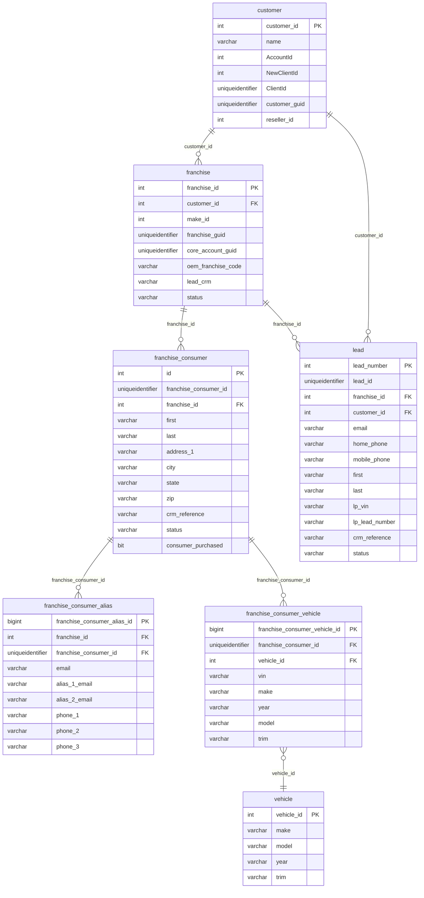

# oltp — Response Logix Production

Lead response automation platform. Receives automotive purchase leads from all major lead providers (AutoTrader, Cars.com, Edmunds, etc.), matches them against known consumers, routes them to dealers, and drives follow-up campaigns (Smart Quote, Smart Follow, Smart Start). The **largest CDP signal source** on the RL Production server.

> **ERD:** `docs/databases/erd/oltp.svg`
> **DDL dump:** `docs/databases/dumps/oltp.sql`

---

## Overview

| Property | Value |
|---|---|
| Server | 20.65.216.199:49577 (RL_MSSQL) |
| SQL Server version | 2012 SP4 Standard (11.0.7512.11) |
| Schemas | 2 — `dbo` (239 tables), `Cleanup` (1 table) |
| Total tables | 240 |
| Views | 75 |
| Stored procedures | 6 (all system diagram procs — no app ETL procs) |
| Total rows (oltp) | ~1.13 billion |
| Total on-disk (oltp) | ~196 GB |
| Universal tenant key | `franchise_id` (INT) — present in all consumer/lead tables |
| PII present | Yes — `franchise_consumer`, `lead`, `smart_quote` (email, phone, name, address, VIN) |
| GLBA-adjacent data | Yes — trade-in data, financing comments, down payment fields in `lead` |

---

## Growth (from `msdb.dbo.backupset` type D)

| Date | Size GB | Delta |
|---|---|---|
| 2026-05-11 | 191.28 | — |
| 2026-05-18 | 192.33 | +1.05 |
| 2026-05-25 | 193.47 | +1.14 |
| 2026-06-01 | 194.72 | +1.25 |
| 2026-06-08 | 195.98 | +1.26 |

**Growth rate: ~+5.8 GB/month** (most active writer on the RL server).

---

## CDP Identity Resolution Significance

This database is **critical for CDP identity resolution**. It contains:

1. **`franchise_consumer`** (51M rows) — deduplicated consumer master per dealer franchise, with `crm_reference` linking back to the dealer's CRM
2. **`franchise_consumer_alias`** (34M rows) — email and phone alias graph per consumer. Each row has `email`, `alias_1_email`, `alias_2_email`, `phone_1`, `phone_2`, `phone_3` — the richest multi-email/multi-phone identity table in the estate
3. **`franchise_consumer_vehicle`** (29M rows) — VIN + consumer association — enables VIN-to-person linkage across all systems
4. **`lead`** (11M rows) — full lead PII including `lp_prospect_id`, `lp_lead_number` (lead provider reference IDs), `crm_reference`

### Tenant join path to DAS
```
franchise_consumer.franchise_id
    → franchise.customer_id
        → customer.AccountId      ← INT (63% populated, range 1–343,543)
        → customer.NewClientId    ← INT (51% populated, range 1,066–44,545) — possible CommonClientID?
        → customer.ClientId       ← UUID (78% populated)
```

**`customer.AccountId`** is partially populated (3,807 of 6,024 customers). Its range (1–343,543) overlaps with DAS Megatron `Account.acc_ID` range — this may be the DAS account linkage. **Needs confirmation with Ron Mulder.**

**`franchise.core_account_guid`** is 24% populated (2,354 of 9,920 franchises) — likely the newer DAS account linking mechanism in progress.

---

## Access status

| Database | Access | Notes |
|---|---|---|
| `oltp` | ✅ Full read | `ConflictAI` has `db_datareader` |
| `oltp_Archive` | ✅ Full read | Archive of historical lead/consumer data |
| `DataOne` | ❌ Blocked | Login fails — DBA must grant access |
| `DBATools` | ⚠️ Accessible | System/DBA utility DB — minimal discovery value |

---

## Tables

_240 tables total · **~196 GB total / ~128.9 GB used** (full DDL in `dumps/oltp.sql`). Row counts from `sys.partitions` 2026-06-14._

### Core Identity Tables

| Table | ~Rows | Purpose | PK | CDP-relevant |
|---|---|---|---|---|
| `customer` | 6,024 | DAS/RL client master — `AccountId` INT (→ DAS account), `NewClientId` INT, `ClientId` UUID | `customer_id` | ✓ |
| `franchise` | 9,920 | Dealer/franchise per make — `customer_id` FK, `core_account_guid` (24% populated), `oem_franchise_code` | `franchise_id` | ✓ |
| `franchise_consumer` | 50,884,746 | Consumer profile per franchise — first, last, address, `crm_reference`, status, purchase flag | `id` (INT) | ✓ |
| `franchise_consumer_alias` | 33,513,653 | Email + phone alias graph — `alias_1_email`, `alias_2_email`, `phone_1/2/3` per consumer UUID | `franchise_consumer_alias_id` | ✓ |
| `franchise_consumer_vehicle` | 29,243,560 | Consumer × vehicle association — VIN, make, year, model per consumer | `franchise_consumer_vehicle_id` | ✓ |
| `franchise_consumer_txn` | 171,960,942 | Consumer transaction audit log — UUID + timestamp per state change | FK: `franchise_consumer_id` | ✓ |

### Lead Tables

| Table | ~Rows | Purpose | PK | CDP-relevant |
|---|---|---|---|---|
| `lead` | 11,148,021 | Inbound lead — full PII (email, phone, address), VIN, lead provider reference IDs, CRM reference | `lead_number` | ✓ |
| `lead_history` | 201,168,573 | Lead state-change history — timestamped lifecycle events per lead | FK: `lead_id` | ✓ |
| `lead_sms_history` | 21,868,434 | SMS communication log per lead | — | ✓ |
| `lead_homenet_sale` | 18,686 | HomeNet sale event linked to lead | — | ✓ |
| `lead_provider` | 488 | Lead provider registry (AutoTrader, Cars.com, etc.) | `lead_provider_id` | ✓ |
| `new_lead_delivery` | 10,455 | Pending/queued new-lead delivery records | — | — |
| `used_lead_delivery` | 10,455 | Pending/queued used-lead delivery records | — | — |

### Smart Quote / Pricing

| Table | ~Rows | Purpose | PK | CDP-relevant |
|---|---|---|---|---|
| `smart_quote` | 25,442,916 | Automated price quote — email, phone, VIN, raw_email content, billability | `smart_quote_id` | ✓ |
| `smart_quote_vehicle` | 42,163,731 | Vehicle(s) offered in smart quote — VIN, make, model, year | `smart_quote_id`+`vehicle_id` | ✓ |
| `franchise_vehicle_pricing_2` | 7,926,760 | Per-franchise vehicle price history v2 | FK: `franchise_id` | ✓ |
| `franchise_inventory_pricing` | 354,318 | Current inventory pricing by franchise | FK: `franchise_id` | ✓ |
| `reactivation` | 4,260,657 | Re-engagement events — consumer re-activated for campaigns | — | ✓ |

### Campaign / Email Automation

| Table | ~Rows | Purpose | PK | CDP-relevant |
|---|---|---|---|---|
| `franchise_campaign_email_template_param` | 8,255,727 | Email template parameter values per campaign | — | — |
| `franchise_email_template_param` | 1,853,571 | Franchise-level email template params | — | — |
| `franchise_smart_follow_v3_schedule` | 346,860 | Smart Follow v3 campaign schedule per franchise | FK: `franchise_id` | ✓ |
| `franchise_campaign_email_template_item` | 345,195 | Email template line items per campaign | — | — |
| `franchise_campaign_email` | 138,249 | Campaign email sends | FK: `franchise_id` | ✓ |
| `franchise_campaign_action` | 138,928 | Campaign action events | FK: `franchise_id` | ✓ |
| `email_template` | 129,576 | Email template master (380 MB — includes raw HTML) | FK: `franchise_id` | — |
| `mailbox` | 19,601,342 | Inbound email receive log (11 GB) | — | ✓ |

### Performance Reports

| Table | ~Rows | Purpose | PK | CDP-relevant |
|---|---|---|---|---|
| `rl_lead_history_report_data` | 39,895,336 | Pre-aggregated lead history report data | — | ✓ |
| `rl_performance_report_data` | 12,275,616 | Pre-aggregated performance report data | — | ✓ |
| `franchise_performance_report` | 1,089,804 | Franchise-level performance metrics | FK: `franchise_id` | ✓ |
| `franchise_smart_facts` | 1,147,405 | Smart Facts analytics data per franchise | FK: `franchise_id` | ✓ |
| `smart_facts_report_data` | 499,872 | Smart Facts report aggregations | FK: `franchise_id` | ✓ |
| `smart_follow_performance_report` | 880,439 | Smart Follow campaign performance | FK: `franchise_id` | ✓ |
| `smart_start_performance_report` | 744,054 | Smart Start campaign performance | FK: `franchise_id` | ✓ |

### Vehicle / Inventory Reference

| Table | ~Rows | Purpose | PK | CDP-relevant |
|---|---|---|---|---|
| `franchise_vehicle` | 2,200,459 | Dealer's active vehicle inventory per franchise | FK: `franchise_id` | ✓ |
| `franchise_vehicle_test` | 1,172,005 | Test/staging vehicle entries | — | — |
| `customer_inventory_calculated` | 1,415,688 | Calculated inventory metrics per customer | FK: `customer_id` | ✓ |
| `vehicle` | 283,317 | Vehicle master — make, model, year, trim | `vehicle_id` | ✓ |
| `vehicle_option` | 3,374,626 | Vehicle option/package catalog | `vehicle_option_id` | — |
| `AIS_VehicleGroups` | 136,605 | AIS vehicle group definitions | — | — |
| `dealer_daily_vehicle` | 153,525 | Daily dealer vehicle snapshot | — | ✓ |

### Transaction / Process Log

| Table | ~Rows | Purpose | PK | CDP-relevant |
|---|---|---|---|---|
| `txn` | 345,282,769 | Transaction UUID registry — every RL interaction creates a txn_id | `txn_id` | — |
| `process_log` | 2,006,664 | Active process log (rolling) | — | — |
| `process_log_20260404T23` … `20260613T23` | ~5M each | Weekly partitioned process logs (10 tables, ~5M rows each) | — | — |
| `cdr` | 3,040,765 | Call detail records (3.4 GB) | — | ✓ |
| `consumer_subscription_history` | 836,754 | Consumer subscription opt-in/out history | — | ✓ |

### Billing

| Table | ~Rows | Purpose | PK | CDP-relevant |
|---|---|---|---|---|
| `customer_billing_group_invoice_detail` | 11,207,194 | Invoice line items per billing group | FK: `franchise_id` | — |
| `customer_billing_group_invoice` | 38,634 | Invoice headers | — | — |
| `customer_billing_group` | 5,739 | Billing group master | — | — |
| `PaymentHistory` | 9,939 | Payment transaction log | — | — |

### Cleanup / Maintenance

| Table | ~Rows | Purpose | PK | CDP-relevant |
|---|---|---|---|---|
| `Cleanup.IndexFragmentation` | 8,840 | DBA index fragmentation scan log | — | — |
| `_FOR_DELETE_*` (7 tables) | 0–22K | Soft-delete staging tables — purge candidates | — | — |
| `ProcsInUse` | 151,808 | Procedure usage monitoring | — | — |
| `AzureStorageWriteData` | 1,236 | Azure Blob write tracking | — | — |
| `AzureStorageWriteJournal` | 2,287 | Azure Blob journal | — | — |

---

## Views (75 total)

All in `dbo` schema. Key views:

| View | Purpose |
|---|---|
| `franchise_consumer_v` | Flattened consumer profile with current alias |
| `lead_history_v` | Lead history with lead context |
| `lead_history_campaign_tracking_v` | Campaign attribution for lead history |
| `franchise_v` | Franchise master with customer join |
| `franchise_campaign_v` | Campaign definition view |
| `franchise_vehicle_inventory` | Current vehicle inventory by franchise |
| `franchise_vehicle_pricing_v` | Current pricing with vehicle data |
| `new_lead_delivery_v` | Pending new-lead delivery queue |
| `used_lead_delivery_v` | Pending used-lead delivery queue |
| `customer_v` | Customer with billing group |
| `franchise_identifier_v` | External ID mapping per franchise (email identifiers) |
| `franchise_identifier_eleadApiPost_v` | eLeads API posting configuration |
| `smart_follow_franchise_v` | Smart Follow settings by franchise |
| `smart_start_franchise_v` | Smart Start settings by franchise |
| `autodata_incentive` | OEM incentive data with regional ccID (Autodata's own class code — not DAS CommonClientID) |

---

## Indexes (key tables)

### `franchise_consumer`
| Index | Type | Columns |
|---|---|---|
| `pk_franchise_consumer` | Clustered | `id` |
| `idx_franchise_consumer_franchise_id` | Non-clustered | `franchise_id` |
| `idx_franchise_consumer_franchise_consumer_id_franchise_rep_id` | Non-clustered | `franchise_consumer_id`, `franchise_rep_id` |
| `idx_franchise_consumer_last_contact_date` | Non-clustered | `franchise_id`, `last_contact_date` |

### `franchise_consumer_alias`
| Index | Type | Columns |
|---|---|---|
| `pk_franchise_consumer_alias` | Clustered | `franchise_consumer_alias_id` |
| `ak_…_franchise_id_email` | Unique non-clustered | `franchise_id`, `email` |
| `ak_…_franchise_consumer_id_email` | Unique non-clustered | `franchise_consumer_id`, `email` |
| `idx_…_alias_1_email` | Non-clustered | `alias_1_email` |
| `idx_…_alias_2_email` | Non-clustered | `alias_2_email` |

### `lead`
| Index | Type | Columns |
|---|---|---|
| `PK_lead_tbl` | Clustered | `lead_number` |
| `ix_lead_email` | Non-clustered | `email` |
| `ix_lead_franchise_id` | Non-clustered | `franchise_id`, `lead_date` |
| `ix_lead_first` / `ix_lead_last` | Non-clustered | `first` / `last` |
| `IX_lead_lp_lead_number` | Non-clustered | `lp_lead_number` |

---

## oltp_Archive

Separate database on the same server — historical archive of high-volume tables removed from `oltp`.

| Table | ~Rows | Size MB |
|---|---|---|
| `lead_history` | 1,026,853,836 | 82,802 |
| `franchise_consumer_txn` | 422,483,667 | 23,813 |
| `franchise_consumer_txn_old` | 209,347,512 | 14,233 |
| `lead` | 178,456,719 | 64,016 |
| `smart_quote` | 66,399,672 | 19,860 |
| `lead_additional_info` | 2,401,500 | 675 |
| `ChatStatistics` | 778,263 | 58 |
| `franchise` | 5,301 | 2 |

**Total archive: ~205 GB, ~1.9 billion rows.** Growing +0.44 GB/month (stable — periodic bulk move from `oltp`).

Archive contains the same `franchise_id` / `franchise_consumer_id` / `lead_id` keys as `oltp`. Historical leads (178M) and consumer transactions (422M) in archive are relevant for long-term identity resolution and churn/re-engagement analysis.

---

## CommonClientID coverage

| Column | Table | Status |
|---|---|---|
| `franchise_id` | All franchise/consumer/lead tables | **Present — RL's tenant key** (NOT the same as DAS CommonClientID) |
| `customer.AccountId` | `customer` | **63% populated** — INT, range 1–343,543. Possible link to DAS Account/billing system. Unconfirmed. |
| `customer.NewClientId` | `customer` | **51% populated** — INT, range 1,066–44,545. Possible CommonClientID link. Unconfirmed. |
| `customer.ClientId` | `customer` | **78% populated** — UUID. Possible DAS system GUID. Unconfirmed. |
| `franchise.core_account_guid` | `franchise` | **24% populated** — UUID. Actively being filled in but incomplete. |

**CommonClientID is NOT present** in `oltp` by that name. The join path to DAS is via `customer.AccountId` / `customer.NewClientId` — values pending confirmation with Ron Mulder or DAS engineering.

---

## ERD



---

## Open questions

_Phase-1 ingestion / join-validation questions and parked access items — not active Phase-0 asks (the broad access phase closed 2026-06-12)._

1. **`customer.AccountId`** — does this equal `Megatron.Account.acc_ID`? If yes, RL consumer profiles are joinable to the DAS account/dealer master without probabilistic matching. Phase-1 join validation (not a Phase-0 blocker).
2. **`customer.NewClientId`** — is this the `CommonClientID`? Range (1K–44K) is plausible for the newer CCID system. Same Phase-1 join validation. (CCID is non-functional today — audit 2026-06-14 — so probabilistic matching is primary.)
3. **`franchise.core_account_guid`** — what is the source of this GUID? Is this the DAS core platform account UUID? Only 24% filled — migration in progress?
4. **`DataOne`** — parked: access-blocked and not required for Phase 0 (CDP ingests original sources; see the access tracker). If a targeted Phase-1 need arises, the grant is `USE DataOne; CREATE USER ConflictAI FOR LOGIN ConflictAI; EXEC sp_addrolemember 'db_datareader', 'ConflictAI';`
5. **What writes to `oltp`?** No stored procedures found (only system diagram procs). The write path is unclear — likely a .NET/Java application layer via JDBC/ADO.NET. ETL from RL into DWRPT_AI/DataStaging is via the SSIS `LVData` and `MLdata` schemas.
6. **`lead_history` partitioning strategy** — `lead_history` in `oltp` (201M rows) vs `oltp_Archive.lead_history` (1B rows). What triggers the move? Weekly/monthly job?
7. **`process_log_YYYYMMDDTNN` tables** — 10 weekly partitioned tables, ~5M rows each. Purpose of the process logging? What process runs nightly?

> Assigned to: Alicia Salazar · Escalate to Ron Mulder at next sync.
