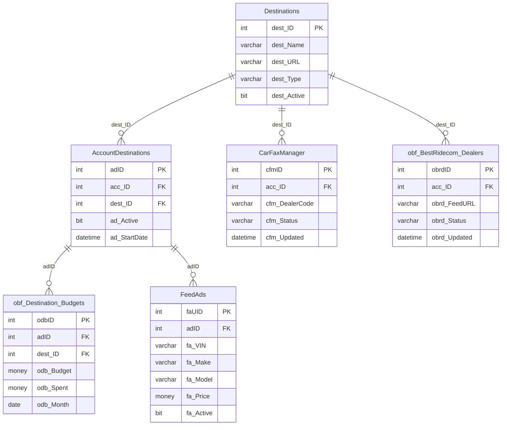

# OutboundFeeds — Schema Documentation

> _Status: complete — schema documented 2026-06-21._ Describe only what the schema dump shows; flag inference; cite real object names. See [quality standards](../discovery-guide.md#quality-standards--references).

## Overview

Outbound automotive feed distribution database. Manages account-level destination routing and per-partner ad/dealer snapshot tables for ~80 downstream feed partners (Cars.com, AutoTrader, TrueCar, Facebook, etc.). Each partner has an `obf_[Partner]_Ads` and `obf_[Partner]_Dealers` table.

## Access

- **Owner:** Ron Mulder · **Researcher:** Alicia · **Status:** granted · **Reach:** `20.51.108.231:1433` / SQL Server auth / SSMS or pyodbc
- Cross-ref: [System Access Tracker](/analysis/artifacts/access-tracker/index.html)

## Schema dump

Authoritative DDL: `dumps/outbound-feeds.sql` — schema-only, no data. Extracted 2026-06-11 via `INFORMATION_SCHEMA` query (SQL Server outbound-feeds). Re-extract from source to refresh.

## Tables

_165 tables total · **7.57 GB total / 7.55 GB used** (full DDL in `dumps/outbound-feeds.sql`; ERD shows subset). Row counts from `sys.partitions` 2026-06-14._

| Table | ~Rows | Purpose | PK | CDP-relevant |
|---|---|---|---|---|
| `Destinations` | 69 | Registry of ~69 downstream feed destinations (name, FTP endpoint, credentials, active flag) — the master partner list. | `dst_ID` | — |
| `DestinationSources` | 0 | Maps destinations to source systems (`dst_ID` → `src_ID`); currently empty (inferred: provisioned but unused or deprecated). | `dsr_ID` | — |
| `DestinationXLate` | 976 | Translation/mapping table that resolves feed destination and classifier IDs to display names (`dxl_Name`); used to normalize partner-specific field values. | — | — |
| `AccountDestinations` | 85,584 | Core routing table: links each dealer account (`fd_UID`, `acc_ID`) to a feed destination with bid, budget, radius, cap, and active/date range — the per-account feed enrollment record. | `acd_ID` | ✓ |
| `obf_Destination_Budgets` | 15,511,902 | Daily/monthly budget snapshot per account-destination combination, capturing bid, budget, and radius at time of export; the largest table (15.5 M rows) — (inferred) truncated and reloaded each run. | — | — |
| `Web__OBF_LatestRecord` | — | Snapshot of the most recent outbound feed record per feed-destination slot, including active flag, dealer bid, budget, cap, and modification timestamp; (inferred) populated from the web application layer. | — | — |
| `PlatformAuto_ExportSummary` | — | Per-account export quality summary for the PlatformAuto destination: live listing count, sent count, VDP sent count, percent sent, and problem flag. | `exs_ID` | — |
| `OutboundLog` | 45,859 | General-purpose step-level log for the outbound feed pipeline, recording timestamp, step name, and description for each processing event. | `obl_ID` | — |
| `FTP_Log` | 166,746 | Logs each FTP file transfer (source path, filename, server, credentials, direction `InOrOut`, and command) for audit and troubleshooting. | `ftpID` | — |
| `ZipSize` | — | Records metadata about feed zip archives (file path, zip path, creation time, file size in bytes) — (inferred) used to monitor feed package sizes. | `zsID` | — |
| `CarFaxManager` | 1,765 | Tracks outbound CarFax file exchanges: records the outbound filename and sent timestamp alongside the inbound response filename and received timestamp. | `cfm_ID` | — |
| `ibf_CarFax` | — | Inbound CarFax data staging table: VIN, account ID, free-expiration date, and one-owner flag — (inferred) loaded from CarFax response files. | — | — |
| `ibf_CarFax_LastRun` | — | Holds the CarFax inbound payload from the previous run (same schema as `ibf_CarFax`) — (inferred) used to detect changes between runs. | — | — |
| `obf_CarFax_Data` | 464,287 | Outbound CarFax export table: links account and listing IDs to VIN and serialized Account/Listing XML blobs with creation timestamp. | — | — |
| `obf_BestRidecom_Dealers` | 1,029 | Dealer snapshot for BestRide.com feed: export ID, dealer ID, name, address, geo-coordinates, and featured/premium flags. | `exportID` | ✓ |
| `obf_BestRidecom_Ads` | 316,740 | Vehicle listing snapshot for BestRide.com feed: full inventory detail including stock, VIN, year/make/model/trim, pricing (price, MSRP, invoice), condition, specs, images, and VDP URL. | — | — |
| `OBF_BRcom_Dealers_Lookup` | — | Lookup/enrichment table for BestRide.com dealer mapping: export ID, feed dealer ID, account ID, dealer name, feed UID, and featured/premium/geo flags. | — | ✓ |
| `obf_BRcomFree_ads` | — | Vehicle listing snapshot for the free-tier BestRide.com feed; same schema as `obf_BestRidecom_Ads` minus the VDP tier field. | — | — |
| `obf_BRcomFree_dealers` | — | Dealer snapshot for the free-tier BestRide.com feed: export ID, dealer ID, name, address, contact, and URL. | `exportID` | ✓ |
| `obf_LotVantage_Dealers` | — | Dealer snapshot for LotVantage feed: dealer ID, name, address, contact info, and URL. | `dlrid` | ✓ |
| `obf_LotVantage_Ads` | — | Vehicle listing snapshot for LotVantage feed: full inventory detail with LotVantage-specific fields (`LVProduct`, `adid`) plus VDP URL and image list. | — | — |
| `obf_LotVantage_CrawlData` | 752,760 | Crawl-sourced vehicle data for LotVantage: dealer domain, VIN, stock number, vehicle URL, full specs, images, and description — (inferred) populated by a web crawler rather than a direct data export. | — | — |
| `obf_VastFree_Dealers` | 706 | Dealer snapshot for the Vast free feed: dealer ID, name, address, contact, and URL. | `dlrID` | ✓ |
| `obf_VastFree_Ads` | 253,310 | Vehicle listing snapshot for the Vast free feed: dealer ID, VIN, year/make/model, title, URL, image URL, price, expiry, description, category, zip, and lead flag. | — | — |
| `obf_PlatformAuto_Dealers` | 305 | Dealer snapshot for PlatformAuto feed: dealer ID, name, address, contact, and URL. | `dlrID` | ✓ |
| `obf_PlatformAuto_Ads` | 79,953 | Vehicle listing snapshot for PlatformAuto feed: standard inventory fields plus dealer logo, VDP URL, a binary hash for change detection (`Hash_1`), and record type. | — | — |
| `obf_PlatformAuto_Ads_Hash` | — | Hash record for each PlatformAuto ad row: stores max-length hashed values of every field alongside `Hash_1` VARBINARY — (inferred) used to detect changes between export cycles. | — | — |
| `obf_Criteo_Vehicles` | 164,827 | Criteo retargeting feed: VIN, year, make, model, sub-model, price, VDP URL, and image list — a minimal vehicle snapshot for ad retargeting. | — | — |
| `obf_ResponseLogix_Data` | — | Vehicle inventory export for ResponseLogix partner: full Auction123-format inventory detail including multiple price fields, certification, video, VDP URL, export ID, and aggregator tag. | — | — |
| `Dw_ResponseLogix` | — | Lightweight data-warehouse summary for ResponseLogix: dealer ID and inventory count (`invcount`) — (inferred) used for reporting or monitoring. | `ID` | — |
| `obf_ResponsePath_Data` | — | Vehicle inventory export for ResponsePath partner: same schema as `obf_ResponseLogix_Data` — full Auction123-format detail with export ID and aggregator tag. | — | — |
| `Dw_ResponsePath` | — | Lightweight data-warehouse summary for ResponsePath: dealer ID and inventory count — (inferred) used for reporting or monitoring. | `ID` | — |
| `obf_CraigsListLV_Dealers` | — | Dealer snapshot for the LotVantage-routed Craigslist feed: dealer ID, name, address, contact, and URL. | `dlrid` | ✓ |
| `obf_CraigsListLV_Ads` | — | Vehicle listing snapshot for the LotVantage-routed Craigslist feed: includes inline dealer info, full vehicle specs, image list, VDP URL, ad ID, and `LVProduct` field. | — | — |
| `obf_CraigsListDT_Dealers` | — | Dealer snapshot for the DetroitTrading-routed Craigslist feed: dealer ID, name, address, contact, bid amount, and brand. | `dlrID` | ✓ |
| `obf_CraigsListDT_Ads` | — | Vehicle listing snapshot for the DetroitTrading-routed Craigslist feed: standard inventory fields plus ad detail URL and stock number. | — | — |
| `obf_TapClassifieds_Dealers` | — | Dealer snapshot for TapClassifieds feed: dealer ID, name, address, contact, and URL. | `dlrID` | ✓ |
| `obf_TapClassifieds_Ads` | — | Vehicle listing snapshot for TapClassifieds feed: combines inline dealer info with full vehicle specs, images, and VDP URL in a single flat record. | — | — |
| `obf_Web2Carz_Free_Ads` | 223,826 | Vehicle listing snapshot for the Web2Carz free feed: standard inventory fields in uppercase column naming convention, including promotional text and photo URLs. | — | — |
| `obf_FeedHub_CrawlData` | — | Crawl-sourced vehicle data for FeedHub: dealer domain, VIN, stock number, vehicle URL, full specs, images, description, and MSRP — (inferred) populated by a web crawler. | — | ✓ |
| `BKUPSettings` | — | Backup configuration: database name, backup retention count, backup file path, and FTP credentials for off-site backup storage. | `dbID` | — |
| `BKUPSteps` | — | Ordered list of named backup steps (step ID, name, order) used by the local backup framework. | `stpID` | — |
| `BKUPHistory` | — | Backup run history: records start/end time and raw/compressed file sizes for each backup step execution. | `hstID` | — |
| `BKUPLog` | — | Audit log of backup step start times, linked to step ID. | `bulID` | — |
| `DBINFO` | — | SQL Server database file metadata snapshot: file ID, logical name, type, physical path, size, max size, and growth setting. | `file_id` | — |
| `CoreLog` | — | Command audit log: records SQL commands (`coreCMD`) and execution timestamps — (inferred) used to audit or replay administrative operations. | `coreID` | — |
| `AllScheduledJobsOnServer` | — | Snapshot of all SQL Server Agent job schedules on the server: job name, enabled flag, schedule, frequency, step name, database, command, and retry settings — (inferred) materialized for reporting. | — | — |
| `Tables_Sizes` | — | Snapshot of table sizes: row count, data space, index space, total size, percent of database, and created/modified dates per table — (inferred) populated by a recurring size-tracking job. | `rec_id` | — |
| `_AccountDestinations_Latests` | — | (Not in DDL dump — inferred view or derived table) Latest active account-destination records; likely a filtered or aggregated projection of `AccountDestinations`. | — | ✓ |
| `BKUPLog_Joined` | — | (Not in DDL dump — inferred view) Joined view of backup log records, likely combining `BKUPLog`, `BKUPSteps`, and `BKUPSettings` for readability. | — | — |
| `FTPProcessTime` | — | (Not in DDL dump — inferred view or derived table) FTP processing duration metrics — likely derived from `FTP_Log` timestamps. | — | — |
| `ibf_CarFax_Joined` | — | (Not in DDL dump — inferred view) Joined CarFax inbound data, likely combining `ibf_CarFax` and `ibf_CarFax_LastRun` for comparison. | — | — |
| `obf_PlatformAuto_Ads_NoNew` | — | (Not in DDL dump — inferred view or derived table) PlatformAuto ads filtered to exclude newly added records — (inferred) used to isolate changed/existing inventory during delta processing. | — | — |
| `PlatformAuto_Usable` | — | (Not in DDL dump — inferred view or derived table) Filtered subset of PlatformAuto accounts or ads deemed usable/eligible for export. | — | — |
| `ZipSize_View` | — | (Not in DDL dump — inferred view) Readable projection of `ZipSize` with human-friendly size formatting or joined path info. | — | — |
| `JobHistory` | — | (Not in DDL dump — inferred view) SQL Server Agent job history summary — (inferred) a convenience projection of `msdb.dbo.sysjobhistory` for local reporting. | — | — |

## Views

No `CREATE VIEW` statements are present in `dumps/outbound-feeds.sql`. The objects listed as views in the Tables section (`_AccountDestinations_Latests`, `BKUPLog_Joined`, `FTPProcessTime`, `ibf_CarFax_Joined`, `obf_PlatformAuto_Ads_NoNew`, `PlatformAuto_Usable`, `ZipSize_View`, `JobHistory`) were not captured in the schema-only DDL extract. Re-extract with `INFORMATION_SCHEMA.VIEWS` or `sys.views` to get view definitions.

## Indexes

**20 indexes across 15 tables** — 14 clustered, 6 nonclustered, 0 disabled. Full dump: run `scripts/index-definitions.sql`.

| Table | Index | Key Columns | Type | Notes |
|---|---|---|---|---|
| `AccountDestinations` | `PK_AccountDestinations_1` | `acd_ID` | CLUSTERED PK | |
| `AccountDestinations` | `IX_…fd_UID_dst_ID_unique` | `fd_UID, dst_ID` | NONCLUSTERED UNIQUE | |
| `AccountDestinations` | `AccountDestinations_c_dst_ID_acc_ID_…` | `dst_ID, acc_ID, acd_Start` → incl. `acd_End` | NONCLUSTERED | Active destinations by account |
| `AccountDestinations` | `AccountDestinations_dstID_acdActive` | `dst_ID, acd_Active` → incl. `fd_UID, acd_Radius, acd_Budget, acd_Bid` | NONCLUSTERED | Active destination lookup with budget |
| `CarFaxManager` | `PK_CarFaxManager` | `cfm_ID` | CLUSTERED PK | |

## CDP Relevance

OutboundFeeds is the **distribution layer** of the DAS CDP. It is where per-account inventory reach decisions (which partner, what bid, what budget, what radius) are enacted. Key tables and columns for CDP work:

| Table | Key Columns | CDP Signal |
|---|---|---|
| `AccountDestinations` | `fd_UID`, `acc_ID`, `dst_ID`, `acd_Budget`, `acd_Bid`, `acd_Radius`, `acd_Cap`, `acd_Active`, `acd_Start`, `acd_End` | Core enrollment record: which dealer is active on which destination, at what spend parameters and radius. Join `fd_UID` → account system, `dst_ID` → `Destinations` for partner name. |
| `Destinations` | `dst_ID`, `dst_Name`, `dst_Active` | Canonical partner list (69 rows). `dst_Name` is the human-readable partner name used in all CDP reporting labels. |
| `obf_Destination_Budgets` | `_accid`, `_fduid`, `_name`, `dst_ID`, `dst_name`, `acd_bid`, `acd_budget`, `acd_radius`, `captured` | Time-series budget snapshot: the only table with a `captured` timestamp enabling historical budget/bid analysis per dealer-destination pair. |
| `Web__OBF_LatestRecord` | `FDUID`, `DESTID`, `ACTIVE`, `DEALERBID`, `DEALERBUDGET`, `DEALERRANGE`, `DEALERCAP`, `INSERTDATE`, `MODIFYDATE` | Current-state feed enrollment as seen by the web app; useful for cross-checking `AccountDestinations` in real time. |
| `obf_BestRidecom_Dealers` / `obf_VastFree_Dealers` / `obf_PlatformAuto_Dealers` / `obf_LotVantage_Dealers` / `obf_CraigsListLV_Dealers` / `obf_CraigsListDT_Dealers` / `obf_BRcomFree_dealers` / `obf_TapClassifieds_Dealers` | `dlrID` / `dlrid`, `dlrName`, `dlrZip`, `dlrPhone`, `dlrEmail` | Dealer identity as reported to each partner. `dlrID` is the DAS feed dealer ID — join to account system via `fd_UID` / `acc_ID`. These tables confirm which dealers are actively exporting inventory to each destination. |
| `OBF_BRcom_Dealers_Lookup` | `exportID`, `fdid`, `acc_id`, `fduid`, `featured`, `premium`, `lat`, `long` | Enrichment: maps BestRide.com export IDs back to DAS account IDs with featured/premium tier and geo-coordinates. |
| `obf_FeedHub_CrawlData` | `domain`, `cil_id`, `veh_vin`, `veh_price`, `veh_url`, `veh_status` | Crawl-sourced inventory data from dealer websites — distinct from DMS-sourced data; useful for data-quality and coverage gap analysis. |
| `_AccountDestinations_Latests` | — | (Inferred view) Latest active routing state per account; likely the most convenient CDP join point for current enrollment. |
| `PlatformAuto_ExportSummary` | `acc_ID`, `lst_LiveCount`, `lst_SentCount`, `lst_PercSent`, `isProblem`, `Aggregator` | Per-account export health for PlatformAuto: percent of live inventory actually sent — useful for feed-health monitoring and identifying accounts with delivery gaps. |

## Growth

Source: `msdb.dbo.backupset` full-backup history (type D), 2026-05-17 to 2026-06-14 (28 days).

| Metric | Value |
|---|---|
| Start size | 7.61 GB (2026-05-17) |
| End size | 7.61 GB (2026-06-14) |
| Net growth | **0.00 GB** |
| Rate | Static — no measurable growth |

OutboundFeeds is stable. The `obf_Destination_Budgets` table (15.5M rows) is the dominant table; its size held flat, suggesting it is truncated and reloaded rather than append-only.

---

## ERD

Key entities (feed routing / budget management). Full DDL: `dumps/outbound-feeds.sql`.

