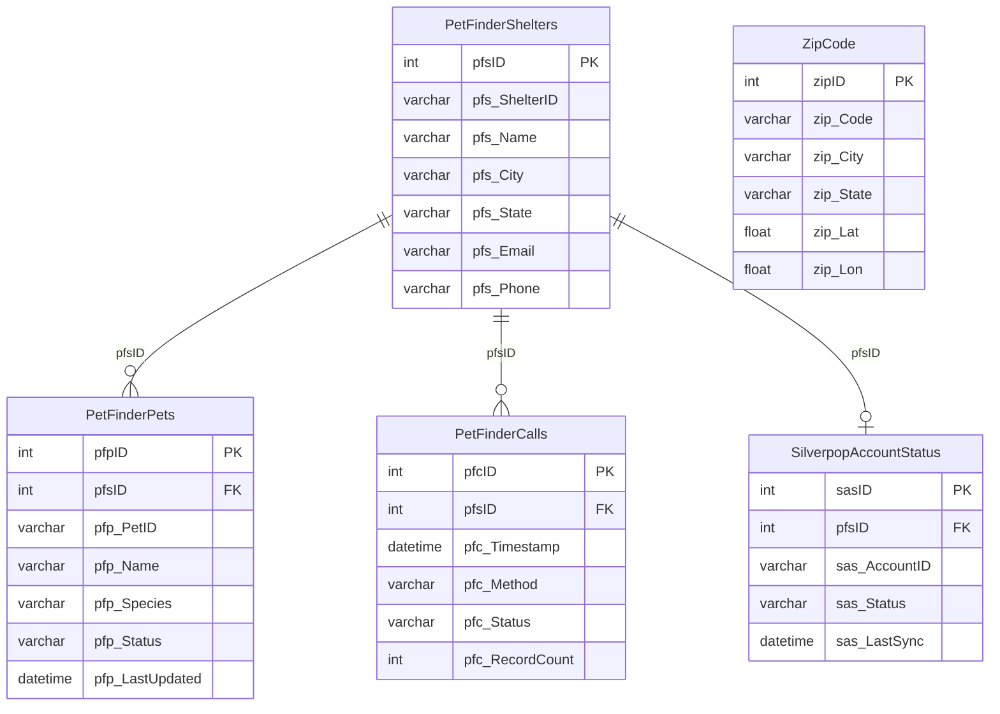

# PetFinder — Schema Documentation

> _Status: complete — schema documented 2026-06-21._ Describe only what the schema dump shows; flag inference; cite real object names. See [quality standards](../discovery-guide.md#quality-standards--references).

## Overview

Pet listing integration database. Syncs shelters, pets, and call/response data from the PetFinder API. Also contains Silverpop email marketing opt-in/opt-out status and URL logging utilities.

## Access

- **Owner:** Ron Mulder · **Researcher:** Alicia · **Status:** granted · **Reach:** `20.51.108.231:1433` / SQL Server auth / SSMS or pyodbc
- Cross-ref: [System Access Tracker](/analysis/artifacts/access-tracker/index.html)

## Schema dump

Authoritative DDL: `dumps/petfinder.sql` — schema-only, no data. Extracted 2026-06-11 via `INFORMATION_SCHEMA` query (SQL Server petfinder). Re-extract from source to refresh.

## Tables

_24 tables total · **0.04 GB total / 0.04 GB used** (full DDL in `dumps/petfinder.sql`; ERD shows subset). Row counts from `sys.partitions` 2026-06-14._

| Table | ~Rows | Purpose | PK | CDP-relevant |
|---|---|---|---|---|
| `PetFinderCalls` | 408 | Configuration table defining PetFinder API call parameters: shelter name, zip code, result count, and active flag. | `pfc_ID` | — |
| `PetFinderShelters` | 883 | Animal shelter registry pulled from the PetFinder API, including name, address, phone, and email per shelter. | `pfs_ID` | — |
| `PetFinderPets` | 15,734 | Individual pet listings retrieved from PetFinder, including species, breed, age, sex, size, highlights, description, and images. | `pfp_ID` | — |
| `ZipCode` | 42,890 | Reference table mapping US zip codes to city, state, latitude, longitude, search radius, and area code. | `zip_Code` | — |
| `ZipCodeRequestCount` | 90,224 | Log of PetFinder API request counts by zip code and call name, with timestamp, for monitoring API usage. | — | — |
| `SilverpopAccountStatus` | 107,872 | Silverpop (email platform) opt-in/opt-out status per user account, with opt-in date, opt-out date, and detail fields. | `sas_ID` | ✓ |
| `SilverpopMailQueueStatus` | 6,043 | Tracks the send status of individual emails in the Silverpop mail queue, linking account, mail queue entry, and recipient ID. | `sms_ID` | — |
| `SilverpopUpdateStatus` | — | Records Silverpop update file processing status, including file path, processing date, and processed count. | `sus_ID` | — |
| `_SilverPop_temp` | — | Staging/temp table for Silverpop contact data including opt-in/out details, account info, ad category flags (Cars, Pets, RealEstate, etc.), and zip code — likely used during sync exports. | — | ✓ |
| `URLResponseLog` | 128 | Log of outbound HTTP requests with URL, posted data, and raw response, used for debugging external API calls. | `rsp_ID` | — |
| `URLResponse` | — | Scratch table storing a single raw HTTP response payload (VARCHAR MAX); likely a work table for ad-hoc API calls. | — | — |
| `GetJobURLResponse` | 108 | Stores URL and response text per job-URL fetch operation, with timestamp. | `jurID` | — |
| `CerritosResponse` | — | Scratch table storing a single raw response from the Cerritos integration (inferred; single VARCHAR MAX column). | — | — |
| `ibf_EpicMotorSports_Data` | — | Scratch table storing a raw data payload from the ibf EpicMotorSports feed (inferred; single VARCHAR MAX column). | — | — |
| `URLEncodeNumbers` | 8,000 | Lookup table of integers (1–8000, inferred) used for URL encoding operations — a number-series utility table. | `Num` | — |
| `BKUPSettings` | — | Configuration for the database backup job: target database, retention count, local path, and FTP credentials. | `dbID` | — |
| `BKUPSteps` | — | Defines ordered steps in the backup process (step ID, name, and execution order). | `stpID` | — |
| `BKUPHistory` | — | Records backup run history per step, including start/end timestamps and backup/zip file sizes. | `hstID` | — |
| `BKUPLog` | — | Lightweight log of backup job starts, linking to step ID with a timestamp. | `bulID` | — |
| `DBINFO` | — | SQL Server database file metadata (name, type, physical path, size, growth) captured from `sys.database_files`. | `file_id` | — |
| `CoreLog` | — | Operational command log recording executed commands and their timestamps (inferred application-level audit log). | `coreID` | — |
| `AllScheduledJobsOnServer` | — | Snapshot of all SQL Server Agent jobs on the server, including schedule, frequency, step commands, and retry settings. | — | — |
| `ZipCodeAdcount` | — | No DDL in dump — name suggests per-zip ad count aggregates (inferred view or missing table). | — | — |
| `BKUPLog_Joined` | — | No DDL in dump — likely a view joining `BKUPLog` and `BKUPHistory` for reporting (inferred). | — | — |
| `JobHistory` | — | No DDL in dump — likely a view or table capturing SQL Server Agent job run history (inferred). | — | — |
| `sysdiagrams` | — | System table used by SQL Server Management Studio to store ER diagram definitions. | `diagram_id` | — |
| `IntMaxes` | — | Utility table recording the maximum integer value currently in use per table/column, for ID generation or validation. | — | — |

## Indexes

**15 indexes across 13 tables** — 13 clustered, 2 nonclustered, 0 disabled. Minimal structure; nearly all PKs. Full dump: run `scripts/index-definitions.sql`.

| Table | Index | Key Columns | Type | Notes |
|---|---|---|---|---|
| `GetJobURLResponse` | `PK_GetJobURLResponse` | `jurID` | CLUSTERED PK | |
| `PetFinderCalls` | `PK_PetFinderCalls` | `pfc_ID` | CLUSTERED PK | |
| `PetFinderCalls` | `IX_PetFinderCalls` | `pfc_ZipCode` | NONCLUSTERED UNIQUE | Zip lookup |
| `PetFinderPets` | `PK_PetFinderPets` | `pfp_ID` | CLUSTERED PK | |
| `PetFinderShelters` | `PK_PetFinderShelters` | `pfs_ID` | CLUSTERED PK | |
| `URLEncodeNumbers` | `PKC__URLEncodeNumbers__Num` | `Num` | CLUSTERED PK | |
| `URLResponseLog` | `PK_URLResponseLog` | `rsp_ID` | CLUSTERED PK | |
| `ZipCode` | `PK_ZipCode` | `zip_Code` | CLUSTERED PK | |

## Views

No `CREATE VIEW` statements present in `dumps/petfinder.sql`. Tables `ZipCodeAdcount`, `BKUPLog_Joined`, and `JobHistory` appear in the row-count snapshot but have no DDL — they may be views whose definitions were not captured. Re-extract with `sp_helptext` or `sys.sql_modules` to confirm.

## ERD

Key entities (pet listing and shelter integration). Full DDL: `dumps/petfinder.sql`.

## CDP relevance

- **`SilverpopAccountStatus`**: `acc_ID`, `acc_Email`, opt-in/opt-out dates and status — directly usable for email consent state in CDP.
- **`_SilverPop_temp`**: Staging contact export with `acc_id`, `acc_email_string`, `acc_firstname`, `acc_lastname`, `zip_code`, opt-in/out fields, and per-category ad interest flags (Cars, Pets, RealEstate, Services, etc.) — rich behavioral segmentation signal.
- **`SilverpopMailQueueStatus`**: Links `acc_ID` to mail queue entries and Silverpop `recipient_ID` — useful for cross-referencing email send history against account identity.
- **`ZipCode`**: Lat/lon per zip — useful for geo-enrichment of contact records that carry zip codes.
- All other tables are operational/infrastructure (PetFinder feed sync, backup, logging) with no direct CDP value.

## Open questions

- `ZipCodeAdcount`, `BKUPLog_Joined`, `JobHistory` have no DDL — confirm whether views, synonyms, or tables missing from dump.
- `_SilverPop_temp` category flags (Cars, Pets, RealEstate, etc.) — confirm whether populated from account ad activity or self-reported preference.
- Relationship between `SilverpopAccountStatus.acc_ID` and Megatron's `acc_id` — confirm shared identity namespace.
