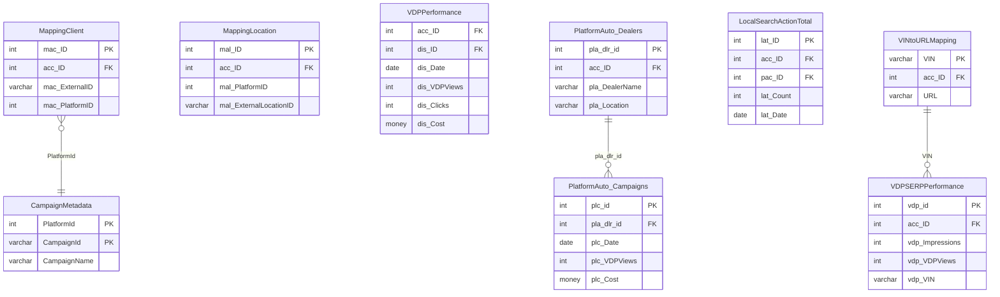

# Prime — Schema Documentation

> _Status: complete — schema documented 2026-06-21._ Describe only what the schema dump shows; flag inference; cite real object names. See [quality standards](../discovery-guide.md#quality-standards--references).

## Overview

Performance advertising and analytics database. Stores campaign-level and dealer-level performance metrics (VDP views, SRP impressions, clicks, leads) from multiple advertising platforms (AutoTrader, Cars.com, CarGurus, etc.), as well as display geo data, platform mapping, and Yext location management.

## Access

- **Owner:** Ron Mulder · **Researcher:** Alicia · **Status:** granted · **Reach:** `20.51.108.231:1433` / SQL Server auth / SSMS or pyodbc
- Cross-ref: [System Access Tracker](/analysis/artifacts/access-tracker/index.html)

## Schema dump

Authoritative DDL: `dumps/prime.sql` — schema-only, no data. Extracted 2026-06-11 via `INFORMATION_SCHEMA` query (SQL Server prime). Re-extract from source to refresh.

## Tables

_141 tables total · **67.48 GB total / 64.19 GB used** (full DDL in `dumps/prime.sql`; ERD shows subset). Row counts from `sys.partitions` 2026-06-14._

| Table | ~Rows | Purpose | PK | CDP-relevant |
|---|---|---|---|---|
| `DataSource` | — | Registry of advertising data sources (platforms/partners) with API credentials, auth type, and active/lag configuration. | `dsr_ID` | — |
| `DataSourceType` | — | Lookup: classifies data source types by name (e.g. display, local search). | `dsr_TypeId` | — |
| `DataSourceAuthenticationType` | — | Lookup: enumerates authentication methods (e.g. API key, OAuth) used by data sources. | `dsa_Id` | — |
| `Partner` | — | Lookup: named advertising partner entities referenced by data sources. | `pnr_ID` | — |
| `ImportLog` | 10,639 | Tracks each data-import job: source, status, date range, file name, and account; audit trail for all ingestion runs. | `iml_ID` | — |
| `ImportStatus` | — | Lookup: named statuses for import jobs (e.g. pending, complete, failed) with sort order. | `ims_ID` | — |
| `PerformanceReportingMaximumDate` | 1 | Stores the most recent reportable date per data source; used to cap reporting to available data. | `pmd_ID` | ✓ |
| `Display` | 3,918,108 | Daily display-ad performance (clicks, impressions, CTR, CPC, cost) by campaign/ad-group and import batch. | `dis_ID` | — |
| `DisplayGEO` | 32,038,337 | Geographic breakdown of display-ad performance (city, metro, region, country, zip) by campaign and date. | `disgeo_id` | — |
| `DisplayMasterOverwrite` | — | Manual overwrite rules that remap display records to a master campaign ID, suppressing or correcting ingested values. | — | — |
| `DisplayAdWordsOverwrite` | — | AdWords-specific overwrite: remaps display records to a master campaign ID by external group name and data source. | `dawo_ID` | — |
| `CampaignMetadata` | 1,555 | Stores campaign name, metadata JSON, and AdEz mapping for each platform+campaign ID pair; enriches raw performance records. | `CampaignId` | ✓ |
| `VDPPerformance` | 1,060,563 | Account-level daily VDP (vehicle detail page) performance: impressions, clicks, VDP views, cost, and campaign name per data source. | — | ✓ |
| `VDPSERPPerformance` | 19,790,345 | Per-listing daily SERP (search results page) and VDP view counts keyed by listing ID and VIN; primary VDP engagement grain. | `vdp_id` | ✓ |
| `VehicleSnapshot` | 3,788,194 | Point-in-time snapshot of vehicle attributes (year, make, model, trim, VIN, stock number, URL) at time of ingest. | — | — |
| `VINtoURLMapping` | 3,309,379 | Maps each VIN to its vehicle-detail-page URL with a created timestamp; used to resolve VIN to landing page. | — | ✓ |
| `PlatformAuto_Dealers` | 1,564 | Dealer roster from the PlatformAuto (inferred: AutoTrader-type) platform: name, address, zip, city, state, and website per account. | `pla_dlr_id` | ✓ |
| `PlatformAuto_Dealers_ExtraInfo` | 1,560 | Extended dealer metadata: Facebook page ID, GA property, budgets, pilot dates, UTM codes, contact info, and promotion type. | `id` | ✓ |
| `PlatformAuto_Campaigns` | 552,352 | Daily campaign-level performance from PlatformAuto: VDP views, SRP visits, local views, cost, and remarketing flag per dealer. | `plc_id` | ✓ |
| `PlatformAuto_Stats` | 31,776,870 | Per-VIN/listing daily SRP and VDP impression counts from PlatformAuto, linked to dealer and account. | `pls_id` | — |
| `PlatformAuto_Campaign_Flights` | 487 | Flight-level performance snapshot from PlatformAuto: VDP views, impressions, clicks, cost, and remarketing flag per flight. | `id` | ✓ |
| `Flight_AltId_Mapping` | 216 | Maps subscription and flight IDs to alternate external IDs used by third-party platforms. | — | ✓ |
| `GVASetup` | — | Per-subscription Google Vehicle Ads (GVA) configuration: merchant ID, Ads account, campaign name, and activation status flags. | — | — |
| `GVACampaignMapping` | 327 | Maps GVA campaign IDs and names to internal account IDs for attribution joining. | `campaign_id` | ✓ |
| `GVACampaignDataset` | 144,350 | Daily GVA campaign-level performance: clicks, impressions, CTR, CPC, cost, and conversions by campaign type. | — | ✓ |
| `GVAVDPData` | 5,994,636 | Per-VIN/listing GVA VDP performance: impressions and clicks by landing page, campaign, client, and date (v1). | — | ✓ |
| `GVAVDPDatav2` | 15,865,536 | Extended GVA VDP performance with conversion and conversion value fields added over v1. | — | ✓ |
| `GAProperties` | 445 | Registry of Google Analytics properties: GA property ID, name, website URL, account, timezone, and currency. | `PropertyID` | — |
| `GAAnalyticsData` | 6,388,117 | Daily GA sessions, users, pageviews, events, engagement metrics, and key events by property, campaign, source, medium, and channel. | `Id` | — |
| `GclIdTracking` | 7,186,030 | Tracks Google Click IDs (GCLIDs) with campaign, ad group, keyword, device, geo presence, and area-of-interest detail per click date. | `Id` | — |
| `GoogleAdsMapping` | — | Lookup: Google Ads location criteria (city, state, DMA, country) keyed by CriteriaID for geo targeting resolution. | `CriteriaID` | ✓ |
| `CampaignGAPropertyMapping` | — | Maps internal campaigns to GA properties with active flag and audit fields; enables GA data attribution to campaigns. | `MappingID` | ✓ |
| `FulfillmentState` | — | Lookup: named fulfillment states (e.g. pending, active, cancelled) with descriptions for event logging. | `fus_id` | — |
| `MappingClient` | 1,271 | Maps external platform client IDs to internal DAS account/client records per data source; tracks last successful fetch. | `mac_ID` | ✓ |
| `MappingLocation` | 6,203 | Maps external platform location IDs to internal DAS location records per data source; tracks last successful fetch. | `mal_ID` | ✓ |
| `MappingInventoryList` | 825 | Maps external platform inventory-list IDs to internal account and location records per data source. | `mai_ID` | ✓ |
| `PendingFulfillments` | — | Queue of in-flight fulfillment actions: client/location external IDs, pending status/reason, and last status-check timestamp. | `pef_ID` | — |
| `ClientFulfillmentEventLog` | — | Audit log of fulfillment state transitions at the client level: state, message, detail, and data-source reference. | `cel_id` | — |
| `LocationFulfillmentEventLog` | — | Audit log of fulfillment state transitions at the location level, mirroring ClientFulfillmentEventLog with location-scoped IDs. | `lel_id` | ✓ |
| `PerformanceGroups` | — | Lookup: named groups that categorize performance actions (e.g. "Local Search"), with sort order and active flag. | `peg_ID` | ✓ |
| `PerformanceActions` | — | Lookup: individual trackable actions (e.g. "Get Directions") with group, description, source flags, and upsell URL. | `pac_ID` | ✓ |
| `LocalSearchActionTotal` | 1,015,627 | Daily totals of local-search consumer actions (directions, calls, etc.) by location, provider, and action type; primary local KPI table. | `lat_ID` | ✓ |
| `LocalSearchActionNormalize` | — | Normalization map: translates raw action strings from each data source to canonical `pac_ID` performance actions. | — | ✓ |
| `Platforms` | — | Lookup: named advertising platforms (code, active flag, data source, product) used across campaign and segmentation tables. | `PlatformID` | — |
| `VideoAdPlatformTokens` | — | Stores OAuth access/refresh tokens and expiry for video-ad platform API connections. | `Id` | — |
| `VideoAdCampaignReportData` | — | Daily video-ad campaign performance by device type: impressions, clicks, CTR, and video completion rates at 25/50/75/100%. | `Id` | ✓ |
| `VideoAdCampaignGeoData` | — | Geographic breakdown of video-ad campaign performance by country, state, city, postal code, and DMA with completion milestones. | `Id` | ✓ |
| `VideoAdCampaignInventoryData` | — | Video-ad inventory breakdown by site, supply source, and deal with impressions, clicks, and completion milestones. | `Id` | ✓ |
| `VideoAdCampaignTechnologyData` | — | Video-ad technology breakdown by OS, browser, device type, and environment with impressions, clicks, and completion milestones. | `Id` | ✓ |
| `AgeGroups` | — | Lookup: age bracket definitions (ID, name, display order) used for audience segmentation. | `AgeGroupID` | — |
| `GenderGroups` | — | Lookup: gender group definitions (ID, name, display order) used for audience segmentation. | `GenderGroupID` | — |
| `PlatformAgeMapping` | — | Maps platform-native age values to canonical `AgeGroupID` labels, enabling cross-platform age normalization. | `MappingID` | ✓ |
| `PlatformGenderMapping` | — | Maps platform-native gender values to canonical `GenderGroupID` labels, enabling cross-platform gender normalization. | `MappingID` | ✓ |
| `SegmentedCampaignPerformance` | 769,085 | Daily campaign performance segmented by age group and gender: impressions, clicks, spend, conversions, and derived rates (CTR, CPC, ROAS). | `PerformanceID` | ✓ |
| `YextCustomer` | 327,223 | Yext customer (business) records: name, contact info, login token, and internal ratchet ID mapping. | `tmpId` | — |
| `YextLocation` | 342,341 | Yext location records: full address, phone variants, geo coordinates, hours, categories, and listing attributes for each dealer location. | `tmpId` | ✓ |
| `YextSubscription` | 120,216 | Yext subscription records: offer, location IDs, status, paid-through date, and features per customer. | `tmpId` | — |
| `YextBusinessCategories` | — | Lookup: Yext business category taxonomy with parent hierarchy and selectability flag. | `id` | — |
| `YextTmpiCategoryMapping` | — | Maps internal TMPI category IDs to Yext category IDs with both category names for cross-system category resolution. | — | ✓ |
| `MetaCampaignInfo` | 57,280 | Meta (Facebook) campaign metadata: account, objective, status, budget, bid strategy, pacing, and date range per campaign. | `campaign_id` | ✓ |
| `FacebookAdAccounts` | 1,775 | Facebook ad-set records: bid amount, bid strategy, daily budget, optimization goal, and effective status per campaign ad-set. | `Id` | ✓ |
| `TikTokCampaignDataset` | 303,118 | TikTok campaign performance: conversions, results, deep-funnel results, and date per external campaign ID. | — | ✓ |
| `TikTokWebsiteMetrics` | — | TikTok campaign website metrics: landing page views, total pageviews, and content-view events by advertiser and date. | — | — |
| `AmazonOTTData` | — | Amazon OTT (connected TV) campaign performance: impressions, video completion funnel (start through 100%), fees, and VCR by advertiser and line item. | — | — |
| `grail_srpactions_daily` | 98,884,098 | Daily SRP action counts by account, subscription, listing, action type, and bot flag; sourced from Grail event pipeline (the largest table in the database). | — | ✓ |
| `ImageProxy_By_Date_Account` | 208,471 | Account-level daily SERP and VDP image-proxy view counts; aggregated from listing-level data. | — | ✓ |
| `ImageProxy_By_Date_Listing` | 4,120,490 | Per-listing daily SERP and VDP image-proxy view counts by account and listing ID. | — | ✓ |
| `BKUPSettings` | — | Configuration for the internal backup utility: database name, retention count, backup path, and FTP credentials. | `dbID` | — |
| `BKUPSteps` | — | Ordered steps of the internal backup process by name. | `stpID` | — |
| `BKUPHistory` | — | Historical record of backup runs: start/end times and compressed file sizes per step. | `hstID` | — |
| `BKUPLog` | — | Log of backup run start timestamps per step. | `bulID` | — |
| `__AllVdpCampaigns` | — | — (not in dump; DDL not available) | — | ✓ |
| `Job_Completion_Check` | — | — (not in dump; DDL not available) | — | — |
| `Latest_DataPulls` | — | — (not in dump; DDL not available) | — | — |
| `BKUPLog_Joined` | — | — (not in dump; DDL not available) | — | — |

## Views

No `CREATE VIEW` statements found in `dumps/prime.sql`. If views exist in the live database, re-extract the dump with `INFORMATION_SCHEMA.VIEWS` to capture them.

## Indexes

**156 indexes across 78 tables** — 73 clustered, 83 nonclustered, 0 disabled. Heavy NCI coverage on analytics/performance tables. Full dump: run `scripts/index-definitions.sql`.

CDP-relevant tables:

| Table | Index | Key Columns | Type | Notes |
|---|---|---|---|---|
| `ImportLog` | `PK_ImportLog` | `iml_ID` | CLUSTERED PK | |
| `ImportLog` | `_dta_…K2_K4D` | `dsr_ID, iml_Created DESC` → incl. `iml_ID, ims_ID, iml_Completed, iml_Parsed, acc_ID` | NONCLUSTERED | Latest import by data source |
| `Display` | `PK_Display` | `dis_ID` | CLUSTERED PK | |
| `Display` | `Display_rcdMasterID_disDate` | `rcd_Master_ID, dis_Date` → incl. `iml_ID` | NONCLUSTERED | Display perf by campaign+date |
| `LocalSearchActionTotal` | `PK_LocalSearchActionTotal` | `lat_ID` | CLUSTERED PK | |
| `LocalSearc

## Growth

Source: `msdb.dbo.backupset` full-backup history (type D), 2026-05-17 to 2026-06-14 (28 days).

| Metric | Value |
|---|---|
| Start size | 64.04 GB (2026-05-17) |
| End size | 67.49 GB (2026-06-14) |
| Net growth | **+3.45 GB / 28 days** |
| Rate | ~0.12 GB/day · ~3.7 GB/month |

Notable spike: on 2026-05-27 the database grew ~1.6 GB in a single day (64.04 → 65.64 → 66.24 across four sequential backups), indicating a bulk data load or partition switch. At steady-state rate excluding the spike: ~0.07 GB/day. At current rate: **~44 GB/year**.

---

## ERD

Key CDP-relevant entities (141 tables total � subset shown). Full DDL: `dumps/prime.sql`.

