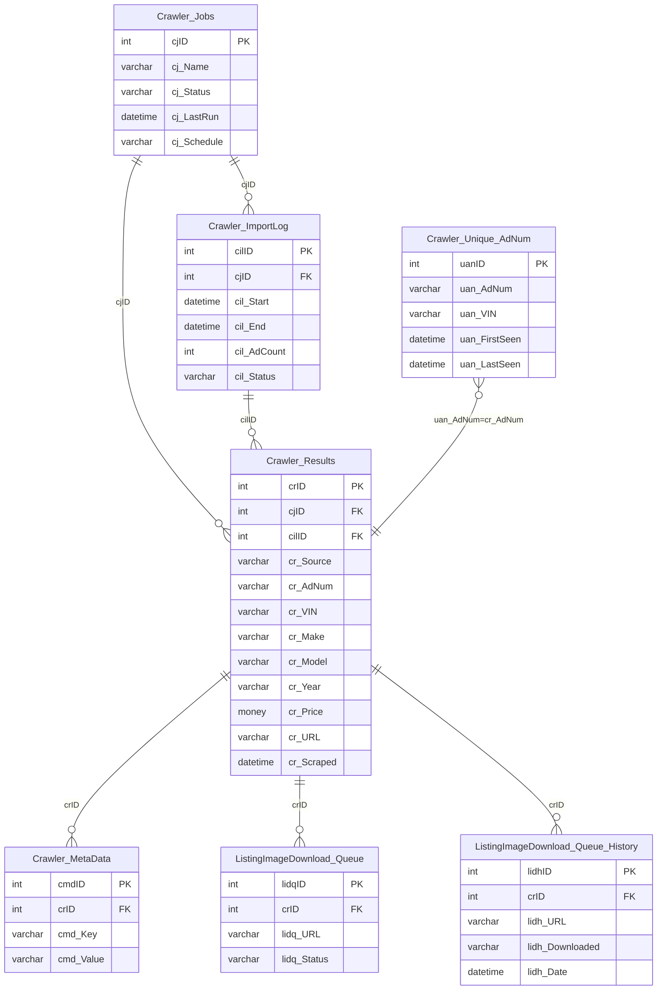

# RedDawn — Schema Documentation

> _Status: complete — schema documented 2026-06-21._ Describe only what the schema dump shows; flag inference; cite real object names. See [quality standards](../discovery-guide.md#quality-standards--references).

## Overview

Web crawling and data harvesting database. Orchestrates crawler jobs, stores raw results, manages import logs, and tracks smart VDP listing snapshots, image downloads, and TikTok feed listings. Feeds Megatron with third-party listing data scraped from external sources.

## Access

- **Owner:** Ron Mulder · **Researcher:** Alicia · **Status:** granted · **Reach:** `20.51.108.231:1433` / SQL Server auth / SSMS or pyodbc
- Cross-ref: [System Access Tracker](/analysis/artifacts/access-tracker/index.html)

## Schema dump

Authoritative DDL: `dumps/reddawn.sql` — schema-only, no data. Extracted 2026-06-11 via `INFORMATION_SCHEMA` query (SQL Server reddawn). Re-extract from source to refresh.

## Tables

_70 tables total · **104.38 GB total / 99.85 GB used** (full DDL in `dumps/reddawn.sql`; ERD shows subset). Row counts from `sys.partitions` 2026-06-14._

| Table | ~Rows | Purpose | PK | CDP-relevant |
|---|---|---|---|---|
| `Crawler_Templates` | 270 | Registry of named Scrapy crawler templates: maps a template name to a keyword, filename, Scrapy version, and archived flag; used to instantiate new crawler jobs. | `name` | — |
| `Crawler_Templates_Logs` | — | Audit log of changes to crawler templates, recording who made each change, when, and free-text notes. | — | — |
| `Crawler_Jobs` | 5,248 | Master job configuration table for web crawlers, keyed by `domain`; stores schedule (cron), execution windows, crawler type, proxy settings, CPU/memory allocations, status, and associated feed IDs. | `domain` | — |
| `Crawler_Jobs_Group` | — | Groups crawler jobs together by a `groupid`, tracking crawled counts, launch times, and priority flags; (inferred) used to batch-schedule related domains together. | — | — |
| `Crawler_Stores` | — | Associates domains with feed ID lists and keywords by crawler type, (inferred) defining which inventory store each crawler targets. | — | — |
| `Crawler_Proxy_Types` | — | Lookup table of named proxy configurations available for crawler jobs, with an enabled flag and a value string. | `id` | — |
| `Crawler_ImportLog` | 22,183 | Per-crawl import tracking log: records the file imported, crawl start time, import time, stored-procedure completion time, provisioning time, status, and ARN for each crawler run against a domain. | `cil_id` | — |
| `Crawler_Results` | 1,361,054 | Raw scraped vehicle listing data keyed to a crawler import log entry (`cil_id`): VIN, stock number, URL, and all vehicle attributes (year, make, model, price, condition, images, options, etc.). | — | — |
| `Crawler_Unique_AdNum` | 41,787,646 | Deduplication registry mapping unique VIN and stock number combinations to a domain and a surrogate key; used to detect duplicate listings across crawler runs. | `cua_id` | — |
| `Crawler_Stats` | 3,435,822 | Per-import statistical parameters (e.g. counts, rates) keyed by `cil_id` and a stat name, with an optional category grouping. | — | — |
| `Crawler_Totals` | 264,225 | Daily aggregated counts of crawled items per domain and type, used to track crawl volume trends over time. | — | — |
| `Crawler_Revisions` | — | Version-control log for crawler configuration objects: records the author, change content, and notes for each revision keyed by object name and type. | — | — |
| `Crawler_Logs` | 2,275,359 | Operational event log for crawler runs, keyed by domain and event timestamp; stores a title, message, and attribution (`whom`). | — | — |
| `Crawler_Error_Logs` | 126,099 | SQL error log for crawler stored procedures: captures error number, message, state, line, and procedure name per import event. | — | — |
| `Crawler_MetaData` | 2,850,702 | Key-value metadata store for crawler domains, supporting arbitrary per-domain configuration or annotation fields. | — | — |
| `Crawler_Classification` | 6,054 | Maps domains to classification labels (e.g. automotive, real estate); used to route crawl results to the correct downstream processing path. | — | — |
| `Crawler_Cleanup_Log` | 5,565,341 | High-volume log of cleanup operations run against crawler import records, tracking each `cil_id`, its state at cleanup time, and a timestamp. | — | — |
| `crawler_count_log` | 7,103,052 | Record-count audit log per crawler domain and import event, storing the source of the count and the capture timestamp. | `id` | — |
| `Crawler_Container_Issues` | — | Log of container-level problems encountered during crawler execution, recording the container name, scan time, and container state. | `id` | — |
| `Crawler_Settings` | — | Global key-value configuration settings for the crawler system. | — | — |
| `Crawler_Results_MissingPercent` | — | Variant of `Crawler_Results` with an additional `crawl_date` and `template` column; (inferred) used during QA to surface listings with high rates of missing field data. | — | — |
| `Crawler_Results_RealEstate` | — | Scraped real estate listing data analogous to `Crawler_Results`: stores property attributes (MLS ID, address, price, bedrooms, bathrooms, amenities, images, etc.) per crawler import. | — | — |
| `ImageDownloadStatus` | — | Lookup/status table defining named stages in the image download pipeline, with an active flag and sort order. | `ids_ID` | — |
| `ListingImageDownload` | 2,745,022 | Master record per listing image download, tracking the source URL, target URL, fail count, file size, stock-photo flag, and pipeline status stage for each image associated with a listing. | `llim_ID` | ✓ |
| `ListingImageDownload_Queue` | 700 | Active work queue for image downloads: holds pending download tasks with their source URL, file size, receive time, and result. | `que_ID` | ✓ |
| `ListingImageDownload_Queue_History` | 147,097,980 | Completed image download queue entries archived with a capture timestamp; the largest table in the database by row count. | — | ✓ |
| `MonthlyPriceImageProcessing` | — | Staging table for generating monthly-price overlay images: combines listing price, monthly payment, vehicle details, and image URL with a processing state flag. | — | — |
| `MonthlyPriceImageProcessingLogs` | — | Audit log recording which dealer accounts (`acc_id`) had monthly price images processed and when. | — | — |
| `ListingVideoDownload` | — | Master record per listing video download, tracking source and output URLs, file size, fail count, pipeline step, and SQS message IDs for each video associated with a listing. | `llvd_ID` | ✓ |
| `ListingVideoOutput` | — | Transcoded video output record per download: stores resolution (width × height), format, quality level, processed URL, file size, and success flag. | `llvo_ID` | ✓ |
| `SmartVDPAccounts` | 791 | Dealer account snapshot for the SmartVDP ad product: company name, address, image URL, UTM parameters, and geo-coordinates for each enrolled account. | `acc_id` | ✓ |
| `SmartVDPListings` | 60,557 | Active vehicle listing snapshot for SmartVDP: full listing attributes (VIN, title, price, monthly price, images, vehicle specs) plus a TikTok page ID and a hash for change detection. | — | ✓ |
| `SmartPLDListings` | 140 | Listing snapshot for the SmartPLD (product listing display) variant of the VDP ad product; shares the same schema as `SmartVDPListings` minus the monthly price and page ID columns. | — | ✓ |
| `SmartVDPClicks` | 23,310,403 | Click event log for SmartVDP ad units: captures event date, app action, IP address, user agent, referrer, bot flag, session ID, landing URL, and subscription context per click. | `srp_id` | ✓ |
| `SmartVDPBotAgents` | 23 | Allowlist of known bot user-agent strings used to classify SmartVDP click traffic as bot. | `bot_id` | ✓ |
| `SmartVDPOptions` | 224 | Per-account configuration for SmartVDP: stores VDP type, VDP algorithm variant, dealer logo URL, and a bypass flag. | `Id` | ✓ |
| `SubscriptionMetaData` | — | Additional metadata per subscription: Analytics ID string and a flag indicating whether a video feed is included. | `Id` | — |
| `srp_daily_processing` | — | Staging table used during daily SRP (search results page) processing: holds in-flight action, account, listing, subscription, and session data before aggregation. | — | — |
| `VDPDashCostByCampaigns` | 146 | Dashboard summary of ad spend by campaign: cost, impressions, clicks, VDP views, and cost-per-VDP for each `cmp_id`. | `cmp_id` | ✓ |
| `VDPDashDailyStats` | 904 | Pivoted daily stats table for the VDP dashboard: one row per campaign per data type, with day01–day31 decimal columns for up to 31 days of values. | — | ✓ |
| `VDPDashPacingCampaign` | 146 | Campaign pacing data for the VDP dashboard: expected vs. actual VDP counts, pacing delta, flight, campaign, account, and advertiser identifiers. | — | ✓ |
| `VDPDailyTotals` | — | Daily rollup of VDP campaign performance: cost, VDP views, clicks, and impressions per campaign. | — | ✓ |
| `FBImport` | — | Log of Facebook campaign data import runs, recording start time, finish time, and status. | `fb_import_id` | — |
| `FBCampaignData` | 32,602 | Facebook ad-level campaign data from an import run: ad account, ad set, ad ID, preview link, effective status, issue details, and learning-phase status. | `fbdata_id` | ✓ |
| `FBCampaignDatav2` | 9,276,171 | Extended version of `FBCampaignData` adding ad set name and ad name columns; the high-volume current Facebook data table. | `fbdata_id` | ✓ |
| `FacebookPageMapping` | 13 | Maps Facebook Page IDs and URLs to internal campaign names, business names, and account IDs; used to correlate FB page events to dealer accounts. | `Id` | ✓ |
| `TikTokFeedListings` | 12,621 | Vehicle listing snapshot formatted for the TikTok product catalog feed: full vehicle attributes, pricing (list, sale, monthly), geo-coordinates, dealer info, images, video link, and up to five custom labels. | — | ✓ |
| `crosslinked` | — | Linking table associating an advertiser name and website URL to a listing ID, listing title, VDP URL, and VIN; (inferred) used for cross-platform URL mapping. | — | — |
| `InventoryTotals` | — | Summary of inventory counts by feed type, account, and source, with a last-upload timestamp; (inferred) used to monitor feed freshness. | — | — |
| `GraftChevyListings` | — | Listing snapshot for the Graft Chevy partner integration, containing full vehicle attributes scraped or imported for Chevrolet dealer listings. | — | ✓ |
| `GraftChevyVDP` | — | Maps VIN and stock number to a VDP URL and data source for the Graft Chevy job, with a last-execution timestamp. | — | ✓ |
| `FoxFactoryAgedRAM` | — | Partner-specific aged RAM truck inventory snapshot for Fox Factory, storing dealer name, VIN, model package, VDP URL, region, catalog, domain, and last-upload date. | — | — |
| `Tickets` | — | Support or work ticket log for crawler issues: records ticket type, domain, request type, creation date, ticket ID, resolution status, title, and assigned person. | — | — |
| `VehicleFilterLocation` | 4 | Maps a vehicle filter value to a human-readable location name per domain; (inferred) used to translate raw filter tags into display labels. | `id` | ✓ |
| `BKUPSettings` | — | Database backup configuration per database entry: retention count, backup path, FTP server, and credentials. | `dbID` | — |
| `BKUPSteps` | — | Ordered list of named backup process steps used by the backup orchestration logic. | `stpID` | — |
| `BKUPHistory` | — | Historical log of backup runs recording start/end time and compressed file sizes (BAK and ZIP) per database and step. | `hstID` | — |
| `BKUPLog` | — | Running log of backup job starts per step, used to detect in-progress or failed backup runs. | `bulID` | — |
| `Crawler_MaxMetaData` | — | Not in DDL dump — (inferred) view or derived table surfacing maximum metadata values per domain or import. | — | — |
| `Crawler_Total_Pivot` | — | Not in DDL dump — (inferred) view pivoting `Crawler_Totals` rows into columns for dashboard or reporting use. | — | — |
| `Crawler_Total_Single` | — | Not in DDL dump — (inferred) view or staging table isolating a single crawler total row for comparison or display purposes. | — | — |
| `Scrapy_Crawl_Check` | — | Not in DDL dump — (inferred) view or monitoring table for checking Scrapy crawler health or run completion status. | — | — |
| `Scrapy_LiveFeedCounts` | — | Not in DDL dump — (inferred) view or live table showing current active feed listing counts from Scrapy crawlers; CDP-relevant as a freshness signal. | — | ✓ |
| `ImageDownload_ToDownload` | — | Not in DDL dump — (inferred) view or staging table enumerating images pending download in the current processing cycle. | — | — |
| `ImageDownload_SideBySide` | — | Not in DDL dump — (inferred) view or table used for QA comparison of original vs. processed images side by side. | — | — |
| `ImageDownload_ToRemove` | — | Not in DDL dump — (inferred) view or staging table enumerating images flagged for deletion from the download store. | — | — |
| `DynamicDisplay_List` | — | Not in DDL dump — (inferred) view or table holding listings selected for a dynamic display ad product. | — | — |
| `DynamicDisplay_List_Tags` | — | Not in DDL dump — (inferred) view or table of tag annotations applied to dynamic display listing selections. | — | — |
| `BKUPLog_Joined` | — | Not in DDL dump — (inferred) view joining `BKUPLog` with step and history details for operational reporting. | — | — |
| `JobHistory` | — | Not in DDL dump — (inferred) view or table summarizing SQL Agent job run history for this server. | — | — |

## Indexes

**62 indexes across 35 tables** — 32 clustered, 30 nonclustered, 0 disabled. Full dump: run `scripts/index-definitions.sql`.

| Table | Index | Key Columns | Type | Notes |
|---|---|---|---|---|
| `Crawler_Jobs` | `PK_Crawler_Jobs` | `domain` | CLUSTERED PK | Domain is the crawl unit |
| `Crawler_ImportLog` | `PK_Crawler_ImportLog` | `cil_id` | CLUSTERED PK | |
| `Crawler_ImportLog` | `Crawler_ImportLog_cil_imported` | `cil_imported` | NONCLUSTERED | Import timestamp filter |
| `Crawler_ImportLog` | `domain` | `domain` | NONCLUSTERED | 100% fill — domain lookup |
| `Crawler_Results` | `Crawler_Results_cilid__vehvin` | `cil_id, veh_vin` | NONCLUSTERED | VIN+import dedup |
| `Crawler_Results` | `Crawler_Results_vehvin` | `veh_vin` → incl. `cil_id` | NONCLUSTERED | **VIN lookup — CDP vehicle identity signal** |
| `Crawler_Results` | `veh_status_Includes` | `veh_status` → incl. `veh_url` | NONCLUSTERED | 100% fill — active/sold filter |
| `Crawler_Logs` | `PK_Crawler_Logs` | `domain, eventt

## Growth

Source: `msdb.dbo.backupset` full-backup history (type D), 2026-05-15 to 2026-06-14 (30 days).

| Metric | Value |
|---|---|
| Start size | 102.79 GB (2026-05-15) |
| End size | 104.69 GB (2026-06-14) |
| Net growth | **+1.90 GB / 30 days** |
| Rate | ~0.06 GB/day · ~1.9 GB/month |

RedDawn shows significant intraday oscillation (±0.5–1.5 GB within a single day), likely because the crawler tables are heavily truncated and reloaded throughout the day. The net trend above uses peak-per-day values. At current rate: **~23 GB/year**. Growth is driven by `ListingImageDownload_Queue_History` (147M rows) and `Crawler_Unique_AdNum` (41.8M rows).

---

## ERD

Key entities (crawler pipeline). Full DDL: `dumps/reddawn.sql`.

