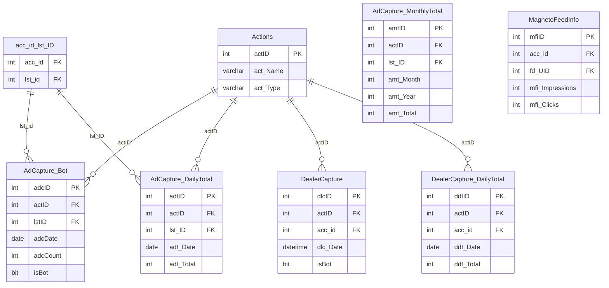

# Trax — Schema Documentation

> _Status: complete — schema documented 2026-06-21._ Describe only what the schema dump shows; flag inference; cite real object names. See [quality standards](../discovery-guide.md#quality-standards--references).

## Overview

Traffic and analytics tracking database. Aggregates daily totals for ad impressions, clicks, and dealer captures, plus granular action tracking and FEEDADS mirrors for analytics queries. Feeds the DAS reporting layer and is a source for CDP engagement metrics.

## Access

- **Owner:** Ron Mulder · **Researcher:** Alicia · **Status:** granted · **Reach:** `20.51.108.231:1433` / SQL Server auth / SSMS or pyodbc
- Cross-ref: [System Access Tracker](/analysis/artifacts/access-tracker/index.html)

## Schema dump

Authoritative DDL: `dumps/trax.sql` — schema-only, no data. Extracted 2026-06-11 via `INFORMATION_SCHEMA` query (SQL Server trax). Re-extract from source to refresh.

## Tables

_36 tables total · **11.43 GB total / 11.31 GB used** (full DDL in `dumps/trax.sql`; ERD shows subset). Row counts from `sys.partitions` 2026-06-14._

| Table | ~Rows | Purpose | PK | CDP-relevant |
|---|---|---|---|---|
| `Actions` | 24 | Lookup table of trackable action types (name, sort order, section, and whether the action applies to ads); referenced by all Capture tables via `actID`. | `actID` | ✓ |
| `AdCapture_Bot` | 17,168,577 | Raw per-event log of ad-level traffic captures flagged as bot or non-bot; each row records one action event against a listing (`lstID`) with a log key and date. | `adcID` | ✓ |
| `AdCapture_DailyTotal` | 0 | Pre-aggregated daily totals of bot vs. non-bot ad captures per action and listing; currently empty, suggesting the daily aggregation job is not running. | `adtID` | ✓ |
| `AdCapture_MonthlyTotal` | 108,454,568 | Monthly rollup of bot vs. non-bot ad captures per action and listing; the primary high-volume analytics table in this database. | `amtID` | ✓ |
| `addmulticapture` | 2,209 | Staging or batch table holding a comma-separated list of listing IDs and an action ID, (inferred) used by bulk capture ingestion procedures. | — | ✓ |
| `AdTotal` | 0 | Monthly total counts per action and listing; currently empty, (inferred) superseded by `AdCapture_MonthlyTotal`. | `adtID` | — |
| `DealerCapture` | 893,103 | Raw per-event log of dealer-level traffic captures flagged as bot or non-bot; each row records one action event against a dealer account (`accID`) with a log key and date. | `dlcID` | ✓ |
| `DealerCapture_DailyTotal` | 122,281 | Pre-aggregated daily totals of bot vs. non-bot dealer captures per action and account. | `ddtID` | ✓ |
| `DealerCapture_MonthlyTotal` | 63,046 | Monthly rollup of bot vs. non-bot dealer captures per action and account. | `dmtID` | ✓ |
| `DealerOptions` | 5,927 | Per-account configuration options for dealers, storing a key-value option string and a grab flag per account. | `dloID` | ✓ |
| `DealerTotal` | 0 | Monthly total counts per action and dealer account; currently empty, (inferred) superseded by `DealerCapture_MonthlyTotal`. | `dltID` | ✓ |
| `MagnetoFeedInfo` | 2,167,742 | Feed-level metadata snapshot from the Magneto feed aggregator: publisher, dealer, feed contact details, ad counts, image counts, and legacy lead quality metrics per aggregation date. | `mfiID` | ✓ |
| `__FeedInfoJoined` | — | Wider feed info snapshot extending `MagnetoFeedInfo` with monthly engagement metric columns (search, detail, printed, directions, dealer, website views) and per-partner lead quality counters; not in DDL dump — (inferred) view or derived staging table. | — | ✓ |
| `acc_id_lst_ID` | 35,165,587 | Bridge table mapping account IDs to listing IDs; primary join surface linking dealer accounts to their individual ad listings across the analytics tables. | — | — |
| `SmartAd_Performance` | 22,352 | Campaign-level ad performance data imported from an external ad platform: impressions and clicks per ad unit, date, package, and campaign (`cmp_id`). | — | ✓ |
| `TrafficFilterIP` | — | Allowlist/blocklist of IP addresses used to classify or suppress traffic; each row stores an IP value and an active flag. | `tfip_id` | — |
| `TrafficFilterKeyword` | — | Allowlist/blocklist of user-agent or referrer keywords used to classify or suppress traffic; each row stores a keyword value and an active flag. | `tfk_id` | — |
| `InvalidCapture` | 0 | Log of traffic capture events rejected as invalid, recording the reason, originating IP, action, listing, account, and the traffic filter keyword (`tfk_id`) that triggered rejection. | `ic_id` | ✓ |
| `Report` | — | Registry of named reports with display name, URL, and description; (inferred) used by the reporting UI layer. | `repID` | — |
| `ReportUser` | — | Junction table granting individual users access to specific reports; links `repID` to `usrID`. | `rusID` | — |
| `User` | — | Internal user directory for the Trax reporting application, storing AD account name, first/last name, and office affiliation (`ofcID`). | `usrID` | — |
| `BKUPSettings` | — | Database backup configuration per database entry: retention count, backup path, FTP server, and credentials. | `dbID` | — |
| `BKUPSteps` | — | Ordered list of named backup process steps used by the backup orchestration logic. | `stpID` | — |
| `BKUPHistory` | — | Historical log of backup runs recording start/end time and compressed file sizes (BAK and ZIP) per database and step. | `hstID` | — |
| `BKUPLog` | — | Running log of backup job starts per step, used to detect in-progress or failed backup runs. | `bulID` | — |
| `__FeedInfoFinal` | — | Not in DDL dump — (inferred) view or derived table representing a final curated version of feed info, possibly joining `MagnetoFeedInfo` and `__FeedInfoJoined`. | — | ✓ |
| `__FeedNewLeads` | — | Not in DDL dump — (inferred) view or derived table surfacing new leads from feed data, likely used by the reporting layer. | — | ✓ |
| `YTD_Totals` | — | Not in DDL dump — (inferred) view or reporting table aggregating year-to-date totals across capture tables. | — | — |
| `InventoryCountByMonth` | — | Not in DDL dump — (inferred) view or reporting table summarizing inventory counts by month. | — | — |
| `export_AdCapture_DailyTotal` | — | Not in DDL dump — (inferred) export-shaped view or staging table of `AdCapture_DailyTotal` for downstream consumers. | — | ✓ |
| `export_DealerCapture_DailyTotal` | — | Not in DDL dump — (inferred) export-shaped view or staging table of `DealerCapture_DailyTotal` for downstream consumers. | — | ✓ |
| `BKUPLog_Joined` | — | Not in DDL dump — (inferred) view joining `BKUPLog` with step and history details for operational reporting. | — | — |
| `JobHistory` | — | Not in DDL dump — (inferred) view or table summarizing SQL Agent job run history for this server. | — | — |

## Indexes

**39 indexes across 26 tables** — 26 clustered, 13 nonclustered, 0 disabled. Indexes optimized for date+action time-series queries. Full dump: run `scripts/index-definitions.sql`.

| Table | Index | Key Columns | Type | Notes |
|---|---|---|---|---|
| `acc_id_lst_ID` | `PK_trax_acc_id_lst_ID` | `acc_id, lst_id` | CLUSTERED PK | Account-listing bridge |
| `acc_id_lst_ID` | `IX_acc_id` | `acc_id` | NONCLUSTERED | |
| `acc_id_lst_ID` | `IX_lst_ID` | `lst_id` | NONCLUSTERED | |
| `Actions` | `PK_Action` | `actID` | CLUSTERED PK | Action type lookup |
| `AdCapture_Bot` | `PK_AdCapture_Bot` | `adcID` | CLUSTERED PK | |
| `AdCapture_Bot` | `AdCapture_Bot_c_Date_i_actID_lstID_isBot` | `adcDate` → incl. `actID, lstID, isBot` | NONCLUSTERED | Date-first traffic by listing |
| `AdCapture_DailyTotal` | `PK_AdCapt

## Growth

Source: `msdb.dbo.backupset` full-backup history (type D), 2026-05-17 to 2026-06-14 (28 days).

| Metric | Value |
|---|---|
| Start size | 11.45 GB (2026-05-17) |
| End size | 11.46 GB (2026-06-14) |
| Net growth | **+0.01 GB** |
| Rate | Static — no measurable growth |

Trax is flat despite being an active analytics database. The `AdCapture_DailyTotal` table (0 rows) confirms daily aggregation is not running. The `AdCapture_MonthlyTotal` table (108M rows) appears to be receiving writes but the DB-level size is not growing — likely due to index fragmentation reclaim or data rotation.

---

## ERD

Key entities (36 tables total). Full DDL: `dumps/trax.sql`.

