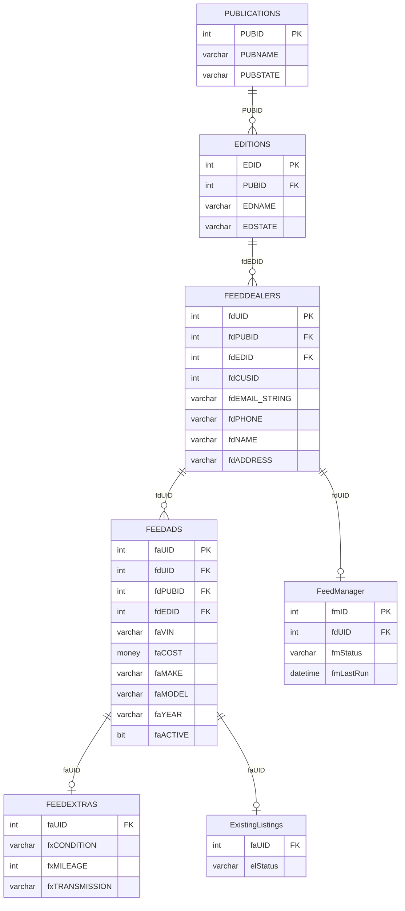

# Web — Schema Documentation

> _Status: complete — schema documented 2026-06-21._ Describe only what the schema dump shows; flag inference; cite real object names. See [quality standards](../discovery-guide.md#quality-standards--references).

## Overview

Main website database. Powers the DAS classified listing portal with ~800 tables covering listings (FEEDADS — 47.3 GB), dealers (FEEDDEALERS), members, publications, editions, feed management, and vendor-specific ad/dealer tables. The largest and most complex database in the platform.

## Access

- **Owner:** Ron Mulder · **Researcher:** Alicia · **Status:** granted · **Reach:** `20.51.108.231:1433` / SQL Server auth / SSMS or pyodbc
- Cross-ref: [System Access Tracker](/analysis/artifacts/access-tracker/index.html)

## Schema dump

Authoritative DDL: `dumps/web.sql` — schema-only, no data. Extracted 2026-06-11 via `INFORMATION_SCHEMA` query (SQL Server web). Re-extract from source to refresh.

## Tables

_657 tables total · **76.2 GB total / 72.48 GB used** (full DDL in `dumps/web.sql`; ERD shows subset). Row counts from `sys.partitions` 2026-06-14._

### Publications & Editions

| Table | ~Rows | Purpose | PK | CDP-relevant |
|---|---|---|---|---|
| `PUBLICATIONS` | 35 | Registry of classified ad publications; stores name, URL, IP, database name, and server routing info for each publication site. | `PUBID` | — |
| `EDITIONS` | 852 | Geographic or market editions within a publication; stores name, contact info, state, publish date, and rate per edition. | `EDID` | — |
| `PUBEDITIONS` | 851 | Junction table linking publications to their editions (many-to-many). | — | — |
| `PubStates` | 44 | Maps each publication to the US state(s) it serves. | — | — |
| `PUBEXPIRING` | — | Per-publication configuration for ad-expiry workflow: renewal timing, payment methods accepted, email routing, and upload paths. | `expID` | — |
| `New_PrintPublications` | — | Newer print-publication registry with pagination share, upload folder, and notification email fields (inferred: parallel to `PUBLICATIONS` for print workflow). | `pub_ID` | — |
| `New_PrintEditions` | — | Print-edition detail records including contact info, Endeavor edition mapping, and instant-renewal rate group IDs. | `ped_ID` | — |
| `StatPubs` | — | Lightweight publication reference table used for reporting; stores pub name, URL, and short code. | `PubID` | — |

### Categories & Classification

| Table | ~Rows | Purpose | PK | CDP-relevant |
|---|---|---|---|---|
| `CLASS` | 496 | Top-level ad classification (e.g., Automotive, Marine) scoped per publication; drives site navigation and search. | `CLSID` | — |
| `SUBCLASS` | 1,903 | Second-level ad subcategory beneath `CLASS`; stores name, display order, and search weight. | `SCLID` | — |
| `SCLSORT` | — | Override sort-order table for subcategories; allows custom category ordering independent of `SUBCLASS.SCLORDER`. | — | — |
| `MAKES` | 448 | Vehicle make lookup: canonical spelling, soundex value, URL slug, logo path, and flags for auto vs. cycle type. | `MKSPELL` | — |
| `MODELS` | 2,699 | Vehicle model/trim lookup keyed by make+model+trim, with car-type classification. | — | — |
| `CARTYPES` | 7 | Small lookup table of vehicle body/category types (e.g., Sedan, SUV) referenced by `MODELS`. | `CTID` | — |
| `New_Class` | 11 | Revised top-level category table with URL-friendly names, federation category mapping, and homepage-expand flags. | `cls_ID` | — |
| `New_SubClass` | 169 | Revised subcategory table with URL slugs, mobile sort order, and federation category/keyword mapping. | `scl_ID` | — |

### Ads & Listings

| Table | ~Rows | Purpose | PK | CDP-relevant |
|---|---|---|---|---|
| `ADS` | 106,890 | Core ad header record: links an ad to edition, subcategory, dealer, and member; stores type, cost, and display flags. | `ADID` | — |
| `ADDETAIL` | 106,895 | Extended ad content for each `ADS` record: ad text, HTML, headline, vehicle year/make/model/price, phone, and up to four image URLs. | `ADID` | — |
| `ADIMAGES` | 2,536,734 | Image URL rows for ads in the `ADS` table; composite key on `ADID` + `IMGURL` + sort order. | — | — |
| `SUBIMAGES` | — | Image URLs for submission (`SUBMIT`) records; same composite-key pattern as `ADIMAGES`. | — | — |
| `SUBMIT` | — | Ad submission staging record capturing all listing fields (year, make, model, price, text, images) plus insertion, proof, and package metadata before publishing to `ADS`. | `SUBID` | — |
| `CART` | — | Shopping-cart record for a web ad purchase: holds listing fields, package, pricing, VIN, stock number, and cart state through checkout. | `CARTID` | — |
| `CARTIMAGES` | — | Image URLs for cart records; composite key on `CARTID` + `IMGURL` + sort order. | — | — |
| `AdRates` | — | Pricing and rules per edition: base cost, insertion count, word limits, upsell costs (border, headline, photo), online-only flags, and renewal parameters. | `rID` | — |

### Feed Listings (primary inventory)

| Table | ~Rows | Purpose | PK | CDP-relevant |
|---|---|---|---|---|
| `ExistingListings` | 2,576,096 | Thin reference table of active feed ad IDs (`adid`); used to quickly check whether a listing exists in the live feed. | — | ✓ |
| `FEEDADS` | 8,032,284 | Primary vehicle inventory feed: one row per active listing with VIN, stock number, year/make/model, price, phone, images, and active flag. Core of the classified portal. | `faUID` | ✓ |
| `FEEDEXTRAS` | 12,149,385 | Extended attributes for each `FEEDADS` row: condition, body type, mileage, transmission, engine, fuel economy, colors, payment, warranty, certified flag, options, and MSRP. | `faUID` | ✓ |
| `FEEDDEALERS` | 22,800 | Feed dealer profile: name, address, phone, fax, email (string + XML), URL, images, and customer ID (`fdCUSID`). Primary dealer entity for the feed system. | `fdUID` | ✓ |
| `FeedManager` | 18,349 | Configuration record for each active dealer feed: publication, edition, feed ID, name, phone, edition tag, active flag, and scheduled deactivation date. | `fmID` | ✓ |
| `feedmanagerlog` | 78,595 | Audit log of changes to `FeedManager` records; stores field-level change description, user, and timestamp. | `fmlID` | ✓ |
| `FEEDTRANSLATE` | 9,152 | Maps incoming feed category strings to internal subcategory IDs (`SCLID`) per publication/edition. | `ftUID` | ✓ |
| `FEEDUPDATE` | 8,122 | Pending dealer profile update queue: new name, address, phone, email, images, and preferences waiting to be applied to `FEEDDEALERS`. | `FUUID` | ✓ |
| `FEEDLOGS` | 20,964 | Per-edition feed processing log: ad count, dealer count, feature count, image count, timestamp, and source file name per run. | `flID` | ✓ |
| `NormalizedFAVDP` | 417,936 | Stores a normalized vehicle detail page (VDP) URL per `FEEDADS` row; decoupled from `FEEDADS` for length. | — | ✓ |
| `FeedCategoryTranslations` | 5,179 | Maps external feed category IDs and names to internal class/subclass IDs per feed and publication. | — | ✓ |
| `FeedAdCount` | 304 | Snapshot of ad counts per publication/aggregator/dealer; used for monitoring and billing reconciliation. | `facid` | ✓ |
| `FEEDUPSELLS` | 0 | Per-listing upsell flags for feed ads: homepage placement, preferred, and enlarged display options. | — | ✓ |
| `FeedMultipleVIN` | 16,169 | Tracks VINs that appear more than once in a feed file; used for duplicate-VIN detection and cleanup. | `fmvID` | ✓ |

### Ratchet (feed onboarding & workflow)

| Table | ~Rows | Purpose | PK | CDP-relevant |
|---|---|---|---|---|
| `RatchetFeedTracker` | 85,344 | Master feed onboarding record: captures dealer and billing contact details, aggregator info, pricing, key milestone dates, sales rep, form/status IDs, and dealer group. Central table for the Ratchet feed-management workflow. | `ffID` | ✓ |
| `adez_feed` | — | Denormalized view/snapshot of `RatchetFeedTracker` joined with status and management team names; (inferred) used by the AdEz reporting interface. | `ffID` | ✓ |
| `RatchetFormActive` | 10,944 | Tracks whether a Ratchet feed form is currently active, with last-modified timestamp and user. | `ffaID` | — |
| `RatchetDestinations` | 12,853 | Maps each Ratchet feed (`ffID`) to the aggregator destinations it publishes to, with a per-destination bid value. | — | — |
| `RatchetDealerGroups` | 101 | Lookup table of dealer groups referenced by `RatchetFeedTracker.rdg_ID`. | `rdg_ID` | ✓ |
| `RatchetDeactivations` | 2,652 | Records of feed deactivations: which feed was deactivated, when, and by whom. | `rdid` | — |
| `RatchetDeactivationReasons` | — | Lookup table of coded deactivation reasons referenced by `RatchetDeactivations`. | `rdrid` | — |
| `RatchetUpsells` | 4,486 | Records upsell products (`upID`) and their pricing sold per Ratchet feed (`ffID`). | — | — |
| `Upsells` | — | Lookup table of available upsell product definitions referenced by `RatchetUpsells`. | `upID` | — |
| `RatchetFormTypes` | 8 | Lookup table of feed form types (e.g., new, renewal) with sort order, active flag, and display/local flags. | `ftID` | — |
| `RatchetFormStatus` | — | Lookup table of form status values (e.g., Pending, Live) with sort order and active flag. | `fsID` | — |
| `WebManagementTeam` | — | Lookup table of web management team member names referenced by `RatchetFeedTracker.wmtID`. | `wmtID` | — |
| `RatchetInventory` | 15 | Lookup table of inventory package types with capacity values and active flags; includes a PerformancePro flag. | `fiID` | — |
| `RatchetFeedMigration` | 979 | Maps old feed IDs (`ffIDMaster`) to new Ratchet subscription IDs during feed-platform migrations. | — | ✓ |

### Destinations & Distribution

| Table | ~Rows | Purpose | PK | CDP-relevant |
|---|---|---|---|---|
| `FEEDDESTINATION` | 67,934 | Active routing record linking a dealer feed to an aggregator destination: stores bid, budget, cap, active flag, and modification date. | `FEEDDESTID` | ✓ |
| `Destination` | 52 | Lookup table of aggregator/partner destinations (name, active flag, lead cost, and short name). | `DESTID` | — |
| `DestinationRules` | 204 | Junction table linking destinations to routing rules; each combination carries an active flag. | — | — |
| `Rules` | — | Lookup table of named routing rules applied to destinations via `DestinationRules`. | `rule_id` | — |

### Leads

| Table | ~Rows | Purpose | PK | CDP-relevant |
|---|---|---|---|---|
| `LeadQueue` | 1,788 | Inbound lead/contact requests from the website: stores sender email, IP, name, phone, message, ADF XML payload, and proof/sent timestamps. | `lqID` | ✓ |
| `LeadQStatus` | 7 | Lookup table of lead queue status codes (e.g., Pending, Sent, Rejected). | `lqStatusID` | ✓ |
| `FormPublications` | 7,522 | Maps Ratchet feed forms (`ffID`) to the publications and customer IDs they are active for. | — | — |
| `FormDealerLocation` | 3,649 | Maps a Ratchet feed form to a publication and location/region code; (inferred) controls geographic routing of dealer forms. | — | ✓ |
| `FormFeedPhoneTracking` | 28 | Phone-tracking campaign configuration per feed: 800-number, redirect target, cc-email, and option flags for call-tracking integration. | `pht_ID` | ✓ |

### Members & Auth

| Table | ~Rows | Purpose | PK | CDP-relevant |
|---|---|---|---|---|
| `MEMBERS` | 232 | Website member accounts: login credentials, name, address, email, phone, and home publication. | `MEMID` | ✓ |
| `MEMROLES` | 231 | Junction table assigning role IDs to member accounts. | — | — |
| `ROLES` | 8 | Lookup table of named member roles (e.g., Admin, Dealer) referenced by `MEMROLES`. | `ROLEID` | — |
| `MEMROLES_LOG` | 215 | Audit log of role assignments and removals: member, role, modifying user, and support ticket reference. | `mrl_ID` | — |
| `x__DEALERLOGIN` | 125 | Dealer portal login session/profile record: package, ad limits, full dealer contact info, expiration date, rep ID, and contact name/email. (inferred: legacy or staging table given `x__` prefix) | — | ✓ |
| `TPDLINFO` | — | Comprehensive dealer-login and ad-submission snapshot combining member credentials, dealer profile fields, and a full ad submission record in a single wide row; (inferred) used for print/web transfer workflows. | — | — |
| `DealerLoginExpiration` | 947 | Tracks dealer login package expiration dates and whether a renewal notice email has been sent. | `dle_ID` | ✓ |
| `DealerLogin_MailLog` | 940 | Log of expiration reminder emails sent to dealers: member, expiration date, package, and mail template used. | `emlid` | ✓ |

### Dealer Accounts

| Table | ~Rows | Purpose | PK | CDP-relevant |
|---|---|---|---|---|
| `New_ADAccounts` | 11,910 | AdEz/Active Directory account snapshot: login, display name, email, internal account ID, role, last login, company, and service list. | `ADMYID` | ✓ |
| `AccountClassification` | 1,742 | Per-account classification record controlling display rules: TFN, price/email/phone exclusion flags, overlay, demo display, and single-photo exclusion. | — | ✓ |
| `DEALERS` | 475,578 | Master dealer registry: name, address, phone, fax, email (string + XML), URL, customer ID, publication ID, profile type, and up to four logo images. | `DLRID` | ✓ |
| `WEBDEALERS` | 2,430 | Publication-scoped dealer profile for the web portal: contact details, images, and CAO flag; (inferred) a filtered/denormalized view of `DEALERS` per publication. | — | ✓ |
| `WEBADS` | — | Publication-scoped ad records mirroring `ADS`/`ADDETAIL` fields but keyed by `PUBID`/`ADNUM`/`CUSID`; (inferred) a denormalized export or staging copy for the web layer. | — | — |
| `InstaDealers` | 267 | Dealer profiles for the Insta (instant-listing) product; same field layout as `WEBDEALERS`. | — | ✓ |
| `InstaAds` | 575 | Ad records for the Insta product; same field layout as `WEBADS`. | — | — |
| `DEALERSUBMIT2` | 3,335 | Dealer-originated ad submission record: full listing fields plus VIN, stock number, package, and reason; a dealer-facing counterpart to `SUBMIT`. | `DSUBID` | ✓ |
| `DealerDirectory` | 1,370 | Standalone dealer directory entries: name, phone, address, URL, publication, section, and region; may exist independently of `DEALERS`. | `DDid` | ✓ |
| `DealersByMake` | 18,774 | Precomputed stock-count per dealer directory entry and vehicle make; (inferred) used for make-filtered dealer search pages. | — | ✓ |
| `DlrIDRep` | — | Simple mapping of dealer ID (`dlrid`) to sales rep account ID (`acc_id_rep`); (inferred) used to attribute dealer accounts to reps. | — | — |

## Indexes

**304 indexes across 232 tables** — 230 clustered, 74 nonclustered, 0 disabled. Several covering indexes with 100% fill factor (static/read-only data). Many `_dta_index_*` names (DTA auto-generated). Full dump: run `scripts/index-definitions.sql`.

CDP-relevant tables:

| Table | Index | Key Columns | Type | Notes |
|---|---|---|---|---|
| `FEEDDEALERS` | `PK_FEEDDEALERS` | `fdUID` | CLUSTERED PK | Main dealer feed entity |
| `FEEDDEALERS` | `IX_FEEDDEALERS_dlrID` | `dlrID` | NONCLUSTERED | Dealer lookup |
| `FEEDDEALERS` | `IX_FEEDDEALERS_fdCUSID` | `fdCUSID` | NONCLUSTERED | Customer ID lookup |
| `FEEDDEALERS` | `IX_FEEDDEALERS_fdEMAIL_STRING` | `fdEMAIL_STRING` | NONCLUSTERED | **Email — CDP match signal** |
| `FEEDADS` | `PK_FEEDADS` | `faUID` | CLUSTERED PK | |
| `FEEDADS` | `TunerFeedAds3` | `fdPUBID, fdEDID, faVIN, faADNUM, fdUID` → incl. `faUID` | NONCLUSTERED UNIQUE | VIN dedup per pub |

## Views

No `CREATE VIEW` statements are present in the `dumps/web.sql` schema dump. The four `vw_StevenRatchetTrackerReport*` objects are defined as `CREATE TABLE` in the dump, suggesting they are materialized/snapshot tables rather than live views, or were exported as tables during schema extraction. No other views were detected.

## Growth

Source: `msdb.dbo.backupset` full-backup history (type D), 2026-05-15 to 2026-06-14 (30 days).

| Metric | Value |
|---|---|
| Start size | 76.48 GB (2026-05-15) |
| End size | 76.44 GB (2026-06-14) |
| Net growth | **−0.04 GB** |
| Rate | Flat / marginal shrink |

WEB is effectively static. The marginal size decrease is within measurement noise. The FEEDADS (8M rows), FEEDEXTRAS (12M rows), and ExistingListings (2.6M rows) tables are likely refreshed in-place rather than appended.

---

## CDP Relevance

Key signal surfaces for identity resolution and customer data:

| Table | Column(s) | Signal type |
|---|---|---|
| `FEEDDEALERS` | `fdEMAIL_STRING`, `fdPHONE`, `fdNAME`, `fdCUSID` | Dealer identity — primary match key |
| `FEEDDEALERS` | `fdADDR`, `fdCITY`, `fdSTATE`, `fdZIP` | Dealer location — geo enrichment |
| `DEALERS` | `DLREMAIL_STRING`, `DLRPHONE`, `DLRNAME`, `CUSID` | Master dealer registry — cross-ref to `FEEDDEALERS` |
| `RatchetFeedTracker` | `ffwEmail_String`, `ffwPhone`, `ffbEmail`, `ffbPhone`, `ffCusID` | Dealer + billing contact — onboarding identity |
| `New_ADAccounts` | `ADEmail`, `acc_id`, `acc_login` | Internal account — rep/admin identity |
| `AccountClassification` | `acc_id`, `cl_no_email`, `cl_no_phone` | Suppression flags — governs contact eligibility |
| `LeadQueue` | `lqFromMail`, `lqFromName`, `lqFromPhone` | Consumer lead — inbound identity signal |
| `DealerLoginExpiration` | `memid`, `dlname`, `acc_id_rep` | Dealer login lifecycle — rep attribution |
| `FEEDADS` | `faVIN`, `faSTOCK`, `faMAKE`, `faMODEL`, `faYEAR` | Inventory entity — VIN as listing key |
| `FEEDEXTRAS` | `fxMileage`, `fxCondition`, `fxMSRP`, `fxCertified` | Inventory enrichment — listing detail |
| `DealersByMake` | `ddid`, `make`, `stockCnt` | Dealer inventory profile — make-level attribution |

---

## ERD

Key CDP-relevant entities (657 tables total — feed/inventory subset shown). Full DDL: `dumps/web.sql`.

