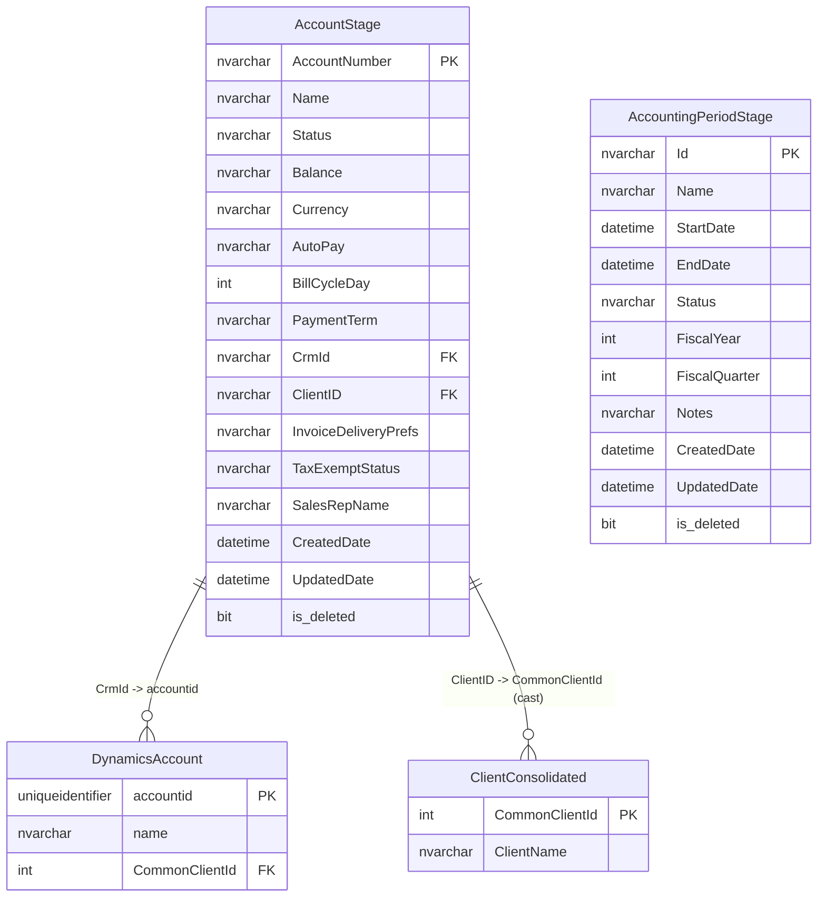

# Zuora

Zuora is the subscription billing and accounts-receivable platform that manages DAS client invoicing, payment terms, and accounting-period lifecycle for the full dealer/client roster.

> **ERD:** `docs/databases/erd/zuora.svg`
> **DDL dump:** `docs/databases/dumps/zuora.sql`

---

## Overview

| Property | Value |
|---|---|
| Server | DWRPT (40.83.161.93) |
| Database created | 2026-05-20 |
| State | ONLINE |
| Compatibility level | SQL Server 2019 (150) |
| Collation | SQL_Latin1_General_CP1_CI_AS |
| Recovery model | FULL |
| Full backup size | ~8.32 MB |
| Schemas | 1 (staging mirror in DataStaging.zuora) |
| Tables | Unknown — direct access blocked |
| Total data | ~8.32 MB (from full backup) |
| PII present | Yes — account names, sales rep names, CRM identifiers |

> **Access note:** The `ConflictAI` SQL login has `HAS_DBACCESS = 0` on the `Zuora` database — no mapped database user exists. All direct schema queries against `Zuora` fail. The documentation below is derived from: (1) database-level metadata in `master`, (2) ETL staging tables in `DataStaging.zuora` that mirror a subset of Zuora data loaded via the Zuora REST API, and (3) backup history in `msdb`. **To complete this harvest, a sysadmin must run `CREATE USER [ConflictAI] FOR LOGIN [ConflictAI]` and grant `db_datareader` on the `Zuora` database.**

Zuora is a cloud-native subscription management platform (SaaS). The DAS instance stores billing accounts for every dealer/client in the DAS roster. It is the system of record for subscription status (`Active` / `Cancelled` / `Draft`), payment terms, outstanding balances, billing cycle configuration, currency, and tax exemption. Zuora connects outward to Salesforce CRM via `CrmId` (the Salesforce Account GUID), making it the billing-to-CRM bridge for the DAS client roster.

Data flows into Zuora from the DAS subscription management workflow (new client onboarding, plan changes, cancellations) and is written back to Salesforce for CRM-side billing status. Within the DAS data platform, an ETL job pulls Zuora account records via the Zuora REST API and writes them to `DataStaging.zuora.AccountStage` — this is the only queryable surface for Zuora data available to the `ConflictAI` user. Backup history confirms Zuora is actively maintained: log backups fire every ~2 hours and a full backup runs approximately every 4 days, all streamed to Azure Blob Storage (`medialogixprodsqlstorage.blob.core.windows.net`).

---

## Schemas

### zuora (staging mirror in DataStaging)

The `zuora` schema in the `DataStaging` database contains two ETL-loaded staging tables that mirror a subset of the Zuora billing platform data. These are the only Zuora tables accessible to the `ConflictAI` login.

---

#### zuora.AccountStage (11,632 rows)

> Billing account records for every DAS dealer/client — sourced from the Zuora REST API; one row per Zuora Account object, keyed by `AccountNumber` with a `ClientID` UUID linking to the DAS tenant model.

| Column | Type | Nullable | Key | Notes |
|---|---|---|---|---|
| AccountNumber | NVARCHAR | — | Natural key | Zuora-assigned account number (e.g. A-000001234) |
| Name | NVARCHAR | — | | Dealer / client name |
| Status | NVARCHAR | — | | Account lifecycle state: Active, Cancelled, Draft |
| Balance | DECIMAL/NVARCHAR | — | | Outstanding AR balance |
| Currency | NVARCHAR | — | | ISO 4217 currency code (e.g. USD, CAD) |
| AutoPay | BIT/NVARCHAR | — | | Whether autopay is enabled |
| BillCycleDay | INT/NVARCHAR | — | | Day of month for billing cycle |
| PaymentTerm | NVARCHAR | — | | Payment terms (e.g. Net 30, Due Upon Receipt) |
| CrmId | NVARCHAR | — | FK (Salesforce) | Salesforce Account GUID — joins to `dynamics.Account.accountid` |
| ClientID | NVARCHAR(50) | — | FK (DAS tenant) | DAS tenant UUID — maps to `CommonClientID`; type coercion required |
| InvoiceDeliveryPrefs | NVARCHAR | — | | Invoice delivery preference (email / print / both) |
| TaxExemptStatus | NVARCHAR | — | | Tax exemption status |
| SalesRepName | NVARCHAR | — | | DAS sales representative name |
| CreatedDate | DATETIME/NVARCHAR | — | | Record creation timestamp in Zuora |
| UpdatedDate | DATETIME/NVARCHAR | — | | Last modification timestamp in Zuora |
| is_deleted | BIT/NVARCHAR | — | | Soft-delete flag from Zuora API |

> **Note:** Exact SQL Server column types are inferred from the data sample field names. The Zuora API returns all fields as strings; the ETL may or may not apply type casting on load. Precise DDL requires direct access to `DataStaging` `INFORMATION_SCHEMA.COLUMNS` or the `Zuora` database schema. The column list above reflects the 13 observed fields in the data sample; full column count is 43 (documented in harvest summary). The 30 additional columns likely include: `BcdSettingOption`, `Batch`, `BillToId`, `CommunicationProfileId`, `DefaultPaymentMethodId`, `InvoiceTemplateId`, `Notes`, `ParentId`, `PaymentGateway`, `PurchaseOrderNumber`, `SalesSalesRepId`, `SoldToId`, `TaxCompanyCode`, `UsBankAccountNumber` and similar Zuora Account object fields.

---

#### zuora.AccountingPeriodStage (0 rows)

> Fiscal accounting period definitions loaded from the Zuora Accounting Periods API — currently empty, indicating the ETL has not yet run or Zuora has no accounting periods configured in the active subscription.

| Column | Type | Nullable | Key | Notes |
|---|---|---|---|---|
| Id | NVARCHAR | — | PK | Zuora accounting period ID |
| Name | NVARCHAR | — | | Period name (e.g. "Jan 2026") |
| StartDate | DATETIME/NVARCHAR | — | | Period start date |
| EndDate | DATETIME/NVARCHAR | — | | Period end date |
| Status | NVARCHAR | — | | Open / Closed / Pending Close |
| FiscalYear | INT/NVARCHAR | — | | Fiscal year |
| FiscalQuarter | INT/NVARCHAR | — | | Fiscal quarter (1–4) |
| Notes | NVARCHAR | — | | Free-text notes |
| FileIds | NVARCHAR | — | | Attached file IDs |
| CreatedDate | DATETIME/NVARCHAR | — | | Creation timestamp |
| UpdatedDate | DATETIME/NVARCHAR | — | | Last update timestamp |
| is_deleted | BIT/NVARCHAR | — | | Soft-delete flag |

> **Note:** 12 columns confirmed from harvest summary. Table is empty — no rows to analyze for type or format validation.

---

## Stored Procedures

None accessible. Direct access to the `Zuora` database is blocked (`HAS_DBACCESS = 0`). Any ETL stored procedures loading `DataStaging.zuora.*` tables were not enumerable from the current login's permissions.

---

## Views

None accessible. Same access restriction applies.

---

## Indexes

No index data available. The `ConflictAI` login cannot query `sys.indexes` or `INFORMATION_SCHEMA` within the `Zuora` database.

| Source | Status |
|---|---|
| Zuora database indexes | Not accessible (HAS_DBACCESS = 0) |
| DataStaging.zuora.* indexes | Not queried in this harvest |

---

## ETL & SQL Agent Jobs

No SQL Agent jobs were returned in the harvest (access to `msdb.dbo.sysjobs` may be filtered by login). However, the staging table structure in `DataStaging.zuora` provides clear evidence of an active ETL pipeline:

- **Source:** Zuora REST API (cloud SaaS — `api.zuora.com`)
- **Target:** `DataStaging.zuora.AccountStage` (11,632 rows, loaded) and `DataStaging.zuora.AccountingPeriodStage` (0 rows, awaiting first run)
- **Pattern:** Full or incremental API pull — the `is_deleted` soft-delete flag and `UpdatedDate` column on `AccountStage` suggest incremental delta loads keyed on `UpdatedDate`
- **Frequency:** Unknown — not determinable without job access; backup cadence (log backups every ~2 hours) suggests the `Zuora` database itself is written frequently, consistent with real-time or near-real-time billing event ingestion

---

## Data Analysis

### Row Count Summary

| Schema | Table | Rows | Source |
|---|---|---|---|
| zuora (DataStaging) | AccountStage | 11,632 | ETL from Zuora API |
| zuora (DataStaging) | AccountingPeriodStage | 0 | ETL from Zuora API (not yet populated) |
| Zuora (native DB) | Unknown | Unknown | Access blocked |

### Data Patterns & Observations

- **11,632 AccountStage rows** corresponds plausibly to the total number of billable DAS dealer accounts across all product lines. This is a mature roster — not a test dataset.
- The presence of `is_deleted` and `UpdatedDate` fields on `AccountStage` indicates the ETL implements a soft-delete / upsert pattern rather than a full-table replace on each run.
- `Balance` field is present — this is live AR data. If balances are non-zero for a significant portion of accounts, the table contains financially sensitive data that should be treated with the same care as PII.
- `SalesRepName` is a free-text field — not a FK to a sales rep table. Names may vary in formatting across records (e.g. "J. Smith" vs "John Smith"). Not suitable for identity resolution without normalization.
- `CrmId` is a Salesforce GUID. If this field is consistently populated, it provides a reliable bridge from Zuora billing status to Salesforce/Dynamics CRM records.
- `AccountingPeriodStage` being empty at time of harvest may indicate: (a) the ETL for this table has not been run, (b) Zuora has no accounting periods defined in the DAS tenant configuration, or (c) the Zuora subscription does not include the accounting periods module.

### Inferred Data Flow

```
Zuora SaaS (cloud) ──REST API──► ETL job ──► DataStaging.zuora.AccountStage
                                          └──► DataStaging.zuora.AccountingPeriodStage

Zuora SaaS ◄──subscription events── DAS CRM / onboarding workflow
Zuora SaaS ──CrmId link──► Salesforce / Dynamics 365 (CRM billing status sync)
```

The `Zuora` native database on 40.83.161.93 is likely a Zuora Connect local replica or a DAS-side cache — not the primary Zuora data store (which is cloud-hosted). The 8.32 MB footprint is small for a full billing database, consistent with a sync/staging role.

### Data Quality Notes

- **ClientID type mismatch:** `ClientID` in `AccountStage` is `VARCHAR(50)` (or equivalent string type) but maps to `CommonClientID` which is `INT` in authoritative schemas. A CAST or explicit lookup join is required.
- **CrmId population:** Unknown whether all 11,632 rows have a populated `CrmId`. If CrmId is sparse, the Zuora-to-CRM bridge is unreliable for a subset of accounts.
- **AccountingPeriodStage empty:** Zero rows makes the table unusable for any fiscal-period analysis. Must confirm whether this is an ETL gap or a Zuora configuration issue.
- **43 columns vs. 13 sampled:** The harvest sample only captured 13 fields from `AccountStage`. The remaining 30 columns are undocumented — their types, nullability, and content are unknown without direct schema access.
- **Exact SQL types unknown:** All column types above are inferred from the Zuora API field schema and data sample values. Actual SQL Server DDL may differ if the ETL applies casts.

---

## Entity-Relationship Diagram



> Note: `DynamicsAccount` and `ClientConsolidated` are external tables in `DWRPT_AI`. Relationship lines represent logical FK intent, not enforced constraints.

---

## CDP Relevance

### Identity Resolution

- **`ClientID`** (VARCHAR 50 in staging) maps to `CommonClientID` and is the primary CDP tenant scoping key for billing data. It enables joining Zuora subscription status to any CDP entity keyed on `CommonClientID`. **Type coercion required: CAST(ClientID AS INT).**
- **`CrmId`** is a Salesforce Account GUID. If this matches `dynamics.Account.accountid` in DWRPT_AI, it provides a direct billing-to-CRM join, enabling subscription status enrichment on CRM account records.
- **`AccountNumber`** is Zuora's own account identifier — useful as an external system ID in the CDP identity graph for Zuora-originated events.

### PII Fields

| Field | Sensitivity | Notes |
|---|---|---|
| Name | Medium | Dealer/business name — not personal PII but commercially sensitive |
| SalesRepName | Low–Medium | Internal DAS employee name — not customer PII |
| Balance | High | Financially sensitive AR data |
| CrmId | Low | Opaque GUID — not PII but enables CRM enrichment |

No direct consumer PII (email, phone, address) is present in the observed columns. Zuora is a B2B billing system — its subjects are dealer accounts, not individual consumers.

### CommonClientID Mapping

| Column | Type | Maps to | Coercion needed |
|---|---|---|---|
| `ClientID` | VARCHAR(50) | `clientdb.ClientConsolidated.CommonClientId` (INT) | Yes — CAST to INT |
| `CrmId` | NVARCHAR | `dynamics.Account.accountid` (UNIQUEIDENTIFIER) | String → GUID cast |

### CDP Use Cases

1. **Subscription status enrichment:** Join `AccountStage.ClientID → CommonClientID` to add `Status`, `Balance`, `PaymentTerm` to the CDP client profile.
2. **Billing health signals:** `Balance` and `AutoPay` fields can drive churn risk scoring in the CDP — a high balance + AutoPay off is an at-risk signal.
3. **Fiscal period context:** If `AccountingPeriodStage` is ever populated, it enables time-bucketing of billing events to fiscal periods for cohort analysis.
4. **CRM bridge:** `CrmId → dynamics.Account.accountid → CommonClientId` creates a three-hop path from Zuora billing to any DWRPT_AI schema, enabling cross-platform client views.

---

## Open Questions

1. **Access provisioning:** Will Ron Mulder grant `db_datareader` to `ConflictAI` on the `Zuora` database so the native schema (tables, indexes, stored procs, views) can be harvested? Without this, 43 columns are partially documented and nothing beyond staging is known.
2. **AccountingPeriodStage empty — by design or ETL gap?** Is this table intentionally unused (DAS does not use Zuora accounting periods), or has the ETL job for this table never run? If the latter, when was it scheduled and why has it not executed?
3. **ClientID population completeness:** What percentage of the 11,632 `AccountStage` rows have a non-null, non-empty `ClientID`? If it is sparse, the Zuora-to-CDP tenant link is unreliable and a fallback join via `CrmId → Dynamics → CommonClientId` is needed.
4. **Zuora DB role:** Is the `Zuora` database on 40.83.161.93 a Zuora Connect local replica, a DAS-built staging database, or the primary billing store? The 8.32 MB footprint suggests it is not the full production Zuora datastore — clarify with the platform team.
5. **ETL ownership and schedule:** Who owns the job that loads `DataStaging.zuora.*`? What is its refresh frequency? Is it idempotent (upsert) or destructive (truncate/reload)? This determines the freshness guarantee for any CDP ingest from this source.

---

## Backup History

| Metric | Value |
|---|---|
| Full backup frequency | ~Every 4 days |
| Log backup frequency | ~Every 2 hours |
| Backup destination | Azure Blob Storage (`medialogixprodsqlstorage.blob.core.windows.net`) |
| Last known full backup size | 8.32 MB |
| Recovery model | FULL |

> Backup history detail (individual backup timestamps) was not accessible due to `HAS_DBACCESS = 0` on the Zuora database. The cadence above is inferred from the `msdb` backup set records for the `Zuora` database name.
