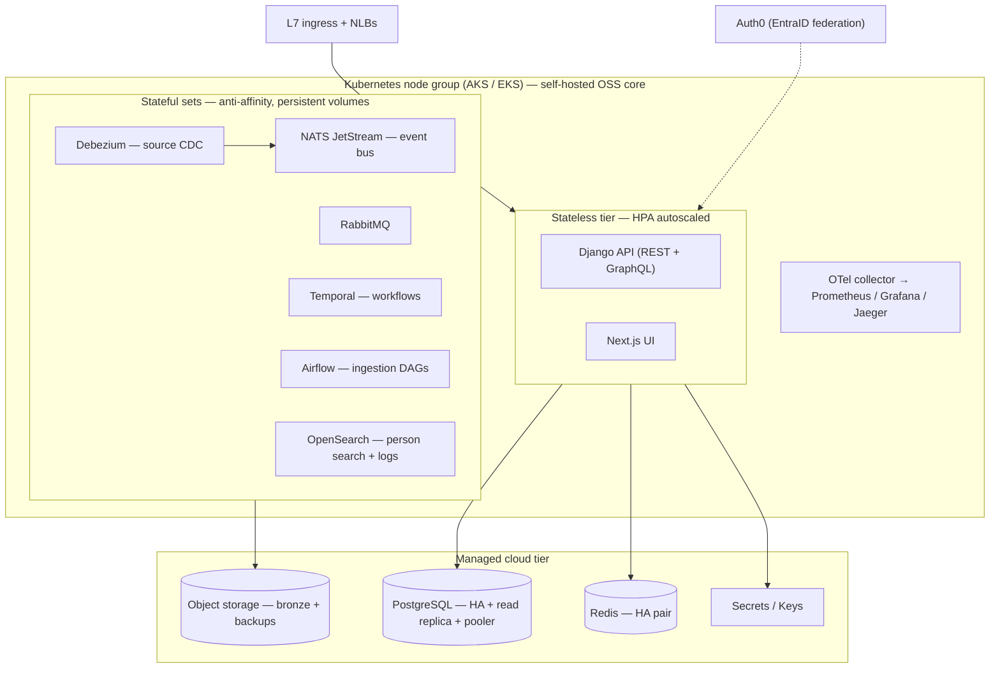

# Deployment Architecture

*Phase 0 deliverable: how the CDP is actually deployed, run, and recovered. Written for decision-makers. The precise node and store sizing lives in `docs/cdp-reference-topology.md`, the per-cloud cost comparison in `docs/cloud-aws-vs-azure-bakeoff.md`, and the system design it serves in `docs/cdp-architecture.md`. Every shape below traces to those sources.*

## The shape of the deployment

The CDP runs as a **portable open-source core on Kubernetes** (AKS on Azure, EKS on AWS), alongside a thin layer of managed cloud services for the things you should never hand-roll: the database of record, the cache, object storage, ingress, and secrets. The split is deliberate. We self-host the software that defines the product (so it is identical on either cloud, with no managed-service premium and no vendor lock-in in app code), and we lease the undifferentiated infrastructure where a cloud provider's HA, backups, and patching are worth paying for.

The Kubernetes node group runs the stateless app tier (Django REST + GraphQL, Next.js) and the stateful core: NATS JetStream (the event bus), RabbitMQ and Temporal (workflow/queueing), Airflow (ingestion orchestration), OpenSearch (person search), and Debezium (source change capture). The managed tier provides **PostgreSQL** (the canonical store) with a connection pooler, **Redis**, **object storage** for the replayable bronze layer and backups, an **L7 ingress**, and **secrets/key management**.

## How we know it works: observability

Every pod and the managed tier are instrumented with **OpenTelemetry**, which feeds three signals to OSS backends the team operates:

- **Metrics:** OTel -> Prometheus -> Grafana for dashboards and alerting.
- **Logs:** OTel -> OpenSearch (reusing the same search tier), structured and queryable.
- **Distributed tracing:** OTel -> Jaeger, backed by OpenSearch, so a single request can be followed end-to-end across the ingestion, resolution, and serving layers.

OTel is portable across both clouds, so the observability story is identical wherever the CDP runs. Managed backends (AMP / Azure Monitor, X-Ray, Application Insights) exist as opt-in levers but are not the default, because they are proprietary and break portability.

## Posture: start at a dev baseline, rightsize on real load

We deploy a **dev baseline first and rightsize production against observed load** (infra-sizing decision, 2026-06-16). The stack is elastic: moving from dev to production is a configuration change (more replicas, bigger nodes, an extra Postgres read replica), not a redesign. We ship conservative starting sizes and let the system's own telemetry set the production numbers, rather than guessing capacity up front.

At a readable level (full per-workload sizing is in `docs/cdp-reference-topology.md`):

| | Dev baseline | Production (rightsized) |
|---|---|---|
| Node group | 3 small nodes, single pool | ~6 larger nodes spread across 3 availability zones, with ~1 node of failover slack |
| App tier | one replica each | multiple replicas, HPA-autoscaled on load |
| Stateful core | single instance each | NATS / OpenSearch / messaging replicated with anti-affinity across nodes and zones |
| PostgreSQL | single-AZ, built-in pooler | zone-redundant HA **+ a read replica**, pooled |
| Redis | one small node | HA primary + replica pair |
| Block storage (PVs) | ~300 GB (OpenSearch dominant) | ~1.5 TB, grows online |
| Object storage | a few hundred GB | multi-TB, geo-replicated |

The scaling levers are well understood and independent: HPA and the node autoscaler handle the app tier; Postgres scales vertically online and fans out reads to replicas; OpenSearch adds data nodes as the search index grows; Airflow scales its worker pool for batch windows and back down afterward.

## How it is built, shipped, and recovered

- **Infrastructure as code.** All cloud and Kubernetes infrastructure is provisioned with Terraform via `boilerworks-opscode`; the application ships on the `boilerworks-django-nextjs` boilerplate. The environment is reproducible and reviewable, with no click-ops.
- **CI/CD.** Changes flow through CI and auto-deploy continuously to dev. Production promotion is a push-button release: the same artifact, gated by an explicit human approval rather than an automatic push. App migrations follow a zero-downtime expand/contract pattern, so deploys do not require a maintenance window.
- **Disaster recovery.** Postgres runs managed point-in-time recovery plus snapshots; object storage (the bronze layer) is geo-replicated and replayable. Production keeps a cross-region pilot-light Postgres standby: minimal warm capacity in a second region that is promoted on a regional failure, with the bronze layer already mirrored there. This bounds recovery to a promotion, not a rebuild.

## Where the substrate is decided

The deployment is **cloud-neutral by construction**: the OSS core runs unchanged on either cloud, and each managed swap-point (database, cache, ingress, secrets, object storage, CDC, backups) has a documented Azure and AWS equivalent. **Azure-primary is preferred** (to consolidate on DAS's org cloud); **AWS is the live alternative** (source-database data gravity). That choice is settled by the bake-off, not by this document, and the architecture holds either way.

## Where to go deeper

- Exact node/store sizing, workload placement, PV and managed-tier shapes, per-cloud SKU mapping, and scaling levers: `docs/cdp-reference-topology.md`
- Per-cloud cost comparison and the substrate bake-off: `docs/cloud-aws-vs-azure-bakeoff.md`
- The system design this deployment serves (layers, data flow, services, observability, locked decisions): `docs/cdp-architecture.md`
- Infra-sizing posture (dev-baseline-first) and the decision record: `memory/decisions.md` (2026-06-16)
- Foundation build stories (IaC, CI/CD wiring): `specs/03-phase-1-build/01-foundation/`
