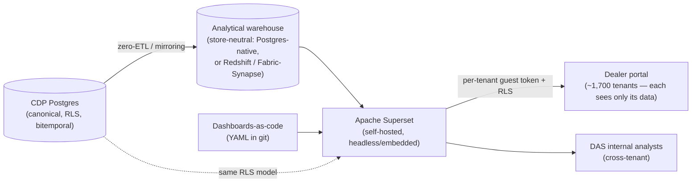

# Reporting Data Flow — Target State

*Phase 0 deliverable: how reporting works in the new CDP, replacing the legacy DWRPT -> Juicebox path. Written for decision-makers, grounded in the reporting-platform decision and the architecture, with the dense detail in the linked specs. The legacy flow it replaces is captured at `/analysis/artifacts/reporting-data-flow/`.*

## Why reporting changes

Today, reporting runs on a chain that does not scale and is being retired: SSIS rebuilds the warehouse nightly, pre-joined **DWRPT** views feed **Juicebox** (221 reports), and Juicebox cannot do SQL joins or serve ~1,700 dealers with proper isolation. The target state moves reporting onto the same governed CDP data and a single open platform, so a report is defined once, isolated per dealer automatically, and version-controlled like code.

## How it works (target state)

In plain terms:
1. The **CDP Postgres** is the canonical, governed store (row-level security, full provenance).
2. Data lands in an **analytical warehouse** via zero-ETL / mirroring, and stays store-neutral: Postgres-native by default, or a managed warehouse (Redshift on AWS / Fabric-Synapse on Azure) if scan volume justifies it. No nightly truncate-and-rebuild.
3. **Apache Superset** (self-hosted, open-source, $0 license baseline) is the reporting engine, run headless/embedded.
4. Reports are **dashboards-as-code**: defined in version-controlled YAML, not hand-built in a UI, so they are reviewable, reproducible, and migratable.
5. Each dealer sees only its own data through a per-tenant guest token bound to the same row-level-security model the CDP already enforces, so there is no second isolation mechanism to get wrong.

## What this replaces, and the migration

The legacy DWRPT views and Juicebox reports are migrated onto Superset + the warehouse as part of Phase 1 (the **Report Migration** workstream decomposes the 221 reports by DWRPT family: CDXP, ML, RL, SL, core, with per-report parity validation against the legacy output). DWRPT remains only as a reporting-parity reference during migration, then retires. Full custom-report-catalog parity and self-serve report authoring are **Phase 2** (Reporting Parity).

## What is locked vs. open

- **Locked:** Apache Superset as the reporting platform, headless/embedded, per-tenant guest-token + RLS, dashboards-as-code (decided 2026-06-14). The warehouse is store-neutral, chosen with the cloud rather than a dependency.
- **Open / client choice:** which warehouse (tied to the cloud decision; Azure-primary preferred, a managed warehouse is roughly even between clouds with Synapse pay-per-scan the Azure lever for query-driven use (per the bake-off), and Postgres-native is the portable $0 default).

## Where to go deeper

- Reporting-platform decision (Superset, with alternatives weighed): `specs/02-phase-1-architecture/02-platform-decisions/01-reporting-platform-decision.md`
- The build workstream (Superset deploy, meta-layer, dashboards-as-code, per-tenant RLS harness, warehouse cutover): `specs/03-phase-1-build/05-integration-etl-reporting/`
- Report migration (per-family decomposition): `specs/03-phase-1-build/11-report-migration/`
- Warehouse cost by cloud: `docs/cloud-aws-vs-azure-bakeoff.md` · Architecture context: `docs/cdp-architecture.md`
- The legacy flow this supersedes: [/analysis/artifacts/reporting-data-flow/](/analysis/artifacts/reporting-data-flow/)
