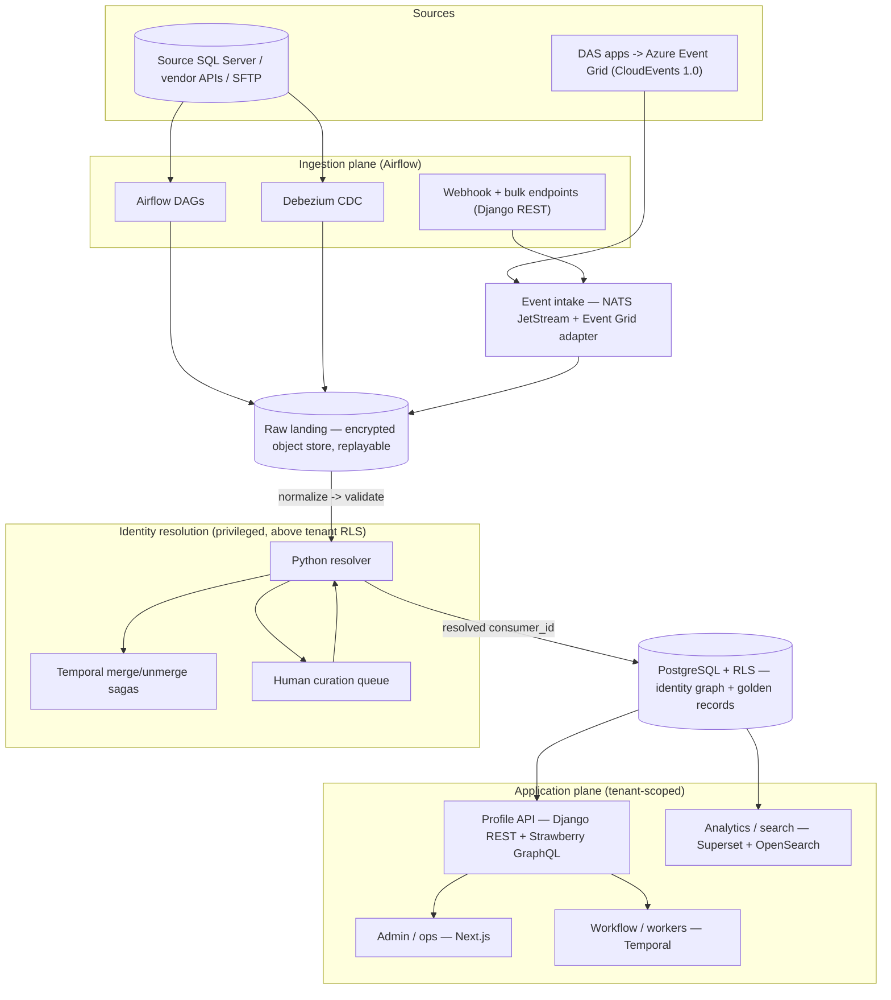

# Services Topology

*Phase 0 deliverable: the set of services that make up the CDP, what each one is responsible for, and the contracts that hold between them. Written for decision-makers; this expands the Services Topology view in `docs/cdp-architecture.md` and traces each choice to a dated, recorded decision. The platform is a portable OSS core that runs unchanged on either cloud, so the services below are described by what they do, not by a cloud vendor's product name.*

## Why decompose it this way

A CDP is a small set of services, each with a single job and a clear edge, rather than one program. Drawing those edges well is what lets the team build the tracks in parallel, swap any one piece without disturbing the rest, and reason about where data and trust flow. The guiding principle is **one responsibility per service, one contract per boundary**: a service talks to its neighbors only through a stated interface, never by reaching into their internals.

Two boundaries do most of the work and are worth stating up front, because every other rule follows from them:

- **All ingestion runs under one plane; the application runs under another.** Everything that pulls data *in* (batch extracts, change capture, file and event intake) is owned by **Airflow**. Everything the *application* does (identity sagas, the review queue, admin utilities) is owned by **Temporal**. The two never overlap: no ingest task ever calls Temporal, and the app layer never participates in ingestion (Leo, 2026-06-13). This keeps a slow backfill from ever competing with a live merge, and makes each plane independently scalable.
- **Intake is bus-agnostic; the resolver is privileged; everything served is tenant-scoped.** The CDP captures events through adapters, not through a hard-wired dependency on any one message bus. The identity resolver runs in a privileged role *above* tenant isolation, because matching the same person across dealers is its whole point. Every other read and write stays inside a single dealer's boundary.

## The services

Seven services, grouped by the job they do.

**Ingestion** lands data from the outside world. It runs the batch and change-capture side of the pipeline: **Airflow DAGs** pull scheduled extracts, SFTP/CSV drops, and vendor-API feeds; **Debezium** captures changes from the source SQL Server databases; and **webhook and bulk endpoints** (Django REST) take real-time pushes and operator file uploads. Everything lands raw to encrypted object storage first ("bronze"), so the whole pipeline is replayable from the original bytes (Leo, 2026-06-18). New sources are added as configuration, not code; see the source registry below.

**Event intake** is the asynchronous front door, and it is deliberately bus-agnostic. The internal backbone is **NATS JetStream**, which provides the event log, retention, and replay. External buses bridge in through a thin adapter. DAS publishes CloudEvents 1.0 to Azure Event Grid today, so the **Event Grid adapter** is a config-only subscription, and a future direct-publish path is a config swap, not a rewrite. The webhook adapter fast-acknowledges by publishing to NATS and landing the raw event to bronze before it returns. This co-primary event path was decided alongside batch (Dan Aston, 2026-06-12); the NATS-for-intake / RabbitMQ-for-app-messaging split was settled 2026-06-17.

**Identity resolution** turns fragmented records into one golden record per person. The matching logic is a **Python service**: normalize identifiers, match deterministically against the identity graph, link or create, and route the ambiguous cases to a human. Multi-step operations that must not be lost halfway (merges, unmerges, and the human-in-the-loop hand-off) run as **Temporal sagas**, so a partially applied merge can never leave the graph inconsistent. Ambiguous matches land in a **human curation queue** where an operator confirms, rejects, or defers. This service is the one privileged exception to tenant isolation, explained under the boundaries below.

**Profile API** is how everything downstream reads and writes. It is a single backend with two surfaces: **Django REST** for ingestion endpoints and operational integrations, and **Strawberry GraphQL** for the Consumer 360 profile, so a downstream app fetches exactly the fields it needs in one round trip. Both surfaces share one auth context and one tenant boundary. VSS is the first downstream consumer.

**Admin / ops** is the operator-facing application: a **Next.js** front end covering the DAS admin dashboard, the dealer portal, the identity conflict-review queue, and the source-onboarding console. It talks only to the Profile API; it holds no business logic of its own.

**Workflow / workers** is the application's durable-execution plane: **Temporal** runs the queue workers, admin-utility orchestration, and the erasure saga (delete the tokenized PII-vault row, confirm the tokens dereference everywhere, audit). It is strictly off the ingest path.

**Analytics / search** serves reporting and lookup. **Apache Superset** (self-hosted, headless/embedded) is the reporting layer for ~1,700 dealer tenants and internal authoring (decided 2026-06-14); **OpenSearch** provides fuzzy person search and doubles as the log/trace store for observability.

The backend is **Python-primary** throughout (Django, the Airflow and Temporal workers, and the resolver and transform logic all live in one stack), with Go reserved for measured hot paths and TypeScript on the front end (language strategy, 2026-06-14).

### Service -> responsibility -> technology

| Service | Responsibility | Technology |
|---|---|---|
| Ingestion | Batch extracts, source change-capture, webhook + bulk endpoints, raw landing | Airflow DAGs, Debezium CDC, Django REST |
| Event intake | Bus-agnostic async capture; external-bus bridge | NATS JetStream + Event Grid adapter (CloudEvents 1.0) |
| Identity resolution | Normalize -> deterministic match -> link/create -> curation queue | Python service, Temporal merge/unmerge sagas, human curation queue |
| Profile API | Consumer 360 reads; operational + ingestion writes | Django REST + Strawberry GraphQL |
| Admin / ops | Dealer portal, conflict-review UI, source-onboarding console | Next.js |
| Workflow / workers | Queue workers, admin orchestration, erasure saga | Temporal |
| Analytics / search | Dealer + internal reporting; fuzzy person search; logs/traces | Apache Superset, OpenSearch |

## The contracts and boundaries between them

The value of the decomposition is in the edges, not the boxes. Four contracts make those edges hold:

- **Bus-agnostic intake: adapters in, not buses in.** Event intake depends on the internal NATS backbone and a stated CloudEvents contract, never on a specific external bus. New event sources arrive as adapters; the rest of the pipeline does not change. Today's Event Grid bridge is one adapter among potentially several.
- **Config-driven source registry: sources are data, not code.** A single declarative entry fully describes each source: its type, credentials reference, ingestion mode (`batch`, `event`, or `both`), field mapping, identity keys, provenance classification, and consent linkage. That one entry drives DAG generation for batch or adapter binding for events, with zero bespoke code, and a source graduates from batch to event by flipping one field. CI rejects an under-specified entry. This is the registry's direct contract with the resolution engine: identity keys are declared per source, not inferred.
- **The resolver is privileged; everything served is tenant-scoped.** Storage enforces row-level security so one dealer's data is invisible to another even if application auth is bypassed. The identity resolver is the one deliberate exception: it runs in a privileged role *above* that isolation, because cross-dealer linkage is exactly its job. The exception is contained. The resolver writes the graph; every read and write *served* back out stays tenant-scoped. Crossing that line anywhere else is a defect.
- **Airflow owns all ingest; Temporal owns app + admin, with no overlap.** This is enforced, not just documented: a CI guard verifies no ingest task invokes Temporal, and the app layer never extracts. The two planes scale and fail independently.

## How the services interact

The flow reads top to bottom: sources feed the ingestion plane and the event intake; both land raw to replayable bronze; the resolver normalizes, validates, and matches, sending ambiguity to the curation queue and durable multi-step work to Temporal sagas, then writes a resolved `consumer_id` into the row-level-secured graph; and the application plane (API, admin, workers, analytics) serves everything back, strictly within tenant boundaries.

## What is locked vs. what firms up later

Locked: the four-channel, bus-agnostic, raw-first ingestion model; the Airflow-owns-ingest / Temporal-owns-app split (2026-06-13); the NATS / RabbitMQ messaging split (2026-06-17); REST + GraphQL dual surface and Python-primary backend (2026-06-14); Superset reporting (2026-06-14); the privileged-resolver / tenant-scoped-serving boundary (matching model locked 2026-06-18). What firms up at build time: the source-registry entries themselves (one per source, added through the long tail), the Event Grid subscription details (catalog, ownership, auth), and the cloud substrate, which the AWS-vs-Azure bake-off settles without changing any of the boundaries above.

## Where to go deeper

`docs/cdp-architecture.md` — the consolidated architecture: the four functional layers, storage and provenance model, deployment, observability, and the full locked-decision log this topology view sits inside.
