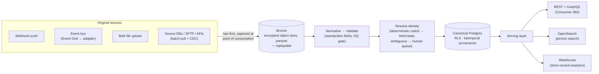

# Target-State Data Flow

*Phase 0 deliverable: how a consumer or vehicle record moves through the CDP end-to-end in the target state, from the moment it leaves an original source to the moment a downstream app reads it. Written for decision-makers; this is one of the four views of the consolidated architecture, expanded. The detailed build content lives in the linked specs, and the design choices below trace to dated, recorded decisions.*

## The shift

Today, data reaches the people who need it through a chain that DAS is retiring: nightly **SSIS** jobs truncate and rebuild the warehouse (`EDW`), pre-joined reporting views (`DWRPT`) feed Juicebox, and everything downstream depends on that rebuild completing. The chain is fragile, near capacity, and it means consumer data is only ever as current as last night's run, and only ever as trustworthy as views that may have been summarized or manipulated along the way (SSIS review with Rick Sorich, 2026-06-08; `docs/cdp-architecture.md`).

The target state inverts this. The **CDP becomes the system of record**, and it ingests from the **original sources** (the application databases, files, vendor APIs, and event streams where data is actually created) rather than from EDW or DWRPT. The legacy ETL is reimplemented against those originals and then retired once the CDP is reliable. DWRPT is kept only as a reporting-parity reference, never as an ingestion source, because its pre-joined views can contain manipulated or summarized data. The result is data that is current, traceable to its true origin, and independent of any nightly rebuild.

## One pipeline, four ways in

No matter how a record arrives, it travels the **same path**: land raw -> normalize -> validate -> resolve identity -> store canonical -> serve. Only the front door differs. Four ingestion channels feed that one shared pipeline (`docs/cdp-architecture.md`, Layer 1; `specs/03-phase-1-build/04-ingest/00-feature.md`):

- **Webhook:** real-time push for individual events; the caller gets back a `consumer_id` so follow-on events take a fast path.
- **Event stream:** asynchronous, high-volume intake on an internal backbone, with external buses bridged in.
- **Bulk upload:** operator-driven CSV/JSON files through the admin UI, processed in the background.
- **Batch pull:** scheduled extraction from source databases, SFTP, and vendor APIs, plus continuous change-capture.

The design principle is that a new source is configuration, not a new system. Each source is declared once in a config-driven registry (its connection, field mapping, identity keys, provenance class, and consent linkage), and that single declaration drives everything downstream (`specs/03-phase-1-build/04-ingest/06-source-registry.md`). A source can even graduate from batch to real-time event intake by flipping one field, with no redesign (event intake set co-primary with batch, Dan Aston, 2026-06-12).

## How a record moves, step by step

**1. Land raw, first.** Whatever arrives is written untouched to an encrypted **bronze** object store (parquet) before anything else happens. This is capture at the point of consumption, which is DAS's explicit requirement. Because the original is preserved, the entire pipeline is **replayable**: if a downstream rule changes, the same source data can be re-run to produce a corrected result, with no re-fetch from the source (raw lands in bronze, Leo, 2026-06-18; `specs/03-phase-1-build/04-ingest/09-nats-event-backbone.md`).

**2. Intake is bus-agnostic.** The event channel runs on an internal **NATS JetStream** backbone, and external buses connect through thin adapters. DAS publishes events to **Azure Event Grid** today, so the CDP subscribes via a config-only adapter: DAS points an event subscription at a CDP webhook URL, with no compute we operate on their side (`specs/03-phase-1-build/04-ingest/08-event-grid-webhook-adapter.md`). For databases, **change-data-capture (Debezium)** streams every insert, update, and delete continuously, so the CDP reflects source changes as they happen rather than only at the next batch window (`specs/03-phase-1-build/04-ingest/12-cdc-capture-debezium.md`). The intake is order-tolerant and de-duplicated, so duplicate or out-of-order deliveries do no harm.

**3. Normalize and validate.** Raw records are standardized into the canonical shape (identifiers like email, phone, and VIN are put into consistent form) and run through a data-quality gate declared per source. Each value is also stamped with its **provenance** (which source it came from) and its data class (DAS-global/shareable vs. dealer-isolated), so governance travels with the data from the first step (two data types per record, Dan, 2026-06-12).

**4. Resolve identity.** The normalized record is matched against the existing identity graph on its strongest identifier. A confident match **links** the record to an existing person; no match **creates** a new one; an ambiguous case goes to a **human review queue** rather than risking a wrong merge. This is deterministic-first by deliberate design, with machine learning earned in a later phase against real data (Option A, locked 2026-06-17; matching/survivorship/household model locked 2026-06-18, Alicia + Luis). The full strategy is in `docs/deliverables/identity-resolution-strategy.md`.

**5. Store canonical.** Resolved data lands in **PostgreSQL** as the canonical store, with two properties that matter for trust:
- **Row-Level Security (RLS)** enforces tenant isolation at the database itself: a dealer's data is invisible to other dealers even if application-layer auth were bypassed.
- **Bitemporal, append-only provenance** records both when something was true in the world and when the CDP learned it, and never destroys a prior value. The "as-of" time-travel query over this history *is* the golden-record evolution view, Mike Paylor's most-requested artifact (provenance model locked 2026-06-18, Alicia + Luis).

**6. Serve.** From the canonical store, data is made available three ways: a **warehouse** for analytics (store-neutral, either Postgres-native or a managed warehouse, so reporting is not locked to one vendor; see `docs/deliverables/reporting-data-flow.md`); **OpenSearch** for fuzzy person search; and an **API surface** that is **REST + GraphQL**, REST for ingestion and operational integrations, GraphQL for the Consumer 360 profile, where a downstream app asks for exactly the fields it needs in one round trip. VSS is the first downstream consumer.

## Why this is better, in plain terms

- Current, not nightly. Webhooks, events, and CDC mean changes flow continuously; downstream consumers no longer wait on a warehouse rebuild.
- Traceable to origin. Every value knows which original source produced it and when, and old values are kept, not overwritten, so any record can be explained and audited.
- **Replayable.** Because raw is preserved in bronze, a logic change can be re-applied to history without going back to the source.
- Governed from the first step. Tenant isolation, provenance class, and consent linkage are attached at ingest and enforced in the database, not bolted on at the edge.
- Additive to extend. A new source is one declarative registry entry: no bespoke pipeline per source, and no rebuild to move a source from batch to real-time.

## What is locked vs. what firms up later

Locked (recorded with dates and owners): the four-channel/one-pipeline shape, bus-agnostic NATS intake, and raw-first capture; ingest from original sources, not EDW/DWRPT; the identity, provenance, and storage models above. What firms up at build time: the Event Grid subscription wiring and CloudEvents delivery contract (a joint workstream with DAS, 2026-06-17), CDC connector tuning against the live source DBs, and the per-source registry entries themselves. The architecture holds regardless of how those build-time details settle.

## Where to go deeper

- The consolidated architecture this view expands (all four layers, services, deployment, and the full locked-decision table): `docs/cdp-architecture.md`
- The ingestion build specs (channels, source registry, event adapter, NATS backbone, CDC): `specs/03-phase-1-build/04-ingest/`; start with `specs/03-phase-1-build/04-ingest/00-feature.md` and `specs/03-phase-1-build/04-ingest/06-source-registry.md`
- How identity resolution works in detail: `docs/deliverables/identity-resolution-strategy.md`
- The reporting/analytics flow off the same canonical store: `docs/deliverables/reporting-data-flow.md`
- Privacy, consent, tenant isolation, and erasure: `docs/deliverables/privacy-by-design-framework.md`
- Decision log behind every dated claim above: `memory/decisions.md`
